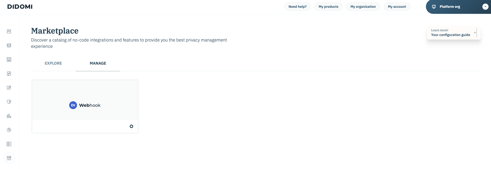

# [!DNL Didomi]

>[!AVAILABILITY]
>
>A origem [!DNL Didomi] está na versão beta. Leia os [termos e condições](../../home.md#terms-and-conditions) na visão geral das fontes para obter mais informações sobre como usar fontes com rótulo beta.

O [!DNL Didomi] é uma plataforma de gerenciamento de preferências e consentimento que ajuda organizações a coletar, gerenciar e impor opções de usuário com relação a dados pessoais em sites, aplicativos e ferramentas internas.

O Adobe Experience Platform oferece suporte à assimilação de dados de uma grande variedade de sistemas externos, incluindo armazenamento em nuvem, bancos de dados e aplicativos como o [!DNL Didomi], por meio de um sistema de conectores de origem. Use fontes para autenticar sistemas externos, gerenciar o fluxo de dados no Experience Platform e garantir a assimilação consistente e estruturada dos dados do cliente.

Use a origem [!DNL Didomi] para transmitir dados de consentimento e preferências do usuário em tempo real da plataforma de gerenciamento de preferências e consentimento [!DNL Didomi] para a Experience Platform. Por meio da fonte [!DNL Didomi], é possível centralizar e agir em dados de consentimento no Experience Platform, mantendo os perfis de clientes e os fluxos de trabalho downstream em conformidade e atualizados.

## Pré-requisitos

Conclua as etapas de pré-requisito descritas abaixo para conectar com êxito sua conta do [!DNL Didomi] à Experience Platform.

### INCLUO NA LISTA DE PERMISSÕES de endereços IP

Você deve adicionar endereços IP específicos da região ao incluo na lista de permissões antes de conectar suas fontes à Experience Platform. Para obter mais informações, leia o guia sobre [como ler os endereços IP de incluir na lista de permissões para se conectar ao Experience Platform](../../ip-address-allow-list.md) para obter mais informações.

### Configurar permissões no Experience Platform

Você deve ter as permissões **[!UICONTROL View Sources]** e **[!UICONTROL Manage Sources]** habilitadas para sua conta para conectar sua conta do [!DNL Didomi] à Experience Platform. Entre em contato com o administrador do produto para obter as permissões necessárias. Para obter mais informações, leia o [guia da interface do usuário de controle de acesso](../../../access-control/ui/overview.md).

### Coletar credenciais da API do Adobe

Para conectar com segurança o [!DNL Didomi] ao Experience Platform, você deve se autenticar usando suas credenciais da API do Adobe. Essas credenciais são essenciais para configurar o webhook e a assimilação de dados.

Leia o manual sobre [introdução às APIs do Experience Platform](../../../landing/api-authentication.md) para obter informações sobre como fazer chamadas com êxito para as APIs do Experience Platform.

### Criar um esquema do Experience Platform

>[!TIP]
>
>Você pode ignorar esta etapa se já tiver um esquema XDM existente.

Um **esquema do Experience Data Model (XDM)** define a estrutura dos dados que você enviará de [!DNL Didomi] (por exemplo, IDs de usuário, fins de consentimento) para a Experience Platform.

Para criar um esquema, selecione [!UICONTROL Schemas] na navegação à esquerda da interface do usuário do Experience Platform e selecione **[!UICONTROL Create schema]**. Em seguida, selecione **[!UICONTROL Standard]** como o tipo de esquema e selecione **[!UICONTROL Manual]** para criar os campos manualmente. Selecione uma classe base para o esquema e forneça um nome para ele.

Depois de criado, atualize o esquema adicionando qualquer um dos campos obrigatórios. Certifique-se de que pelo menos um campo seja um campo [!UICONTROL Identity] para informar à Experience Platform sobre seus valores de identidade primários. Finalmente, habilite o botão [!UICONTROL Profile] para armazenar seus dados com êxito.

Para obter mais informações, leia o manual sobre [criação de esquemas na interface](../../../xdm/tutorials/create-schema-ui.md).

### Criar um conjunto de dados

>[!TIP]
>
>Você pode ignorar esta etapa se já tiver um conjunto de dados.

Um **conjunto de dados** no Experience Platform é usado para armazenar dados de entrada com base no esquema definido por você.

Para criar um conjunto de dados, selecione [!UICONTROL Datasets] na navegação à esquerda da interface do Experience Platform e selecione **[!UICONTROL Create dataset]**. Em seguida, selecione **[!UICONTROL Create dataset from schema]** e, em seguida, selecione seu esquema para associar ao novo conjunto de dados.

## Configurar o Webhook HTTP no console [!DNL Didomi]

O [!DNL Webhooks] permite que você assine eventos acionados na plataforma [!DNL Didomi] quando os usuários interagem com suas preferências de consentimento. Quando um evento relevante ocorre — por exemplo, quando um usuário consente ou retira o consentimento — [!DNL Didomi] envia uma solicitação POST HTTP em tempo real contendo uma carga JSON para o ponto de extremidade [!DNL webhook] configurado.

Para garantir a compatibilidade com o Experience Platform, seu webhook deve atender aos seguintes requisitos.

| Campo | Descrição | Exemplo |
| --- | --- | --- | 
| Segredo do cliente | A chave secreta associada às credenciais da API do Adobe. | `d8f3b2e1-4c9a-4a7f-9b2e-8f1c3d2a1b6e` |
| Chave de API | A chave de API pública usada para autenticar solicitações para serviços da Adobe. |  |
| Tipo de concessão | O método pelo qual um aplicativo obtém um token de acesso do servidor de autorização. Defina este valor como `client_credentials`. | `client_credentials` |
| Escopo | Os escopos de autorização definem as permissões específicas ou os níveis de acesso que um aplicativo está solicitando ao provedor de API. | `openid,AdobeID,read_organizations,additional_info.projectedProductContext,session` |
| Cabeçalho de autenticação | Os cabeçalhos adicionais necessários para a solicitação de token do Adobe. | `{"Content-type": "application/x-www-form-urlencoded"}` |
| URL do token | Seu terminal de token do Adobe. | `https://ims-na1.adobelogin.com/ims/token/v3` |
| URL do ponto terminal | O URL final do conector do Adobe (fornecido no final da configuração). | `https://dcs.adobedc.net/collection/your-adobe-endpoint-id` |

{style="table-layout:auto"}

Em seguida, configure as seguintes opções para o [!DNL webhook].

| Campo | Descrição | Valor |
| ---| --- | --- | 
| Cabeçalhos de solicitação | Os cabeçalhos personalizados para [!DNL webhook]. Certifique-se de incluir o `x-adobe-flow-id`. Você pode recuperar esse valor após a criação do [fluxo de dados](../../tutorials/ui/create/consent-and-preferences/didomi.md#retrieve-the-streaming-endpoint-url). | `{"Content-Type": "application/json", "Cache-Control": "no-cache", "x-adobe-flow-id": "{DATAFLOW_ID}"}` |
| Flatten | Esta propriedade deve ser verificada, pois garante que os dados de [!DNL webhook] sejam enviados como um objeto simples. | Habilitado |
| Tipos de evento | Selecione o grupo específico de [!DNL Didomi] eventos (`event.*` ou `user.*`) que deve disparar o [!DNL webhook]. Use `event.*` para rastrear alterações de consentimento ou preferência e use `user.*` para rastrear atualizações de perfil de usuário. Essa seleção é necessária para garantir que somente eventos compatíveis sejam enviados para a Adobe. O Adobe suporta apenas um esquema por fluxo de dados, portanto, selecionar ambos os tipos de evento pode causar erros de assimilação. | A lista de tipos de eventos compatíveis é: <ul><li>`Event.created`</li><li>`Event.updated`</li><li>`Event.deleted`</li><li>`User.created`</li><li>`User.updated`</li><li>`User.deleted`</li></ul> |

### Baixe o arquivo de carga de amostra {#download-the-sample-payload-file}

Com base no grupo de eventos selecionado, baixe o **arquivo de carga de exemplo** apropriado diretamente do Console [!DNL Didomi]. Esse arquivo representa a estrutura dos dados e será usado durante as etapas de esquema e mapeamento no Adobe.

| **Grupo de Eventos** | **Arquivo de Exemplo a Ser Baixado** | **Opção de Filtragem** |
| --- | ---| --- |
| `event.*` | Baixar uma amostra para `event.created` | Filtrar apenas para `event.*` eventos |
| `user.*` | Baixar uma amostra para `user.created` | Filtrar apenas para `user.*` eventos |

## Conectar sua conta do [!DNL Didomi] à Experience Platform

Leia o manual sobre [conexão [!DNL Didomi] ao Experience Platform](../../tutorials/ui/create/consent-and-preferences/didomi.md) para saber como criar uma conexão de origem e assimilar dados de consentimento e preferências de [!DNL Didomi] na Experience Platform.
