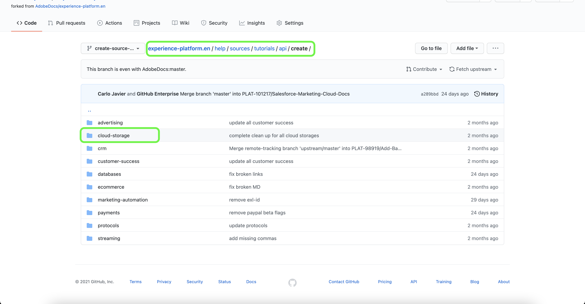

# Use a interface da Web do GitHub para criar uma página de documentação de origem

Este documento fornece etapas sobre como usar a interface da Web do GitHub para criar a documentação e enviar uma solicitação de pull (PR).

>[!TIP]
>
>Os seguintes documentos do guia de contribuição do Adobe podem ser usados para dar suporte ao seu processo de documentação: <ul><li>[Instale as ferramentas de criação do Git e do Markdown](https://experienceleague.adobe.com/docs/contributor/contributor-guide/setup/install-tools.html?lang=en)</li><li>[Configurar o repositório Git localmente para a documentação](https://experienceleague.adobe.com/docs/contributor/contributor-guide/setup/local-repo.html?lang=en)</li><li>[Fluxo de trabalho de contribuição do GitHub para grandes alterações](https://experienceleague.adobe.com/docs/contributor/contributor-guide/setup/full-workflow.html?lang=en)</li></ul>

## Configurar o ambiente do GitHub

A primeira etapa na configuração do ambiente GitHub é navegar até a variável [Repositório Adobe Experience Platform GitHub](https://github.com/AdobeDocs/experience-platform.en).

Em seguida, selecione **Bifurcação**.

Depois que a bifurcação estiver concluída, selecione **principal** e insira um nome para a nova ramificação no menu suspenso exibido. Forneça um nome descritivo para a ramificação, pois ele será usado para conter o trabalho e selecione **criar ramificação**.

Na estrutura de pastas do GitHub do seu repositório bifurcado, navegue até [`experience-platform.en/help/sources/tutorials/api/create/`](https://github.com/AdobeDocs/experience-platform.en/tree/main/help/sources/tutorials/api/create) e selecione a categoria apropriada para sua origem na lista. Por exemplo, se você estiver criando documentação para uma nova fonte de armazenamento na nuvem, selecione **armazenamento na nuvem**.

>[!TIP]
>
>Se você estiver criando documentação para a interface do usuário, navegue para [`experience-platform.en/help/sources/tutorials/ui/create/`](https://github.com/AdobeDocs/experience-platform.en/tree/main/help/sources/tutorials/ui/create) e selecione a categoria apropriada para sua fonte. Para adicionar suas imagens, navegue até [`experience-platform.en/help/sources/images/tutorials/create/sdk`](https://github.com/AdobeDocs/experience-platform.en/tree/main/help/sources/images/tutorials/create) em seguida, adicione suas capturas de tela ao `sdk` pasta.

Uma pasta de fontes de armazenamento em nuvem existentes é exibida. Para adicionar documentação para uma nova fonte, selecione **Adicionar arquivo** e depois selecione **Criar novo arquivo** no menu suspenso exibido.

Dê um nome ao arquivo de origem `YOURSOURCE.md` onde YOURSOURCE é o nome da sua fonte na Platform. Por exemplo, se sua empresa for [!DNL Mailchimp], seu nome de arquivo deve ser `mailchimp.md`.

## Crie a página de documentação da sua origem

Para começar a documentar sua nova fonte, cole o conteúdo do [modelo de documentação das fontes](./template.md) no editor da Web do GitHub. Também é possível baixar o modelo [here](../assets/template.zip).

Com o modelo copiado para a interface do editor da Web do GitHub, siga as instruções descritas no modelo e edite os valores que contêm informações relevantes para a sua fonte.

Quando concluído, confirme o arquivo na ramificação.

## Envie sua documentação para revisão

Depois que seu arquivo for confirmado, você poderá abrir uma solicitação de pull (PR) para mesclar sua ramificação de trabalho na ramificação principal do repositório da documentação do Adobe. Certifique-se de que a ramificação em que você está trabalhando está selecionada e selecione **Comparar e obter solicitação**.

Certifique-se de que as ramificações base e comparada estejam corretas. Adicione uma nota ao PR, descrevendo sua atualização e, em seguida, selecione **Criar solicitação de pull**. Isso abre uma PR para mesclar a ramificação de trabalho do seu trabalho na ramificação principal do repositório do Adobe.

>[!TIP]
>
>Deixe o **Permitir edições por mantenedores** caixa de seleção selecionada para garantir que a equipe de documentação do Adobe possa fazer edições no PR.

Neste ponto, é exibida uma notificação solicitando que você assine o Contrato de licença de colaborador (CLA) do Adobe. Esta é uma etapa obrigatória. Após assinar o CLA, atualize a página do PR e envie a solicitação de pull.

Você pode confirmar que a solicitação de pull foi enviada inspecionando a guia solicitações de pull em https://github.com/AdobeDocs/experience-platform.en.

