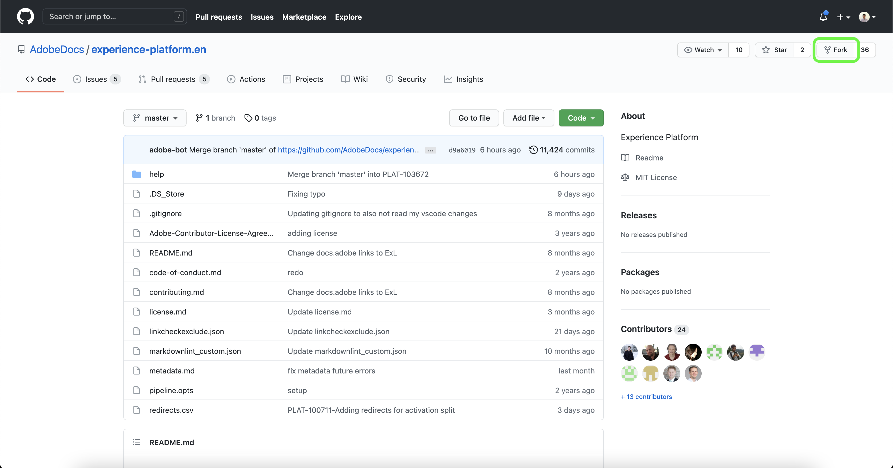

# Usar um editor de texto no ambiente local para criar uma página de documentação de fontes

Este documento fornece etapas sobre como usar o ambiente local para criar a documentação para a sua fonte e enviar uma solicitação de pull (PR).

>[!TIP]
>
>Os seguintes documentos do guia de contribuição do Adobe podem ser usados para dar suporte ao seu processo de documentação: <ul><li>[Instale as ferramentas de criação do Git e do Markdown](https://experienceleague.adobe.com/docs/contributor/contributor-guide/setup/install-tools.html?lang=en)</li><li>[Configurar o repositório Git localmente para a documentação](https://experienceleague.adobe.com/docs/contributor/contributor-guide/setup/local-repo.html?lang=en)</li><li>[Fluxo de trabalho de contribuição do GitHub para grandes alterações](https://experienceleague.adobe.com/docs/contributor/contributor-guide/setup/full-workflow.html?lang=en)</li></ul>

## Pré-requisitos

O tutorial a seguir requer que o GitHub Desktop esteja instalado no computador local. Se você não tiver o GitHub Desktop, poderá baixar o aplicativo [here](https://desktop.github.com/).

## Conecte-se ao GitHub e configure seu ambiente de criação local

A primeira etapa na configuração do ambiente de criação local é navegar até a variável [Repositório Adobe Experience Platform GitHub](https://github.com/AdobeDocs/experience-platform.en).

Na página principal do repositório GitHub da plataforma, selecione **Bifurcação**.

Para clonar o repositório no computador local, selecione **Código**. No menu suspenso exibido, selecione **HTTPS** e, em seguida, selecione **Abrir com o GitHub Desktop**.

>[!TIP]
>
>Para obter mais informações, consulte o tutorial em [configuração do repositório Git localmente para a documentação](https://experienceleague.adobe.com/docs/contributor/contributor-guide/setup/local-repo.html?lang=en#create-a-local-clone-of-the-repository).

Em seguida, deixe que o GitHub Desktop clone o `experience-platform.en` repositório.

Quando o processo de clonagem estiver concluído, acesse o GitHub Desktop para criar uma nova ramificação. Selecionar **Principal** no início da navegação e selecione **Nova ramificação**

No painel de controle exibido, insira um nome descritivo para a ramificação e selecione **Criar ramificação**.

Em seguida, selecione **Publicar ramificação**.

## Crie a página de documentação da sua origem

Com o repositório clonado na máquina local e uma nova ramificação criada, agora é possível começar a criar a página de documentação da nova fonte por meio da [editor de texto de sua escolha](https://experienceleague.adobe.com/docs/contributor/contributor-guide/setup/install-tools.html?lang=en#understand-markdown-editors).

O Adobe recomenda usar [Código do Visual Studio](https://code.visualstudio.com/) e que você instala a extensão de criação do Adobe Markdown. Para instalar a extensão, inicie o Código do Visual Studio e selecione o **Extensões** na navegação à esquerda.

Em seguida, digite `Adobe Markdown Authoring` na barra de pesquisa e selecione **Instalar** na página exibida.

Com o computador local pronto, baixe o [modelo de documentação das fontes](../assets/template.zip) e extraia o arquivo para `experience-platform.en/help/sources/tutorials/api/create/...` com [`...`] representando a categoria de sua escolha. Por exemplo, se estiver criando uma fonte de armazenamento em nuvem, selecione a pasta de armazenamento em nuvem.

Finalmente, siga as instruções descritas no modelo e edite o modelo com as informações relevantes relacionadas à sua fonte.

## Envie sua documentação para revisão

Para criar uma solicitação de pull (PR) e enviar sua documentação para revisão, primeiro salve seu trabalho em [!DNL Visual Studio Code] (ou o editor de texto escolhido). Em seguida, usando o GitHub Desktop, insira uma mensagem de confirmação e selecione **Confirmar para criar-fonte-documentação**.

Em seguida, selecione **Origem da push** para carregar seu trabalho na ramificação remota.

Para criar uma solicitação de pull, selecione **Criar solicitação de pull**.

Certifique-se de que as ramificações base e comparada estejam corretas. Adicione uma nota ao PR, descrevendo sua atualização e, em seguida, selecione **Criar solicitação de pull**. Isso abre uma PR para mesclar a ramificação de trabalho do seu trabalho na ramificação principal do repositório do Adobe.

>[!TIP]
>
>Deixe o **Permitir edições por mantenedores** caixa de seleção selecionada para garantir que a equipe de documentação do Adobe possa fazer edições no PR.

Você pode confirmar que a solicitação de pull foi enviada inspecionando a guia solicitações de pull em https://github.com/AdobeDocs/experience-platform.en.

