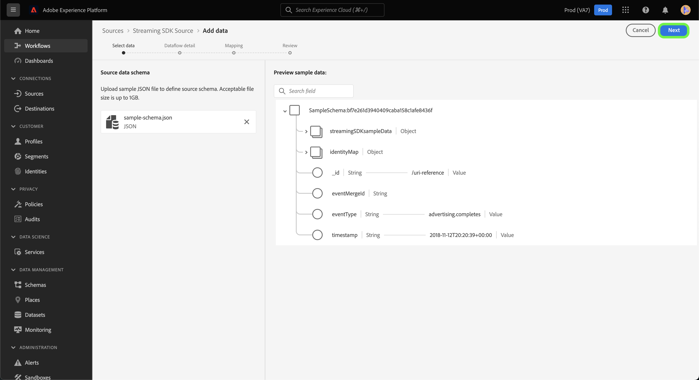

# Criar uma conexão de origem e um fluxo de dados para fluxo *SUA FONTE* dados que usam a interface do usuário

*Conforme você passa por esse modelo, substitua ou exclua todos os parágrafos em itálico (começando por este).*

*Comece atualizando os metadados (título e descrição) na parte superior da página. Ignore todas as instâncias do UICONTROL nesta página. Esta é uma tag que ajuda nossos processos de tradução automática a traduzir a página corretamente para os vários idiomas suportados. Adicionaremos tags à sua documentação após enviá-la.*

Este tutorial fornece etapas para criar um *SUA FONTE* conector de origem usando a interface do usuário da plataforma.

## Visão geral

*Forneça uma breve visão geral da empresa, incluindo o valor que ela oferece aos clientes. Inclua um link para a página inicial da documentação do produto para mais leitura.*

>[!IMPORTANT]
>
>Esta página de documentação foi criada pela *SUA FONTE* equipe. Para quaisquer consultas ou pedidos de atualização, contacte-os diretamente em *Inserir link ou endereço de email onde você pode acessar para obter atualizações*.

## Pré-requisitos

*Adicione informações nesta seção sobre qualquer coisa que os clientes precisam saber antes de começar a configurar a origem na interface do usuário do Adobe Experience Platform. Isso pode ser sobre:*

* *precisar ser adicionado a uma lista de permissões*
* *requisitos para hash de email*
* *qualquer conta específica do seu lado*
* *como obter as credenciais de autenticação para se conectar à plataforma*

### Obter credenciais necessárias

Para se conectar *SUA FONTE* para Plataforma, você deve fornecer valores para as seguintes propriedades de conexão:

| Credencial | Descrição | Exemplo |
| --- | --- | --- |
| *credencial um* | *Adicione uma breve descrição à credencial de autenticação da sua origem aqui* | *Adicione aqui um exemplo da credencial de autenticação da sua origem* |
| *credencial dois* | *Adicione uma breve descrição à credencial de autenticação da sua origem aqui* | *Adicione aqui um exemplo da credencial de autenticação da sua origem* |
| *credencial três* | *Adicione uma breve descrição à credencial de autenticação da sua origem aqui* | *Adicione aqui um exemplo da credencial de autenticação da sua origem* |

Para obter mais informações sobre essas credenciais, consulte o *SUA FONTE* documentação de autenticação. *Adicione um link à documentação de autenticação da plataforma aqui*.

### Integrar *SUA FONTE* com seu webhook

*O SDK de streaming requer que sua fonte seja capaz de suportar webhooks para se comunicar com o Experience Platform. Nesta seção, você deve fornecer as etapas que seus usuários terão que seguir para integrar o YOURSOURCE a um webhook.*

## Conecte seu *SUA FONTE* account

Na interface do usuário da plataforma, selecione **[!UICONTROL Fontes]** na barra de navegação esquerda para acessar o [!UICONTROL Fontes] espaço de trabalho. O [!UICONTROL Catálogo] exibe uma variedade de fontes com as quais você pode criar uma conta.

Você pode selecionar a categoria apropriada no catálogo no lado esquerdo da tela. Como alternativa, você pode encontrar a fonte específica com a qual deseja trabalhar usando a opção de pesquisa.

Em **Streaming** categoria , selecione *SUA FONTE* e selecione **[!UICONTROL Adicionar dados]**.

>[!TIP]
>
>As capturas de tela usadas abaixo são exemplos. Ao criar sua documentação, substitua as imagens por capturas de tela de sua fonte real. Você pode usar o mesmo padrão e a mesma cor de marcação, bem como os mesmos nomes de arquivo. Certifique-se de que a captura de tela capture a tela inteira da interface do usuário da plataforma. Para obter informações sobre como fazer upload de suas capturas de tela, consulte o guia em [enviar sua documentação para revisão](../documentation/github.md).

## Selecionar dados

O **[!UICONTROL Selecionar dados]** será exibida, fornecendo uma interface para selecionar os dados trazidos para a plataforma.

* A parte esquerda da interface é um navegador que permite visualizar os fluxos de dados disponíveis em sua conta;
* A parte direita da interface permite visualizar até 100 linhas de dados de um arquivo JSON.

Selecionar **[!UICONTROL Upload de arquivos]** para carregar um arquivo JSON do sistema local. Como alternativa, você pode arrastar e soltar o arquivo JSON que deseja fazer upload no [!UICONTROL Arrastar e soltar arquivos] painel.

Depois que o arquivo é carregado, a interface de visualização é atualizada para exibir uma pré-visualização do esquema carregado. A interface de visualização permite inspecionar o conteúdo e a estrutura de um arquivo. Também é possível usar a variável [!UICONTROL Campo de pesquisa] para acessar itens específicos dentro do esquema.

Quando terminar, selecione **[!UICONTROL Próximo]**.

## Detalhes do fluxo de dados

O **Detalhes do fluxo de dados** é exibida, fornecendo opções para usar um conjunto de dados existente ou estabelecer um novo conjunto de dados para o fluxo de dados, bem como uma oportunidade de fornecer um nome e uma descrição para o fluxo de dados. Durante essa etapa, você também pode definir as configurações para assimilação de perfil, diagnóstico de erro, assimilação parcial e alertas.

Quando terminar, selecione **[!UICONTROL Próximo]**.

## Mapeamento

O [!UICONTROL Mapeamento] é exibida, fornecendo uma interface para mapear os campos de origem do esquema de origem para os campos XDM de destino apropriados no esquema de destino.

A Platform fornece recomendações inteligentes para campos mapeados automaticamente com base no esquema de destino ou conjunto de dados selecionado. Você pode ajustar manualmente as regras de mapeamento de acordo com seus casos de uso. Com base em suas necessidades, você pode optar por mapear campos diretamente ou usar funções de preparação de dados para transformar dados de origem em valores calculados ou calculados. Para obter etapas abrangentes sobre o uso da interface do mapeador e dos campos calculados, consulte o [Guia da interface do usuário de preparação de dados](https://experienceleague.adobe.com/docs/experience-platform/data-prep/ui/mapping.html).

Depois que os dados de origem forem mapeados com êxito, selecione **[!UICONTROL Próximo]**.

## Revisão

O **[!UICONTROL Revisão]** é exibida, permitindo que você revise o novo fluxo de dados antes de criá-lo. Os detalhes são agrupados nas seguintes categorias:

* **[!UICONTROL Conexão]**: Mostra o tipo de origem, o caminho relevante do arquivo de origem escolhido e a quantidade de colunas dentro desse arquivo de origem.
* **[!UICONTROL Atribuir conjunto de dados e mapear campos]**: Mostra em qual conjunto de dados os dados de origem estão sendo assimilados, incluindo o esquema ao qual o conjunto de dados adere.

Depois de revisar o fluxo de dados, clique em **[!UICONTROL Concluir]** e permitir que o fluxo de dados seja criado.

## Obter o URL do terminal de transmissão

Com o fluxo de dados criado, agora é possível recuperar o URL do terminal de transmissão. Esse terminal será usado para se inscrever no webhook, permitindo que sua fonte de transmissão se comunique com o Experience Platform.

Para recuperar o terminal de transmissão, acesse [!UICONTROL Atividade do fluxo de dados] página do fluxo de dados que você acabou de criar e copiar o ponto de extremidade da parte inferior do [!UICONTROL Propriedades] painel.

## Próximas etapas

*Os workflows para as etapas restantes da criação de um fluxo de dados são modularizados. Se houver chamadas de retorno específicas que você queira fazer em relação à sua fonte, consulte a seção recursos adicionais abaixo.*

Ao seguir este tutorial, você estabeleceu uma conexão com seu *SUA FONTE* conta. Agora você pode continuar para o próximo tutorial e [configurar um fluxo de dados para trazer dados para a plataforma](https://experienceleague.adobe.com/docs/experience-platform/sources/ui-tutorials/dataflow/crm.html).

## Recursos adicionais

*Esta é uma seção opcional na qual você pode fornecer mais links para a documentação do seu produto ou quaisquer outras etapas, capturas de tela, nuances que você considere importantes para o sucesso do cliente. Você pode usar esta seção para adicionar informações ou dicas sobre todo o fluxo de trabalho da sua origem, especialmente se houver &quot;gotchas&quot; específicas que um usuário final poderá encontrar.*
