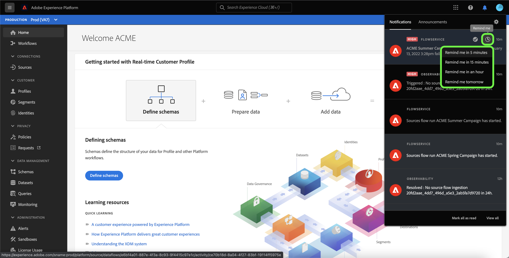
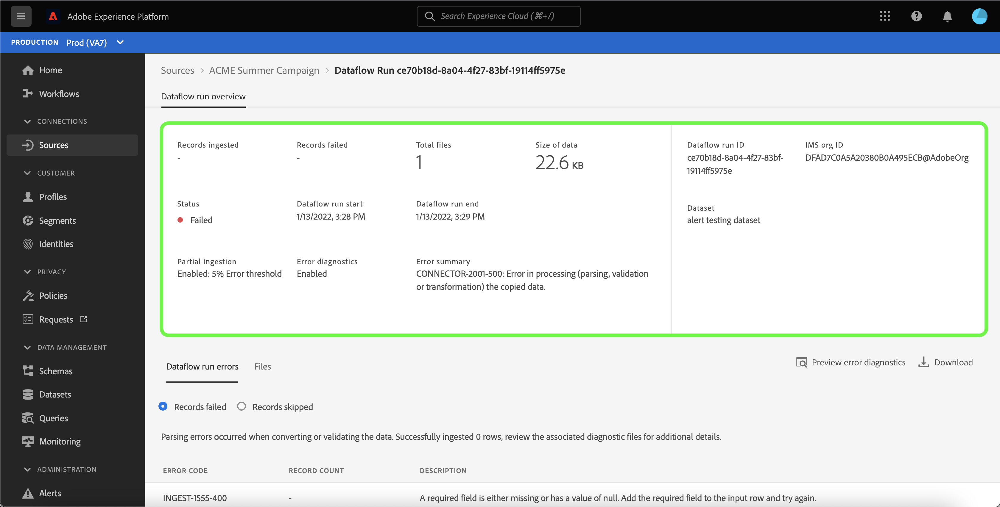
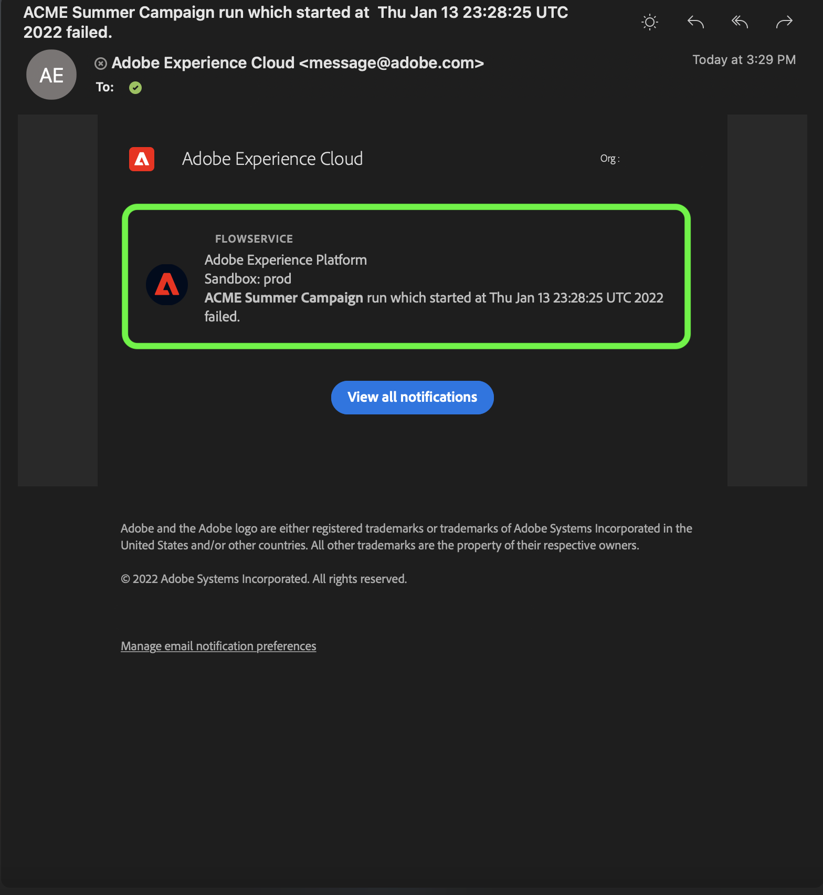
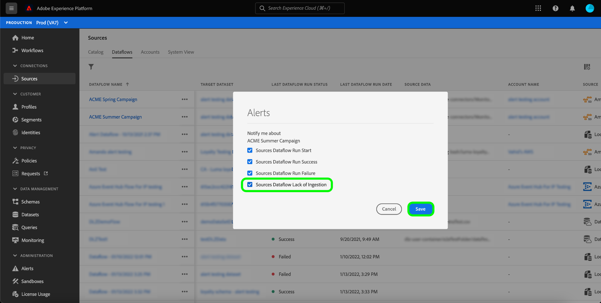

# Assinar alertas de fluxos de dados de fontes na interface do usuário

O Adobe Experience Platform permite assinar alertas baseados em eventos sobre atividades do Adobe Experience Platform. Os alertas reduzem ou eliminam a necessidade de pesquisar a variável [[!DNL Observability Insights] API](../../../observability/api/overview.md) para verificar se uma tarefa foi concluída, se um determinado marco em um workflow foi atingido ou se ocorreram erros.

Você pode assinar alertas ao criar um fluxo de dados para receber mensagens de alerta sobre o status, o sucesso ou a falha da execução do fluxo.

Este documento fornece etapas sobre como assinar mensagens de alerta de recebimento para seus fluxos de dados de fontes.

## Introdução

Este documento requer uma compreensão funcional dos seguintes componentes do Adobe Experience Platform:

* [Fontes](../../home.md): [!DNL Experience Platform] permite que os dados sejam assimilados de várias fontes, fornecendo a capacidade de estruturar, rotular e aprimorar os dados recebidos usando [!DNL Platform] serviços.
* [Observabilidade](../../../observability/home.md): [!DNL Observability Insights] O permite monitorar as atividades do Platform por meio do uso de métricas estatísticas e notificações de eventos.
   * [Alertas](../../../observability/alerts/overview.md): Quando um determinado conjunto de condições em suas operações da plataforma é atingido (como um possível problema quando o sistema viola um limite), a Platform pode enviar mensagens de alerta para qualquer usuário em sua organização que tenha se inscrito nelas.

## Inscrever-se em alertas na interface do usuário {#subscribe-sources-alerts}

>[!CONTEXTUALHELP]
>id="platform_sources_alerts_subscribe"
>title="Assinar alertas de origens"
>abstract="Os alertas permitem receber notificações com base no status dos fluxos de dados de fontes. É possível definir notificações de alerta para obter atualizações caso o fluxo de dados tenha sido iniciado, tenha sido bem-sucedido, tenha falhado ou não tenha assimilado dados."
>text="Learn more in documentation"

>[!IMPORTANT]
>
>Você deve ativar notificações instantâneas de emails para sua conta da plataforma para receber notificações de alerta por email para seus fluxos de dados.

Você pode ativar alertas para seus fluxos de dados durante a [!UICONTROL Detalhes do fluxo de dados] etapa do fluxo de trabalho de origens no espaço de trabalho de origens.

Os alertas disponíveis para fluxos de dados de fontes são:

| Alertas | Descrição |
| --- | --- |
| Início da execução do fluxo de dados de fontes | Este alerta envia uma mensagem quando o fluxo de dados de origem foi iniciado. |
| Êxito na Execução do Fluxo de Dados de Fontes | Esse alerta envia uma mensagem quando os dados da origem são assimilados com êxito na plataforma. |
| Falha na Execução do Fluxo de Dados de Fontes | Esse alerta envia uma mensagem se ocorrer um erro no fluxo de dados. |
| Fontes Fluxo de Dados Ausência de Ingestão | Esse alerta envia uma mensagem se a assimilação for atrasada em mais de sete horas e nenhum dado for assimilado na Platform. |

Selecione os alertas que deseja assinar e selecione **[!UICONTROL Próximo]** para revisar e finalizar o fluxo de dados.

Consulte os seguintes guias para obter etapas detalhadas sobre como criar um fluxo de dados de fontes na interface do usuário:

* [Advertising](./dataflow/advertising.md)
* [armazenamento na nuvem](./dataflow/batch/cloud-storage.md)
* [CRM](./dataflow/crm.md)
* [Banco de dados](./dataflow/databases.md)
* [Comércio eletrônico](./dataflow/ecommerce.md)
* [Arquivos locais](./create/local-system/local-file-upload.md)
* [Automação de marketing](./dataflow/marketing-automation.md)
* [Pagamentos](./dataflow/payments.md)
* [Protocolos](./dataflow/protocols.md)

## Receber alertas

Depois que o fluxo de dados for executado, você poderá receber alertas por meio da interface do usuário ou por email.

### Na interface do usuário

Os alertas são representados na interface do usuário por um ícone de notificação no cabeçalho superior da interface do usuário da plataforma. Selecione o ícone de notificação para ver mensagens de alerta específicas relacionadas aos seus fluxos de dados.

O painel Notificações é exibido, exibindo uma lista de atualizações de status no fluxo de dados criado por você.

Você pode passar o mouse sobre uma mensagem de alerta para marcá-los como lidos ou selecionar o ícone do relógio para definir lembretes futuros sobre o status do seu fluxo de dados.

Selecione a mensagem de alerta para ver informações específicas no fluxo de dados.

O [!UICONTROL Visão geral da execução do fluxo de dados] será exibida. A metade superior da tela exibe uma visão geral do fluxo de dados, incluindo informações sobre seus atributos, ID de execução de fluxo de dados correspondente e resumo de erro de alto nível.

A metade inferior da página exibe qualquer [!UICONTROL Erros de execução do fluxo de dados] que ocorreu durante o estágio de execução do fluxo de dados. Aqui, você pode visualizar o diagnóstico de erros ou usar o [[!DNL Data Access] API](https://www.adobe.io/experience-platform-apis/references/data-access/) para baixar o diagnóstico de erro ou o manifesto do arquivo que corresponde ao seu fluxo de dados.

Para obter mais informações sobre como lidar com erros de fluxo de dados, consulte o guia em [monitoramento de fluxos de dados de fontes na interface do usuário](../../../dataflows/ui/monitor-sources.md).

### Por email

Os alertas dos seus fluxos de dados também são enviados por email. Selecione o nome do fluxo de dados no corpo do email para ver mais informações sobre o fluxo de dados.

Semelhante ao alerta da interface do usuário, a variável [!UICONTROL Visão geral da execução do fluxo de dados] for exibida, fornecendo uma interface para investigar todos os erros associados ao fluxo de dados.

## Assinar e cancelar a assinatura de alertas

É possível assinar mais alertas ou cancelar a assinatura de alertas estabelecidos para um fluxo de dados existente no [!UICONTROL Fluxos de dados] página. Localize o fluxo de dados criado na lista e selecione as reticências (`...`) para ver um menu suspenso de opções. Em seguida, selecione **[!UICONTROL Assinar alertas]** para modificar as configurações de alerta do seu fluxo de dados.

Uma janela pop-up é exibida, fornecendo uma lista de alertas de origens. Selecione os alertas dos quais deseja assinar ou desmarcar os alertas dos quais deseja cancelar a assinatura. Quando terminar, selecione **[!UICONTROL Salvar]**.

## Próximas etapas

Este documento forneceu um guia passo a passo sobre como se inscrever em alertas de contexto para seus fluxos de dados de fontes. Para obter mais informações, consulte o [guia da interface de usuário de alertas](../../../observability/alerts/ui.md).