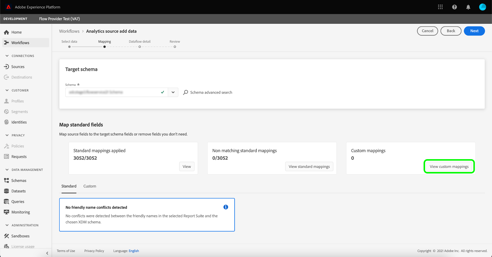
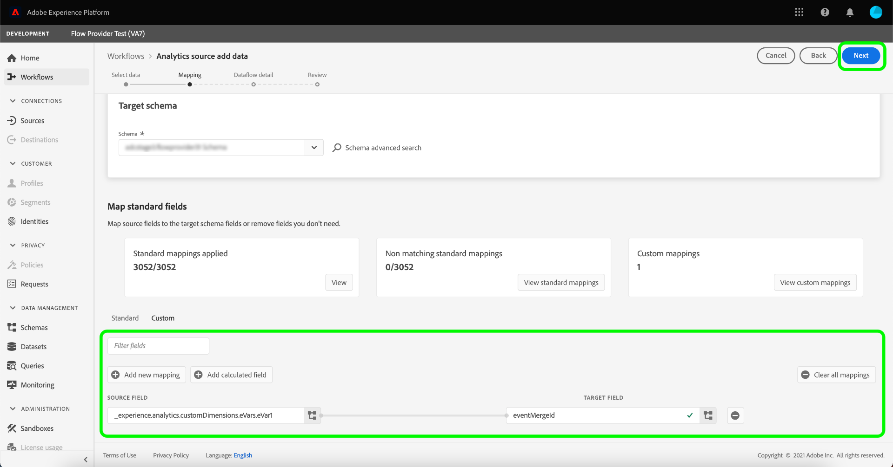

# Criar uma conexão de origem do Adobe Analytics na interface do usuário

Este tutorial fornece etapas para criar uma conexão de origem Adobe Analytics na interface do usuário para trazer [!DNL Analytics] dados do Conjunto de relatórios para o Adobe Experience Platform.

## Introdução

Este tutorial requer uma compreensão funcional dos seguintes componentes do Adobe Experience Platform:

* [Sistema](../../../../../xdm/home.md) do Experience Data Model (XDM): A estrutura padronizada pela qual o Experience Platform organiza os dados de experiência do cliente.
* [Perfil](../../../../../profile/home.md) do cliente em tempo real: Fornece um perfil de consumidor unificado e em tempo real com base em dados agregados de várias fontes.
* [Sandboxes](../../../../../sandboxes/home.md): O Experience Platform fornece sandboxes virtuais que particionam uma única instância da Platform em ambientes virtuais separados para ajudar a desenvolver aplicativos de experiência digital.

### Terminologia principal

É importante entender os seguintes termos principais usados em todo este documento:

* **Atributo** padrão: Atributos padrão são qualquer atributo predefinido pelo Adobe. Eles contêm o mesmo significado para todos os clientes e estão disponíveis nos grupos de campos [!DNL Analytics] de origem e [!DNL Analytics] de esquema.
* **Atributo** personalizado: Atributos personalizados são qualquer atributo na hierarquia de variável personalizada no  [!DNL Analytics]. Os atributos personalizados são usados em uma implementação do Adobe Analytics para capturar informações específicas em um Conjunto de relatórios e podem diferir em seu uso, de Conjunto de relatórios a Conjunto de relatórios. Os atributos personalizados incluem eVars, props e listas. Consulte a documentação a seguir [[!DNL Analytics] sobre variáveis de conversão](https://experienceleague.adobe.com/docs/analytics/admin/admin-tools/conversion-variables/conversion-var-admin.html?lang=en) para obter mais informações sobre eVars.
* **Qualquer atributo em grupos** de campos personalizados: Os atributos originados de grupos de campos criados por clientes são definidos pelo usuário e não são considerados atributos padrão ou personalizados.
* **Nomes** amigáveis: Nomes amigáveis são rótulos fornecidos por humanos para variáveis personalizadas em uma  [!DNL Analytics] implementação. Consulte a documentação a seguir [[!DNL Analytics] sobre variáveis de conversão](https://experienceleague.adobe.com/docs/analytics/admin/admin-tools/conversion-variables/conversion-var-admin.html?lang=en) para obter mais informações sobre nomes amigáveis.

## Criar uma conexão de origem com o Adobe Analytics

Na interface do usuário da plataforma, selecione **[!UICONTROL Fontes]** no painel de navegação esquerdo para acessar o espaço de trabalho [!UICONTROL Fontes]. A tela [!UICONTROL Catálogo] exibe uma variedade de fontes com as quais você pode criar uma conta.

Você pode selecionar a categoria apropriada no catálogo no lado esquerdo da tela. Também é possível usar a barra de pesquisa para restringir as fontes exibidas.

Na categoria **[!UICONTROL Adobe applications]**, selecione **[!UICONTROL Adobe Analytics]** e selecione **[!UICONTROL Add data]**.

### Selecionar dados

A etapa **[!UICONTROL Adicionar dados de origem do Analytics]** é exibida. Selecione **[!UICONTROL Report Suite]** para começar a criar uma conexão de origem para os dados do Conjunto de relatórios do Analytics e selecione o Report Suite que deseja assimilar. Os Conjuntos de relatórios que não podem ser selecionados já foram assimilados nessa sandbox ou em uma sandbox diferente. Selecione **[!UICONTROL Next]** para continuar.

>[!NOTE]
>
>Várias conexões de entrada podem ser feitas para trazer vários Conjuntos de relatórios, no entanto, apenas um Conjunto de relatórios pode ser usado com a Plataforma de dados do cliente em tempo real de cada vez.

<!---Analytics Report Suites can be configured for one sandbox at a time. To import the same Report Suite into a different sandbox, the dataset flow will have to be deleted and instantiated again via configuration for a different sandbox.--->

### Mapeamento

>[!IMPORTANT]
>
>O recurso de suporte de Preparação de dados para a fonte [!DNL Analytics] está em beta.

A página [!UICONTROL Mapeamento] fornece uma interface para mapear campos de origem para seus campos de esquema de destino apropriados. A partir daqui, você pode mapear variáveis personalizadas para novos grupos de campos do esquema e aplicar cálculos, conforme suportado pela Preparação de dados. Selecione um schema de target para iniciar o processo de mapeamento.

>[!TIP]
>
>Somente os esquemas que têm o grupo de campos do modelo [!DNL Analytics] são exibidos no menu de seleção de esquema. Outros esquemas são omitidos. Se não houver esquemas apropriados disponíveis para seus dados do Conjunto de relatórios, você deverá criar um novo esquema. Para obter etapas detalhadas sobre como criar schemas, consulte o guia sobre [como criar e editar schemas na interface do usuário](../../../../../xdm/ui/resources/schemas.md).

A seção [!UICONTROL Mapear campos padrão] exibe painéis para [!UICONTROL Mapeamentos padrão aplicados], [!UICONTROL Mapeamentos padrão não correspondentes] e [!UICONTROL Mapeamentos personalizados]. Consulte a tabela a seguir para obter informações específicas sobre cada categoria:

| Mapear campos padrão | Descrição |
| --- | --- |
| [!UICONTROL Mapeamentos padrão aplicados] | O painel [!UICONTROL Mapeamentos padrão aplicados] exibe o número total de atributos mapeados. Os mapeamentos padrão referem-se a conjuntos de mapeamento entre todos os atributos nos dados [!DNL Analytics] de origem e os atributos correspondentes no grupo de campos [!DNL Analytics]. Eles são pré-mapeados e não podem ser editados. |
| [!UICONTROL Mapeamentos padrão não correspondentes] | O painel [!UICONTROL Mapeamentos padrão não correspondentes] refere-se ao número de atributos mapeados que contêm conflitos de nome amigáveis. Esses conflitos são exibidos quando você está reutilizando um esquema que já tem um conjunto preenchido de descritores de campo de um conjunto de relatórios diferente. Você pode continuar com seu fluxo de dados [!DNL Analytics] mesmo com conflitos de nome amigáveis. |
| [!UICONTROL Mapeamentos personalizados] | O painel [!UICONTROL Mapeamentos personalizados] exibe o número de atributos personalizados mapeados, incluindo eVars, props e listas. Os mapeamentos personalizados referem-se a conjuntos de mapeamento entre atributos personalizados nos dados [!DNL Analytics] de origem e atributos em grupos de campos personalizados incluídos no esquema selecionado. |

Para visualizar o grupo de campos do esquema do modelo [!DNL Analytics] ExperienceEvent, selecione **[!UICONTROL Exibir]** no painel [!UICONTROL Mapeamentos padrão aplicados].

A página [!UICONTROL Grupo de campos do esquema de modelo do Adobe Analytics ExperienceEvent] fornece uma interface para usar na inspeção da estrutura do esquema. Quando terminar, selecione **[!UICONTROL Fechar]**.

A Platform detecta automaticamente seus conjuntos de mapeamento para qualquer conflito de nome amigável. Se não houver conflitos com seus conjuntos de mapeamento, selecione **[!UICONTROL Next]** para continuar.

Se houver conflitos de nome amigáveis entre o Conjunto de relatórios de origem e o esquema selecionado, você ainda poderá continuar com o fluxo de dados [!DNL Analytics], reconhecendo que os descritores de campo não serão alterados. Como alternativa, você pode optar por criar um novo schema com um conjunto em branco de descritores.

Selecione **[!UICONTROL Next]** para continuar.

#### Mapeamentos personalizados

Para usar as funções de Preparação de dados e adicionar um novo mapeamento ou campos calculados para atributos personalizados, selecione **[!UICONTROL Exibir mapeamentos personalizados]**.

Em seguida, selecione **[!UICONTROL Adicionar novo mapeamento]**.

Dependendo das suas necessidades, você pode selecionar **[!UICONTROL Add new mapping]** ou **[!UICONTROL Add calculated field]** a partir das opções exibidas.

Um conjunto de mapeamento vazio é exibido. Selecione o ícone de mapeamento para adicionar um campo de origem.

Você pode usar a interface para navegar pela estrutura do schema de origem e identificar o novo campo de origem que deseja usar. Após selecionar o campo de origem que deseja mapear, selecione **[!UICONTROL Select]**.

Em seguida, selecione o ícone de mapeamento em [!UICONTROL Campo de destino] para mapear o campo de origem selecionado para o campo de destino apropriado.

Semelhante ao schema de origem, você pode usar a interface para navegar pela estrutura do schema de destino e selecionar o campo de destino para o qual deseja mapear. Depois de selecionar o campo de destino apropriado, selecione **[!UICONTROL Select]**.

Com seu conjunto de mapeamento personalizado concluído, selecione **[!UICONTROL Próximo]** para prosseguir.

A documentação a seguir fornece mais recursos para entender a Preparação de dados, os campos calculados e as funções de mapeamento:

* [Visão geral da preparação de dados](../../../../../data-prep/home.md)
* [Funções de mapeamento da preparação de dados](../../../../../data-prep/functions.md)
* [Adicionar campos calculados](../../../../../data-prep/calculated-fields.md)

### Fornecer detalhes do fluxo de dados

A etapa **[!UICONTROL Detalhes do fluxo de dados]** é exibida, onde você deve fornecer um nome e uma descrição opcional para o fluxo de dados. Selecione **[!UICONTROL Next]** quando terminar.

### Revisão

A etapa [!UICONTROL Revisar] é exibida, permitindo que você revise o novo fluxo de dados do Analytics antes de ele ser criado. Os detalhes da conexão são agrupados por categorias, incluindo:

* [!UICONTROL Conexão]: Exibe a plataforma de origem da conexão.
* [!UICONTROL Tipo] de dados: Exibe o Conjunto de relatórios selecionado e sua ID de conjunto de relatórios correspondente.

### Monitorar o fluxo de dados

Depois que o fluxo de dados for criado, é possível monitorar os dados que estão sendo assimilados por meio dele. Na tela [!UICONTROL Catálogo], selecione **[!UICONTROL Fluxos de dados]** para exibir uma lista de fluxos estabelecidos associados à sua conta do Analytics.

A tela **Fluxos de dados** é exibida. Nesta página há um par de fluxos de conjunto de dados, incluindo informações sobre seu nome, dados de origem, tempo de criação e status.

O conector instancia dois fluxos de conjunto de dados. Um fluxo representa dados de preenchimento retroativo e o outro é dados em tempo real. Os dados de preenchimento retroativo não são configurados para Perfil, mas são enviados para o lago de dados para casos de uso analíticos e da ciência de dados.

Para obter mais informações sobre preenchimento retroativo, dados em tempo real e suas respectivas latências, consulte a [Visão geral do Conector de dados do Analytics](../../../../connectors/adobe-applications/analytics.md).

Selecione o fluxo do conjunto de dados que deseja visualizar na lista.

A página **[!UICONTROL Atividade do conjunto de dados]** é exibida. Essa página exibe a taxa de mensagens que estão sendo consumidas no formato de um gráfico. Selecione **[!UICONTROL Data governance]** no cabeçalho superior para acessar os campos de rotulagem.

Você pode visualizar os rótulos herdados de um fluxo de conjunto de dados da tela [!UICONTROL Data governance]. Para obter mais informações sobre como rotular dados provenientes do Analytics, visite o [guia de rótulos de uso de dados](../../../../../data-governance/labels/user-guide.md).

Para excluir um fluxo de dados, vá para a página [!UICONTROL Fluxos de dados] e selecione os elipses (`...`) ao lado do nome do fluxo de dados e selecione [!UICONTROL Excluir].

## Próximas etapas e recursos adicionais

Depois que a conexão é criada, o fluxo de dados é criado automaticamente para conter os dados recebidos e preencher um conjunto de dados com o esquema selecionado. Além disso, ocorre o preenchimento retroativo de dados e a assimilação de até 13 meses de dados históricos. Quando a assimilação inicial for concluída, [!DNL Analytics] dados e serão usados por serviços de plataforma downstream, como [!DNL Real-time Customer Profile] e Serviço de segmentação. Consulte os seguintes documentos para obter mais detalhes:

* [[!DNL Real-time Customer Profile] visão geral](../../../../../profile/home.md)
* [[!DNL Segmentation Service] visão geral](../../../../../segmentation/home.md)
* [[!DNL Data Science Workspace] visão geral](../../../../../data-science-workspace/home.md)
* [[!DNL Query Service] visão geral](../../../../../query-service/home.md)

O vídeo a seguir é destinado a respaldar a compreensão da assimilação de dados pelo uso do conector do Adobe Analytics Source:

>[!WARNING]
>
> A interface [!DNL Platform] mostrada no vídeo a seguir está desatualizada. Consulte a documentação acima para obter as capturas de tela e a funcionalidade mais recentes da interface do usuário.

>[!VIDEO](https://video.tv.adobe.com/v/29687?quality=12&learn=on)
