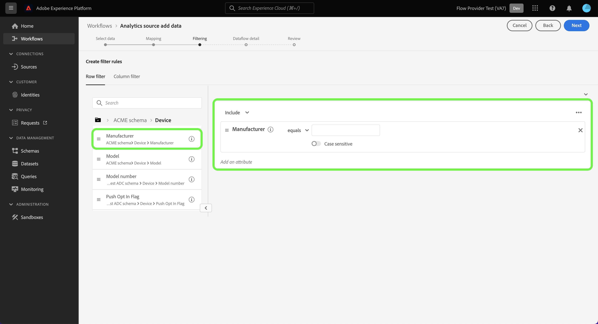

# Conectar o Adobe Analytics ao Experience Platform

Leia este guia para saber como usar a fonte do Adobe Analytics para assimilar dados do conjunto de relatórios do Analytics na Adobe Experience Platform.

## Introdução

Este tutorial requer uma compreensão funcional dos seguintes componentes do Experience Platform:

* [Sistema do Experience Data Model (XDM)](../../../../../xdm/home.md): a estrutura padronizada pela qual a Experience Platform organiza os dados de experiência do cliente.
* [Perfil de cliente em tempo real](../../../../../profile/home.md): fornece um perfil de cliente unificado em tempo real com base em dados agregados de várias fontes.
* [Sandboxes](../../../../../sandboxes/home.md): a Experience Platform fornece sandboxes virtuais que particionam uma única instância do Experience Platform em ambientes virtuais separados para ajudar a desenvolver aplicativos de experiência digital.

### Principal terminologia

É importante entender os seguintes termos principais usados neste documento:

* **Atributo padrão**: atributos padrão são atributos predefinidos pela Adobe. Eles contêm o mesmo significado para todos os clientes e estão disponíveis nos grupos de campos de dados de origem do Analytics e esquema do Analytics.
* **Atributo personalizado**: os atributos personalizados são qualquer atributo na hierarquia de variáveis personalizadas no Analytics. Os atributos personalizados são usados em uma implementação do Adobe Analytics para capturar informações específicas em um conjunto de relatórios e podem diferir no uso de cada conjunto de relatórios. Os atributos personalizados incluem eVars, propriedades e listas. Consulte a seguinte [documentação do Analytics sobre variáveis de conversão](https://experienceleague.adobe.com/docs/analytics/admin/admin-tools/conversion-variables/conversion-var-admin.html?lang=pt-BR) para obter mais informações sobre eVars.
* **Qualquer atributo em grupos de campos personalizados**: atributos originários de grupos de campos criados por clientes são todos definidos pelo usuário e não são considerados atributos padrão nem personalizados.

## Navegar pelo catálogo de origens

>[!NOTE]
>
>Ao criar um fluxo de dados de origem do Analytics em uma sandbox de produção, dois fluxos de dados são criados:
>
>* Um fluxo de dados que faz um preenchimento retroativo de 13 meses de dados históricos do conjunto de relatórios no data lake. Esse fluxo de dados termina quando o preenchimento retroativo é concluído.
>* Um fluxo de dados que envia dados em tempo real para o data lake e para [!DNL Real-Time Customer Profile]. Esse fluxo de dados é executado continuamente.

Na interface do Experience Platform, selecione **[!UICONTROL Sources]** na navegação à esquerda para acessar o espaço de trabalho [!UICONTROL Sources]. Na categoria *[!UICONTROL Adobe applications]*, selecione o cartão Adobe Analytics e **[!UICONTROL Add data]**.

## Selecionar dados

>[!IMPORTANT]
>
>* Os conjuntos de relatórios listados na tela podem vir de várias regiões. Você é responsável por entender as limitações e obrigações de seus dados e como usá-los entre regiões do Adobe Experience Platform. Verifique se isso é permitido pela sua empresa.
>* Os dados de vários conjuntos de relatórios podem ser ativados para o Perfil do cliente em tempo real somente se não houver conflitos de dados, como duas propriedades personalizadas (eVars, listas e props) com significado diferente.

Um conjunto de relatórios é um container de dados que forma a base dos relatórios do Analytics. Uma organização pode ter muitos conjuntos de relatórios, cada um contendo diferentes conjuntos de dados.

Você pode assimilar conjuntos de relatórios de qualquer região (Estados Unidos, Reino Unido ou Cingapura) desde que eles estejam mapeados para a mesma organização da instância de sandbox da Experience Platform em que a conexão de origem está sendo criada. Um conjunto de relatórios pode ser assimilado usando apenas um único fluxo de dados ativo. Se um conjunto de relatórios estiver em cinza e não puder ser selecionado, significa que ele já foi assimilado na sandbox que você está usando ou em uma sandbox diferente.

Várias conexões de entrada podem ser feitas para trazer vários conjuntos de relatórios para a mesma sandbox. Se os conjuntos de relatórios tiverem esquemas diferentes para variáveis (como eVars ou eventos), eles deverão ser mapeados para campos específicos nos grupos de campos personalizados e evitar conflitos de dados usando o [Preparo de dados](../../../../../data-prep/ui/mapping.md). Os conjuntos de relatórios podem ser adicionados somente a uma única sandbox.

Selecione **[!UICONTROL Report suite]** e use a interface *[!UICONTROL Analytics source add data]* para navegar pela lista e identificar o conjunto de relatórios do Analytics que você deseja assimilar na Experience Platform. Selecione **[!UICONTROL Next]** para continuar.

&lt;!—Os Conjuntos de relatórios do Analytics podem ser configurados para uma sandbox por vez. Para importar o mesmo Conjunto de relatórios para uma sandbox diferente, o fluxo do conjunto de dados terá de ser excluído e instanciado novamente por meio da configuração de uma sandbox diferente.—>

## Mapeamento {#mapping}

>[!IMPORTANT]
>
>As transformações de Preparo de dados podem adicionar latência ao fluxo de dados geral. A latência adicional adicionada varia de acordo com a complexidade da lógica de transformação.

Antes de mapear os dados do Analytics para o esquema XDM de destino, primeiro você deve determinar se está usando um esquema padrão ou personalizado.

>[!BEGINTABS]

>[!TAB Esquema padrão]

Um esquema padrão cria um novo esquema em seu nome. Este esquema recém-criado contém o grupo de campos [!DNL Adobe Analytics ExperienceEvent Template]. Para usar um esquema padrão, selecione **[!UICONTROL Default schema]**.

>[!TAB Esquema personalizado]

Com um esquema personalizado, você pode escolher qualquer esquema disponível para seus dados do Analytics, desde que esse esquema tenha o grupo de campos [!DNL Adobe Analytics ExperienceEvent Template]. Para usar um esquema personalizado, selecione **[!UICONTROL Custom schema]**.

>[!ENDTABS]

Use a interface *[!UICONTROL Mapping]* para mapear campos de origem para seus campos de esquema de destino apropriados. Você pode mapear variáveis personalizadas para novos grupos de campos de esquema e aplicar cálculos, conforme suportado pelo Preparo de dados. Selecione um schema de destino para iniciar o processo de mapeamento.

>[!TIP]
>
>Somente esquemas que têm o grupo de campos [!DNL Adobe Analytics ExperienceEvent Template] são exibidos no menu de seleção de esquema. Outros esquemas são omitidos. Se não houver esquemas apropriados disponíveis para seus dados de conjunto de relatórios, você deve criar um novo esquema. Para obter etapas detalhadas sobre como criar esquemas, consulte o guia em [criar e editar esquemas na interface](../../../../../xdm/ui/resources/schemas.md).

Você pode consultar o painel [!UICONTROL Map standard fields] para obter as métricas do seu [!UICONTROL Standard mappings applied]. [!UICONTROL Standard mappings with descriptor name conflicts] e [!DNL Custom mappings].

| Mapear campos padrão | Descrição |
| --- | --- |
| [!UICONTROL Standard mappings applied] | O painel [!UICONTROL Standard mappings applied] exibe o número total de atributos mapeados. Os mapeamentos padrão se referem aos mapeamentos entre todos os atributos nos dados de origem do Analytics e atributos correspondentes no grupo de campos do Analytics. Eles são pré-mapeados e não podem ser editados. |
| [!UICONTROL Standard mappings with descriptor name conflicts] | O painel [!UICONTROL Standard mappings with descriptor name conflicts] refere-se ao número de atributos mapeados que contêm conflitos de nome. Esses conflitos aparecem quando você está reutilizando um esquema que já tem um conjunto preenchido de descritores de campo de um conjunto de relatórios diferente. Você pode continuar com o fluxo de dados do Analytics mesmo com conflitos de nome. |
| [!UICONTROL Custom mappings] | O painel [!UICONTROL Custom mappings] exibe o número de atributos personalizados mapeados, incluindo eVars, propriedades e listas. Os mapeamentos personalizados se referem ao mapeamento entre atributos personalizados nos dados de origem do Analytics e atributos nos grupos de campos personalizados incluídos no esquema selecionado. |

### Mapeamentos padrão {#standard-mappings}

O Experience Platform detecta automaticamente o mapeamento para qualquer conflito de nome. Se não houver conflitos com seus mapeamentos, selecione **[!UICONTROL Next]** para continuar.

>[!TIP]
>
>Se houver conflitos de nome entre seu conjunto de relatórios de origem e o esquema selecionado, você ainda poderá continuar com o fluxo de dados do Analytics, reconhecendo que os descritores de campo não serão alterados. Como alternativa, você pode optar por criar um novo esquema com um conjunto de descritores em branco.

## Mapeamentos personalizados {#custom-mappings}

>[!CONTEXTUALHELP]
>id="platform_analytics_import_mapping"
>title="Baixar modelo"
>abstract="Baixe o modelo csv para executar o mapeamento offline."
>additional-url="https://experienceleague.adobe.com/pt-br/docs/experience-platform/data-prep/ui/mapping#import-mapping" text="Importar mapeamento"

Você pode usar as funções de Preparo de dados para adicionar novos mapeamentos personalizados ou campos calculados para atributos personalizados. Para adicionar mapeamento personalizado, selecione **[!UICONTROL Custom]**.

* **[!UICONTROL Filter fields]**: Use a entrada de texto [!UICONTROL Filter fields] para filtrar por campos de mapeamento específicos em seus mapeamentos.
* **[!UICONTROL Add new mapping]**: Para adicionar um novo campo de origem e mapeamento de campo de destino, selecione **[!UICONTROL Add new mapping]**.
* **[!UICONTROL Add calculated field]**: Se necessário, você pode selecionar **[!UICONTROL Add calculated field]** para criar um novo campo calculado para seus mapeamentos.
* **[!UICONTROL Import mapping]**: você pode reduzir o tempo de configuração manual do seu processo de assimilação de dados e limitar erros usando a funcionalidade de mapeamento de importação do Preparo de dados. Selecione **[!UICONTROL Import mapping]** para importar mapeamentos de um fluxo existente ou de um arquivo exportado. Para obter mais informações, leia [o manual sobre importação e exportação de mapeamentos](../../../../../data-prep/ui/mapping.md#import-mapping).
* **[!UICONTROL Download template]**: Você também pode baixar uma cópia CSV dos mapeamentos e configurá-los no dispositivo local. Selecione **[!UICONTROL Download template]** para baixar uma cópia CSV dos mapeamentos. Você deve garantir que esteja usando apenas os campos fornecidos no arquivo de origem e no esquema de destino.

Consulte a documentação a seguir para obter mais informações sobre Preparo de dados.

* [Visão geral do Preparo de dados](../../../../../data-prep/home.md)
* [Funções de mapeamento de Preparo de dados](../../../../../data-prep/functions.md)
* [Adicionar campos calculados](../../../../../data-prep/ui/mapping.md#calculated-fields)

<!-- 
To use Data Prep functions and add new mapping or calculated fields for custom attributes, select **[!UICONTROL View custom mappings]**.

Next, select **[!UICONTROL Add new mapping]**.

Depending on your needs, you can select either **[!UICONTROL Add new mapping]** or **[!UICONTROL Add calculated field]** from the options that appear. 

An empty mapping set appears. Select the mapping icon to add a source field.

You can use the interface to navigate through the source schema structure and identify the new source field that you want to use. Once you have selected the source field that you want to map, select **[!UICONTROL Select]**.

Next, select the mapping icon under [!UICONTROL Target Field] to map your selected source field to its appropriate target field.

Similar to the source schema, you can use the interface to navigate through the target schema structure and select the target field you want to map to. Once you have selected the appropriate target field, select **[!UICONTROL Select]**.

With your custom mapping set completed, select **[!UICONTROL Next]** to proceed.

 -->

## Filtragem para o perfil do cliente em tempo real {#filtering-for-profile}

>[!CONTEXTUALHELP]
>id="platform_data_prep_analytics_filtering"
>title="Criar regras de filtro"
>abstract="Defina as regras de filtragem em nível de linha e coluna ao enviar dados para o perfil do cliente em tempo real. Use a filtragem de nível de linha para aplicar condições e determinar quais dados **incluir para ingestão de perfil**. Use a filtragem de nível de coluna para selecionar as colunas de dados que deseja **excluir para ingestão de perfil**. As regras de filtragem não se aplicam aos dados enviados para o data lake."

Depois de concluir os mapeamentos dos dados do conjunto de relatórios do Analytics, você pode aplicar regras e condições de filtragem para incluir ou excluir seletivamente os dados da assimilação no Perfil do cliente em tempo real. O suporte para filtragem só está disponível para dados do Analytics e os dados são filtrados apenas antes da entrada de [!DNL Profile.]. Todos os dados são assimilados no data lake.

>[!BEGINSHADEBOX]

**Informações adicionais sobre Preparação de dados e filtragem de dados do Analytics para o Perfil de cliente em tempo real**

* Você pode usar a funcionalidade de filtragem para dados que vão para o Perfil, mas não para dados que vão para o data lake.
* Você pode usar a filtragem para dados em tempo real, mas não pode filtrar dados de preenchimento retroativo.
   * A fonte do Analytics não preenche os dados retroativamente com o Perfil.
* Se você utilizar as configurações de Preparo de dados durante a configuração inicial de um fluxo do Analytics, essas alterações também serão aplicadas ao preenchimento retroativo automático de 13 meses.
   * No entanto, esse não é o caso da filtragem, pois ela é reservada apenas para dados em tempo real.
* O Preparo de dados é aplicado aos caminhos de transmissão e assimilação em lote. Se você modificar uma configuração existente de Preparo de dados, essas alterações serão aplicadas aos novos dados recebidos pelos caminhos de transmissão e assimilação em lote.
   * No entanto, qualquer configuração de Preparo de dados não se aplica a dados que já foram assimilados no Experience Platform, independentemente de serem dados de transmissão ou em lote.
* Os atributos padrão do Analytics são sempre mapeados automaticamente. Portanto, não é possível aplicar transformações a atributos padrão.
   * No entanto, você pode filtrar atributos padrão, desde que eles não sejam necessários no Serviço de identidade ou Perfil.
* Não é possível usar a filtragem em nível de coluna para filtrar campos obrigatórios e campos de identidade.
* Embora seja possível filtrar identidades secundárias, especificamente AAID e AACustomID, não é possível filtrar a ECID.
* Quando ocorre um erro de transformação, a coluna correspondente resulta em NULL.

>[!ENDSHADEBOX]

### Filtragem em nível de linha

>[!IMPORTANT]
>
>Use a filtragem de nível de linha para aplicar condições e determinar quais dados **incluir para ingestão de perfil**. Use a filtragem em nível de coluna para selecionar as colunas de dados que você deseja **excluir para assimilação de perfil**.

Você pode filtrar dados para assimilação de perfil no nível da linha e no nível da coluna. Use a filtragem em nível de linha para definir critérios como cadeia de caracteres contém, é igual a, começa ou termina com. Você também pode usar a filtragem em nível de linha para unir condições usando `AND` e `OR`, e negar condições usando `NOT`.

Para filtrar os dados do Analytics no nível da linha, selecione **[!UICONTROL Row filter]** e use o painel esquerdo para navegar pela hierarquia de esquema e identificar o atributo de esquema que deseja selecionar.

Depois de identificar o atributo que deseja configurar, selecione e arraste o atributo do painel esquerdo para o painel Filtragem.

Para configurar condições diferentes, selecione **[!UICONTROL equals]** e, em seguida, selecione uma condição na janela suspensa exibida.

A lista de condições configuráveis inclui:

* [!UICONTROL equals]
* [!UICONTROL does not equal]
* [!UICONTROL starts with]
* [!UICONTROL ends with]
* [!UICONTROL does not end with]
* [!UICONTROL contains]
* [!UICONTROL does not contain]
* [!UICONTROL exists]
* [!UICONTROL does not exist]

Em seguida, insira os valores que deseja incluir com base no atributo selecionado. No exemplo abaixo, [!DNL Apple] e [!DNL Google] são selecionados para assimilação como parte do atributo **[!UICONTROL Manufacturer]**.

Para especificar ainda mais suas condições de filtragem, adicione outro atributo do esquema e adicione valores com base nesse atributo. No exemplo abaixo, o atributo **[!UICONTROL Model]** é adicionado e modelos como [!DNL iPhone 16] e [!DNL Google Pixel 9] são filtrados para assimilação.

Para adicionar um novo contêiner, selecione as reticências (`...`) na parte superior direita da interface de filtragem e selecione **[!UICONTROL Add container]**.

Depois que um novo contêiner for adicionado, selecione **[!UICONTROL Include]** e, em seguida, selecione **[!UICONTROL Exclude]** no menu suspenso. Adicione os atributos e valores que deseja excluir e, quando terminar, selecione **[!UICONTROL Next]**.

### Filtragem em nível de coluna

Selecione **[!UICONTROL Column filter]** no cabeçalho para aplicar a filtragem em nível de coluna.

A página é atualizada em uma árvore de esquema interativa, exibindo os atributos do esquema no nível da coluna. Aqui, você pode selecionar as colunas de dados que deseja excluir da assimilação de perfis. Como alternativa, é possível expandir uma coluna e selecionar atributos específicos para exclusão.

Por padrão, todas as análises vão para Perfil e esse processo permite que ramificações de dados XDM sejam excluídas da assimilação de perfis.

### Filtrar identidades secundárias

Use um filtro de coluna para excluir identidades secundárias da assimilação de perfis. Para filtrar identidades secundárias, selecione **[!UICONTROL Column filter]** e **[!UICONTROL _identities]**.

O filtro se aplica somente quando uma identidade é marcada como secundária. Se as identidades forem selecionadas, mas um evento chegar com uma das identidades marcadas como primárias, elas não serão filtradas.

### Fornecer detalhes do fluxo de dados

A etapa **[!UICONTROL Dataflow detail]** é exibida, onde você deve fornecer um nome e uma descrição opcional para o fluxo de dados. Selecione **[!UICONTROL Next]** quando terminar.

### Revisar

A etapa [!UICONTROL Review] é exibida, permitindo que você revise seu novo fluxo de dados do Analytics antes de ele ser criado. Os detalhes da conexão são agrupados por categorias, incluindo:

* [!UICONTROL Connection]: exibe a plataforma de origem da conexão.
* [!UICONTROL Data type]: exibe o conjunto de relatórios selecionado e sua ID de conjunto de relatórios correspondente.

>[!TIP]
>
>Siga estas práticas recomendadas para não exceder seus direitos de licença e sobrecarregar suas métricas de armazenamento total e riqueza de dados:
>
>* Configure o TTL (Time-To-Live, tempo de vida útil) de retenção do conjunto de dados do evento de experiência no início para otimizar o gerenciamento do ciclo de vida dos dados e a eficiência do armazenamento. Para obter mais detalhes, consulte o manual sobre [gerenciamento da Retenção do Conjunto de Dados do Evento de Experiência no data lake usando TTL](../../../../../catalog/datasets/experience-event-dataset-retention-ttl-guide.md).
>
>* Ao criar um fluxo de dados de origem do Analytics, comece configurando o conector para assimilar dados somente no data lake. Depois de confirmar que o fluxo de dados está funcionando, você pode ativar a assimilação de perfis para o conjunto de dados. Essa abordagem funciona melhor quando os filtros de linha e coluna reduzem efetivamente o volume de dados.

## Monitorar seu fluxo de dados {#monitor-your-dataflow}

Quando o fluxo de dados for concluído, você poderá usar a interface *[!UICONTROL Dataflows]* para monitorar o status do fluxo de dados do Analytics.

Use a interface [!UICONTROL Dataset activity] para obter informações sobre o progresso dos dados que estão sendo enviados do Analytics para o Experience Platform. A interface exibe métricas como o total de registros no mês anterior, o total de registros assimilados nos últimos sete dias e o tamanho dos dados no mês anterior.

A origem instancia dois fluxos de conjunto de dados. Um fluxo representa dados de preenchimento retroativo e o outro é para dados em tempo real. Os dados de preenchimento retroativo não são configurados para assimilação no Perfil do cliente em tempo real, mas são enviados ao data lake para casos de uso analíticos e de ciência de dados.

Para obter mais informações sobre preenchimento retroativo, dados em tempo real e suas respectivas latências, leia a [Visão geral da origem do Analytics](../../../../connectors/adobe-applications/analytics.md).

>[!NOTE]
>
>A página de atividade do conjunto de dados não exibe informações sobre lotes, pois o conector de origem do Analytics é totalmente gerenciado pela Adobe. É possível monitorar se os dados estão fluindo observando as métricas sobre registros assimilados.

## Excluir seu fluxo de dados {#delete-dataflow}

>[!NOTE]
>
>Não é possível desativar um fluxo de dados do Analytics. Para interromper o fluxo de dados do Analytics, você deve **excluir** totalmente o fluxo de dados.

Para excluir o fluxo de dados do Analytics, selecione **[!UICONTROL Dataflows]** no cabeçalho superior do espaço de trabalho de fontes. Use a página de fluxos de dados para localizar o fluxo de dados do Analytics que você deseja excluir e selecione as reticências (`...`) ao lado dela. Em seguida, use o menu suspenso e selecione **[!UICONTROL Delete]**.

* A exclusão do fluxo de dados ativo do Analytics também excluirá seu conjunto de dados subjacente.
* A exclusão do fluxo de dados de preenchimento retroativo do Analytics não exclui o conjunto de dados subjacente, mas interromperá o processo de preenchimento retroativo do conjunto de relatórios correspondente. Se você excluir o fluxo de dados de preenchimento retroativo, os dados assimilados ainda poderão ser visualizados no conjunto de dados.

## Próximas etapas e recursos adicionais

Depois que a conexão é criada, o fluxo de dados é criado automaticamente para conter os dados recebidos e preencher um conjunto de dados com o esquema selecionado. Além disso, ocorre o preenchimento retroativo de dados e a assimilação de até 13 meses de dados históricos. Quando a assimilação inicial for concluída, os dados do Analytics e serão usados pelos serviços downstream do Experience Platform, como o [!DNL Real-Time Customer Profile] e o Serviço de segmentação. Consulte os seguintes documentos para obter mais detalhes:

* [Visão geral do [!DNL Real-Time Customer Profile]](../../../../../profile/home.md)
* [Visão geral do [!DNL Segmentation Service]](../../../../../segmentation/home.md)
* [Visão geral do [!DNL Data Science Workspace]](../../../../../data-science-workspace/home.md)
* [Visão geral do [!DNL Query Service]](../../../../../query-service/home.md)

O vídeo a seguir é destinado a ajudá-lo a entender a assimilação de dados usando o conector do Adobe Analytics Source:

>[!WARNING]
>
> A interface do usuário [!DNL Experience Platform] mostrada no vídeo a seguir está desatualizada. Consulte a documentação acima para obter as capturas de tela e a funcionalidade mais recentes da interface.

>[!VIDEO](https://video.tv.adobe.com/v/3430257?captions=por_br&quality=12&learn=on)

