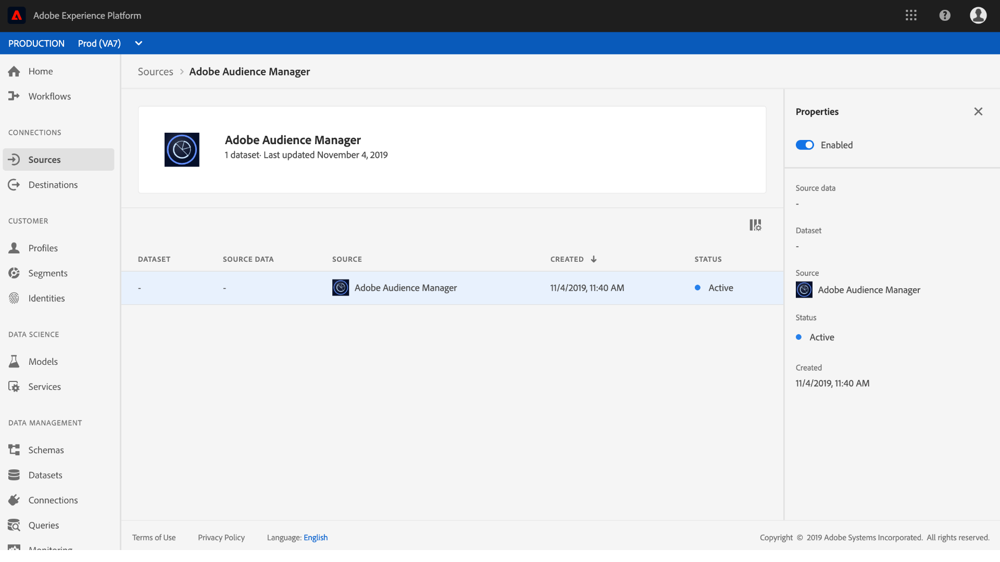

# Criar um conector de origem Adobe Audience Manager na interface do usuário

Este tutorial o orienta pelas etapas para criar conectores de origem para a Adobe Audience Manager trazer os dados do Evento da Experiência do consumidor para a Plataforma usando a interface do usuário.

## Criar uma conexão de origem com o Adobe Audience Manager

Faça logon no [Adobe Experience Platform](https://platform.adobe.com) e selecione **Fontes** na barra de navegação esquerda para acessar a área de trabalho de fontes. A tela *Catálogo* exibe várias fontes com as quais você pode criar conexões de origem e cada fonte mostra o número de conexões existentes associadas a elas.

Na categoria de aplicativos *de* Adobe, selecione **Adobe Audience Manager** para exibir uma barra de informações no lado direito da tela. A barra de informações fornece uma breve descrição para a fonte selecionada, bem como opções para visualização de sua documentação ou para conexão com a fonte.

Para criar um novo conector de origem para Adobe Audience Manager, clique em **Adicionar dados**.

Uma caixa de diálogo é exibida. Clique em **Conectar** para criar a conexão.

Se uma conexão de origem com o Adobe Audience Manager for estabelecida, a página atividade *de* origem do conector Audience Manager será exibida.

Se desejar pausar os dados de Audience Manager recebidos, você poderá fazer isso clicando na lista de fluxo de dados e alterne seu *Status* da coluna *Propriedades* direita.

## Próximas etapas

Enquanto um fluxo de dados Audience Manager está ativo, os dados recebidos são automaticamente assimilados aos Perfis do cliente em tempo real. Agora você pode utilizar esses dados de entrada e criar segmentos de audiência usando o Serviço de segmentação de plataforma. Consulte os seguintes documentos para obter mais detalhes:

- [Visão geral do Perfil do cliente em tempo real](../../../../../profile/home.md)
- [Visão geral do Serviço de segmentação](../../../../../segmentation/home.md)