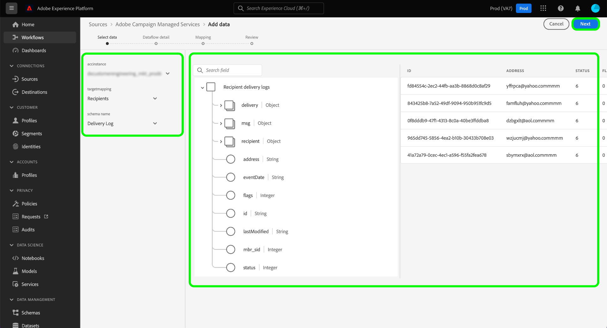
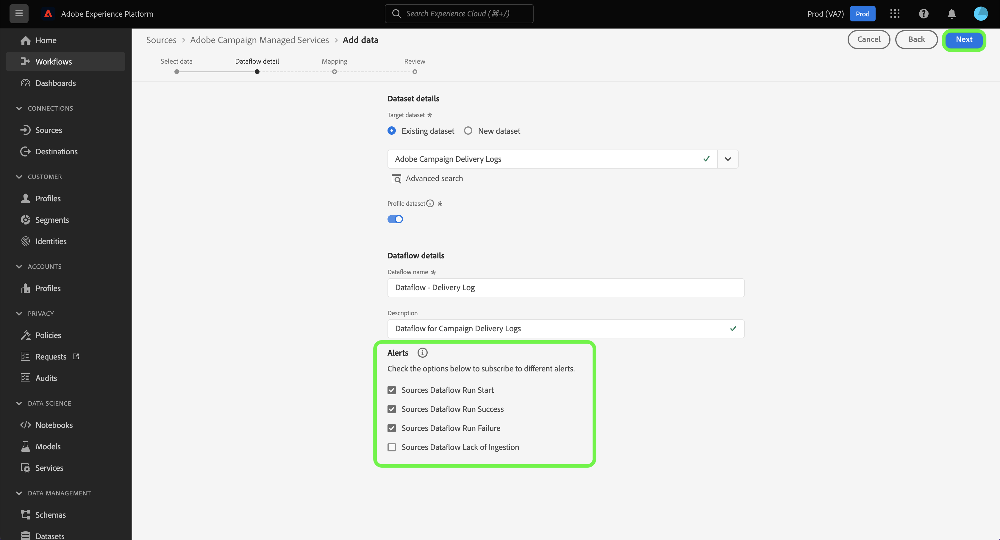

# Criar uma conexão de origem do Adobe Campaign Managed Cloud Services usando a interface do usuário do Experience Platform

Este tutorial fornece etapas para criar uma conexão de origem a fim de trazer seus dados do Adobe Campaign Managed Cloud Services para a Adobe Experience Platform.

## Introdução

Este guia requer uma compreensão funcional dos seguintes componentes do Experience Platform:

* [Fontes](../../../../home.md): o Experience Platform permite a assimilação de dados de várias fontes, ao mesmo tempo em que fornece a capacidade de estruturar, rotular e aprimorar os dados recebidos usando os serviços do Experience Platform.
* [[!DNL Experience Data Model (XDM)] Sistema](../../../../../xdm/home.md): a estrutura padronizada pela qual o Experience Platform organiza os dados de experiência do cliente.
   * [Noções básicas sobre a composição de esquema](../../../../../xdm/schema/composition.md): saiba mais sobre os blocos de construção básicos de esquemas XDM, incluindo princípios-chave e práticas recomendadas na composição de esquema.
   * [Tutorial do Editor de esquemas](../../../../../xdm/tutorials/create-schema-ui.md): saiba como criar esquemas personalizados usando a interface do Editor de esquemas.
* [Sandboxes](../../../../../sandboxes/home.md): a Experience Platform fornece sandboxes virtuais que particionam uma única instância do Experience Platform em ambientes virtuais separados para ajudar a desenvolver aplicativos de experiência digital.

## Conectar o Adobe Campaign Managed Cloud Services ao Experience Platform

Na interface do Experience Platform, selecione **[!UICONTROL Sources]** na navegação à esquerda para acessar o espaço de trabalho [!UICONTROL Sources]. A tela [!UICONTROL Catalog] exibe uma variedade de fontes com as quais você pode criar uma conta.

Você pode selecionar a categoria apropriada no catálogo no lado esquerdo da tela. Você também pode usar a barra de pesquisa para restringir as fontes exibidas.

Na categoria **[!UICONTROL Adobe applications]**, selecione **[!UICONTROL Adobe Campaign Managed Cloud Services]** e **[!UICONTROL Add data]**.

### Selecionar dados {#select-data}

>[!CONTEXTUALHELP]
>id="platform_sources_campaign_instance"
>title="Instância de ambiente do Adobe Campaign"
>abstract="O nome do ambiente do Adobe Campaign que você deseja usar."
>text="Learn more in documentation"

>[!CONTEXTUALHELP]
>id="platform_sources_campaign_mapping"
>title="Target mapping"
>abstract="Os target mappings são objetos técnicos usados pelo Campaign para entregar mensagens e contêm todas as configurações técnicas necessárias para enviar entregas (endereços, números de telefone, indicadores de aceitação, identificadores adicionais...)."
>text="Learn more in documentation"

>[!CONTEXTUALHELP]
>id="platform_sources_campaign_schema"
>title="Nome do esquema"
>abstract="O nome da entidade definida no banco de dados do Adobe Campaign."
>text="Learn more in documentation"

A etapa [!UICONTROL Select data] é exibida, fornecendo uma interface para configurar o [!UICONTROL Adobe Campaign instance], o [!UICONTROL Target mapping] e o [!UICONTROL Schema name].

| Propriedade | Descrição |
| --- | --- |
| Instância do Adobe Campaign | O nome da instância do ambiente Adobe Campaign que você está usando. |
| Target mapping | Os objetos técnicos usados pelo Campaign para entregar mensagens e conter todas as configurações técnicas necessárias para enviar deliveries. |
| Nome do esquema | O nome da entidade do esquema que você está trazendo para a Experience Platform. As opções incluem Log de entrega e Log de rastreamento. |

Depois de fornecer valores para a instância do Campaign, o target mapping e o nome do schema, a tela é atualizada para exibir uma pré-visualização do schema, bem como um conjunto de dados de amostra. Quando terminar, selecione **[!UICONTROL Next]**.

### Usar um conjunto de dados existente

A página [!UICONTROL Dataflow detail] permite selecionar se você deseja usar um conjunto de dados existente ou configurar um novo para o fluxo de dados.

Para usar um conjunto de dados existente, selecione **[!UICONTROL Existing dataset]**. Você pode recuperar um conjunto de dados existente usando a opção [!UICONTROL Advanced search] ou rolando pela lista de conjuntos de dados existentes no menu suspenso.

Com um conjunto de dados selecionado, forneça um nome para o fluxo de dados e uma descrição opcional.

### Usar um novo conjunto de dados

Para usar um novo conjunto de dados, selecione **[!UICONTROL New dataset]** e forneça um nome de conjunto de dados de saída e uma descrição opcional. Em seguida, selecione um esquema para mapear usando a opção [!UICONTROL Advanced search] ou rolando pela lista de esquemas existentes no menu suspenso. Quando terminar, selecione **[!UICONTROL Next]**.

### Ativar alertas

Você pode ativar os alertas para receber notificações sobre o status do fluxo de dados. Selecione um alerta na lista para assinar e receber notificações sobre o status do seu fluxo de dados. Para obter mais informações sobre alertas, consulte o manual sobre [assinatura de alertas de fontes usando a interface](../../alerts.md).

Quando terminar de fornecer detalhes ao fluxo de dados, selecione **[!UICONTROL Next]**.

### Mapear campos de dados para um esquema XDM

A etapa [!UICONTROL Mapping] é exibida, fornecendo uma interface para mapear os campos de origem do esquema de origem para os campos XDM de destino apropriados no esquema de destino.

O Experience Platform fornece recomendações inteligentes para campos mapeados automaticamente com base no esquema ou conjunto de dados de destino selecionado. Você pode ajustar manualmente as regras de mapeamento para atender aos seus casos de uso. Com base nas suas necessidades, você pode optar por mapear campos diretamente ou usar funções de preparação de dados para transformar dados de origem para derivar valores calculados ou calculados. Para obter etapas abrangentes sobre como usar a interface do mapeador e campos calculados, consulte o [Guia da Interface do Preparo de Dados](../../../../../data-prep/ui/mapping.md).

>[!IMPORTANT]
>
>Ao mapear os campos de origem para campos XDM de destino, você deve garantir que mapeie o campo de identidade principal designado para o campo XDM de destino apropriado.
>
>Para cada público, você pode adicionar até 20 campos a serem mapeados para o Adobe Campaign. Você pode alterar esse limite atualizando o valor da opção `NmsCdp_Aep_Sources_Max_Columns` na pasta Administration > Platform > Options do explorador do Campaign.

Após mapear os dados de origem com êxito, selecione **[!UICONTROL Next]**.

### Revisar seu fluxo de dados

A etapa **[!UICONTROL Review]** é exibida, permitindo que você revise seu novo fluxo de dados antes de ele ser criado. Os detalhes são agrupados nas seguintes categorias:

* **[!UICONTROL Connection]**: Mostra o tipo de origem, o caminho relevante do arquivo de origem escolhido e a quantidade de colunas nesse arquivo de origem.
* **[!UICONTROL Assign dataset & map fields]**: mostra em qual conjunto de dados os dados de origem estão sendo assimilados, incluindo o esquema ao qual o conjunto de dados adere.

Depois de revisar o fluxo de dados, selecione **[!UICONTROL Finish]** e aguarde algum tempo para que o fluxo de dados seja criado.

### Monitorar a atividade do conjunto de dados

Depois que o fluxo de dados for criado, você poderá monitorar os dados que estão sendo assimilados por meio dele para ver informações sobre taxas assimiladas e lotes bem-sucedidos e com falha.

Para começar a exibir a atividade do conjunto de dados, selecione **[!UICONTROL Dataflows]** no catálogo de fontes.

Em seguida, selecione o conjunto de dados de destino na lista de fluxos de dados exibida.

A página de atividade do conjunto de dados é exibida. Aqui, você pode ver informações sobre o desempenho do seu fluxo de dados, incluindo a taxa de assimilação, lotes bem-sucedidos e lotes com falha.

Essa página também fornece uma interface para atualizar a descrição dos metadados do fluxo de dados, habilitar a assimilação parcial e o diagnóstico de erros, bem como adicionar novos dados ao conjunto de dados.

>[!IMPORTANT]
>
>Não é possível preencher retroativamente logs de eventos antigos com a origem do Adobe Campaign Managed Cloud Services. Se o preenchimento retroativo for necessário, use um fluxo de trabalho personalizado ou uma implementação personalizada para exportar dados para o Amazon S3 ou Azure Blob, ou do Amazon S3 ou Azure Blob para um conjunto de dados do Adobe Experience Platform.

## Próximas etapas

Ao seguir este tutorial, você criou com sucesso um fluxo de dados para trazer seus logs do delivery e os dados dos logs de rastreamento do Campaign v8 para a Experience Platform. Os dados de entrada agora podem ser usados por serviços downstream do Experience Platform, como [!DNL Real-Time Customer Profile] e [!DNL Data Science Workspace]. Consulte os seguintes documentos para obter mais detalhes:

* [Visão geral do [!DNL Real-Time Customer Profile]](../../../../../profile/home.md)
* [Visão geral do [!DNL Data Science Workspace]](../../../../../data-science-workspace/home.md)
