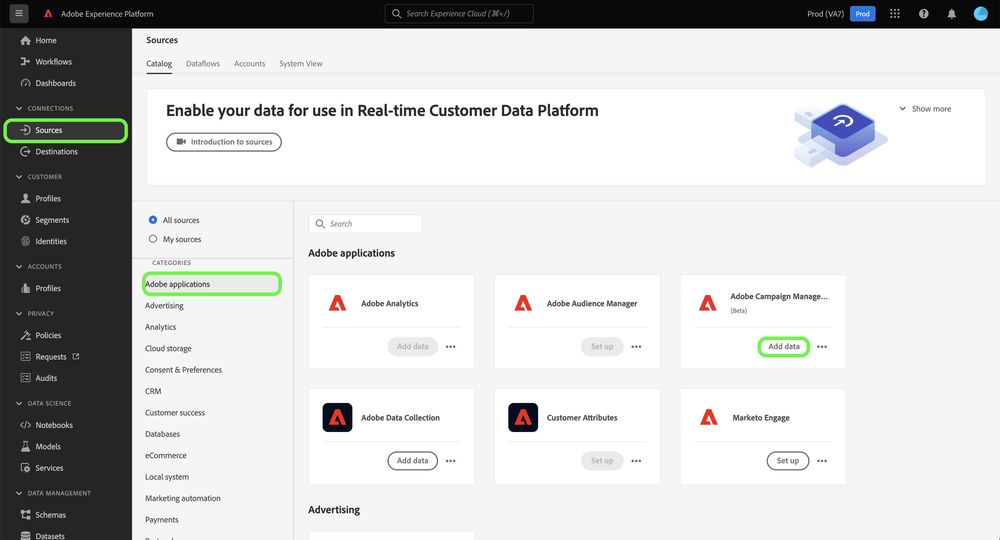

# Criar uma conexão de origem do Adobe Campaign Managed Cloud Services usando a interface do usuário da plataforma

Este tutorial fornece etapas para criar uma conexão de origem para trazer seus dados do Adobe Campaign Managed Cloud Services para o Adobe Experience Platform.

## Introdução

Este guia requer uma compreensão funcional dos seguintes componentes do Experience Platform:

* [Fontes](../../../../home.md): A Platform permite que os dados sejam assimilados de várias fontes, além de fornecer a você a capacidade de estruturar, rotular e aprimorar os dados recebidos usando os serviços da plataforma.
* [[!DNL Experience Data Model (XDM)] Sistema](../../../../../xdm/home.md): A estrutura padronizada pela qual o Experience Platform organiza os dados de experiência do cliente.
   * [Noções básicas da composição do schema](../../../../../xdm/schema/composition.md): Saiba mais sobre os elementos básicos dos esquemas XDM, incluindo princípios-chave e práticas recomendadas na composição do schema.
   * [Tutorial do Editor de esquemas](../../../../../xdm/tutorials/create-schema-ui.md): Saiba como criar esquemas personalizados usando a interface do Editor de esquemas.
* [Sandboxes](../../../../../sandboxes/home.md): A Platform fornece sandboxes virtuais que particionam uma única instância da Platform em ambientes virtuais separados para ajudar a desenvolver aplicativos de experiência digital.

## Conectar o Adobe Campaign Managed Cloud Services à plataforma

Na interface do usuário da plataforma, selecione **[!UICONTROL Fontes]** na navegação à esquerda para acessar o [!UICONTROL Fontes] espaço de trabalho. O [!UICONTROL Catálogo] exibe uma variedade de fontes com as quais você pode criar uma conta.

Você pode selecionar a categoria apropriada no catálogo no lado esquerdo da tela. Também é possível usar a barra de pesquisa para restringir as fontes exibidas.

Em **[!UICONTROL Aplicativos Adobe]** categoria , selecione **[!UICONTROL Adobe Campaign Managed Cloud Services]** e depois selecione **[!UICONTROL Adicionar dados]**.

### Selecionar dados {#select-data}

>[!CONTEXTUALHELP]
>id="platform_sources_campaign_instance"
>title="Instância do ambiente Adobe Campaign"
>abstract="O nome do ambiente Adobe Campaign que você deseja usar."
>text="Learn more in documentation"

>[!CONTEXTUALHELP]
>id="platform_sources_campaign_mapping"
>title="Target mapping"
>abstract="Os target mappings são objetos técnicos usados pelo Campaign para entregar mensagens e contêm todas as configurações técnicas necessárias para enviar deliveries (endereços, números de telefone, indicadores de aceitação, identificadores adicionais...)."
>text="Learn more in documentation"

>[!CONTEXTUALHELP]
>id="platform_sources_campaign_schema"
>title="Nome do esquema"
>abstract="O nome da entidade definida no banco de dados do Adobe Campaign."
>text="Learn more in documentation"

O [!UICONTROL Selecionar dados] será exibida, fornecendo uma interface para configurar [!UICONTROL Instância do Adobe Campaign], [!UICONTROL Target mapping]e [!UICONTROL Nome do esquema].

| Propriedade | Descrição |
| --- | --- |
| Instância do Adobe Campaign | O nome da instância do ambiente Adobe Campaign que você está usando. |
| Target mapping | Os objetos técnicos usados pelo Campaign para entregar mensagens e contêm todas as configurações técnicas necessárias para enviar deliveries. |
| Nome do esquema | O nome da entidade de esquema que você está trazendo para a Plataforma. As opções incluem Log de entrega e Log de rastreamento. |

Depois de fornecer os valores para a instância do Campaign, o target mapping e o nome do schema, a tela é atualizada para exibir uma pré-visualização do esquema, bem como um conjunto de dados de amostra. Quando terminar, selecione **[!UICONTROL Próximo]**.

### Usar um conjunto de dados existente

O [!UICONTROL Detalhes do fluxo de dados] permite selecionar se deseja usar um conjunto de dados existente ou configurar um novo conjunto de dados para o fluxo de dados.

Para usar um conjunto de dados existente, selecione **[!UICONTROL Conjunto de dados existente]**. Você pode recuperar um conjunto de dados existente usando o [!UICONTROL Pesquisa avançada] ou percorrendo a lista de conjuntos de dados existentes no menu suspenso.

Com um conjunto de dados selecionado, forneça um nome para o seu fluxo de dados e uma descrição opcional.

### Usar um novo conjunto de dados

Para usar um novo conjunto de dados, selecione **[!UICONTROL Novo conjunto de dados]** e, em seguida, forneça um nome de conjunto de dados de saída e uma descrição opcional. Em seguida, selecione um esquema para mapear usando o [!UICONTROL Pesquisa avançada] ou rolando pela lista de schemas existentes no menu suspenso. Quando terminar, selecione **[!UICONTROL Próximo]**.

### Ativar alertas

Você pode habilitar alertas para receber notificações sobre o status do seu fluxo de dados. Selecione um alerta na lista para assinar e receber notificações sobre o status do seu fluxo de dados. Para obter mais informações sobre alertas, consulte o guia sobre [inscrever-se em alertas de origens usando a interface do usuário](../../alerts.md).

Quando terminar de fornecer detalhes do fluxo de dados, selecione **[!UICONTROL Próximo]**.

### Mapear campos de dados para um esquema XDM

O [!UICONTROL Mapeamento] é exibida, fornecendo uma interface para mapear os campos de origem do esquema de origem para os campos XDM de destino apropriados no esquema de destino.

A Platform fornece recomendações inteligentes para campos mapeados automaticamente com base no esquema de destino ou conjunto de dados selecionado. Você pode ajustar manualmente as regras de mapeamento de acordo com seus casos de uso. Com base em suas necessidades, você pode optar por mapear campos diretamente ou usar funções de preparação de dados para transformar dados de origem em valores calculados ou calculados. Para obter etapas abrangentes sobre o uso da interface do mapeador e dos campos calculados, consulte o [Guia da interface do usuário de preparação de dados](../../../../../data-prep/ui/mapping.md).

>[!IMPORTANT]
>
>Ao mapear os campos de origem para campos XDM de destino, você deve mapear o campo de identidade primário designado para o campo XDM de destino apropriado.

Depois que os dados de origem forem mapeados com êxito, selecione **[!UICONTROL Próximo]**.

### Revisar o fluxo de dados

O **[!UICONTROL Revisão]** é exibida, permitindo que você revise o novo fluxo de dados antes de criá-lo. Os detalhes são agrupados nas seguintes categorias:

* **[!UICONTROL Conexão]**: Mostra o tipo de origem, o caminho relevante do arquivo de origem escolhido e a quantidade de colunas dentro desse arquivo de origem.
* **[!UICONTROL Atribuir conjunto de dados e mapear campos]**: Mostra em qual conjunto de dados os dados de origem estão sendo assimilados, incluindo o esquema ao qual o conjunto de dados adere.

Depois de revisar o fluxo de dados, selecione **[!UICONTROL Concluir]** e permitir que o fluxo de dados seja criado.

### Monitorar a atividade do conjunto de dados

Depois que o fluxo de dados for criado, você poderá monitorar os dados que estão sendo assimilados por meio dele para ver informações sobre taxas assimiladas e lotes bem-sucedidos e com falha.

Para começar a visualizar a atividade do conjunto de dados, selecione **[!UICONTROL Fluxos de dados]** no catálogo de fontes.

Em seguida, selecione o conjunto de dados de destino na lista de fluxos de dados exibidos.

A página de atividade do conjunto de dados é exibida. A partir daqui, você pode ver informações sobre o desempenho do seu fluxo de dados, incluindo taxa de ingestão, lotes bem-sucedidos e lotes com falha.

Esta página também fornece uma interface para atualizar a descrição de metadados do seu fluxo de dados, ativar a assimilação parcial e o diagnóstico de erros, bem como adicionar novos dados ao seu conjunto de dados.

## Próximas etapas

Ao seguir este tutorial, você criou com sucesso um fluxo de dados para trazer seus logs de delivery e dados de logs de rastreamento do Campaign v8 para a Plataforma. Os dados recebidos agora podem ser usados por serviços downstream da plataforma, como [!DNL Real-Time Customer Profile] e [!DNL Data Science Workspace]. Consulte os seguintes documentos para obter mais detalhes:

* [Visão geral do [!DNL Real-Time Customer Profile]](../../../../../profile/home.md)
* [Visão geral do [!DNL Data Science Workspace]](../../../../../data-science-workspace/home.md)
