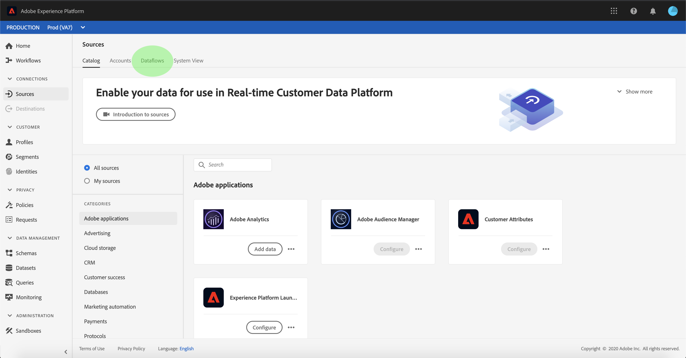

# Criar uma conexão de origem do Adobe Analytics para dados de classificações na interface do usuário

Este tutorial fornece etapas para criar uma conexão de fonte de dados de classificações do Adobe Analytics na interface do usuário para trazer dados de classificações para o Adobe Experience Platform.

## Introdução

Este tutorial requer uma compreensão funcional dos seguintes componentes do Adobe Experience Platform:

* [[!DNL Experience Data Model (XDM)] Sistema](../../../../../xdm/home.md): A estrutura padronizada pela qual o Experience Platform organiza os dados de experiência do cliente.
* [[!DNL Real-time Customer Profile]](../../../../../profile/home.md): Fornece um perfil de consumidor unificado e em tempo real com base em dados agregados de várias fontes.
* [[!DNL Sandboxes]](../../../../../sandboxes/home.md): O Experience Platform fornece sandboxes virtuais que particionam uma única instância da Platform em ambientes virtuais separados para ajudar a desenvolver aplicativos de experiência digital.

O Conector de dados de classificações do Analytics exige que seus dados tenham sido migrados para a nova infraestrutura [!DNL Classifications] do Adobe Analytics antes do uso. Para confirmar o status da migração de seus dados, entre em contato com o Gerente de sucesso do cliente do Adobe.

## Selecione suas classificações

Faça logon em [Adobe Experience Platform](https://platform.adobe.com) e selecione **[!UICONTROL Sources]** na barra de navegação esquerda para acessar o espaço de trabalho de origens. A tela **[!UICONTROL Catalog]** exibe as fontes disponíveis para criar conexões de entrada com o . Cada cartão de origem mostra uma opção para configurar uma nova conta ou adicionar dados a uma conta existente.

Você pode selecionar a categoria apropriada no catálogo no lado esquerdo da tela. Como alternativa, você pode encontrar a fonte específica com a qual deseja trabalhar usando a opção de pesquisa.

Na categoria **[!UICONTROL Adobe applications]**, selecione o cartão **[!UICONTROL Adobe Analytics]** e selecione **[!UICONTROL Add data]** para começar a trabalhar com os dados de classificações do Analytics.

A etapa **[!UICONTROL Analytics source add data]** é exibida. Selecione **[!UICONTROL Classifications]** no cabeçalho superior para ver uma lista de conjuntos de dados [!DNL Classifications], incluindo informações sobre a ID da dimensão, o nome do conjunto de relatórios e a ID do conjunto de relatórios.

Cada página exibe até dez conjuntos de dados [!DNL Classifications] diferentes que você pode escolher. Selecione **[!UICONTROL Next]** na parte inferior da página para procurar mais opções. O painel à direita mostra o número total de conjuntos de dados [!DNL Classifications] selecionados, bem como seus nomes. Esse painel também permite remover qualquer conjunto de dados [!DNL Classifications] selecionado por engano ou apagar todas as seleções com uma ação.

Você pode selecionar até 30 conjuntos de dados diferentes [!DNL Classifications] para trazer para [!DNL Platform].

Depois de selecionar seus conjuntos de dados [!DNL Classifications], selecione **[!UICONTROL Next]** na parte superior direita da página.

## Revisar suas classificações

A etapa **[!UICONTROL Review]** é exibida, permitindo que você revise os conjuntos de dados [!DNL Classifications] selecionados antes de criá-los. Os detalhes são agrupados nas seguintes categorias:

* **[!UICONTROL Connection]**: Mostra a plataforma de origem e o status da conexão.
* **[!UICONTROL Data type]**: Mostra o número de selecionados  [!DNL Classifications].
* **[!UICONTROL Scheduling]**: Mostra a frequência da sincronização de  [!DNL Classifications] dados.

Depois de revisar o fluxo de dados, clique em **[!UICONTROL Finish]** e aguarde algum tempo para que o fluxo de dados seja criado.

## Monitorar o fluxo de dados de classificações

Depois que o fluxo de dados for criado, é possível monitorar os dados que estão sendo assimilados por meio dele. Na tela **[!UICONTROL Catalog]**, selecione **[!UICONTROL Dataflows]** para visualizar uma lista de fluxos estabelecidos associados à sua conta [!DNL Classifications].

A tela **[!UICONTROL Dataflows]** é exibida. Nesta página há uma lista de fluxos de dados, incluindo informações sobre seu nome, dados de origem e status de execução do fluxo de dados. À direita, está o painel **[!UICONTROL Properties]** que contém metadados relacionados ao seu fluxo de dados [!DNL Classifications].

Selecione o **[!UICONTROL Target dataset]** que deseja acessar.

A página **[!UICONTROL Dataset activity]** exibe informações sobre o conjunto de dados de destino selecionado, incluindo detalhes sobre o status do lote, a ID do conjunto de dados e o esquema.

>[!IMPORTANT]
>
>Embora a exclusão de conjuntos de dados seja possível para outros conectores de origem, no momento não é compatível com o conector de Dados de classificações do Analytics. Se você excluir um conjunto de dados por engano, entre em contato com o Atendimento ao cliente do Adobe.

## Próximas etapas

Ao seguir este tutorial, você criou um conector de Dados de classificações do Analytics que traz [!DNL Classifications] dados para [!DNL Platform]. Consulte os seguintes documentos para obter mais informações sobre os dados [!DNL Analytics] e [!DNL Classifications]:

* [Visão geral do Data Connector do Analytics](../../../../connectors/adobe-applications/analytics.md)
* [Criar uma conexão de dados do Analytics na interface do usuário](./analytics.md)
* [Sobre as classificações](https://experienceleague.adobe.com/docs/analytics/components/classifications/c-classifications.html)
