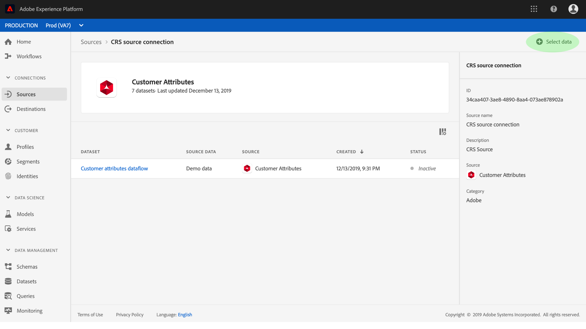

# Criar um conector de origem de atributos do cliente na interface do usuário

Este tutorial fornece etapas para criar um conector de origem na interface do usuário para coletar dados de perfil de atributos do cliente no Adobe Experience Platform. Para obter mais informações sobre atributos do cliente, consulte o documento [overview](https://experienceleague.adobe.com/docs/core-services/interface/customer-attributes/attributes.html).

## Criar uma conexão de origem

Faça logon em [Adobe Experience Platform](https://platform.adobe.com) e selecione **[!UICONTROL Fontes]** na barra de navegação esquerda para acessar a área de trabalho de fontes. A tela **[!UICONTROL Catálogo]** exibe as fontes disponíveis para criar conexões de entrada e cada fonte mostra o número de conexões existentes associadas a elas. Selecione a opção para **[!UICONTROL Atributos do cliente]** e selecione **[!UICONTROL Adicionar dados]**. Aguarde até que a conexão seja estabelecida, você será redirecionado se uma conexão for estabelecida com êxito.

>[!NOTE]
>
>Se você já tiver estabelecido um conector de origem para dados de perfil de atributos do cliente, a opção de conexão com a fonte será desativada.

A tela **atividade de origem** lista todas as conexões estabelecidas anteriormente para os dados de perfil dos atributos do cliente, você pode criar uma nova conexão clicando em **Selecionar dados**.

>[!NOTE]
>
>Várias conexões de entrada para uma fonte podem ser feitas para inserir dados diferentes.

Na lista de conjuntos de dados de perfil de atributos do cliente disponíveis, selecione aquele que deseja trazer para [!DNL Platform] e clique em **Próximo**.

>[!NOTE]
>
>Somente um conjunto de dados pode ser selecionado por conexão de origem de atributos do cliente.

A etapa **Revisar** é exibida, permitindo que você reveja sua nova conexão de entrada antes de ela ser criada. Os detalhes da conexão são agrupados por categorias, incluindo:

* **Detalhes** da fonte: Mostra o tipo da conexão de origem e os dados de origem selecionados.
* **Detalhes** do público alvo: Ao criar outros conectores de origem, esse container mostra em qual conjunto de dados os dados de origem estão assimilando, incluindo o schema ao qual o conjunto de dados está aderindo. Os dados do perfil dos atributos do cliente são mapeados e assimilados automaticamente nos Perfis do cliente em tempo real.

## Próximas etapas

Depois que a conexão é criada, um esquema de público-alvo e um conjunto de dados são criados automaticamente para conter os dados recebidos. Quando a ingestão inicial for concluída, os dados do perfil dos atributos do cliente poderão ser usados por serviços downstream [!DNL Platform], como [!DNL Real-time Customer Profile] e [!DNL Segmentation Service]. Consulte os seguintes documentos para obter mais detalhes:

* [[!DNL Real-time Customer Profile] visão geral](../../../../../profile/home.md)
* [[!DNL Segmentation Service] visão geral](../../../../../segmentation/home.md)
