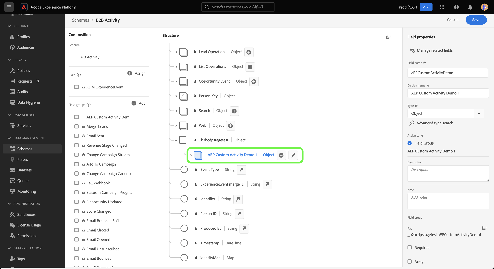
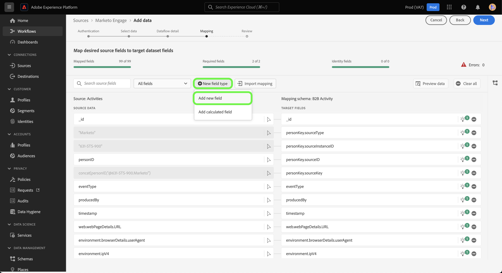
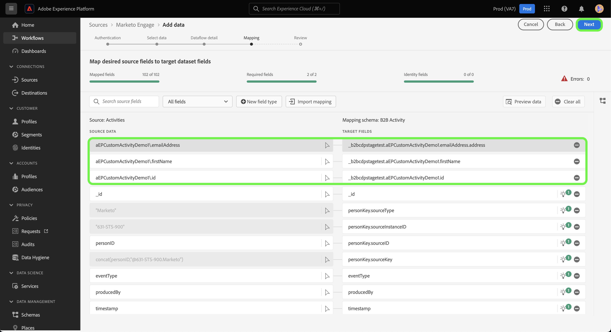

# Criar um [!DNL Marketo Engage] conexão de origem e fluxo de dados para dados de atividade personalizados na interface do

>[!NOTE]
>
>Este tutorial fornece etapas específicas sobre como configurar e trazer **atividade personalizada** dados de [!DNL Marketo] para Experience Platform. Para obter etapas sobre como trazer **atividade padrão** dados, leia os [[!DNL Marketo] Guia da interface do usuário](./marketo.md).

Além de [atividades padrão](../../../../connectors/adobe-applications/mapping/marketo.md#activities), você também pode usar o [!DNL Marketo] fonte para trazer dados de atividades personalizadas para a Adobe Experience Platform. Este documento fornece etapas sobre como criar uma conexão de origem e um fluxo de dados para dados de atividade personalizados usando o [!DNL Marketo] na interface do usuário.

## Introdução

Este tutorial requer uma compreensão funcional dos seguintes componentes do Adobe Experience Platform:

* [Utilitário de geração automática de esquemas e namespaces B2B](../../../../connectors/adobe-applications/marketo/marketo-namespaces.md): o utilitário de geração automática de esquemas e namespaces B2B permite usar [!DNL Postman] para gerar automaticamente valores para seus namespaces e esquemas B2B. Você deve concluir os namespaces e esquemas B2B primeiro, antes de criar um [!DNL Marketo] conexão de origem e fluxo de dados.
* [Origens](../../../../home.md): o Experience Platform permite que os dados sejam assimilados de várias fontes e, ao mesmo tempo, fornece a capacidade de estruturar, rotular e aprimorar os dados recebidos usando os serviços da plataforma.
* [Experience Data Model (XDM)](../../../../../xdm/home.md): a estrutura padronizada pela qual o Experience Platform organiza os dados de experiência do cliente.
   * [Criar e editar esquemas na interface](../../../../../xdm/ui/resources/schemas.md): saiba como criar e editar esquemas na interface do usuário.
* [Namespaces de identidade](../../../../../identity-service/namespaces.md): os namespaces de identidade são um componente de [!DNL Identity Service] que servem como indicadores do contexto ao qual uma identidade está relacionada. Uma identidade totalmente qualificada inclui um valor de ID e um namespace.
* [[!DNL Real-Time Customer Profile]](/help/profile/home.md): fornece um perfil de consumidor unificado em tempo real com base em dados agregados de várias fontes.
* [Sandboxes](../../../../../sandboxes/home.md): o Experience Platform fornece sandboxes virtuais que particionam uma única instância da Platform em ambientes virtuais separados para ajudar a desenvolver aplicativos de experiência digital.

## Recupere os detalhes de sua atividade personalizada

A primeira etapa para obter dados de atividade personalizados do [!DNL Marketo] O Experience Platform é recuperar o nome da API e o nome de exibição da atividade personalizada.

Faça logon na sua conta usando o [[!DNL Marketo]](https://app-sjint.marketo.com/#MM0A1) interface. Na navegação à esquerda, em [!DNL Database Management], selecione **Atividades personalizadas do Marketo**.

A interface é atualizada para uma exibição de suas atividades personalizadas, incluindo informações sobre seus respectivos nomes de exibição e nomes de API. Você também pode usar o painel direito para selecionar e exibir outras atividades personalizadas da sua conta.


Selecionar **Campos** no cabeçalho superior para exibir os campos associados à atividade personalizada. Nesta página, você pode exibir os nomes, os nomes das APIs, as descrições e os tipos de dados dos campos na atividade personalizada. Detalhes sobre campos individuais serão usados em uma etapa posterior, ao criar um esquema.


## Configurar grupos de campos para atividades personalizadas no esquema de atividades B2B

No *[!UICONTROL Esquemas]* do painel da interface do Experience Platform, selecione **[!UICONTROL Procurar]** e selecione **[!UICONTROL Atividade B2B]** na lista de schemas.

>[!TIP]
>
>Use a barra de pesquisa para acelerar sua navegação pela lista de schemas.


### Criar um novo grupo de campos para uma atividade personalizada

Em seguida, adicione um novo grupo de campos à [!DNL B2B Activity] esquema. Este grupo de campos deve corresponder à atividade personalizada que você deseja assimilar e deve usar o nome para exibição da atividade personalizada que você recuperou anteriormente.

Para adicionar um novo grupo de campos, selecione **[!UICONTROL + Adicionar]** ao lado da variável *[!UICONTROL Grupos de campos]* painel em *[!UICONTROL Composição]*.


A variável *[!UICONTROL Adicionar grupos de campos]* é exibida. Selecionar **[!UICONTROL Criar novo grupo de campos]** em seguida, forneça o mesmo nome de exibição para a atividade personalizada que você recuperou em uma etapa anterior e forneça uma descrição opcional para o novo grupo de campos. Quando terminar, selecione **[!UICONTROL Adicionar grupos de campos]**.


Depois de criado, seu novo grupo de campos para atividade personalizada aparece na [!UICONTROL Grupos de campos] catálogo.


### Adicionar um novo campo à estrutura do esquema

Em seguida, adicione um novo campo ao esquema. Esse novo campo deve ser definido como `type: object` e conterão os campos individuais da atividade personalizada.

Para adicionar um novo campo, selecione o sinal de mais (`+`) ao lado do nome do schema. Uma entrada para *[!UICONTROL Campo sem título | Tipo]* é exibida. Em seguida, configure as propriedades do campo usando o *[!UICONTROL Propriedades do campo]* painel. Defina o nome do campo como o nome da API da atividade personalizada e defina o nome de exibição como o nome de exibição da atividade personalizada. Em seguida, defina o tipo como `object` e atribua o grupo de campos ao grupo de campos de atividade personalizado que você criou na etapa anterior. Quando terminar, selecione **[!UICONTROL Aplicar]**.


O novo campo aparece no esquema.



### Adicionar subcampos ao campo de objeto {#add-sub-fields-to-the-object-field}

A última etapa na preparação do esquema é adicionar campos individuais dentro do campo criado na etapa anterior.


## Crie um fluxo de dados

Com a configuração do esquema concluída, agora é possível prosseguir para criar um fluxo de dados para seus dados de atividade personalizados.

Na interface do usuário da Platform, selecione **[!UICONTROL Origens]** na barra de navegação esquerda, para acessar a [!UICONTROL Origens] espaço de trabalho. A variável [!UICONTROL Catálogo] exibe uma variedade de fontes com as quais você pode criar uma conta.

Você pode selecionar a categoria apropriada no catálogo no lado esquerdo da tela. Como alternativa, você pode encontrar a fonte específica com a qual deseja trabalhar usando a barra de pesquisa.

No [!UICONTROL aplicativos Adobe] categoria, selecione **[!UICONTROL Marketo Engage]**. Em seguida, selecione **[!UICONTROL Adicionar dados]** para criar um novo [!DNL Marketo] fluxo de dados.


### Selecionar dados

Selecionar **[!UICONTROL Atividades]** na lista de [!DNL Marketo] conjuntos de dados e selecione **[!UICONTROL Próxima]**.


### Detalhes do fluxo de dados

Em seguida, [fornecer informações para o fluxo de dados](./marketo.md#provide-dataflow-details), incluindo nomes e descrições para seu conjunto de dados e fluxo de dados, o esquema que você usará e as configurações para [!DNL Profile] assimilação, diagnóstico de erros e assimilação parcial.


### Mapeamento

Os mapeamentos para campos de atividade padrão são preenchidos automaticamente, mas os campos de atividade personalizados devem ser mapeados manualmente para os campos de destino correspondentes.

Para começar a mapear os campos de atividade personalizados, selecione **[!UICONTROL Novo tipo de campo]** e selecione **[!UICONTROL Adicionar novo campo]**.



Navegue pela estrutura de dados de origem e localize o campo de atividade personalizado que você deseja assimilar. Quando terminar, selecione **[!UICONTROL Selecionar]**.

>[!TIP]
>
>Para evitar confusão e lidar com nomes de campo duplicados, os campos de atividade personalizados recebem o prefixo do nome da API.


Para adicionar um campo de destino, selecione o ícone de esquema  e selecione os campos de atividade personalizados no schema de destino.


Repita as etapas para adicionar o restante dos campos de mapeamento de atividade personalizados. Quando terminar, selecione **[!UICONTROL Próxima]**.



### Consulte a seção

A variável *[!UICONTROL Revisão]* é exibida, permitindo que você revise seu novo fluxo de dados antes de ele ser criado. Os detalhes são agrupados nas seguintes categorias:

* **[!UICONTROL Conexão]**: mostra o tipo de origem, o caminho relevante da entidade de origem escolhida e a quantidade de colunas nessa entidade de origem.
* **[!UICONTROL Atribuir conjunto de dados e mapear campos]**: mostra em qual conjunto de dados os dados de origem estão sendo assimilados, incluindo o esquema ao qual o conjunto de dados adere.

Depois de revisar o fluxo de dados, selecione **[!UICONTROL Salvar e assimilar]** e aguarde algum tempo para criar o fluxo de dados.


### Adicionar atividades personalizadas a um fluxo de dados de atividades existente {#add-to-existing-dataflows}

Para adicionar dados de atividade personalizados a um fluxo de dados existente, modifique os mapeamentos de um fluxo de dados de atividades existente com os dados de atividade personalizados que deseja assimilar. Isso permite assimilar atividades personalizadas no mesmo conjunto de dados de atividades existente. Para obter mais informações sobre como atualizar os mapeamentos de um fluxo de dados existente, leia o manual sobre [atualização de fluxos de dados na interface do](../../update-dataflows.md).

### Uso [!DNL Query Service] para filtrar atividades para atividades personalizadas {#query-service-filter}

Depois que o fluxo de dados for concluído, você poderá usar [Serviço de consulta](../../../../../query-service/home.md) para filtrar as atividades dos dados de atividade personalizados.

Quando as atividades personalizadas são assimiladas na Platform, o nome da API da atividade personalizada torna-se automaticamente seu `eventType`. Uso `eventType={API_NAME}` para filtrar por dados de atividade personalizados.

```sql
SELECT * FROM with_custom_activities_ds_today WHERE eventType='aepCustomActivityDemo1' 
```

Use o `IN` para filtrar várias atividades personalizadas:

```sql
SELECT * FROM $datasetName WHERE eventType='{API_NAME}'
SELECT * FROM $datasetName WHERE eventType IN ('aepCustomActivityDemo1', 'aepCustomActivityDemo2')
```

A imagem abaixo mostra um exemplo de instrução SQL na variável [Editor de consultas](../../../../../query-service/ui/user-guide.md) que filtra os dados de atividade personalizados.


## Próximas etapas

Ao seguir este tutorial, você configurou um esquema da Platform para [!DNL Marketo] dados de atividade personalizados e criou um fluxo de dados para trazer esses dados para a Platform. Para obter informações gerais sobre o [!DNL Marketo] origem, leia o [[!DNL Marketo] visão geral da origem](../../../../connectors/adobe-applications/marketo/marketo.md).
