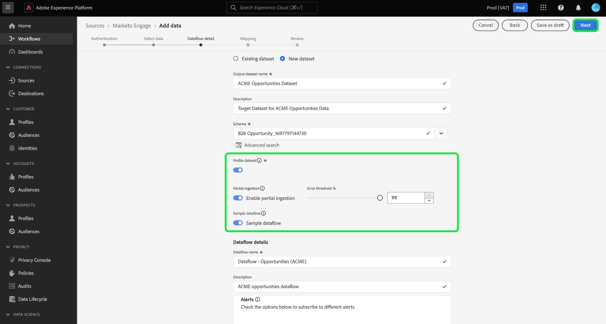
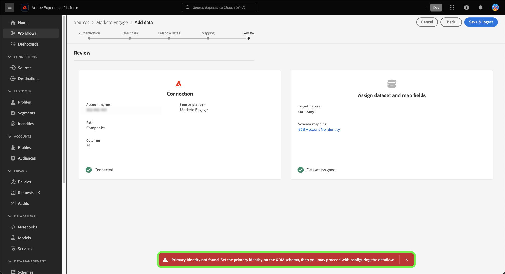

# Criar uma conexão de origem e um fluxo de dados de [!DNL Marketo Engage] na interface do usuário

>[!IMPORTANT]
>
>Antes de criar uma conexão de origem [!DNL Marketo Engage] e um fluxo de dados, primeiro verifique se você mapeou a [ID da Organização da Adobe](https://experienceleague.adobe.com/docs/marketo/using/product-docs/core-marketo-concepts/miscellaneous/set-up-adobe-organization-mapping.html) em [!DNL Marketo]. Além disso, você também deve garantir que concluiu o [preenchimento automático de seus [!DNL Marketo] namespaces e esquemas B2B](../../../../connectors/adobe-applications/marketo/marketo-namespaces.md) antes de criar uma conexão de origem e um fluxo de dados.

Este tutorial fornece etapas para a criação de um conector de origem [!DNL Marketo Engage] (a seguir denominado &quot;[!DNL Marketo]&quot;) na interface do usuário para trazer dados B2B para o Adobe Experience Platform.

## Introdução

Este tutorial requer uma compreensão funcional dos seguintes componentes do Adobe Experience Platform:

* [Utilitário de geração automática de esquemas e namespaces B2B](../../../../connectors/adobe-applications/marketo/marketo-namespaces.md): o utilitário de geração automática de esquemas e namespaces B2B permite usar [!DNL Postman] para gerar valores automaticamente para seus esquemas e namespaces B2B. Você deve concluir seus namespaces e esquemas B2B primeiro, antes de criar uma conexão de origem e um fluxo de dados do [!DNL Marketo].
* [Fontes](../../../../home.md): o Experience Platform permite a assimilação de dados de várias fontes, ao mesmo tempo em que fornece a capacidade de estruturar, rotular e aprimorar os dados recebidos usando os serviços do Experience Platform.
* [Experience Data Model (XDM)](../../../../../xdm/home.md): a estrutura padronizada pela qual a Experience Platform organiza os dados de experiência do cliente.
   * [Criar e editar esquemas na interface](../../../../../xdm/ui/resources/schemas.md): saiba como criar e editar esquemas na interface.
* [Namespaces de identidade](../../../../../identity-service/features/namespaces.md): os namespaces de identidade são um componente de [!DNL Identity Service] que serve como indicadores do contexto ao qual uma identidade está relacionada. Uma identidade totalmente qualificada inclui um valor de ID e um namespace.
* [[!DNL Real-Time Customer Profile]](/help/profile/home.md): Fornece um perfil de consumidor unificado em tempo real com base em dados agregados de várias fontes.
* [Sandboxes](../../../../../sandboxes/home.md): a Experience Platform fornece sandboxes virtuais que particionam uma única instância do Experience Platform em ambientes virtuais separados para ajudar a desenvolver aplicativos de experiência digital.

### Coletar credenciais necessárias

Para acessar sua conta do [!DNL Marketo] no Experience Platform, você deve fornecer os seguintes valores:

| Credencial | Descrição |
| ---- | ---- |
| `munchkinId` | A Munchkin ID é o identificador exclusivo de uma instância [!DNL Marketo] específica. |
| `clientId` | A ID exclusiva do cliente da sua instância [!DNL Marketo]. |
| `clientSecret` | O segredo exclusivo do cliente da sua instância [!DNL Marketo]. |

Para obter mais informações sobre como adquirir esses valores, consulte o [[!DNL Marketo] guia de autenticação](../../../../connectors/adobe-applications/marketo/marketo-auth.md).

Depois de obter as credenciais necessárias, você poderá seguir as etapas da próxima seção.

## Conectar sua conta do [!DNL Marketo]

Na interface do Experience Platform, selecione **[!UICONTROL Fontes]** na navegação à esquerda para acessar o espaço de trabalho [!UICONTROL Fontes]. Você pode selecionar a categoria apropriada no catálogo no lado esquerdo da tela. Como alternativa, você pode encontrar a fonte específica com a qual deseja trabalhar usando a opção de pesquisa.

Na categoria *aplicativos do Adobe*, selecione **[!UICONTROL Marketo Engage]** e **[!UICONTROL Adicionar dados]**.

>[!TIP]
>
>As origens no catálogo de origens exibem a opção **[!UICONTROL Configurar]** quando uma determinada origem ainda não tem uma conta autenticada. Quando uma conta autenticada existir, esta opção será alterada para **[!UICONTROL Adicionar dados]**.

A página **[!UICONTROL Conectar conta do Marketo Engage]** é exibida. Nesta página, você pode usar uma nova conta ou acessar uma conta existente.

>[!BEGINTABS]

>[!TAB Criar uma nova conta]

Para criar uma nova conta, selecione **[!UICONTROL Nova conta]** e forneça um nome, uma descrição opcional e suas credenciais.

Quando terminar, selecione **[!UICONTROL Conectar à origem]** e aguarde algum tempo para que a nova conexão seja estabelecida.

>[!TAB Usar uma conta existente]

Para usar uma conta existente, selecione **[!UICONTROL Conta existente]** e a conta que deseja usar no catálogo de contas existente.

Selecione **[!UICONTROL Avançar]** para continuar.

>[!ENDTABS]

## Selecionar um conjunto de dados

Depois de criar sua conta do [!DNL Marketo], a próxima etapa fornece uma interface para você explorar conjuntos de dados do [!DNL Marketo].

A metade esquerda da interface é um navegador de diretório, que exibe os 10 conjuntos de dados do [!DNL Marketo]. Uma conexão de origem [!DNL Marketo] totalmente funcional requer a assimilação dos nove conjuntos de dados diferentes. Se você também estiver usando o recurso de marketing baseado em conta (ABM) do [!DNL Marketo], será necessário criar um décimo fluxo de dados para assimilar o conjunto de dados [!UICONTROL Contas nomeadas].

>[!NOTE]
>
>Por motivos de brevidade, o tutorial a seguir usa [!UICONTROL Oportunidades] como exemplo, mas as etapas descritas abaixo se aplicam a qualquer um dos 10 conjuntos de dados do [!DNL Marketo].

Selecione o conjunto de dados que você deseja assimilar. Isso atualiza a interface para exibir uma visualização do conjunto de dados. Quando terminar, selecione **[!UICONTROL Próximo]**.

## Fornecer detalhes do conjunto de dados e do fluxo de dados {#provide-dataset-and-dataflow-details}

Em seguida, você deve fornecer informações sobre seu conjunto de dados e seu fluxo de dados.

### Detalhes do conjunto de dados {#dataset-details}

Um conjunto de dados é uma construção de armazenamento e gerenciamento para uma coleção de dados, normalmente uma tabela, que contém um esquema (colunas) e campos (linhas). Os dados assimilados com sucesso na Experience Platform são armazenados no data lake como conjuntos de dados. Durante essa etapa, você pode criar um novo conjunto de dados ou usar um conjunto de dados existente.

>[!BEGINTABS]

>[!TAB Usar um novo conjunto de dados]

Para usar um novo conjunto de dados, selecione **[!UICONTROL Novo conjunto de dados]** e forneça um nome e uma descrição opcional para seu conjunto de dados. Você também deve selecionar um esquema do Experience Data Model (XDM) ao qual seu conjunto de dados adere.

>[!TAB Usar um conjunto de dados existente]

Se você já tiver um conjunto de dados existente, selecione **[!UICONTROL Conjunto de dados existente]** e use a opção **[!UICONTROL Pesquisa avançada]** para exibir uma janela de todos os conjuntos de dados na sua organização, incluindo seus respectivos detalhes, como se eles estão habilitados para assimilação no Perfil do cliente em tempo real ou não.

>[!ENDTABS]

### Configurações de fluxo de dados {#dataflow-configurations}

>[!IMPORTANT]
>
>A origem [!DNL Marketo] usa assimilação em lote para assimilar todos os registros históricos e usa assimilação por transmissão para atualizações em tempo real. Isso permite que a origem continue a transmitir enquanto assimila registros incorretos. Habilite a opção de **[!UICONTROL Assimilação parcial]** e defina o [!UICONTROL Limite de erros %] como o máximo para evitar que o fluxo de dados falhe.

Se o seu conjunto de dados estiver habilitado para o Perfil de cliente em tempo real, durante essa etapa você poderá alternar para **[!UICONTROL o conjunto de dados do perfil]** para habilitar seus dados para assimilação de perfil. Você também pode usar esta etapa para habilitar o **[!UICONTROL Diagnóstico de erro]** e a **[!UICONTROL Assimilação parcial]**.

* **[!UICONTROL Diagnóstico de erro]**: selecione **[!UICONTROL Diagnóstico de erro]** para instruir a origem a produzir o diagnóstico de erro que você poderá consultar posteriormente ao monitorar a atividade do conjunto de dados e o status do fluxo de dados.
* **[!UICONTROL Assimilação parcial]**: [Assimilação parcial de lotes](../../../../../ingestion/batch-ingestion/partial.md) é a capacidade de assimilar dados que contêm erros, até um determinado limite configurável. Esse recurso permite assimilar com sucesso todos os seus dados precisos na Experience Platform, enquanto todos os seus dados incorretos são armazenados em lote separadamente com informações sobre por que são inválidos.

Durante esta etapa, você pode habilitar o **[!UICONTROL Fluxo de dados de amostra]** para limitar a assimilação de dados e evitar custos adicionais decorrentes da assimilação de todos os dados históricos, incluindo identidades de pessoa.

>[!BEGINSHADEBOX]

**Guia rápido sobre como usar o fluxo de dados de exemplo**

O fluxo de dados de exemplo é uma configuração que você pode definir para seu fluxo de dados do [!DNL Marketo] para limitar sua taxa de assimilação e experimentar os recursos do Experience Platform sem precisar assimilar grandes quantidades de dados.

* Ative o fluxo de dados de amostra para limitar os dados históricos, assimilando até 100 mil (da maior ID de registro) registros ou até os últimos 10 dias de atividade durante o trabalho de preenchimento retroativo.
* Ao usar a configuração de fluxo de dados de amostra para todas as entidades B2B, você deve considerar que é possível que alguns registros relacionados possam estar ausentes, pois todo o histórico dos dados de origem não é assimilado.

>[!ENDSHADEBOX]

Além disso, se estiver assimilando dados do conjunto de dados das empresas, você pode habilitar **[!UICONTROL Excluir contas não solicitadas]** para excluir contas não solicitadas da assimilação.

Quando indivíduos preenchem um formulário, [!DNL Marketo] cria um registro de conta fantasma com base no Nome da Empresa que não contém outros dados. Para novos fluxos de dados, a alternância para excluir contas não solicitadas é habilitada por padrão. Para fluxos de dados existentes, você pode ativar ou desativar o recurso, com alterações aplicáveis a dados recém-assimilados e a dados não existentes.

## Mapear os campos de origem do conjunto de dados [!DNL Marketo] para campos XDM de destino

A etapa [!UICONTROL Mapeamento] é exibida, fornecendo uma interface para mapear os campos de origem do esquema de origem para os campos XDM de destino apropriados no esquema de destino.

Cada conjunto de dados [!DNL Marketo] tem suas próprias regras de mapeamento específicas a serem seguidas. Consulte o seguinte para obter mais informações sobre como mapear conjuntos de dados do [!DNL Marketo] para XDM:

* [Atividades](../../../../connectors/adobe-applications/mapping/marketo.md#activities)
* [Programas](../../../../connectors/adobe-applications/mapping/marketo.md#programs)
* [Associações ao programa](../../../../connectors/adobe-applications/mapping/marketo.md#program-memberships)
* [Empresas](../../../../connectors/adobe-applications/mapping/marketo.md#companies)
* [Listas estáticas](../../../../connectors/adobe-applications/mapping/marketo.md#static-lists)
* [Associações de lista estática](../../../../connectors/adobe-applications/mapping/marketo.md#static-list-memberships)
* [Contas Nomeadas](../../../../connectors/adobe-applications/mapping/marketo.md#named-accounts)
* [Oportunidades](../../../../connectors/adobe-applications/mapping/marketo.md#opportunities)
* [Funções do contato da oportunidade](../../../../connectors/adobe-applications/mapping/marketo.md#opportunity-contact-roles)
* [Pessoas](../../../../connectors/adobe-applications/mapping/marketo.md#persons)

Com base nas suas necessidades, você pode optar por mapear campos diretamente ou usar funções de preparação de dados para transformar dados de origem para derivar valores calculados ou calculados. Para obter etapas abrangentes sobre como usar a interface de mapeamento, consulte o [guia da interface de Preparo de Dados](../../../../../data-prep/ui/mapping.md).

Quando os conjuntos de mapeamento estiverem prontos, selecione **[!UICONTROL Avançar]** e aguarde alguns minutos para criar o novo fluxo de dados.

## Revisar seu fluxo de dados

A etapa **[!UICONTROL Revisão]** é exibida, permitindo que você revise seu novo fluxo de dados antes de ele ser criado. Os detalhes são agrupados nas seguintes categorias:

* **[!UICONTROL Conexão]**: mostra o tipo de origem, o caminho relevante da entidade de origem escolhida e a quantidade de colunas nessa entidade de origem.
* **[!UICONTROL Atribuir campos de conjunto de dados e mapa]**: mostra em qual conjunto de dados os dados de origem estão sendo assimilados, incluindo o esquema ao qual o conjunto de dados pertence.

Depois de revisar o fluxo de dados, selecione **[!UICONTROL Salvar e assimilar]** e aguarde algum tempo para que o fluxo de dados seja criado.

## Monitorar seu fluxo de dados

Depois que o fluxo de dados for criado, você poderá monitorar os dados que estão sendo assimilados por meio dele para ver informações sobre taxas de assimilação, sucesso e erros. Para obter mais informações sobre como monitorar fluxos de dados, consulte o tutorial sobre [monitoramento de fluxos de dados na interface](../../../../../dataflows/ui/monitor-sources.md).

## Excluir seus atributos

Os atributos personalizados em conjuntos de dados não podem ser ocultos ou removidos retroativamente. Se quiser ocultar ou remover um atributo personalizado de um conjunto de dados existente, você deverá criar um novo conjunto de dados sem esse atributo personalizado, um novo esquema XDM e configurar um novo fluxo de dados para o novo conjunto de dados criado. Você também deve desativar ou excluir o fluxo de dados original que consiste no conjunto de dados com o atributo personalizado que deseja ocultar ou remover.

## Excluir seu fluxo de dados

Você pode excluir fluxos de dados que não são mais necessários ou que foram criados incorretamente usando a função **[!UICONTROL Excluir]** disponível no espaço de trabalho [!UICONTROL Fluxos de Dados]. Para obter mais informações sobre como excluir fluxos de dados, consulte o tutorial sobre [exclusão de fluxos de dados na interface](../../delete.md).

## Próximas etapas

Ao seguir este tutorial, você criou com êxito um fluxo de dados para assimilar dados B2B da sua origem [!DNL Marketo Engage] para a Experience Platform.

## Apêndice {#appendix}

As seções a seguir fornecem diretrizes adicionais que você pode seguir ao usar a origem [!DNL Marketo].

### Mensagens de erro na interface {#error-messages}

As seguintes mensagens de erro são exibidas na interface do usuário quando o Experience Platform detecta problemas na configuração:

#### [!DNL Munchkin ID] não está mapeado para a organização apropriada

A autenticação será negada se o [!DNL Munchkin ID] não estiver mapeado para a organização da Experience Platform que você está usando. Configure o mapeamento entre o [!DNL Munchkin ID] e sua organização usando a [[!DNL Marketo] interface](https://app-sjint.marketo.com/#MM0A1).

#### Identidade principal ausente

Um fluxo de dados não será salvo e assimilado se uma identidade principal estiver ausente. Verifique se [existe uma identidade primária dentro do esquema XDM](../../../../../xdm/tutorials/create-schema-ui.md), antes de tentar configurar um fluxo de dados.

