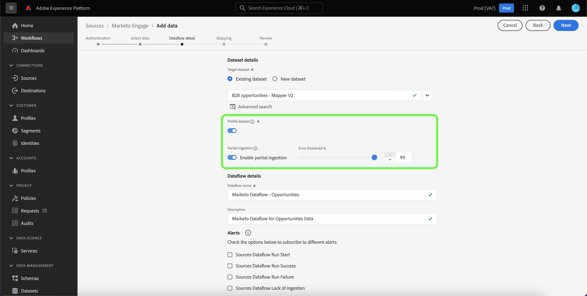

# Crie um [!DNL Marketo Engage] conector de origem na interface do usuário

>[!IMPORTANT]
>
>Antes de criar um [!DNL Marketo Engage] conexão de origem e um fluxo de dados, primeiro verifique se você tem [mapeada a ID da organização do Adobe IMS](https://experienceleague.adobe.com/docs/marketo/using/product-docs/core-marketo-concepts/miscellaneous/set-up-adobe-organization-mapping.html?lang=en) em [!DNL Marketo]. Além disso, você também deve garantir que tenha concluído o [preencher automaticamente [!DNL Marketo] Espaços de nomes e esquemas B2B](../../../../connectors/adobe-applications/marketo/marketo-namespaces.md) antes de criar uma conexão de origem e um fluxo de dados.

Este tutorial fornece etapas para criar um [!DNL Marketo Engage] (a seguir designado por &quot;[!DNL Marketo]&quot;) conector de origem na interface do usuário para trazer dados B2B para o Adobe Experience Platform.

## Introdução

Este tutorial requer uma compreensão funcional dos seguintes componentes do Adobe Experience Platform:

* [Fontes](../../../../home.md): O Experience Platform permite que os dados sejam assimilados de várias fontes, fornecendo a capacidade de estruturar, rotular e aprimorar os dados recebidos usando os serviços da plataforma.
* [Experience Data Model (XDM)](../../../../../xdm/home.md): A estrutura padronizada pela qual o Experience Platform organiza os dados de experiência do cliente.
   * [Criar e editar esquemas na interface do usuário](../../../../../xdm/ui/resources/schemas.md): Saiba como criar e editar esquemas na interface do usuário.
* [Namespaces de identidade](../../../../../identity-service/namespaces.md): Os namespaces de identidade são um componente do [!DNL Identity Service] que servem como indicadores do contexto a que uma identidade se refere. Uma identidade totalmente qualificada inclui um valor de ID e um namespace.
* [[!DNL Real-time Customer Profile]](/help/profile/home.md): Fornece um perfil de consumidor unificado e em tempo real com base em dados agregados de várias fontes.
* [Sandboxes](../../../../../sandboxes/home.md): O Experience Platform fornece sandboxes virtuais que particionam uma única instância da Platform em ambientes virtuais separados para ajudar a desenvolver aplicativos de experiência digital.

### Obter credenciais necessárias

Para acessar o [!DNL Marketo] na Platform, você deve fornecer os seguintes valores:

| Credencial | Descrição |
| ---------- | ----------- |
| `munchkinId` | A ID do Munchkin é o identificador exclusivo de um [!DNL Marketo] instância. |
| `clientId` | A ID de cliente exclusiva do seu [!DNL Marketo] instância. |
| `clientSecret` | O segredo de cliente exclusivo de seu [!DNL Marketo] instância. |

Para obter mais informações sobre a aquisição desses valores, consulte [[!DNL Marketo] guia de autenticação](../../../../connectors/adobe-applications/marketo/marketo-auth.md).

Depois de coletar suas credenciais necessárias, siga as etapas da próxima seção.

## Conecte seu [!DNL Marketo] account

Na interface do usuário da plataforma, selecione **[!UICONTROL Fontes]** na barra de navegação esquerda para acessar o [!UICONTROL Fontes] espaço de trabalho. O [!UICONTROL Catálogo] exibe uma variedade de fontes com as quais você pode criar uma conta.

Você pode selecionar a categoria apropriada no catálogo no lado esquerdo da tela. Como alternativa, você pode encontrar a fonte específica com a qual deseja trabalhar usando a barra de pesquisa.

Em [!UICONTROL Aplicativos Adobe] categoria , selecione **[!UICONTROL Marketo Engage]**. Em seguida, selecione **[!UICONTROL Adicionar dados]** para criar um novo [!DNL Marketo] fluxo de dados.

O **[!UICONTROL Conta do Marketo Engage Connect]** será exibida. Nesta página, você pode usar uma nova conta ou acessar uma conta existente.

### Conta existente

Para criar um fluxo de dados com uma conta existente, selecione **[!UICONTROL Conta existente]** e selecione o [!DNL Marketo] conta que deseja usar. Selecionar **[!UICONTROL Próximo]** para continuar.

### Nova conta

Se estiver criando uma nova conta, selecione **[!UICONTROL Nova conta]**. No formulário de entrada exibido, forneça um nome de conta, uma descrição opcional e [!DNL Marketo] credenciais de autenticação. Quando terminar, selecione **[!UICONTROL Conectar-se à origem]** e, em seguida, permitir que a nova conexão seja estabelecida.

## Selecionar um conjunto de dados

Depois de criar o [!DNL Marketo] , a próxima etapa fornece uma interface para você explorar [!DNL Marketo] conjuntos de dados.

A metade esquerda da interface é um navegador de diretório, exibindo o 10 [!DNL Marketo] conjuntos de dados. Um funcionamento pleno [!DNL Marketo] a conexão de origem requer a assimilação dos nove conjuntos de dados diferentes. Se também estiver usando a variável [!DNL Marketo] recurso de marketing com base em conta (ABM), você também deve criar um 10º fluxo de dados para assimilar o [!UICONTROL Contas Nomeadas] conjunto de dados.

>[!NOTE]
>
>Para fins de brevidade, o tutorial a seguir usa [!UICONTROL Oportunidades] como exemplo, mas as etapas descritas abaixo se aplicam a qualquer um dos 10 [!DNL Marketo] conjuntos de dados.

Selecione o conjunto de dados que deseja assimilar primeiro e, em seguida, selecione **[!UICONTROL Próximo]**.

## Fornecer detalhes do fluxo de dados

O [!UICONTROL Detalhes do fluxo de dados] permite selecionar se deseja usar um conjunto de dados existente ou um novo conjunto de dados. Durante esse processo, também é possível definir as configurações para [!UICONTROL Conjunto de dados de perfil], [!UICONTROL Diagnóstico de erros], [!UICONTROL Ingestão parcial]e [!UICONTROL Alertas].

### Usar um conjunto de dados existente

Para assimilar dados em um conjunto de dados existente, selecione **[!UICONTROL Conjunto de dados existente]**. Você pode recuperar um conjunto de dados existente usando o [!UICONTROL Pesquisa avançada] ou percorrendo a lista de conjuntos de dados existentes no menu suspenso. Depois de selecionar um conjunto de dados, forneça um nome e uma descrição para o seu fluxo de dados.

### Usar um novo conjunto de dados

Para assimilar em um novo conjunto de dados, selecione **[!UICONTROL Novo conjunto de dados]** e, em seguida, forneça um nome de conjunto de dados de saída e uma descrição opcional. Em seguida, selecione um esquema para mapear usando o [!UICONTROL Pesquisa avançada] ou rolando pela lista de schemas existentes no menu suspenso. Depois de selecionar um esquema, forneça um nome e uma descrição para o seu fluxo de dados.

### Habilitar [!DNL Profile] e diagnóstico de erros

Em seguida, selecione o **[!UICONTROL Conjunto de dados de perfil]** alternar para ativar o conjunto de dados para [!DNL Profile]. Isso permite criar uma visualização holística dos atributos e comportamentos de uma entidade. Dados de todos [!DNL Profile]-conjuntos de dados habilitados serão incluídos em [!DNL Profile] As alterações e são aplicadas quando você salva o fluxo de dados.

[!UICONTROL Diagnóstico de erros] permite a geração detalhada de mensagens de erro para qualquer registro incorreto que ocorra no seu fluxo de dados, enquanto [!UICONTROL Ingestão parcial] O permite assimilar dados contendo erros, até um determinado limite definido manualmente. Consulte a [visão geral da ingestão parcial de lote](../../../../../ingestion/batch-ingestion/partial.md) para obter mais informações.

>[!IMPORTANT]
>
>O [!DNL Marketo] O conector usa a assimilação em lote para assimilar todos os registros históricos e usa a assimilação de streaming para atualizações em tempo real. Isso permite que o conector continue o streaming ao assimilar qualquer registro incorreto. Ative o **[!UICONTROL Ingestão parcial]** e, em seguida, defina a [!UICONTROL Limite de erros %] como máximo para impedir que o fluxo de dados falhe.

### Ativar alertas

Você pode habilitar alertas para receber notificações sobre o status do seu fluxo de dados. Selecione um alerta na lista para assinar e receber notificações sobre o status do seu fluxo de dados. Para obter mais informações sobre alertas, consulte o guia sobre [inscrever-se em alertas de origens usando a interface do usuário](../../alerts.md).

Quando terminar de fornecer detalhes do fluxo de dados, selecione **[!UICONTROL Próximo]**.

## Mapeie seu [!DNL Marketo] campos de origem do conjunto de dados para direcionar campos XDM

O [!UICONTROL Mapeamento] é exibida, fornecendo uma interface para mapear os campos de origem do esquema de origem para os campos XDM de destino apropriados no esquema de destino.

Cada [!DNL Marketo] o conjunto de dados tem suas próprias regras de mapeamento específicas para serem seguidas. Consulte o seguinte para obter mais informações sobre como mapear [!DNL Marketo] conjuntos de dados para XDM:

* [Atividades](../../../../connectors/adobe-applications/mapping/marketo.md#activities)
* [Programas](../../../../connectors/adobe-applications/mapping/marketo.md#programs)
* [Associações do programa](../../../../connectors/adobe-applications/mapping/marketo.md#program-memberships)
* [Empresas](../../../../connectors/adobe-applications/mapping/marketo.md#companies)
* [Listas estáticas](../../../../connectors/adobe-applications/mapping/marketo.md#static-lists)
* [Associações da lista estática](../../../../connectors/adobe-applications/mapping/marketo.md#static-list-memberships)
* [Contas Nomeadas](../../../../connectors/adobe-applications/mapping/marketo.md#named-accounts)
* [Oportunidades](../../../../connectors/adobe-applications/mapping/marketo.md#opportunities)
* [Funções de contato da oportunidade](../../../../connectors/adobe-applications/mapping/marketo.md#opportunity-contact-roles)
* [Pessoas](../../../../connectors/adobe-applications/mapping/marketo.md#persons)

Com base em suas necessidades, você pode optar por mapear campos diretamente ou usar funções de preparação de dados para transformar dados de origem em valores calculados ou calculados. Para obter etapas abrangentes sobre o uso da interface de mapeamento, consulte o [Guia da interface do usuário de preparação de dados](../../../../../data-prep/ui/mapping.md).

Quando os conjuntos de mapeamento estiverem prontos, selecione **[!UICONTROL Próximo]** e aguarde alguns instantes para que o novo fluxo de dados seja criado.

## Revisar o fluxo de dados

O **[!UICONTROL Revisão]** é exibida, permitindo que você revise o novo fluxo de dados antes de criá-lo. Os detalhes são agrupados nas seguintes categorias:

* **[!UICONTROL Conexão]**: Mostra o tipo de origem, o caminho relevante da entidade de origem escolhida e a quantidade de colunas dentro dessa entidade de origem.
* **[!UICONTROL Atribuir conjunto de dados e mapear campos]**: Mostra em qual conjunto de dados os dados de origem estão sendo assimilados, incluindo o esquema ao qual o conjunto de dados adere.

Depois de revisar o fluxo de dados, selecione **[!UICONTROL Salvar e assimilar]** e permitir que o fluxo de dados seja criado.

## Monitorar o fluxo de dados

Depois que o fluxo de dados for criado, você poderá monitorar os dados que estão sendo assimilados por meio dele para ver informações sobre taxas de ingestão, sucesso e erros. Para obter mais informações sobre como monitorar fluxos de dados, consulte o tutorial em [monitoramento de fluxos de dados na interface do usuário](../../../../../dataflows/ui/monitor-sources.md).

## Excluir seus atributos

Os atributos personalizados em conjuntos de dados não podem ser ocultos ou removidos retroativamente. Se quiser ocultar ou remover um atributo personalizado de um conjunto de dados existente, será necessário criar um novo conjunto de dados sem esse atributo personalizado, um novo esquema XDM e configurar um novo fluxo de dados para o novo conjunto de dados que você criar. Você também deve desativar ou excluir o fluxo de dados original que consiste no conjunto de dados com o atributo personalizado que deseja ocultar ou remover.

## Excluir seu fluxo de dados

É possível excluir os fluxos de dados que não são mais necessários ou foram criados incorretamente usando o **[!UICONTROL Excluir]** disponível na função [!UICONTROL Fluxos de dados] espaço de trabalho. Para obter mais informações sobre como excluir fluxos de dados, consulte o tutorial em [exclusão de fluxos de dados na interface do usuário](../../delete.md).

## Próximas etapas

Ao seguir este tutorial, você criou com sucesso um fluxo de dados para trazer [!DNL Marketo] dados. Os dados recebidos agora podem ser usados por serviços downstream da plataforma, como [!DNL Real-time Customer Profile] e [!DNL Data Science Workspace]. Consulte os seguintes documentos para obter mais detalhes:

* [[!DNL Real-time Customer Profile] visão geral](/help/profile/home.md)
* [[!DNL Data Science Workspace] visão geral](/help/data-science-workspace/home.md)
