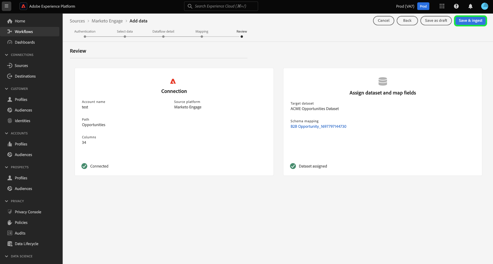

# Crie um [!DNL Marketo Engage] conector de origem na interface do usuário

This tutorial provides steps for creating a [!DNL Marketo Engage] (hereinafter referred to as &quot;[!DNL Marketo]&quot;) source connector in the UI to bring B2B data into Adobe Experience Platform.

## Introdução

Este tutorial requer uma compreensão funcional dos seguintes componentes do Adobe Experience Platform:

* [Fontes](../../../../home.md): O Experience Platform permite que os dados sejam assimilados de várias fontes, fornecendo a capacidade de estruturar, rotular e aprimorar os dados recebidos usando os serviços da plataforma.
* [Experience Data Model (XDM)](../../../../../xdm/home.md): The standardized framework by which Experience Platform organizes customer experience data.
   * [Create and edit schemas in the UI](../../../../../xdm/ui/resources/schemas.md): Learn how to create and edit schemas in the UI.
* [Identity namespaces](../../../../../identity-service/namespaces.md): Identity namespaces are a component of [!DNL Identity Service] that serve as indicators of the context to which an identity relates. Uma identidade totalmente qualificada inclui um valor de ID e um namespace.
* [[!DNL Real-time Customer Profile]](/help/profile/home.md): Provides a unified, real-time consumer profile based on aggregated data from multiple sources.
* [Sandboxes](../../../../../sandboxes/home.md): O Experience Platform fornece sandboxes virtuais que particionam uma única instância da Platform em ambientes virtuais separados para ajudar a desenvolver aplicativos de experiência digital.

### Gather required credentials

Para acessar o [!DNL Marketo] na Platform, você deve fornecer os seguintes valores:

| Credencial | Descrição |
| ---------- | ----------- |
| `munchkinId` | A ID do Munchkin é o identificador exclusivo de um [!DNL Marketo] instância. |
| `clientId` | A ID de cliente exclusiva do seu [!DNL Marketo] instância. |
| `clientSecret` | O segredo de cliente exclusivo de seu [!DNL Marketo] instância. |

For more information on acquiring these values, refer to the [[!DNL Marketo] authentication guide](../../../../connectors/adobe-applications/marketo/marketo-auth.md).

Depois de coletar suas credenciais necessárias, siga as etapas da próxima seção.

## Conecte seu [!DNL Marketo] account

Na interface do usuário da plataforma, selecione **[!UICONTROL Fontes]** na barra de navegação esquerda para acessar o [!UICONTROL Fontes] espaço de trabalho. O [!UICONTROL Catálogo] exibe uma variedade de fontes com as quais você pode criar uma conta.

Você pode selecionar a categoria apropriada no catálogo no lado esquerdo da tela. Como alternativa, você pode encontrar a fonte específica com a qual deseja trabalhar usando a barra de pesquisa.

Em [!UICONTROL Aplicativos Adobe] categoria , selecione **[!UICONTROL Marketo Engage]**. Em seguida, selecione **[!UICONTROL Adicionar dados]** para criar um novo [!DNL Marketo] fluxo de dados.

O **[!UICONTROL Ligar ao Marketo Engage]** será exibida. Nesta página, você pode usar uma nova conta ou acessar uma conta existente.

### Nova conta

Se estiver criando uma nova conta, selecione **[!UICONTROL Nova conta]**. No formulário de entrada exibido, forneça um nome de conta, uma descrição opcional e [!DNL Marketo] credenciais de autenticação. When finished, select **[!UICONTROL Connect to source]** and then allow some time for the new connection to establish.

### Conta existente

Para criar um fluxo de dados com uma conta existente, selecione **[!UICONTROL Conta existente]** e selecione o [!DNL Marketo] conta que deseja usar. Selecionar **[!UICONTROL Próximo]** para continuar.

## Selecionar um conjunto de dados

Depois de criar o [!DNL Marketo] , a próxima etapa fornece uma interface para você explorar [!DNL Marketo] conjuntos de dados.

A metade esquerda da interface é um navegador de diretório, exibindo o 10 [!DNL Marketo] conjuntos de dados. Um funcionamento pleno [!DNL Marketo] a conexão de origem requer a assimilação dos nove conjuntos de dados diferentes. Se também estiver usando a variável [!DNL Marketo] recurso de marketing com base em conta (ABM), você também deve criar um 10º fluxo de dados para assimilar o [!UICONTROL Contas Nomeadas] conjunto de dados.

>[!NOTE]
>
>Para fins de brevidade, o tutorial a seguir usa [!UICONTROL Contas Nomeadas] como exemplo, mas as etapas descritas abaixo se aplicam a qualquer um dos 10 [!DNL Marketo] conjuntos de dados.

Selecione o conjunto de dados que deseja assimilar primeiro e, em seguida, selecione **[!UICONTROL Próximo]**.

## Map [!DNL Marketo] schemas to Platform

O [!UICONTROL Mapeamento] é exibida, fornecendo uma interface para mapear [!DNL Marketo] esquemas para a Platform.

Escolha um conjunto de dados para os dados de entrada que serão assimilados. Você pode usar um conjunto de dados existente ou criar um novo conjunto de dados.

### Usar um conjunto de dados existente

Para assimilar dados em um conjunto de dados existente, selecione **[!UICONTROL Conjunto de dados existente]** e selecione o ícone do conjunto de dados.

O **[!UICONTROL Selecionar conjunto de dados]** será exibida. Find the dataset with the appropriate schema you wish to use, select it, then select **[!UICONTROL Confirm]**.

### Usar um novo conjunto de dados

Para assimilar dados em um novo conjunto de dados, selecione **[!UICONTROL Novo conjunto de dados]** e insira um nome e uma descrição para o conjunto de dados nos campos fornecidos.

Você pode procurar um esquema inserindo seu nome na variável **[!UICONTROL Selecionar esquema]** barra de pesquisa. Você também pode selecionar o ícone suspenso para ver uma lista de schemas existentes. Como alternativa, você pode selecionar **[!UICONTROL Pesquisa avançada]** para acessar a página dos esquemas existentes, incluindo seus respectivos detalhes.

Ative o **[!UICONTROL Conjunto de dados de perfil]** para ativar seu conjunto de dados de destino para [!DNL Profile], permitindo criar uma visualização holística dos atributos e comportamentos de uma entidade. Dados de todos [!DNL Profile]-conjuntos de dados habilitados serão incluídos em [!DNL Profile] As alterações e são aplicadas quando você salva o fluxo de dados.

Depois de selecionar um esquema, role para baixo para exibir a caixa de diálogo de mapeamento para começar a mapear [!DNL Marketo] campos do conjunto de dados para seus campos XDM de destino apropriados.

### Mapeie seu [!DNL Marketo] campos de origem do conjunto de dados para direcionar campos XDM

Each [!DNL Marketo] dataset has its own specific mapping rules to follow. See the following for more information on how to map [!DNL Marketo] datasets to XDM:

* [Atividades](../../../../connectors/adobe-applications/mapping/marketo.md#activities)
* [Programas](../../../../connectors/adobe-applications/mapping/marketo.md#programs)
* [Associações do programa](../../../../connectors/adobe-applications/mapping/marketo.md#program-memberships)
* [Empresas](../../../../connectors/adobe-applications/mapping/marketo.md#companies)
* [Listas estáticas](../../../../connectors/adobe-applications/mapping/marketo.md#static-lists)
* [Static list memberships](../../../../connectors/adobe-applications/mapping/marketo.md#static-list-memberships)
* [Named Accounts](../../../../connectors/adobe-applications/mapping/marketo.md#named-accounts)
* [Oportunidades](../../../../connectors/adobe-applications/mapping/marketo.md#opportunities)
* [Opportunity contact roles](../../../../connectors/adobe-applications/mapping/marketo.md#opportunity-contact-roles)
* [Pessoas](../../../../connectors/adobe-applications/mapping/marketo.md#persons)

Select **[!UICONTROL Preview data]** to see mapping results based on your selected dataset.

The [!UICONTROL Preview] popover provides you an interface to explore mapping results of up to 100 rows of sample data from the selected dataset.

Depois que os campos de origem forem mapeados para os campos de destino apropriados, selecione **[!UICONTROL Fechar]**.

## Fornecer detalhes do fluxo de dados

The [!UICONTROL Dataflow detail] step appears, allowing you to provide a name and a brief description about your new dataflow.

Ative o **[!UICONTROL Diagnóstico de erros]** alternar para permitir a geração detalhada de mensagens de erro para lotes recém-assimilados, que podem ser baixados usando a API. Para obter mais informações, consulte o tutorial em [recuperação de diagnósticos de erros de assimilação de dados](../../../../../ingestion/quality/error-diagnostics.md).

O [!DNL Marketo] O conector usa a assimilação em lote para assimilar todos os registros históricos e usa a assimilação de streaming para atualizações em tempo real. Isso permite que o conector continue o streaming ao assimilar qualquer registro incorreto. Ative o **[!UICONTROL Ingestão parcial]** e, em seguida, defina a [!UICONTROL Limite de erros %] como máximo para impedir que o fluxo de dados falhe.

**[!UICONTROL Ingestão parcial]** O oferece a capacidade de assimilar dados que contenham erros até um determinado limite. Para obter mais informações, consulte o [visão geral da ingestão parcial de lote](../../../../../ingestion/batch-ingestion/partial.md).

Depois de fornecer os detalhes do fluxo de dados e definir o limite de erro como máximo, selecione **[!UICONTROL Próximo]**.

## Revisar o fluxo de dados

O **[!UICONTROL Revisão]** é exibida, permitindo que você revise o novo fluxo de dados antes de criá-lo. Os detalhes são agrupados nas seguintes categorias:

* **[!UICONTROL Conexão]**: Mostra o tipo de origem, o caminho relevante da entidade de origem escolhida e a quantidade de colunas dentro dessa entidade de origem.
* **[!UICONTROL Atribuir conjunto de dados e mapear campos]**: Mostra em qual conjunto de dados os dados de origem estão sendo assimilados, incluindo o esquema ao qual o conjunto de dados adere.

Depois de revisar o fluxo de dados, selecione **[!UICONTROL Concluir]** e permitir que o fluxo de dados seja criado.

## Monitorar o fluxo de dados

Depois que o fluxo de dados for criado, você poderá monitorar os dados que estão sendo assimilados por meio dele para ver informações sobre taxas de ingestão, sucesso e erros. Para obter mais informações sobre como monitorar fluxos de dados, consulte o tutorial em [monitoramento de fluxos de dados na interface do usuário](../../../../../dataflows/ui/monitor-sources.md).

## Excluir seus atributos

Os atributos personalizados em conjuntos de dados não podem ser ocultos ou removidos retroativamente. Se quiser ocultar ou remover um atributo personalizado de um conjunto de dados existente, será necessário criar um novo conjunto de dados sem esse atributo personalizado, um novo esquema XDM e configurar um novo fluxo de dados para o novo conjunto de dados que você criar. Você também deve desativar ou excluir o fluxo de dados original que consiste no conjunto de dados com o atributo personalizado que deseja ocultar ou remover.

## Excluir seu fluxo de dados

É possível excluir os fluxos de dados que não são mais necessários ou foram criados incorretamente usando o **[!UICONTROL Excluir]** disponível na função [!UICONTROL Fluxos de dados] espaço de trabalho. Para obter mais informações sobre como excluir fluxos de dados, consulte o tutorial em [exclusão de fluxos de dados na interface do usuário](../../delete.md).

## Próximas etapas

Ao seguir este tutorial, você criou com sucesso um fluxo de dados para trazer [!DNL Marketo] dados. Os dados recebidos agora podem ser usados por serviços downstream da plataforma, como [!DNL Real-time Customer Profile] e [!DNL Data Science Workspace]. Consulte os seguintes documentos para obter mais detalhes:

* [[!DNL Real-time Customer Profile] visão geral](/help/profile/home.md)
* [[!DNL Data Science Workspace] visão geral](/help/data-science-workspace/home.md)
