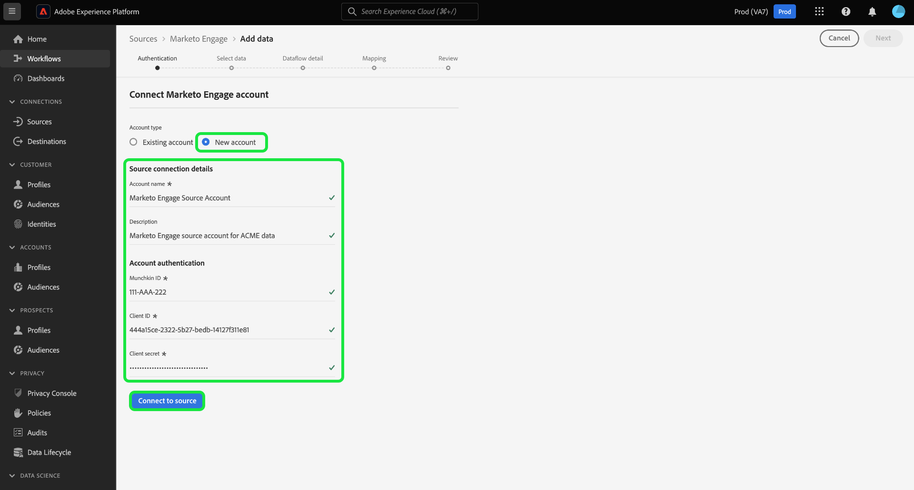

# Criar um [!DNL Marketo Engage] conexão de origem e fluxo de dados na interface do

>[!IMPORTANT]
>
>Antes de criar uma [!DNL Marketo Engage] conexão de origem e um fluxo de dados, primeiro verifique se você tem [ID da organização do Adobe mapeada](https://experienceleague.adobe.com/docs/marketo/using/product-docs/core-marketo-concepts/miscellaneous/set-up-adobe-organization-mapping.html?lang=en) in [!DNL Marketo]. Além disso, você também deve garantir que concluiu [preenchimento automático [!DNL Marketo] Namespaces e esquemas B2B](../../../../connectors/adobe-applications/marketo/marketo-namespaces.md) antes de criar uma conexão de origem e um fluxo de dados.

Este tutorial fornece etapas para a criação de um [!DNL Marketo Engage] (a seguir designado por &quot;[!DNL Marketo]&quot;) conector de origem na interface do para trazer dados B2B para o Adobe Experience Platform.

## Introdução

Este tutorial requer uma compreensão funcional dos seguintes componentes do Adobe Experience Platform:

* [Utilitário de geração automática de esquemas e namespaces B2B](../../../../connectors/adobe-applications/marketo/marketo-namespaces.md): o utilitário de geração automática de esquemas e namespaces B2B permite usar [!DNL Postman] para gerar automaticamente valores para seus namespaces e esquemas B2B. Você deve concluir os namespaces e esquemas B2B primeiro, antes de criar um [!DNL Marketo] conexão de origem e fluxo de dados.
* [Origens](../../../../home.md): o Experience Platform permite que os dados sejam assimilados de várias fontes e, ao mesmo tempo, fornece a capacidade de estruturar, rotular e aprimorar os dados recebidos usando os serviços da plataforma.
* [Experience Data Model (XDM)](../../../../../xdm/home.md): a estrutura padronizada pela qual o Experience Platform organiza os dados de experiência do cliente.
   * [Criar e editar esquemas na interface](../../../../../xdm/ui/resources/schemas.md): saiba como criar e editar esquemas na interface do usuário.
* [Namespaces de identidade](../../../../../identity-service/namespaces.md): os namespaces de identidade são um componente de [!DNL Identity Service] que servem como indicadores do contexto ao qual uma identidade está relacionada. Uma identidade totalmente qualificada inclui um valor de ID e um namespace.
* [[!DNL Real-Time Customer Profile]](/help/profile/home.md): fornece um perfil de consumidor unificado em tempo real com base em dados agregados de várias fontes.
* [Sandboxes](../../../../../sandboxes/home.md): o Experience Platform fornece sandboxes virtuais que particionam uma única instância da Platform em ambientes virtuais separados para ajudar a desenvolver aplicativos de experiência digital.

### Coletar credenciais necessárias

Para acessar seu [!DNL Marketo] na Platform, você deve fornecer os seguintes valores:

| Credencial | Descrição |
| ---------- | ----------- |
| `munchkinId` | A ID do Munchkin é o identificador exclusivo de um [!DNL Marketo] instância. |
| `clientId` | A ID exclusiva do cliente do [!DNL Marketo] instância. |
| `clientSecret` | O segredo exclusivo do cliente do [!DNL Marketo] instância. |

Para obter mais informações sobre como adquirir esses valores, consulte o [[!DNL Marketo] guia de autenticação](../../../../connectors/adobe-applications/marketo/marketo-auth.md).

Depois de obter as credenciais necessárias, você poderá seguir as etapas da próxima seção.

## Conecte seu [!DNL Marketo] account

Na interface do usuário da Platform, selecione **[!UICONTROL Origens]** na barra de navegação esquerda, para acessar a [!UICONTROL Origens] espaço de trabalho. A variável [!UICONTROL Catálogo] exibe uma variedade de fontes com as quais você pode criar uma conta.

Você pode selecionar a categoria apropriada no catálogo no lado esquerdo da tela. Como alternativa, você pode encontrar a fonte específica com a qual deseja trabalhar usando a barra de pesquisa.

No [!UICONTROL aplicativos Adobe] categoria, selecione **[!UICONTROL Marketo Engage]**. Em seguida, selecione **[!UICONTROL Adicionar dados]** para criar um novo [!DNL Marketo] fluxo de dados.

A variável **[!UICONTROL Conectar conta Marketo Engage]** é exibida. Nesta página, você pode usar uma nova conta ou acessar uma conta existente.

### Conta existente

Para criar um fluxo de dados com uma conta existente, selecione **[!UICONTROL Conta existente]** e, em seguida, selecione a [!DNL Marketo] conta que deseja usar. Selecionar **[!UICONTROL Próxima]** para continuar.

### Nova conta

Se estiver criando uma nova conta, selecione **[!UICONTROL Nova conta]**. No formulário de entrada que aparece, forneça um nome de conta, uma descrição opcional e sua [!DNL Marketo] credenciais de autenticação. Quando terminar, selecione **[!UICONTROL Conectar à origem]** e aguarde algum tempo para estabelecer a nova conexão.

## Selecionar um conjunto de dados

Depois de criar o [!DNL Marketo] conta, a próxima etapa fornece uma interface para você explorar [!DNL Marketo] conjuntos de dados.

A metade esquerda da interface é um navegador de diretórios, exibindo as 10 [!DNL Marketo] conjuntos de dados. Um sistema de [!DNL Marketo] a conexão de origem requer a assimilação dos nove conjuntos de dados diferentes. Se você também estiver usando a variável [!DNL Marketo] de marketing baseado em conta (ABM), você também deverá criar um 10º fluxo de dados para assimilar a [!UICONTROL Contas Nomeadas] conjunto de dados.

>[!NOTE]
>
>Para fins de brevidade, o tutorial a seguir usa [!UICONTROL Oportunidades] exemplo, mas as etapas descritas abaixo aplicam-se a qualquer um dos 10 [!DNL Marketo] conjuntos de dados.

Selecione o conjunto de dados que deseja assimilar primeiro e selecione **[!UICONTROL Próxima]**.

## Fornecer detalhes do fluxo de dados {#provide-dataflow-details}

A variável [!UICONTROL Detalhes do fluxo de dados] permite selecionar se deseja usar um conjunto de dados existente ou um novo conjunto de dados. Durante esse processo, você também pode definir configurações para [!UICONTROL Conjunto de dados Perfil], [!UICONTROL Diagnóstico de erro], [!UICONTROL Assimilação parcial], e [!UICONTROL Alertas].

>[!BEGINTABS]

>[!TAB Usar um conjunto de dados existente]

Para assimilar dados em um conjunto de dados existente, selecione **[!UICONTROL Conjunto de dados existente]**. É possível recuperar um conjunto de dados existente usando o [!UICONTROL Pesquisa avançada] ou rolando pela lista de conjuntos de dados existentes no menu suspenso. Depois de selecionar um conjunto de dados, forneça um nome e uma descrição para o fluxo de dados.

>[!TAB Usar um novo conjunto de dados]

Para assimilar em um novo conjunto de dados, selecione **[!UICONTROL Novo conjunto de dados]** e forneça um nome de conjunto de dados de saída e uma descrição opcional. Em seguida, selecione um esquema para mapear usando o [!UICONTROL Pesquisa avançada] ou rolando pela lista de esquemas existentes no menu suspenso. Depois de selecionar um esquema, forneça um nome e uma descrição para o fluxo de dados.

>[!ENDTABS]

### Ativar [!DNL Profile] e diagnóstico de erro

Em seguida, selecione o **[!UICONTROL Conjunto de dados Perfil]** ativar ou desativar o conjunto de dados para [!DNL Profile]. Isso permite criar uma visualização integral dos atributos e comportamentos de uma entidade. Dados de todos [!DNL Profile]Os conjuntos de dados habilitados para serão incluídos no [!DNL Profile] As alterações e são aplicadas quando você salva o fluxo de dados.

[!UICONTROL Diagnóstico de erro] permite a geração de mensagens de erro detalhadas para qualquer registro incorreto que ocorra em seu fluxo de dados, enquanto [!UICONTROL Assimilação parcial] O permite assimilar dados que contêm erros, até um determinado limite definido manualmente. Consulte a [visão geral da assimilação parcial de lotes](../../../../../ingestion/batch-ingestion/partial.md) para obter mais informações.

>[!IMPORTANT]
>
>A variável [!DNL Marketo] A origem usa a assimilação em lote para assimilar todos os registros históricos e a assimilação por transmissão para atualizações em tempo real. Isso permite que a origem continue a transmitir enquanto assimila registros incorretos. Ativar o **[!UICONTROL Assimilação parcial]** alterne e defina o [!UICONTROL Limite de erro %] ao máximo para evitar a falha do fluxo de dados.

### Ativar alertas

Você pode ativar os alertas para receber notificações sobre o status do fluxo de dados. Selecione um alerta na lista para assinar e receber notificações sobre o status do seu fluxo de dados. Para obter mais informações sobre alertas, consulte o manual sobre [assinatura de alertas de origens usando a interface do usuário](../../alerts.md).

Quando terminar de fornecer detalhes ao seu fluxo de dados, selecione **[!UICONTROL Próxima]**.

### Ignorar contas não solicitadas ao assimilar dados de empresas

Ao criar um fluxo de dados para assimilar dados do conjunto de dados das empresas, você pode configurar [!UICONTROL Excluir contas não solicitadas] para excluir ou incluir contas não solicitadas da assimilação.

Quando indivíduos preenchem um formulário, [!DNL Marketo] cria um registro de conta fantasma com base no Nome da empresa que não contém outros dados. Para novos fluxos de dados, a alternância para excluir contas não solicitadas é habilitada por padrão. Para fluxos de dados existentes, você pode ativar ou desativar o recurso, com alterações aplicáveis a dados recém-assimilados e a dados não existentes.

## Mapeie seu [!DNL Marketo] campos de origem do conjunto de dados para campos XDM de destino

A variável [!UICONTROL Mapeamento] é exibida, fornecendo uma interface para mapear os campos de origem do esquema de origem para os campos XDM de destino apropriados no esquema de destino.

Each [!DNL Marketo] O conjunto de dados tem suas próprias regras de mapeamento específicas a serem seguidas. Consulte o seguinte para obter mais informações sobre como mapear [!DNL Marketo] conjuntos de dados para XDM:

* [Atividades](../../../../connectors/adobe-applications/mapping/marketo.md#activities)
* [Programas](../../../../connectors/adobe-applications/mapping/marketo.md#programs)
* [Associações ao programa](../../../../connectors/adobe-applications/mapping/marketo.md#program-memberships)
* [Empresas](../../../../connectors/adobe-applications/mapping/marketo.md#companies)
* [Listas estáticas](../../../../connectors/adobe-applications/mapping/marketo.md#static-lists)
* [Associações de lista estática](../../../../connectors/adobe-applications/mapping/marketo.md#static-list-memberships)
* [Contas Nomeadas](../../../../connectors/adobe-applications/mapping/marketo.md#named-accounts)
* [Oportunidades](../../../../connectors/adobe-applications/mapping/marketo.md#opportunities)
* [Funções do contato da oportunidade](../../../../connectors/adobe-applications/mapping/marketo.md#opportunity-contact-roles)
* [Pessoas](../../../../connectors/adobe-applications/mapping/marketo.md#persons)

Com base nas suas necessidades, você pode optar por mapear campos diretamente ou usar funções de preparação de dados para transformar dados de origem para derivar valores calculados ou calculados. Para obter etapas abrangentes sobre como usar a interface de mapeamento, consulte [Guia da interface de preparação de dados](../../../../../data-prep/ui/mapping.md).

Quando os conjuntos de mapeamento estiverem prontos, selecione **[!UICONTROL Próxima]** e aguarde alguns instantes para que o novo fluxo de dados seja criado.

## Revisar seu fluxo de dados

A variável **[!UICONTROL Revisão]** é exibida, permitindo que você revise seu novo fluxo de dados antes de ele ser criado. Os detalhes são agrupados nas seguintes categorias:

* **[!UICONTROL Conexão]**: mostra o tipo de origem, o caminho relevante da entidade de origem escolhida e a quantidade de colunas nessa entidade de origem.
* **[!UICONTROL Atribuir conjunto de dados e mapear campos]**: mostra em qual conjunto de dados os dados de origem estão sendo assimilados, incluindo o esquema ao qual o conjunto de dados adere.

Depois de revisar o fluxo de dados, selecione **[!UICONTROL Salvar e assimilar]** e aguarde algum tempo para criar o fluxo de dados.

## Monitorar seu fluxo de dados

Depois que o fluxo de dados for criado, você poderá monitorar os dados que estão sendo assimilados por meio dele para ver informações sobre taxas de assimilação, sucesso e erros. Para obter mais informações sobre como monitorar fluxos de dados, consulte o tutorial sobre [monitoramento de fluxos de dados na interface do](../../../../../dataflows/ui/monitor-sources.md).

## Excluir seus atributos

Os atributos personalizados em conjuntos de dados não podem ser ocultos ou removidos retroativamente. Se quiser ocultar ou remover um atributo personalizado de um conjunto de dados existente, você deverá criar um novo conjunto de dados sem esse atributo personalizado, um novo esquema XDM e configurar um novo fluxo de dados para o novo conjunto de dados criado. Você também deve desativar ou excluir o fluxo de dados original que consiste no conjunto de dados com o atributo personalizado que deseja ocultar ou remover.

## Excluir seu fluxo de dados

É possível excluir fluxos de dados que não são mais necessários ou que foram criados incorretamente usando o **[!UICONTROL Excluir]** disponível na [!UICONTROL Fluxos de dados] espaço de trabalho. Para obter mais informações sobre como excluir fluxos de dados, consulte o tutorial sobre [exclusão de fluxos de dados na interface](../../delete.md).

## Próximas etapas

Ao seguir este tutorial, você criou com sucesso um fluxo de dados para trazer [!DNL Marketo] dados. Os dados de entrada agora podem ser usados por serviços downstream da plataforma, como [!DNL Real-Time Customer Profile] e [!DNL Data Science Workspace]. Consulte os seguintes documentos para obter mais detalhes:

* [Visão geral do [!DNL Real-Time Customer Profile]](/help/profile/home.md)
* [Visão geral do [!DNL Data Science Workspace]](/help/data-science-workspace/home.md)
