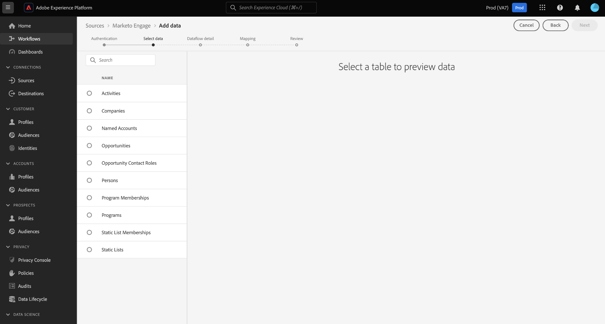

# Crie um conector de origem [!DNL Marketo Engage] na interface do usuário

Este tutorial fornece etapas para criar um conector de origem [!DNL Marketo Engage] (a seguir chamado &quot;[!DNL Marketo]&quot;) na interface do usuário para trazer dados B2B para o Adobe Experience Platform.

## Introdução

Este tutorial requer uma compreensão funcional dos seguintes componentes do Adobe Experience Platform:

* [Fontes](../../../../home.md): O Experience Platform permite que os dados sejam assimilados de várias fontes, fornecendo a capacidade de estruturar, rotular e aprimorar os dados recebidos usando os serviços da plataforma.
* [Modelo de dados de experiência (XDM)](../../../../../xdm/home.md): A estrutura padronizada pela qual o Experience Platform organiza os dados de experiência do cliente.
   * [Criar e editar esquemas na interface do usuário](../../../../../xdm/ui/resources/schemas.md): Saiba como criar e editar esquemas na interface do usuário.
* [Namespaces](../../../../../identity-service/namespaces.md) de identidade: Os namespaces de identidade são um componente do  [!DNL Identity Service] que serve como indicadores do contexto ao qual uma identidade está relacionada. Uma identidade totalmente qualificada inclui um valor de ID e um namespace.
* [[!DNL Real-time Customer Profile]](/help/profile/home.md): Fornece um perfil de consumidor unificado e em tempo real com base em dados agregados de várias fontes.
* [Sandboxes](../../../../../sandboxes/home.md): O Experience Platform fornece sandboxes virtuais que particionam uma única instância da Platform em ambientes virtuais separados para ajudar a desenvolver aplicativos de experiência digital.

### Obter credenciais necessárias

Para acessar sua conta [!DNL Marketo] no Platform, você deve fornecer os seguintes valores:

| Credencial | Descrição |
| ---------- | ----------- |
| `munchkinId` | A ID do Munchkin é o identificador exclusivo de uma instância [!DNL Marketo] específica. |
| `clientId` | A ID de cliente exclusiva da sua instância [!DNL Marketo]. |
| `clientSecret` | O segredo de cliente exclusivo da sua instância [!DNL Marketo]. |

Para obter mais informações sobre a aquisição desses valores, consulte o [[!DNL Marketo] guia de autenticação](../../../../connectors/adobe-applications/marketo/marketo-auth.md).

Depois de coletar suas credenciais necessárias, siga as etapas da próxima seção.

## Conecte sua conta [!DNL Marketo]

Na interface do usuário da plataforma, selecione **[!UICONTROL Fontes]** na barra de navegação esquerda para acessar o espaço de trabalho [!UICONTROL Fontes]. A tela [!UICONTROL Catálogo] exibe uma variedade de fontes com as quais você pode criar uma conta.

Você pode selecionar a categoria apropriada no catálogo no lado esquerdo da tela. Como alternativa, você pode encontrar a fonte específica com a qual deseja trabalhar usando a barra de pesquisa.

Na categoria [!UICONTROL Adobe applications], selecione **[!UICONTROL Marketo Engage]**. Em seguida, selecione **[!UICONTROL Add data]** para criar um novo fluxo de dados [!DNL Marketo].

A página **[!UICONTROL Connect to Marketo Engage]** é exibida. Nesta página, você pode usar uma nova conta ou acessar uma conta existente.

### Nova conta

Se estiver criando uma nova conta, selecione **[!UICONTROL New account]**. No formulário de entrada exibido, forneça um nome de conta, uma descrição opcional e suas credenciais de autenticação [!DNL Marketo]. Quando terminar, selecione **[!UICONTROL Connect to source]** e, em seguida, conceda algum tempo para que a nova conexão seja estabelecida.

### Conta existente

Para criar um fluxo de dados com uma conta existente, selecione **[!UICONTROL Existing account]** e selecione a conta [!DNL Marketo] que deseja usar. Selecione **[!UICONTROL Next]** para continuar.

## Selecionar um conjunto de dados

Depois de criar sua conta [!DNL Marketo], a próxima etapa fornece uma interface para você explorar [!DNL Marketo] conjuntos de dados.

A metade esquerda da interface é um navegador de diretório, exibindo os 10 conjuntos de dados [!DNL Marketo]. Uma conexão de origem [!DNL Marketo] que funcione totalmente requer a assimilação dos nove conjuntos de dados diferentes. Se você também estiver usando o recurso de [!DNL Marketo] marketing baseado em conta (ABM), também deverá criar um 10º fluxo de dados para assimilar o conjunto de dados [!UICONTROL Contas nomeadas].

>[!NOTE]
>
>Por motivos de brevidade, o tutorial a seguir usa [!UICONTROL Contas Nomeadas] como um exemplo, mas as etapas descritas abaixo se aplicam a qualquer um dos 10 conjuntos de dados [!DNL Marketo].

Selecione o conjunto de dados que deseja assimilar primeiro e selecione **[!UICONTROL Next]**.

## Mapear esquemas [!DNL Marketo] para a plataforma

A etapa [!UICONTROL Mapeamento] é exibida, fornecendo uma interface para mapear [!DNL Marketo] esquemas para a Plataforma.

Escolha um conjunto de dados para os dados de entrada que serão assimilados. Você pode usar um conjunto de dados existente ou criar um novo conjunto de dados.

### Usar um conjunto de dados existente

Para assimilar dados em um conjunto de dados existente, selecione **[!UICONTROL Conjunto de dados existente]** e selecione o ícone do conjunto de dados.

A caixa de diálogo **[!UICONTROL Selecionar conjunto de dados]** é exibida. Encontre o conjunto de dados com o esquema apropriado que deseja usar, selecione-o e depois selecione **[!UICONTROL Confirmar]**.

### Usar um novo conjunto de dados

Para assimilar dados em um novo conjunto de dados, selecione **[!UICONTROL New dataset]** e insira um nome e uma descrição para o conjunto de dados nos campos fornecidos.

Você pode procurar um esquema inserindo seu nome na barra de pesquisa **[!UICONTROL Selecionar esquema]**. Você também pode selecionar o ícone suspenso para ver uma lista de schemas existentes. Como alternativa, você pode selecionar **[!UICONTROL Pesquisa avançada]** para acessar a página de esquemas existentes, incluindo seus respectivos detalhes.

Alterne o botão **[!UICONTROL Conjunto de dados de perfil]** para ativar seu conjunto de dados de destino para [!DNL Profile], permitindo criar uma visualização holística dos atributos e comportamentos de uma entidade. Os dados de todos os conjuntos de dados habilitados para [!DNL Profile] serão incluídos em [!DNL Profile] e as alterações serão aplicadas quando você salvar o fluxo de dados.

Depois de selecionar um esquema, role para baixo para exibir a caixa de diálogo de mapeamento para começar a mapear os campos do conjunto de dados [!DNL Marketo] para os campos XDM de destino apropriados.

### Mapear os campos de origem do conjunto de dados [!DNL Marketo] para campos XDM de destino

Cada conjunto de dados [!DNL Marketo] tem suas próprias regras de mapeamento específicas a serem seguidas. Consulte o seguinte para obter mais informações sobre como mapear conjuntos de dados [!DNL Marketo] para XDM:

* [Atividades](../../../../connectors/adobe-applications/mapping/marketo.md#activities)
* [Programas](../../../../connectors/adobe-applications/mapping/marketo.md#programs)
* [Associações do programa](../../../../connectors/adobe-applications/mapping/marketo.md#program-memberships)
* [Empresas](../../../../connectors/adobe-applications/mapping/marketo.md#companies)
* [Listas estáticas](../../../../connectors/adobe-applications/mapping/marketo.md#static-lists)
* [Associações da lista estática](../../../../connectors/adobe-applications/mapping/marketo.md#static-list-memberships)
* [Contas Nomeadas](../../../../connectors/adobe-applications/mapping/marketo.md#named-accounts)
* [Oportunidades](../../../../connectors/adobe-applications/mapping/marketo.md#opportunities)
* [Funções de contato da oportunidade](../../../../connectors/adobe-applications/mapping/marketo.md#opportunity-contact-roles)
* [Pessoas](../../../../connectors/adobe-applications/mapping/marketo.md#persons)

Selecione **[!UICONTROL Preview data]** para ver os resultados do mapeamento com base no conjunto de dados selecionado.

O provedor [!UICONTROL Preview] fornece uma interface para explorar os resultados de mapeamento de até 100 linhas de dados de amostra do conjunto de dados selecionado.

Depois que os campos de origem forem mapeados para os campos de destino apropriados, selecione **[!UICONTROL Close]**.

## Fornecer detalhes do fluxo de dados

A etapa [!UICONTROL Detalhes do fluxo de dados] é exibida, permitindo que você forneça um nome e uma breve descrição sobre seu novo fluxo de dados.

Ative a opção **[!UICONTROL Error diagnostics]** para permitir a geração detalhada de mensagens de erro para lotes recém-assimilados, que pode ser baixada usando a API. Para obter mais informações, consulte o tutorial em [recuperar diagnósticos de erro de assimilação de dados](../../../../../ingestion/quality/error-diagnostics.md).

O conector [!DNL Marketo] usa a assimilação em lote para assimilar todos os registros históricos e usa a assimilação de streaming para atualizações em tempo real. Isso permite que o conector continue o streaming ao assimilar qualquer registro incorreto. Ative o botão **[!UICONTROL Assimilação parcial]** e, em seguida, defina o [!UICONTROL Limite de erro %] como máximo para impedir que o fluxo de dados falhe.

**[!UICONTROL O]** questionário parcial oferece a capacidade de assimilar dados que contenham erros até um determinado limite. Para obter mais informações, consulte a [visão geral da ingestão parcial de lote](../../../../../ingestion/batch-ingestion/partial.md).

Depois de fornecer os detalhes do fluxo de dados e definir o limite de erro como máximo, selecione **[!UICONTROL Next]**.

## Revisar o fluxo de dados

A etapa **[!UICONTROL Revisar]** é exibida, permitindo que você revise o novo fluxo de dados antes de ele ser criado. Os detalhes são agrupados nas seguintes categorias:

* **[!UICONTROL Conexão]**: Mostra o tipo de origem, o caminho relevante da entidade de origem escolhida e a quantidade de colunas dentro dessa entidade de origem.
* **[!UICONTROL Atribuir conjunto de dados e mapear campos]**: Mostra em qual conjunto de dados os dados de origem estão sendo assimilados, incluindo o esquema ao qual o conjunto de dados adere.

Depois de revisar o fluxo de dados, selecione **[!UICONTROL Finish]** e aguarde algum tempo para que o fluxo de dados seja criado.

## Monitorar o fluxo de dados

Depois que o fluxo de dados for criado, você poderá monitorar os dados que estão sendo assimilados por meio dele para ver informações sobre taxas de ingestão, sucesso e erros. Para obter mais informações sobre como monitorar fluxos de dados, consulte o tutorial em [monitorando fluxos de dados na interface do usuário](../../../../../dataflows/ui/monitor-sources.md).

## Excluir seus atributos

Os atributos personalizados em conjuntos de dados não podem ser ocultos ou removidos retroativamente. Se quiser ocultar ou remover um atributo personalizado de um conjunto de dados existente, será necessário criar um novo conjunto de dados sem esse atributo personalizado, um novo esquema XDM e configurar um novo fluxo de dados para o novo conjunto de dados que você criar. Você também deve desativar ou excluir o fluxo de dados original que consiste no conjunto de dados com o atributo personalizado que deseja ocultar ou remover.

## Excluir seu fluxo de dados

Você pode excluir fluxos de dados que não são mais necessários ou foram criados incorretamente usando a função **[!UICONTROL Delete]** disponível no espaço de trabalho [!UICONTROL Fluxos de dados]. Para obter mais informações sobre como excluir fluxos de dados, consulte o tutorial em [excluir fluxos de dados na interface do usuário](../../delete.md).

## Próximas etapas

Ao seguir este tutorial, você criou com êxito um fluxo de dados para trazer [!DNL Marketo] dados. Os dados recebidos agora podem ser usados por serviços downstream da plataforma, como [!DNL Real-time Customer Profile] e [!DNL Data Science Workspace]. Consulte os seguintes documentos para obter mais detalhes:

* [[!DNL Real-time Customer Profile] visão geral](/help/profile/home.md)
* [[!DNL Data Science Workspace] visão geral](/help/data-science-workspace/home.md)
