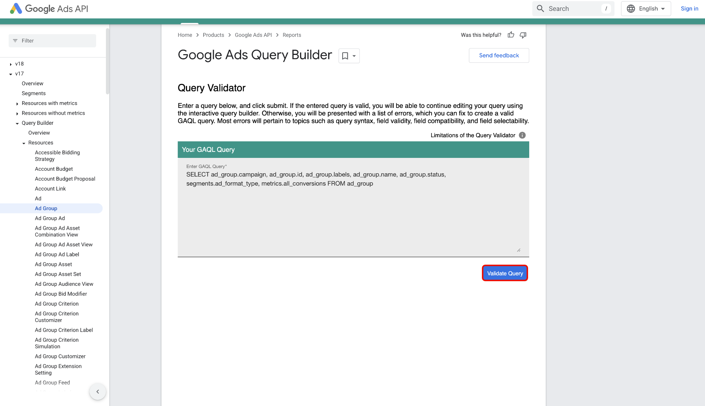

# Conectar o [!DNL Google Ads] ao Experience Platform usando a interface

>[!NOTE]
>
> A origem [!DNL Google Ads] está atualmente na versão beta e só oferece suporte à assimilação única. Você pode usar o [método de API](../../../api/create/advertising/ads.md) para realizar a assimilação incremental de dados de [!DNL Google Ads] na Experience Platform.
>
>Consulte a [Visão geral das fontes](../../../../home.md#terms-and-conditions) para obter mais informações sobre o uso de fontes com rótulo beta.

Leia este guia para saber como conectar sua conta do [!DNL Google Ads] à Adobe Experience Platform usando o espaço de trabalho de fontes na interface do usuário do Experience Platform.

## Introdução

Este tutorial requer uma compreensão funcional dos seguintes componentes do Experience Platform:

* [[!DNL Experience Data Model (XDM)] Sistema](../../../../../xdm/home.md): a estrutura padronizada pela qual o Experience Platform organiza os dados de experiência do cliente.
   * [Noções básicas sobre a composição de esquema](../../../../../xdm/schema/composition.md): saiba mais sobre os blocos de construção básicos de esquemas XDM, incluindo princípios-chave e práticas recomendadas na composição de esquema.
   * [Tutorial do Editor de esquemas](../../../../../xdm/tutorials/create-schema-ui.md): saiba como criar esquemas personalizados usando a interface do Editor de esquemas.
* [[!DNL Real-Time Customer Profile]](../../../../../profile/home.md): Fornece um perfil de consumidor unificado em tempo real com base em dados agregados de várias fontes.

Se você já tiver uma conexão [!DNL Google Ads] válida, ignore o restante deste documento e prossiga para o tutorial em [configurando um fluxo de dados](../../dataflow/advertising.md)

### Coletar credenciais necessárias

Para obter informações sobre autenticação, leia a [[!DNL Google Ads] visão geral da origem](../../../../connectors/advertising/ads.md).

## Conectar sua conta do Google Ads

Na interface do Experience Platform, selecione **[!UICONTROL Fontes]** na navegação à esquerda para acessar o espaço de trabalho *[!UICONTROL Fontes]*. Você pode selecionar a categoria apropriada no painel *[!UICONTROL Categorias]*. Como alternativa, você pode usar a barra de pesquisa para navegar até a fonte específica que deseja usar.

Para usar o [!DNL Google Ads], selecione o cartão de origem do **[!UICONTROL Google Ads]** em *[!UICONTROL Advertising]* e selecione **[!UICONTROL Adicionar dados]**.

.

### Conta existente

Para usar uma conta existente, selecione **[!UICONTROL Conta existente]** e, em seguida, selecione a conta que deseja usar na lista de contas na interface.

Depois de selecionar sua conta, selecione **[!UICONTROL Avançar]** para prosseguir para a próxima etapa.

.

### Nova conta

Se você não tiver uma conta existente, deverá criar uma nova conta fornecendo as credenciais de autenticação necessárias que correspondam à sua origem.

Para criar uma nova conta, selecione **[!UICONTROL Nova conta]** e forneça um nome de conta e, opcionalmente, uma descrição para os detalhes da sua conta. Em seguida, forneça os valores de autenticação apropriados para autenticar sua origem em relação ao Experience Platform:

* **ID do cliente**: a ID do cliente é o número da conta que corresponde à conta do cliente [!DNL Google Ads] que você deseja gerenciar com a API [!DNL Google Ads]. Esta ID segue o modelo de `123-456-7890`.
* **ID do cliente de logon**: a ID do cliente de logon é o número da conta que corresponde à sua conta de gerente do [!DNL Google Ads] e é usada para buscar dados de relatório de um cliente operacional específico. Para obter mais informações sobre como fazer logon na ID do cliente, leia a [[!DNL Google Ads] documentação da API](https://developers.google.com/search-ads/reporting/concepts/login-customer-id).
* **Token do desenvolvedor**: o token do desenvolvedor permite que você acesse a API [!DNL Google Ads]. Você pode usar o mesmo token de desenvolvedor para fazer solicitações em todas as suas contas do [!DNL Google Ads]. Recupere seu token de desenvolvedor [fazendo logon em sua conta de gerente](https://ads.google.com/home/tools/manager-accounts/) e navegando até a página da Central de API.
* **Token de atualização**: o token de atualização faz parte da autenticação [!DNL OAuth2]. Esse token permite gerar novamente os tokens de acesso após a expiração.
* **ID do Cliente**: a ID do cliente é usada em conjunto com o segredo do cliente como parte da autenticação [!DNL OAuth2]. Juntos, a ID do cliente e o segredo do cliente permitem que o aplicativo opere em nome da sua conta, identificando o aplicativo no [!DNL Google].
* **Segredo do cliente**: o segredo do cliente é usado em conjunto com a ID do cliente como parte da autenticação [!DNL OAuth2]. Juntos, a ID do cliente e o segredo do cliente permitem que o aplicativo opere em nome da sua conta, identificando o aplicativo no [!DNL Google].
* Versão da API **[!DNL Google Ads]**: a versão da API atual com suporte de [!DNL Google Ads]. Embora a versão mais recente da API do [!DNL Google Ads] seja a v21, o Experience Platform atualmente oferece suporte à versão v19 e mais recente. Verifique se você está usando uma dessas versões compatíveis para garantir a compatibilidade.

Depois de inserir suas credenciais, selecione **[!UICONTROL Conectar à origem]** e aguarde alguns minutos para que a conexão seja processada. Quando terminar, selecione **[!UICONTROL Próximo]**.

.

## Selecionar dados {#select-data}

Com [!DNL Google Ads], você deve fornecer a lista de atributos para assimilação durante a fase de seleção de dados do fluxo de trabalho. Para recuperar esses atributos, você deve usar o [[!DNL Google Ads Query Builder]](https://developers.google.com/google-ads/api/fields/v19/overview_query_builder).

No [!DNL Google Ads Query Builder], navegue até o tipo de recurso que deseja usar e use o seletor de atributos para selecionar seus atributos, segmentos e métricas.

Os atributos selecionados preenchem o painel [!DNL Google Ads Query Language]. Certifique-se de usar o modo [!DNL Standard] e selecione **[!DNL Enter or edit a query]**.

Em seguida, selecione **[!DNL Validate Query]** para validar sua consulta [!DNL Google Ads].

Se tiver êxito, o [!DNL Google Ads Query Builder] retornará uma mensagem indicando que sua consulta é válida. Em seguida, copie **somente os atributos** de dentro da consulta.

Volte para a fase de seleção de dados do fluxo de trabalho de origens na interface do usuário do Experience Platform e cole os atributos no painel *[!UICONTROL Listar atributos]*.

Selecione **[!UICONTROL Visualizar]** para visualizar os dados e selecione **[!UICONTROL Avançar]** para continuar.

## Criar um fluxo de dados para assimilar dados de publicidade

Ao seguir este tutorial, você estabeleceu uma conexão com sua conta do Google Ads. Agora você pode seguir para o próximo tutorial e [configurar um fluxo de dados para trazer dados de publicidade para a Experience Platform](../../dataflow/advertising.md).
