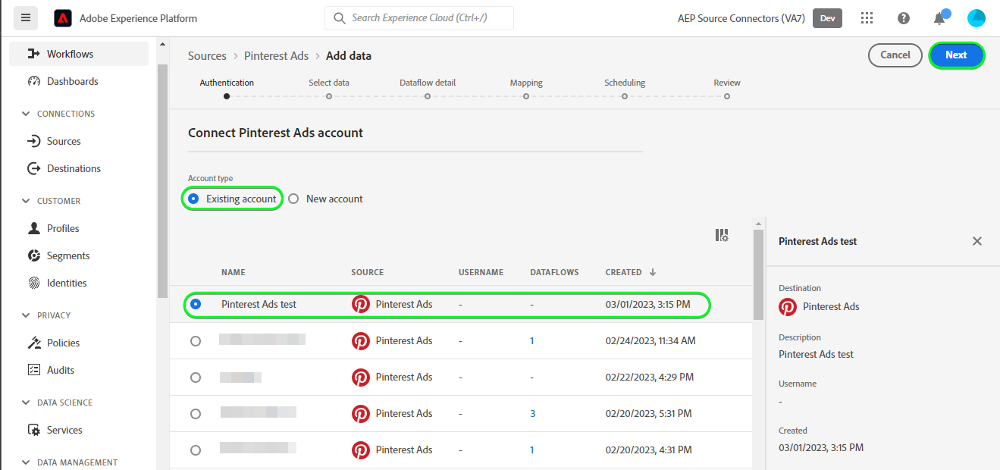
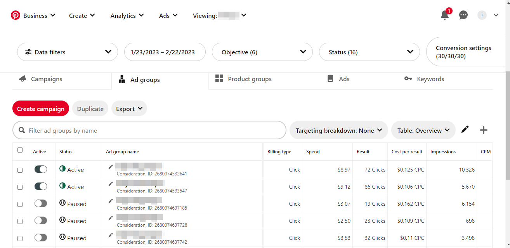

# Criar uma conexão de origem [!DNL Pinterest Ads] na interface

>[!NOTE]
>
>A origem [!DNL Pinterest Ads] está na versão beta. Leia a [visão geral das fontes](../../../../home.md#terms-and-conditions) para obter mais informações sobre o uso de fontes com rótulo beta.

Este tutorial fornece etapas para a criação de um conector de origem [!DNL Pinterest Ads] usando a interface do usuário do Adobe Experience Platform.

## Introdução {#getting-started}

Este tutorial requer uma compreensão funcional dos seguintes componentes do Experience Platform:

* [[!DNL Experience Data Model (XDM)] Sistema](../../../../../xdm/home.md): a estrutura padronizada pela qual a Experience Platform organiza os dados de experiência do cliente.
   * [Noções básicas sobre a composição de esquema](../../../../../xdm/schema/composition.md): saiba mais sobre os blocos de construção básicos de esquemas XDM, incluindo princípios-chave e práticas recomendadas na composição de esquema.
   * [Tutorial do Editor de esquemas](../../../../../xdm/tutorials/create-schema-ui.md): saiba como criar esquemas personalizados usando a interface do Editor de esquemas.
* [[!DNL Real-Time Customer Profile]](../../../../../profile/home.md): Fornece um perfil de consumidor unificado em tempo real com base em dados agregados de várias fontes.

## Pré-requisitos {#prerequisites}

Para conectar [!DNL Pinterest Ads] ao Experience Platform, você deve fornecer valores para as seguintes propriedades de conexão:

* O token de acesso [!DNL Pinterest].
* A ID da conta de anúncio [!DNL Pinterest].
* Uma de [!DNL Pinterest] campanha, grupo de publicidade ou IDs de publicidade, conforme necessário.

Para obter mais informações sobre essas propriedades de conexão, leia a [[!DNL Pinterest Ads] visão geral](../../../../connectors/advertising/pinterest-ads.md#prerequisites).

### Criar um esquema do Experience Platform {#create-platform-schema}

Você também deve garantir que primeiro crie um esquema do Experience Platform para usar em sua origem [!DNL Pinterst Ads]. Leia o tutorial sobre [criação de um esquema do Experience Platform](../../../../../xdm/schema/composition.md) para obter etapas abrangentes sobre como criar um esquema.


Para obter uma lista dos campos suportados pela campanha [!DNL Pinterest], grupo de anúncios e APIs de anúncios, consulte a seção [[!DNL Pinterest] campos](#pinterest-fields).

## Conectar sua conta do [!DNL Pinterest Ads] {#connect-account}

Na interface do usuário do Experience Platform, selecione **[!UICONTROL Fontes]** na barra de navegação esquerda para acessar o espaço de trabalho [!UICONTROL Fontes]. A tela [!UICONTROL Catálogo] exibe uma variedade de fontes com as quais você pode criar uma conta.

Você pode selecionar a categoria apropriada no catálogo no lado esquerdo da tela. Como alternativa, você pode encontrar a fonte específica com a qual deseja trabalhar usando a opção de pesquisa.

Na categoria *Advertising*, selecione **[!UICONTROL Pinterest Ads]** e **[!UICONTROL Adicionar dados]**.


A página **[!UICONTROL Conectar a conta do Pinterest Ads]** é exibida. Nesta página, você pode usar credenciais novas ou existentes.

### Conta existente {#existing-account}

Para usar uma conta existente, selecione a conta [!DNL Pinterest Ads] com a qual deseja criar um novo fluxo de dados e clique em **[!UICONTROL Avançar]** para continuar.



### Nova conta {#new-account}

Se você estiver criando uma nova conta, selecione **[!UICONTROL Nova conta]** e forneça um nome, uma descrição opcional e suas credenciais. Quando terminar, selecione **[!UICONTROL Conectar à origem]** e aguarde algum tempo para que a nova conexão seja estabelecida.


## Selecionar dados {#select-data}

A etapa **[!UICONTROL Selecionar dados]** é exibida, fornecendo uma interface para que você insira as informações que seriam passadas para as APIs para trazer os dados que deseja para o Experience Platform.

| Campo | Descrição |
| --- | --- |
| [!UICONTROL ad_account_id] | Sua ID de conta de anúncio [!DNL Pinterest Ads]. Consulte o [[!DNL Pinterest] guia sobre como encontrar IDs no Ads Manager](https://help.pinterest.com/en/business/article/find-ids-in-ads-manager) se precisar de orientação. |
| [!UICONTROL tipo_de_objeto] | Selecione uma das **campanhas**, **grupos de anúncios** ou **anúncios**, dependendo de qual das [!DNL Pinterest] APIs do Analytics você deseja obter informações. |
| [!UICONTROL object_ids] | As IDs do objeto selecionado. Navegue até a página [!DNL Pinterest] do **Pinterest Business Hub** > **Resumo da Conta de Anúncios** > **Campanhas** / **Grupos de Anúncios** / **Anúncios** e copie as IDs necessárias mencionadas logo abaixo de cada um de seus nomes. |

>[!TIP]
>
>Você pode fornecer vários `object_ids` transmitindo valores separados por vírgula. O número máximo de IDs que você pode passar em uma única solicitação é 100. Se valores incorretos forem passados, o Experience Platform exibirá a seguinte mensagem: `The request could not be processed. Error from flow provider: Unknown error while processing request.`

Depois de fornecer os valores, selecione **[!UICONTROL Selecionar]**. Se os valores fornecidos forem válidos, a parte direita da interface, visualizar dados, será preenchida.


## Próximas etapas {#next-steps}

Seguindo este tutorial, você estabeleceu uma conexão com sua conta do [!DNL Pinterest Ads]. Agora você pode seguir para o próximo tutorial e [configurar um fluxo de dados para trazer dados de publicidade para a Experience Platform](../../dataflow/advertising.md).

## Recursos adicionais {#additional-resources}

As seções abaixo fornecem recursos adicionais que você pode consultar ao usar a origem [!DNL Pinterest Ads].

## Agendando {#scheduling}

Ao agendar o fluxo de dados do [!DNL Pinterest Ads] para assimilação, você deve selecionar uma das seguintes configurações de frequência e intervalo:

| Frequência | Intervalo |
| --- | --- |
| `Day` | 1 |
| `Hour` | 24 |

Para obter mais informações sobre como agendar o fluxo de dados do [!DNL Pinterest Ads], leia a [seção de medidas de proteção da [!DNL Pinterest Ads] visão geral](../../../../connectors/advertising/pinterest-ads.md#guardrails).

Depois de fornecer os valores para o seu agendamento, selecione **[!UICONTROL Avançar]**.


### Validação {#validation}

Para validar se você configurou corretamente a origem e se os dados de [!DNL Pinterest Ads] estão sendo assimilados, siga as etapas abaixo:

Na interface do usuário do Experience Platform, selecione **[!UICONTROL Exibir Fluxos de Dados]** ao lado do menu de cartão [!DNL Pinterest Ads] na página de catálogo. Você pode selecionar [!UICONTROL Visualizar conjunto de dados] para verificar os dados que foram assimilados.


Você pode verificar os dados em relação às contagens visíveis na interface do usuário do [!DNL Pinterest]

>[!BEGINTABS]

>[!TAB Campanhas]


>[!TAB Grupos de anúncios]



>[!TAB Anúncios]


>[!ENDTABS]


### [!DNL Pinterest] Campos {#pinterest-fields}

Os campos suportados pela campanha [!DNL Pinterest], grupo de publicidade e APIs de publicidade estão abaixo:

+++ Exibir conteúdo

```json
{
  "items": [
    {
      "name": "AD_GROUP_ID",
      "category": "ADS",
      "definition": "Unique ID for your ad group",
      "display_name": "Ad group ID"
    },
    {
      "name": "AD_ID",
      "category": "ADS",
      "definition": "Unique ID for your ad",
      "display_name": "Ad ID"
    },
    {
      "name": "CAMPAIGN_BOOKING_REFERENCE",
      "category": "ADS",
      "definition": "Campaign booking reference number",
      "display_name": "Campaign booking reference"
    },
    {
      "name": "CAMPAIGN_DAILY_SPEND_CAP",
      "category": "ADS",
      "definition": "The maximum amount you're willing to spend in one day",
      "display_name": "Daily budget"
    },
    {
      "name": "CAMPAIGN_ID",
      "category": "ADS",
      "definition": "Unique ID for your campaign",
      "display_name": "Campaign ID"
    },
    {
      "name": "CAMPAIGN_LIFETIME_SPEND_CAP",
      "category": "ADS",
      "definition": "The maximum amount you're willing to spend over the lifetime of your campaign",
      "display_name": "Lifetime budget"
    },
    {
      "name": "CAMPAIGN_NAME",
      "category": "ADS",
      "definition": "Name, objective and ID of your campaign",
      "display_name": "Campaign name"
    },
    {
      "name": "CHECKOUT_ROAS",
      "category": "ADS",
      "definition": "Average return on ad spend for checkout events. This metric may include conversions that are modeled.",
      "display_name": "ROAS (Checkout)"
    },
    {
      "name": "CLICKTHROUGH_1",
      "category": "ADS",
      "definition": "The total number of clicks on your Pin to content on or off of Pinterest",
      "display_name": "Paid Pin clicks"
    },
    {
      "name": "CLICKTHROUGH_1_GROSS",
      "category": "ADS",
      "definition": "Unfiltered number of times someone clicks your ad (paid)",
      "display_name": "Gross Pin clicks"
    },
    {
      "name": "CLICKTHROUGH_2",
      "category": "ADS",
      "definition": "Total number of Pin clicks from ads saved to another person's board",
      "display_name": "Earned Pin clicks"
    },
    {
      "name": "CPC_IN_MICRO_DOLLAR",
      "category": "ADS",
      "definition": "The cost per click in micro dollars"
    },
    {
      "name": "CPM_IN_DOLLAR",
      "category": "ADS",
      "definition": "Average cost per 1k paid impressions",
      "display_name": "CPM"
    },
    {
      "name": "CPM_IN_MICRO_DOLLAR",
      "category": "ADS",
      "definition": "Cost per thousand first-order impressions in micro dollars"
    },
    {
      "name": "CPW_IN_DOLLAR",
      "category": "ADS",
      "definition": "The cost per web session in dollars"
    },
    {
      "name": "CPW_IN_MICRO_DOLLAR",
      "category": "ADS",
      "definition": "The cost per web session in micro dollars"
    },
    {
      "name": "CTR",
      "category": "ADS",
      "definition": "Paid Pin clicks divided by paid impressions",
      "display_name": "Paid CTR"
    },
    {
      "name": "CTR_2",
      "category": "ADS",
      "definition": "Earned Pin clicks divided by earned impressions",
      "display_name": "Earned CTR"
    },
    {
      "name": "ECPCV_IN_DOLLAR",
      "category": "ADS",
      "definition": "Average cost per video view that was watched to completion",
      "display_name": "CPCV (100%)"
    },
    {
      "name": "ECPCV_P95_IN_DOLLAR",
      "category": "ADS",
      "definition": "Average cost per video that was watched until 95% of its length",
      "display_name": "CPCV (95%)"
    },
    {
      "name": "ECPC_IN_DOLLAR",
      "category": "ADS",
      "definition": "Average cost per click",
      "display_name": "CPC"
    },
    {
      "name": "ECPC_IN_MICRO_DOLLAR",
      "category": "ADS",
      "definition": "Effective CPC (including first-order and downstream clicks) in micro dollars"
    },
    {
      "name": "ECPE_IN_DOLLAR",
      "category": "ADS",
      "definition": "Cost per engagement",
      "display_name": "CPE"
    },
    {
      "name": "ECPM_IN_MICRO_DOLLAR",
      "category": "ADS",
      "definition": "Effective CPM (including first-order and downstream impressions) in micro dollars"
    },
    {
      "name": "ECPV_IN_DOLLAR",
      "category": "ADS",
      "definition": "Average cost per video view",
      "display_name": "CPV"
    },
    {
      "name": "ECTR",
      "category": "ADS",
      "definition": "Total Pin clicks divided by total impressions",
      "display_name": "CTR"
    },
    {
      "name": "EENGAGEMENT_RATE",
      "category": "ADS",
      "definition": "Total engagements divided by total impressions",
      "display_name": "Engagement rate"
    },
    {
      "name": "ENGAGEMENT",
      "category": "ORGANIC",
      "definition": "The total number of engagements on your Pins. This includes saves, Pin clicks, outbound clicks, carousel card swipes, secondary creative (collections) clicks and Idea Pin forward/backward swipes.",
      "display_name": "Engagement"
    },
    {
      "name": "ENGAGEMENT_1",
      "category": "ADS",
      "definition": "Paid actions taken as a result of your ads",
      "display_name": "Paid engagements"
    },
    {
      "name": "ENGAGEMENT_2",
      "category": "ADS",
      "definition": "Earned actions from ads saved to boards",
      "display_name": "Earned engagements"
    },
    {
      "name": "ENGAGEMENT_RATE",
      "category": "ADS",
      "definition": "Paid engagements divided by paid impressions"
    },
    {
      "name": "ENGAGEMENT_RATE",
      "category": "ORGANIC",
      "definition": "The total engagements with your Pins divided by the total number of times your Pins were seen. Engagements include saves, Pin clicks, and outbound clicks.",
      "display_name": "Engagement rate"
    },
    {
      "name": "IDEA_PIN_PAGE_BACKWARD_1",
      "category": "ADS",
      "definition": "The number of times someone goes back to a previous page within an Idea Pin you promoted"
    },
    {
      "name": "IDEA_PIN_PAGE_BACKWARD_2",
      "category": "ADS",
      "definition": "The number of times someone goes back to a previous page within your Idea Pin on someone else's board"
    },
    {
      "name": "IDEA_PIN_PAGE_FORWARD_1",
      "category": "ADS",
      "definition": "The number of times someone advances to a new page within an Idea Pin you promoted"
    },
    {
      "name": "IDEA_PIN_PAGE_FORWARD_2",
      "category": "ADS",
      "definition": "The number of times someone advances to a new page within your Idea Pin on someone else's board"
    },
    {
      "name": "IDEA_PIN_PRODUCT_TAG_VISIT_1",
      "category": "ADS",
      "definition": "The number of times someone taps on a product tagged within an Idea Pin you promoted"
    },
    {
      "name": "IDEA_PIN_PRODUCT_TAG_VISIT_2",
      "category": "ADS",
      "definition": "The number of times someone taps on a product tagged within an Idea ad saved to another person's board"
    },
    {
      "name": "IMPRESSION",
      "category": "ORGANIC",
      "definition": "The number of times your Pins were on screen.",
      "display_name": "Impressions"
    },
    {
      "name": "IMPRESSION_1",
      "category": "ADS",
      "definition": "The number of times your ad was seen",
      "display_name": "Paid impressions"
    },
    {
      "name": "IMPRESSION_1_GROSS",
      "category": "ADS",
      "definition": "Unfiltered number of times your ad was on screen (paid)",
      "display_name": "Gross impressions"
    },
    {
      "name": "IMPRESSION_2",
      "category": "ADS",
      "definition": "Total number of times your ad was viewed after being saved to another person's board",
      "display_name": "Earned impressions"
    },
    {
      "name": "INAPP_CHECKOUT_COST_PER_ACTION",
      "category": "ADS",
      "definition": "Average cost per in-app checkout event",
      "display_name": "In-app CPA (Checkout)"
    },
    {
      "name": "OUTBOUND_CLICK",
      "category": "ORGANIC",
      "definition": "The number of times people perform actions that lead them to a destination off Pinterest.",
      "display_name": "Outbound clicks"
    },
    {
      "name": "OUTBOUND_CLICK_1",
      "category": "ADS",
      "definition": "The total number of clicks to the destination URL associated with your ad",
      "display_name": "Paid outbound clicks"
    },
    {
      "name": "OUTBOUND_CLICK_2",
      "category": "ADS",
      "definition": "The total number of clicks to the destination URL associated with your ad saved to another person's board",
      "display_name": "Earned outbound clicks"
    },
    {
      "name": "OUTBOUND_CLICK_RATE",
      "category": "ORGANIC",
      "definition": "The total number of clicks to the destination URL associated with your Pin divided by the total number of times your Pins were on screen.",
      "display_name": "Outbound click rate"
    },
    {
      "name": "PAGE_VISIT_COST_PER_ACTION",
      "category": "ADS",
      "definition": "Average cost per page visit event. This metric may include conversions that are modeled.",
      "display_name": "CPA (Page visit)"
    },
    {
      "name": "PAGE_VISIT_ROAS",
      "category": "ADS",
      "definition": "Average return on ad spend for page visit events. This metric may include conversions that are modeled.",
      "display_name": "ROAS (Page visit)"
    },
    {
      "name": "PAID_IMPRESSION",
      "category": "ADS",
      "definition": "The number of impressions that you paid for",
      "display_name": "Paid Impressions"
    },
    {
      "name": "PINTEREST_CHECKOUT_COST_PER_ACTION",
      "category": "ADS",
      "definition": "Average cost per Pinterest checkout event",
      "display_name": "Pinterest CPA (Checkout)"
    },
    {
      "name": "PINTEREST_CHECKOUT_ROAS",
      "category": "ADS",
      "definition": "Average return on ad spend for Pinterest checkout events",
      "display_name": "Pinterest ROAS (Checkout)"
    },
    {
      "name": "PIN_CLICK",
      "category": "ORGANIC",
      "definition": "The total number of clicks on your Pin so it opens in closeup.",
      "display_name": "Pin click"
    },
    {
      "name": "PIN_CLICK_RATE",
      "category": "ORGANIC",
      "definition": "The total number of clicks from your Pin to content on or off Pinterest, divided by the total number of times your Pins were on screen.",
      "display_name": "Pin click rate"
    },
    {
      "name": "PIN_ID",
      "category": "ADS",
      "definition": "Thumbnail of your ad's image or video",
      "display_name": "Organic pin ID"
    },
    {
      "name": "PIN_PROMOTION_ID",
      "category": "ADS",
      "definition": "Unique ID for your ad",
      "display_name": "Ad ID"
    },
    {
      "name": "QUARTILE_95_PERCENT_VIEW",
      "category": "ORGANIC",
      "definition": "The number of times your video was viewed to 95% of its length.",
      "display_name": "Played to 95%"
    },
    {
      "name": "REPIN_1",
      "category": "ADS",
      "definition": "Total number of saves for your ad",
      "display_name": "Paid saves"
    },
    {
      "name": "REPIN_2",
      "category": "ADS",
      "definition": "Number of times your ad was saved from another person's board",
      "display_name": "Earned saves"
    },
    {
      "name": "REPIN_RATE",
      "category": "ADS",
      "definition": "Paid saves divided by paid impressions",
      "display_name": "Paid save rate"
    },
    {
      "name": "SAVE",
      "category": "ORGANIC",
      "definition": "The number of times people saved your Pin to a board.",
      "display_name": "Saves"
    },
    {
      "name": "SAVE_RATE",
      "category": "ORGANIC",
      "definition": "The total saves of your Pins divided by the total number of times your Pins were on screen.",
      "display_name": "Save rate"
    },
    {
      "name": "SPEND_IN_DOLLAR",
      "category": "ADS",
      "definition": "Total amount you've spent during the reporting time period",
      "display_name": "Spend"
    },
    {
      "name": "SPEND_IN_MICRO_DOLLAR",
      "category": "ADS",
      "definition": "The money you spend for promoted Pins, in micro dollars",
      "display_name": "Spend in account currency"
    },
    {
      "name": "SPEND_IN_MICRO_US_DOLLAR",
      "category": "ADS",
      "definition": "The money you spend for promoted Pins, in micro USD",
      "display_name": "Spend in micro USD"
    },
    {
      "name": "SPEND_IN_US_DOLLAR",
      "category": "ADS",
      "definition": "Total amount you've spent during the reporting time period (in USD)",
      "display_name": "Spend In USD"
    },
    {
      "name": "TOTAL_CHECKOUT",
      "category": "ADS",
      "definition": "Total number of checkout events that resulted from interactions with your ad. This metric may include conversions that are modeled.",
      "display_name": "Conversions (Checkout)"
    },
    {
      "name": "TOTAL_CHECKOUT_VALUE_IN_MICRO_DOLLAR",
      "category": "ADS",
      "definition": "Total value of checkout events resulting from interactions with your ad. This metric may include conversions that are modeled.",
      "display_name": "Order value (Checkout)"
    },
    {
      "name": "TOTAL_CLICKTHROUGH",
      "category": "ADS",
      "definition": "The total number of clicks on your Pin to content on or off of Pinterest (paid and earned)",
      "display_name": "Pin clicks"
    },
    {
      "name": "TOTAL_CLICK_ADD_TO_CART",
      "category": "ADS",
      "definition": "The number of add to cart events resulting from clicks on your ad. This metric may include conversions that are modeled.",
      "display_name": "Click-through conversions (Add to cart)"
    },
    {
      "name": "TOTAL_CLICK_CHECKOUT",
      "category": "ADS",
      "definition": "Total number of checkout events resulting from clicks on your ad. This metric may include conversions that are modeled.",
      "display_name": "Click-through conversions (Checkout)"
    },
    {
      "name": "TOTAL_CLICK_CHECKOUT_VALUE_IN_MICRO_DOLLAR",
      "category": "ADS",
      "definition": "Total value of checkout events resulting from clicks on your ad. This metric may include conversions that are modeled.",
      "display_name": "Click-through order value (Checkout)"
    },
    {
      "name": "TOTAL_CLICK_LEAD",
      "category": "ADS",
      "definition": "Total number of lead events resulting from clicks on your ad. This metric may include conversions that are modeled.",
      "display_name": "Click-through conversions (Lead)"
    },
    {
      "name": "TOTAL_CLICK_SIGNUP",
      "category": "ADS",
      "definition": "Number of signup events resulting from clicks on your ad. This metric may include conversions that are modeled.",
      "display_name": "Click-through conversions (Signup)"
    },
    {
      "name": "TOTAL_CLICK_SIGNUP_VALUE_IN_MICRO_DOLLAR",
      "category": "ADS",
      "definition": "Total value of signup events resulting from clicks on your ad. This metric may include conversions that are modeled.",
      "display_name": "Click-through value (Signup)"
    },
    {
      "name": "TOTAL_CONVERSIONS",
      "category": "ADS",
      "definition": "Total number of conversions for all event types using the Pinterest Tag integration after an ad interaction. This metric may include conversions that are modeled.",
      "display_name": "Conversions"
    },
    {
      "name": "TOTAL_CUSTOM",
      "category": "ADS",
      "definition": "Total number of custom events resulting from interactions with your ad. This metric may include conversions that are modeled.",
      "display_name": "Conversions (Custom)"
    },
    {
      "name": "TOTAL_ENGAGEMENT",
      "category": "ADS",
      "definition": "The total number of engagements on your ads, including clicks, saves, carousel swipes, and collections secondary saves",
      "display_name": "Engagements"
    },
    {
      "name": "TOTAL_ENGAGEMENT_CHECKOUT",
      "category": "ADS",
      "definition": "Total number of checkout events resulting from engagements with your ad. Engagements includes saves, closeups, carousel swipes, collection secondary closeups, and collection secondary saves. This metric may include conversions that are modeled.",
      "display_name": "Engagement conversions (Checkout)"
    },
    {
      "name": "TOTAL_ENGAGEMENT_CHECKOUT_VALUE_IN_MICRO_DOLLAR",
      "category": "ADS",
      "definition": "Total value of checkout events resulting from engagements with your ad. Engagements includes saves, closeups, carousel swipes, collection secondary closeups, and collection secondary saves. This metric may include conversions that are modeled.",
      "display_name": "Engagement order value (Checkout)"
    },
    {
      "name": "TOTAL_ENGAGEMENT_LEAD",
      "category": "ADS",
      "definition": "Total number of lead events resulting from engagement with your ad. Engagements includes saves, closeups, carousel swipes, collection secondary closeups, and collection secondary saves. This metric may include conversions that are modeled.",
      "display_name": "Engagement conversions (Lead)"
    },
    {
      "name": "TOTAL_ENGAGEMENT_SIGNUP",
      "category": "ADS",
      "definition": "Total number of signup events resulting from engagements with your ad. Engagements includes saves, closeups, carousel swipes, collection secondary closeups, and collection secondary saves. This metric may include conversions that are modeled.",
      "display_name": "Engagement conversions (Signup)"
    },
    {
      "name": "TOTAL_ENGAGEMENT_SIGNUP_VALUE_IN_MICRO_DOLLAR",
      "category": "ADS",
      "definition": "Total value of signup events resulting from engagements with your ad. Engagements includes saves, closeups, carousel swipes, collection secondary closeups, and collection secondary saves. This metric may include conversions that are modeled.",
      "display_name": "Engagement value (Signup)"
    },
    {
      "name": "TOTAL_IDEA_PIN_PAGE_BACKWARD",
      "category": "ADS",
      "definition": "The total number of times someone goes back to a previous page within an Idea Pin, including paid and earned",
      "display_name": "Total Idea Pin page backward"
    },
    {
      "name": "TOTAL_IDEA_PIN_PAGE_FORWARD",
      "category": "ADS",
      "definition": "The total number of times someone advances to a new page within an Idea Pin, including paid and earned",
      "display_name": "Total Idea Pin page forward"
    },
    {
      "name": "TOTAL_IDEA_PIN_PRODUCT_TAG_VISIT",
      "category": "ADS",
      "definition": "The number of times someone taps on a product tagged within an Idea Pin, paid and earned.",
      "display_name": "Total Idea Pin product tag visits"
    },
    {
      "name": "TOTAL_IMPRESSION_FREQUENCY",
      "category": "ADS",
      "definition": "The average number of times each user saw your ad.",
      "display_name": "Frequency"
    },
    {
      "name": "TOTAL_IMPRESSION_USER",
      "category": "ADS",
      "definition": "Total number of unique users who saw your ads",
      "display_name": "Reach"
    },
    {
      "name": "TOTAL_LEAD",
      "category": "ADS",
      "definition": "Total number of lead events resulting from interactions with your ad. This metric may include conversions that are modeled.",
      "display_name": "Conversions (Lead)"
    },
    {
      "name": "TOTAL_OFFLINE_CHECKOUT",
      "category": "ADS",
      "definition": "Total number of offline checkout events resulting from clicks on your ad",
      "display_name": "Offline conversions (Checkout)"
    },
    {
      "name": "TOTAL_PAGE_VISIT",
      "category": "ADS",
      "definition": "Total number of page visit events resulting from interactions with your ad. This metric may include conversions that are modeled.",
      "display_name": "Conversions (Page visit)"
    },
    {
      "name": "TOTAL_PINTEREST_CHECKOUT",
      "category": "ADS",
      "definition": "Total number of Pinterest checkout events resulting from clicks on your ad",
      "display_name": "Pinterest conversions (Checkout)"
    },
    {
      "name": "TOTAL_PINTEREST_CHECKOUT_VALUE_IN_MICRO_DOLLAR",
      "category": "ADS",
      "definition": "Total value of Pinterest checkout events resulting from interactions with your ad",
      "display_name": "Pinterest order value (Checkout)"
    },
    {
      "name": "TOTAL_REPIN_RATE",
      "category": "ADS",
      "definition": "Total saves divided by total impressions",
      "display_name": "Total save rate"
    },
    {
      "name": "TOTAL_SIGNUP",
      "category": "ADS",
      "definition": "Total number of signup events resulting from interactions with your ad. This metric may include conversions that are modeled.",
      "display_name": "Conversions (Signup)"
    },
    {
      "name": "TOTAL_SIGNUP_VALUE_IN_MICRO_DOLLAR",
      "category": "ADS",
      "definition": "Total value of signup events resulting from interactions with your ad. This metric may include conversions that are modeled.",
      "display_name": "Value (Signup)"
    },
    {
      "name": "TOTAL_VIDEO_3SEC_VIEWS",
      "category": "ADS",
      "definition": "Total number of times your video ad played continuously for at least 3 seconds while 50% visible (paid and earned)",
      "display_name": "Total 3-Second Video Views"
    },
    {
      "name": "TOTAL_VIDEO_AVG_WATCHTIME_IN_SECOND",
      "category": "ADS",
      "definition": "Averaged across all videos that begin playback, including seeks and loops. Start time triggered when video begins playback.",
      "display_name": "Average Watch Time In Seconds"
    },
    {
      "name": "TOTAL_VIDEO_MRC_VIEWS",
      "category": "ADS",
      "definition": "Total number of times your video ad played continuously for at least 2 seconds while 50% visible (paid and earned)",
      "display_name": "Video views"
    },
    {
      "name": "TOTAL_VIDEO_P0_COMBINED",
      "category": "ADS",
      "definition": "Total number of times your video ad started playing (paid and earned)",
      "display_name": "Total video starts"
    },
    {
      "name": "TOTAL_VIDEO_P100_COMPLETE",
      "category": "ADS",
      "definition": "Total number of times your video ad played 100% of its length, including views that skipped ahead to this point (paid and earned)",
      "display_name": "Total video played at 100%"
    },
    {
      "name": "TOTAL_VIDEO_P25_COMBINED",
      "category": "ADS",
      "definition": "Total number of times your video ad played 25% of its length, including views that skipped ahead to this point (paid and earned)",
      "display_name": "Total video played at 25%"
    },
    {
      "name": "TOTAL_VIDEO_P50_COMBINED",
      "category": "ADS",
      "definition": "Total number of times your video ad played 50% of its length, including views that skipped ahead to this point (paid and earned)",
      "display_name": "Total video played at 50%"
    },
    {
      "name": "TOTAL_VIDEO_P75_COMBINED",
      "category": "ADS",
      "definition": "Total number of times your video ad played 75% of its length, including views that skipped ahead to this point (paid and earned)",
      "display_name": "Total video played at 75%"
    },
    {
      "name": "TOTAL_VIDEO_P95_COMBINED",
      "category": "ADS",
      "definition": "Total number of times your video ad played 95% of its length, including views that skipped ahead to this point (paid and earned)",
      "display_name": "Total video played at 95%"
    },
    {
      "name": "TOTAL_VIEW_ADD_TO_CART",
      "category": "ADS",
      "definition": "Total number of add to cart events resulting from views of your ad. This metric may include conversions that are modeled.",
      "display_name": "View-through conversions (Add to cart)"
    },
    {
      "name": "TOTAL_VIEW_CHECKOUT",
      "category": "ADS",
      "definition": "Total number of checkout events resulting from views of your ad. This metric may include conversions that are modeled.",
      "display_name": "View-through conversions (Checkout)"
    },
    {
      "name": "TOTAL_VIEW_CHECKOUT_VALUE_IN_MICRO_DOLLAR",
      "category": "ADS",
      "definition": "Total value of checkout events resulting from views of your ad. This metric may include conversions that are modeled.",
      "display_name": "View-through order value (Checkout)"
    },
    {
      "name": "TOTAL_VIEW_LEAD",
      "category": "ADS",
      "definition": "Total number of lead events resulting from views of your ad. This metric may include conversions that are modeled.",
      "display_name": "View-through conversions (Lead)"
    },
    {
      "name": "TOTAL_VIEW_SIGNUP",
      "category": "ADS",
      "definition": "Number of signup events resulting from views of your ad. This metric may include conversions that are modeled.",
      "display_name": "View-through conversions (Signup)"
    },
    {
      "name": "TOTAL_VIEW_SIGNUP_VALUE_IN_MICRO_DOLLAR",
      "category": "ADS",
      "definition": "Total value of signup events resulting from views of your ad. This metric may include conversions that are modeled.",
      "display_name": "View-through value (Signup)"
    },
    {
      "name": "TOTAL_WEB_CHECKOUT",
      "category": "ADS",
      "definition": "Total number of web checkout events resulting from clicks on your ad. This metric may include conversions that are modeled.",
      "display_name": "Web conversions (Checkout)"
    },
    {
      "name": "TOTAL_WEB_CHECKOUT_VALUE_IN_MICRO_DOLLAR",
      "category": "ADS",
      "definition": "Total value of web checkout events resulting from interactions with your ad. This metric may include conversions that are modeled.",
      "display_name": "Web order value (Checkout)"
    },
    {
      "name": "TOTAL_WEB_CLICK_CHECKOUT",
      "category": "ADS",
      "definition": "Total number of web checkout events resulting from clicks on your ad. This metric may include conversions that are modeled.",
      "display_name": "Web click-through conversions (Checkout)"
    },
    {
      "name": "TOTAL_WEB_CLICK_CHECKOUT_VALUE_IN_MICRO_DOLLAR",
      "category": "ADS",
      "definition": "Total value of web checkout events resulting from clicks on your ad. This metric may include conversions that are modeled.",
      "display_name": "Web click-through order value (Checkout)"
    },
    {
      "name": "TOTAL_WEB_ENGAGEMENT_CHECKOUT",
      "category": "ADS",
      "definition": "Total number of web checkout events resulting from engagements with your ad (save, closeup or carousel swipe). This metric may include conversions that are modeled.",
      "display_name": "Web engagement conversions (Checkout)"
    },
    {
      "name": "TOTAL_WEB_ENGAGEMENT_CHECKOUT_VALUE_IN_MICRO_DOLLAR",
      "category": "ADS",
      "definition": "Total value of web checkout events resulting from engagements with your ad (save, closeup or carousel swipe). This metric may include conversions that are modeled.",
      "display_name": "Web engagement order value (Checkout)"
    },
    {
      "name": "TOTAL_WEB_SESSIONS",
      "category": "ADS",
      "definition": "Total number of sessions loaded in a browser",
      "display_name": "Web sessions"
    },
    {
      "name": "TOTAL_WEB_VIEW_CHECKOUT",
      "category": "ADS",
      "definition": "Total number of web checkout events resulting from views of your ad. This metric may include conversions that are modeled.",
      "display_name": "Web view-through conversions (Checkout)"
    },
    {
      "name": "TOTAL_WEB_VIEW_CHECKOUT_VALUE_IN_MICRO_DOLLAR",
      "category": "ADS",
      "definition": "Total value of web checkout events resulting from views of your ad. This metric may include conversions that are modeled.",
      "display_name": "Web view-through order value (Checkout)"
    },
    {
      "name": "VIDEO_10S_VIEW",
      "category": "ORGANIC",
      "definition": "The number of times your video was viewed for at least 10 seconds.",
      "display_name": "10-second plays"
    },
    {
      "name": "VIDEO_3SEC_VIEWS_2",
      "category": "ADS",
      "definition": "The number of times your video ad played continuously for 3 seconds while 50% in view after being saved to another person's board",
      "display_name": "Earned 3-Second Video Views"
    },
    {
      "name": "VIDEO_AVG_WATCH_TIME",
      "category": "ORGANIC",
      "definition": "The average time someone spent playing the video and static image cards included in your pin.",
      "display_name": "Average video play time"
    },
    {
      "name": "VIDEO_LENGTH",
      "category": "ADS",
      "definition": "Runtime of your video ad",
      "display_name": "Video length"
    },
    {
      "name": "VIDEO_MRC_VIEW",
      "category": "ORGANIC",
      "definition": "The amount of views for at least 2 seconds with 50% of video in view.",
      "display_name": "Video views"
    },
    {
      "name": "VIDEO_MRC_VIEWS_2",
      "category": "ADS",
      "definition": "The number of times your video ad played continuously for 2 seconds while 50% in view after being saved to another person's board",
      "display_name": "Earned video views"
    },
    {
      "name": "VIDEO_P0_COMBINED_2",
      "category": "ADS",
      "definition": "Total number of times your video ad started playing after it was saved to another person's board",
      "display_name": "Earned video starts"
    },
    {
      "name": "VIDEO_P100_COMPLETE_2",
      "category": "ADS",
      "definition": "Total number of times your video ad reached 100% of its length after it was saved to another person's board, including views that skipped ahead to this point",
      "display_name": "Earned video played at 100%"
    },
    {
      "name": "VIDEO_P25_COMBINED_2",
      "category": "ADS",
      "definition": "Total number of times your video ad reached 25% of its length after it was saved to another person's board, including views that skipped ahead to this point",
      "display_name": "Earned video played at 25%"
    },
    {
      "name": "VIDEO_P50_COMBINED_2",
      "category": "ADS",
      "definition": "Total number of times your video ad reached 50% of its length after it was saved to another person's board, including views that skipped ahead to this point",
      "display_name": "Earned video played at 50%"
    },
    {
      "name": "VIDEO_P75_COMBINED_2",
      "category": "ADS",
      "definition": "Total number of times your video ad reached 75% of its length after it was saved to another person's board, including views that skipped ahead to this point",
      "display_name": "Earned video played at 75%"
    },
    {
      "name": "VIDEO_P95_COMBINED_2",
      "category": "ADS",
      "definition": "Total number of times your video ad reached 95% of its length after it was saved to another person's board, including views that skipped ahead to this point",
      "display_name": "Earned video played at 95%"
    },
    {
      "name": "VIDEO_START",
      "category": "ORGANIC",
      "definition": "Total number of video starts."
    },
    {
      "name": "VIDEO_V50_WATCH_TIME",
      "category": "ORGANIC",
      "definition": "The total play time for your video in minutes.",
      "display_name": "Total play time (minutes)"
    },
    {
      "name": "WEB_CHECKOUT_COST_PER_ACTION",
      "category": "ADS",
      "definition": "Average cost per web checkout event. This metric may include conversions that are modeled.",
      "display_name": "Web CPA (Checkout)"
    },
    {
      "name": "WEB_CHECKOUT_ROAS",
      "category": "ADS",
      "definition": "Average return on ad spend for web checkout events. This metric may include conversions that are modeled.",
      "display_name": "Web ROAS (Checkout)"
    },
    {
      "name": "WEB_SESSIONS_1",
      "category": "ADS",
      "definition": "Number of paid sessions loaded in a browser",
      "display_name": "Paid web sessions"
    },
    {
      "name": "WEB_SESSIONS_2",
      "category": "ADS",
      "definition": "Number of earned sessions loaded in a browser",
      "display_name": "Earned web sessions"
    }
  ]
}
```

+++
