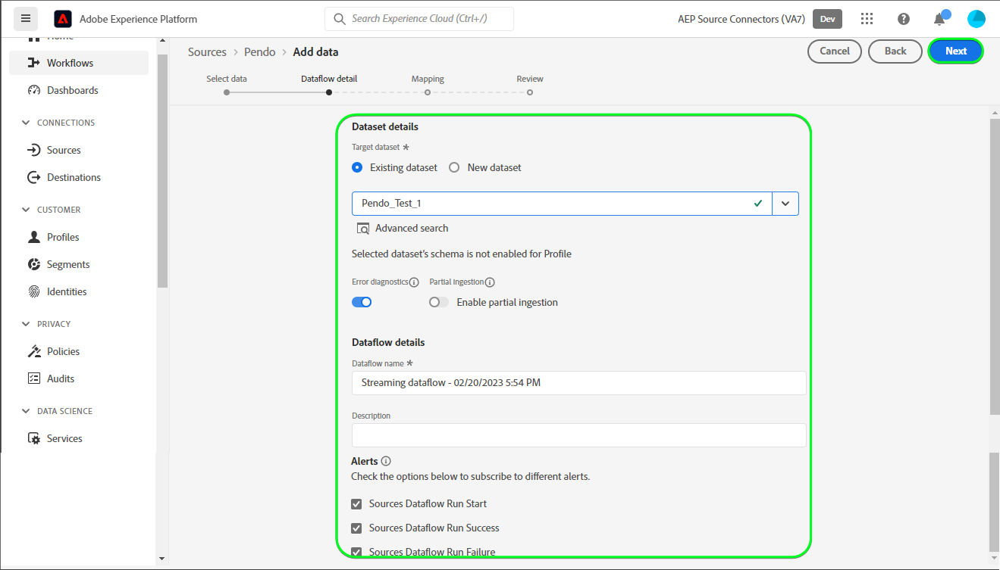

# Criar um [!DNL Pendo] fluxo de dados da conexão de origem e na interface

>[!NOTE]
>
>A variável [!DNL Pendo] a fonte está na versão beta. Consulte a [visão geral das origens](../../../../home.md#terms-and-conditions) para obter mais informações sobre o uso de fontes rotuladas como beta.

Este tutorial fornece etapas para a criação de um [!DNL Pendo] conexão de origem e fluxo de dados usando a interface do usuário do Adobe Experience Platform.

## Introdução {#getting-started}

Este tutorial requer um entendimento prático dos seguintes componentes do Experience Platform:

* [[!DNL Experience Data Model (XDM)] Sistema](../../../../../xdm/home.md): o quadro normalizado pelo qual [!DNL Experience Platform] organiza os dados de experiência do cliente.
   * [Noções básicas da composição do esquema](../../../../../xdm/schema/composition.md): saiba mais sobre os componentes básicos dos esquemas XDM, incluindo princípios fundamentais e práticas recomendadas na composição do esquema.
   * [Tutorial do Editor de esquemas](../../../../../xdm/tutorials/create-schema-ui.md): saiba como criar esquemas personalizados usando a interface do Editor de esquemas.
* [[!DNL Real-Time Customer Profile]](../../../../../profile/home.md): fornece um perfil de consumidor unificado em tempo real com base em dados agregados de várias fontes.

## Pré-requisitos {#prerequisites}

A seção a seguir fornece informações sobre os pré-requisitos a serem concluídos antes da criação de um [!DNL Pendo] conexão de origem.

### Amostra de JSON para definir o esquema de origem para [!DNL Pendo] {#prerequisites-json-schema}

Antes de criar uma [!DNL Pendo] conexão de origem, será necessário fornecer um esquema de origem. Você pode usar o JSON abaixo.

```
{
  "accountId": "58f79ee324d3f",
  "timestamp": 1673372516,
  "visitorId": "test@test.com",
  "uniqueId": "166e50cdf40930fe1367e4d44795c9c74d88b83a",
  "properties": {
    "guideProperties": {
  "name": "Guide Conversion Test"
  }
}
}
```

Para obter mais informações, leia a [[!DNL Pendo] guia sobre webhooks](https://support.pendo.io/hc/en-us/articles/360032285012-Webhooks).

### Criar um esquema da Platform para [!DNL Pendo] {#create-platform-schema}

Você também deve garantir que primeiro crie um esquema da Platform para usar na origem. Veja o tutorial sobre [criação de um schema do Platform](../../../../../xdm/schema/composition.md) para obter etapas abrangentes sobre como criar um schema.


## Conecte seu [!DNL Pendo] account {#connect-account}

Na interface do usuário da Platform, selecione **[!UICONTROL Origens]** na navegação à esquerda, para acessar a [!UICONTROL Origens] e veja um catálogo de fontes disponíveis no Experience Platform.

Use o *[!UICONTROL Categorias]* para filtrar fontes por categoria. Como alternativa, insira um nome de origem na barra de pesquisa para localizar uma origem específica do catálogo.

Vá para a [!UICONTROL Analytics] categoria para ver o [!DNL Pendo] cartão de origem. Para começar, selecione **[!UICONTROL Adicionar dados]**.


## Selecionar dados {#select-data}

A variável **[!UICONTROL Selecionar dados]** será exibida, fornecendo uma interface para que você selecione os dados que deseja trazer para a Platform.

* A parte esquerda da interface é um navegador que permite visualizar os fluxos de dados disponíveis em sua conta;
* A parte direita da interface permite visualizar até 100 linhas de dados de um arquivo JSON.

Selecionar **[!UICONTROL Fazer upload de arquivos]** para carregar um arquivo JSON do seu sistema local. Como alternativa, você pode arrastar e soltar o arquivo JSON que deseja fazer upload na [!UICONTROL Arrastar e soltar arquivos] painel.


Depois que o arquivo for carregado, a interface de visualização será atualizada para exibir uma visualização do esquema carregado. A interface de visualização permite inspecionar o conteúdo e a estrutura de um arquivo. Você também pode usar a variável [!UICONTROL Campo de pesquisa] para acessar itens específicos no esquema.

Quando terminar, selecione **[!UICONTROL Próxima]**.


## Detalhes do fluxo de dados {#dataflow-detail}

A variável **Detalhes do fluxo de dados** A etapa é exibida, fornecendo opções para usar um conjunto de dados existente ou estabelecer um novo para o fluxo de dados, bem como uma oportunidade de fornecer um nome e uma descrição para o fluxo de dados. Durante essa etapa, você também pode definir configurações para Assimilação de perfil, diagnóstico de erro, assimilação parcial e alertas.

Quando terminar, selecione **[!UICONTROL Próxima]**.



## Mapeamento {#mapping}

A variável [!UICONTROL Mapeamento] é exibida, fornecendo uma interface para mapear os campos de origem do esquema de origem para os campos XDM de destino apropriados no esquema de destino.

A Platform fornece recomendações inteligentes para campos mapeados automaticamente com base no esquema ou conjunto de dados de destino selecionado. Você pode ajustar manualmente as regras de mapeamento para atender aos seus casos de uso. Com base nas suas necessidades, você pode optar por mapear campos diretamente ou usar funções de preparação de dados para transformar dados de origem para derivar valores calculados ou calculados. Para obter etapas abrangentes sobre como usar a interface do mapeador e campos calculados, consulte [Guia da interface de preparação de dados](../../../../../data-prep/ui/mapping.md).

Os mapeamentos listados abaixo são obrigatórios e devem ser configurados antes de prosseguir para a [!UICONTROL Revisão] estágio.

| Campo de destino | Descrição |
| --- | --- |
| `uniqueId` | A variável [!DNL Pendo] identificador do evento. |

Depois que os dados de origem forem mapeados com sucesso, selecione **[!UICONTROL Próxima]**.


## Consulte a seção {#review}

A variável **[!UICONTROL Revisão]** é exibida, permitindo que você revise seu novo fluxo de dados antes de ele ser criado. Os detalhes são agrupados nas seguintes categorias:

* **[!UICONTROL Conexão]**: mostra o tipo de origem, o caminho relevante do arquivo de origem escolhido e a quantidade de colunas nesse arquivo de origem.
* **[!UICONTROL Atribuir conjunto de dados e mapear campos]**: mostra em qual conjunto de dados os dados de origem estão sendo assimilados, incluindo o esquema ao qual o conjunto de dados adere.

Depois de revisar o fluxo de dados, selecione **[!UICONTROL Concluir]** e aguarde algum tempo para criar o fluxo de dados.


## Obter o URL do ponto de extremidade de streaming {#get-streaming-endpoint-url}

Com o fluxo de dados de transmissão criado, agora é possível recuperar o URL do ponto de extremidade de transmissão. Esse endpoint será usado para assinar seu webhook, permitindo que a fonte de streaming se comunique com o Experience Platform.

Para construir o URL usado para configurar o webhook no [!DNL Pendo] você deve recuperar o seguinte:

* **[!UICONTROL ID do fluxo de dados]**
* **[!UICONTROL Endpoint de transmissão]**

Para recuperar o **[!UICONTROL ID do fluxo de dados]** e **[!UICONTROL Endpoint de transmissão]**, vá para a [!UICONTROL Atividade de fluxo de dados] página do fluxo de dados que você acabou de criar e copie os detalhes da parte inferior da [!UICONTROL Propriedades] painel.


Depois de recuperar o ponto de extremidade de transmissão e a ID do fluxo de dados, crie um URL com base no seguinte padrão: ```{STREAMING_ENDPOINT}?x-adobe-flow-id={DATAFLOW_ID}```. Por exemplo, um URL de webhook construído pode ser semelhante a: ```https://dcs.adobedc.net/collection/0c61859cc71939a0caf01123f91b2fc52589018800ad46b6c76c2dff3595ee95```

## Configurar Webhook no [!DNL Pendo] {#set-up-webhook}

Em seguida, faça logon em sua conta no [[!DNL Pendo]](https://pendo.io/) e crie um webhook. Para obter etapas sobre como criar um webhook usando o [!DNL Pendo] de usuário, consulte a [[!DNL Pendo] guia sobre a criação de webhook](https://support.pendo.io/hc/en-us/articles/360032285012-Webhooks#create-a-webhook-0-4).

Depois que o webhook for criado, navegue até a página de configurações do [!DNL Pendo] webhook e insira o URL do webhook no [!DNL URL] campo.


>[!TIP]
>
>É possível assinar uma variedade de categorias de eventos diferentes para determinar o tipo de eventos que você deseja enviar do seu [!DNL Pendo] para a Platform. Para obter mais informações sobre os diferentes eventos, consulte a [[!DNL Pendo] documentação](https://support.pendo.io/hc/en-us/articles/360032285012-Webhooks#create-a-webhook-0-4).

## Próximas etapas {#next-steps}

Ao seguir este tutorial, você configurou com êxito um fluxo de dados de transmissão para trazer seus [!DNL Pendo] dados para Experience Platform. Para monitorar os dados que estão sendo assimilados, consulte o manual sobre [monitoramento de fluxos de dados de transmissão usando a interface do usuário da plataforma](../../monitor-streaming.md).

## Recursos adicionais {#additional-resources}

As seções abaixo fornecem recursos adicionais que você pode consultar ao usar o [!DNL Pendo] origem.

### Validação {#validation}

Para validar se você configurou corretamente a origem e [!DNL Pendo] estão sendo assimiladas, siga as etapas abaixo:

* Você pode verificar o [!DNL Pendo] **[!UICONTROL Relatórios]** > **[!UICONTROL Histórico do chat]** página para identificar os eventos que estão sendo capturados pelo [!DNL Pendo].


* Na interface do usuário da Platform, selecione **[!UICONTROL Exibir fluxos de dados]** ao lado da variável [!DNL Pendo] no catálogo de origens. Em seguida, selecione **[!UICONTROL Visualizar conjunto de dados]** para verificar os dados assimilados pelos webhooks configurados no [!DNL Pendo].


### Erros e solução de problemas {#errors-and-troubleshooting}

Ao verificar uma execução de fluxo de dados, você pode encontrar a seguinte mensagem de erro: `The message can't be validated ... uniqueID:expected minLength:1, actual 0].`


Para corrigir esse erro, verifique se a variável *uniqueID* o mapeamento foi configurado. Para obter orientação adicional, consulte o [Mapeamento](#mapping) seção.

Para obter mais informações, visite o [[!DNL Pendo] Centro de ajuda](https://www.pendo.io/help-center/).
