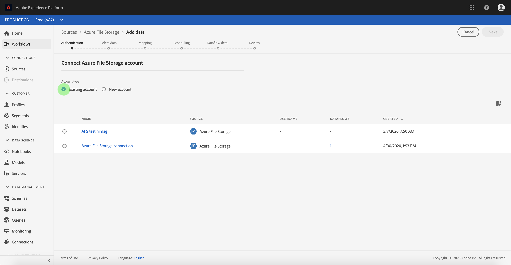

# Criar um [!DNL Azure File Storage] conexão de origem na interface

Os conectores de origem no Adobe Experience Platform fornecem a capacidade de assimilar dados originados externamente de forma programada. Este tutorial fornece etapas para autenticar um [!DNL Azure File Storage] conector de origem usando o [!DNL Platform] interface do usuário.

## Introdução

Este tutorial requer uma compreensão funcional dos seguintes componentes do Adobe Experience Platform:

- [[!DNL Experience Data Model (XDM)] Sistema](../../../../../xdm/home.md): o quadro normalizado pelo qual [!DNL Experience Platform] organiza os dados de experiência do cliente.
   - [Noções básicas da composição do esquema](../../../../../xdm/schema/composition.md): saiba mais sobre os componentes básicos dos esquemas XDM, incluindo princípios fundamentais e práticas recomendadas na composição do esquema.
   - [Tutorial do Editor de esquemas](../../../../../xdm/tutorials/create-schema-ui.md): saiba como criar esquemas personalizados usando a interface do Editor de esquemas.
- [[!DNL Real-Time Customer Profile]](../../../../../profile/home.md): fornece um perfil de consumidor unificado em tempo real com base em dados agregados de várias fontes.

Se você já tiver um [!DNL Azure File Storage] conexão, você pode ignorar o restante deste documento e prosseguir para o tutorial em [configuração de um fluxo de dados](../../dataflow/batch/cloud-storage.md).

### Coletar credenciais necessárias

Para autenticar seu [!DNL Azure File Storage] conector de origem, você deve fornecer valores para as seguintes propriedades de conexão:

| Credencial | Descrição |
| ---------- | ----------- |
| `host` | O endpoint do [!DNL Azure File Storage] que você está acessando. |
| `userId` | O usuário com acesso suficiente à [!DNL Azure File Storage] terminal. |
| `password` | A variável [!DNL Azure File Storage] chave de acesso. |

Para obter mais informações sobre a introdução, consulte [este [!DNL Azure File Storage] documento](https://docs.microsoft.com/en-us/azure/storage/files/storage-how-to-use-files-windows).

## Conecte seu [!DNL Azure File Storage] account

Depois de obter as credenciais necessárias, siga as etapas abaixo para vincular [!DNL Azure File Storage] conta para [!DNL Platform].

Efetue logon no [Adobe Experience Platform](https://platform.adobe.com) e selecione **[!UICONTROL Origens]** na barra de navegação esquerda, para acessar a **[!UICONTROL Origens]** espaço de trabalho. A variável **[!UICONTROL Catálogo]** A tela exibe uma variedade de fontes com as quais você pode criar uma conta.

Você pode selecionar a categoria apropriada no catálogo no lado esquerdo da tela. Como alternativa, você pode encontrar a fonte específica com a qual deseja trabalhar usando a opção de pesquisa.

No **[!UICONTROL Bancos de dados]** categoria, selecione **[!UICONTROL Armazenamento de arquivos do Azure]**. Se esta for a primeira vez que você usa este conector, selecione **[!UICONTROL Configurar]**. Caso contrário, selecione **[!UICONTROL Adicionar dados]** para criar um novo [!DNL Azure File Storage] conector.

A variável **[!UICONTROL Conectar-se ao Armazenamento de Arquivos do Azure]** é exibida. Nesta página, você pode usar credenciais novas ou existentes.

### Nova conta

Se estiver usando novas credenciais, selecione **[!UICONTROL Nova conta]**. No formulário de entrada que aparece, forneça um nome, uma descrição opcional e [!DNL Azure File Storage] credenciais. Quando terminar, selecione **[!UICONTROL Conectar]** e aguarde algum tempo para estabelecer a nova conexão.

### Conta existente

Para conectar uma conta existente, selecione a [!DNL Azure File Storage] conta à qual deseja se conectar e selecione **[!UICONTROL Próxima]** para continuar.

## Próximas etapas

Ao seguir este tutorial, você estabeleceu uma conexão com o seu [!DNL Azure File Storage] conta. Agora você pode seguir para o próximo tutorial e [configure um fluxo de dados para trazer dados do armazenamento em nuvem para [!DNL Platform]](../../dataflow/batch/cloud-storage.md).
