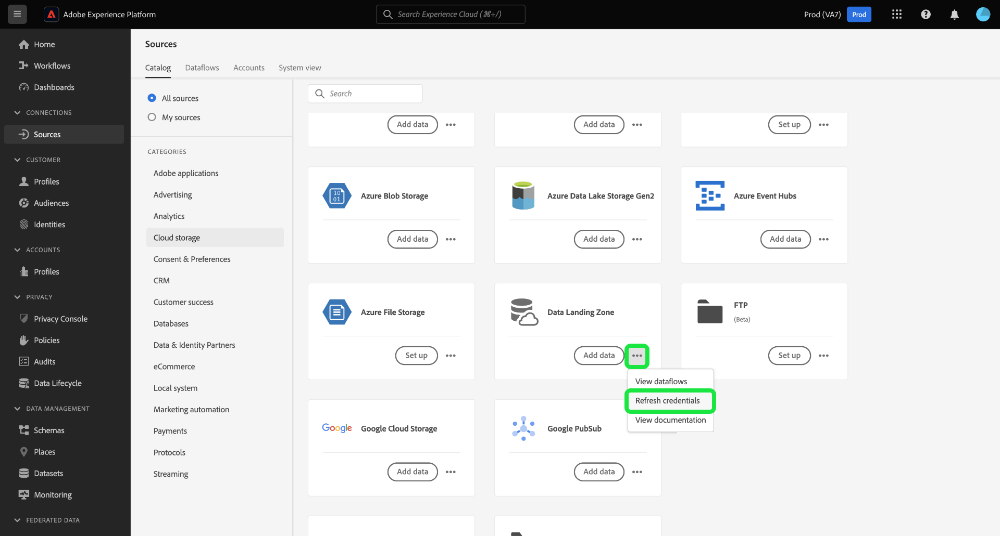

# Conectar [!DNL Data Landing Zone] para a Platform usando a interface

>[!IMPORTANT]
>
>Esta página é específica do [!DNL Data Landing Zone] *origem* conector no Experience Platform. Para obter informações sobre como se conectar ao [!DNL Data Landing Zone] *destino* conector, consulte a [[!DNL Data Landing Zone] página da documentação de destino](/help/destinations/catalog/cloud-storage/data-landing-zone.md).

[!DNL Data Landing Zone] O é um recurso de armazenamento de arquivos seguro e baseado em nuvem para trazer arquivos para a Adobe Experience Platform. Os dados são excluídos automaticamente do [!DNL Data Landing Zone] após sete dias.

Este tutorial fornece etapas para a criação de um [!DNL Data Landing Zone] conexão de origem usando a interface do usuário da Platform.

## Introdução

Este tutorial requer uma compreensão funcional dos seguintes componentes do Adobe Experience Platform:

* [Origens](../../../../home.md): o Experience Platform permite que os dados sejam assimilados de várias fontes e, ao mesmo tempo, fornece a capacidade de estruturar, rotular e aprimorar os dados recebidos usando os serviços da plataforma.
* [Sandboxes](../../../../../sandboxes/home.md): o Experience Platform fornece sandboxes virtuais que particionam uma única instância da Platform em ambientes virtuais separados para ajudar a desenvolver aplicativos de experiência digital.

## Traga seus arquivos de [!DNL Data Landing Zone] para a Platform

Na interface do usuário da Platform, selecione **[!UICONTROL Origens]** na navegação à esquerda, para acessar a [!UICONTROL Origens] espaço de trabalho. A variável [!UICONTROL Catálogo] exibe uma variedade de fontes com as quais você pode criar uma conta.

Você pode selecionar a categoria apropriada no catálogo no lado esquerdo da tela. Como alternativa, você pode encontrar a fonte específica com a qual deseja trabalhar usando a barra de pesquisa.

No [!UICONTROL armazenamento na nuvem] categoria, selecione [!DNL Data Landing Zone] e selecione **[!UICONTROL Adicionar dados]**.

A variável [!UICONTROL Adicionar dados] é exibida, fornecendo uma interface para selecionar e visualizar os dados que deseja trazer para a Platform.

* A parte esquerda da interface é um navegador de pastas, que fornece uma lista de arquivos do container que você pode trazer para a Platform.
* A parte direita da interface permite visualizar até 100 linhas de dados de um arquivo compatível.

Selecione o arquivo que deseja trazer para o Experience Platform e aguarde alguns momentos para que a interface correta seja atualizada em uma tela de visualização.

>[!TIP]
>
>A Platform detecta automaticamente as informações de propriedade do arquivo selecionado, incluindo informações sobre o formato de dados do arquivo, delimitador de coluna designado e tipo de compactação.

A interface de visualização permite inspecionar o conteúdo e a estrutura de um arquivo. Por padrão, a interface de visualização exibe o primeiro arquivo na pasta selecionada.

Para visualizar um arquivo diferente, selecione o ícone de visualização ao lado do nome do arquivo que deseja inspecionar.

Quando terminar, selecione **[!UICONTROL Próxima]**.

Para obter um guia passo a passo detalhado sobre como criar um fluxo de dados para uma fonte de armazenamento na nuvem, consulte o tutorial sobre [criação de um fluxo de dados de armazenamento em nuvem para trazer dados para a Platform](../../dataflow/batch/cloud-storage.md).

## Recupere seu [!DNL Data Landing Zone] credenciais

[!DNL Data Landing Zone] O é uma origem fornecida com sua licença do Adobe Experience Platform Sources. [!DNL Data Landing Zone] O usa uma autenticação baseada em token SAS e URI SAS. Você pode recuperar suas credenciais de autenticação da [!UICONTROL Catálogo de origens] página.

Para recuperar suas credenciais, selecione a **[!UICONTROL Data Landing Zone]** e copie suas credenciais do painel direito exibido.

Um pop-over é exibido, exibindo o nome do container, o token SAS, o nome da conta de armazenamento, o URI SAS e a data de expiração.

## Atualize seu [!DNL Data Landing Zone] credenciais

Seu [!DNL Data Landing Zone] As credenciais do estão definidas para expirar automaticamente após 90 dias e você deve usar novas credenciais para se reconectar ao [!DNL Data Landing Zone] após a expiração. Seus fluxos de dados no Experience Platform não são afetados pelas credenciais de expiração e você ainda pode continuar trabalhando com fluxos de dados novos e existentes com suas novas credenciais.

Há duas maneiras de atualizar seu [!DNL Data Landing Zone] credenciais:

>[!BEGINTABS]

>[!TAB Usar o cartão de origem]

Para atualizar suas credenciais na página de catálogo de origens, selecione as reticências (**`...`**) no [!DNL Data Landing Zone] e selecione **[!UICONTROL Atualizar credenciais]**.

Uma janela pop-up é exibida, solicitando sua confirmação antes de você poder continuar. Quando estiver pronto, selecione **[!UICONTROL Atualizar credenciais]**.

>[!TAB Usar o painel direito]

Para atualizar suas credenciais usando o painel direito, selecione a **[!UICONTROL Data Landing Zone]** cartão de origem e selecione **[!UICONTROL Mais ações]**. Em seguida, selecione **[!UICONTROL Atualizar credenciais]** e, em seguida, confirme usando a janela pop-up exibida.

>[!ENDTABS]

## Próximas etapas

Ao seguir este tutorial, você acessou seu [!DNL Data Landing Zone] e aprendido a recuperar e atualizar suas credenciais. Agora você pode prosseguir para o próximo tutorial em [criação de um fluxo de dados para trazer dados de um armazenamento em nuvem para a Platform](../../dataflow/batch/cloud-storage.md).
