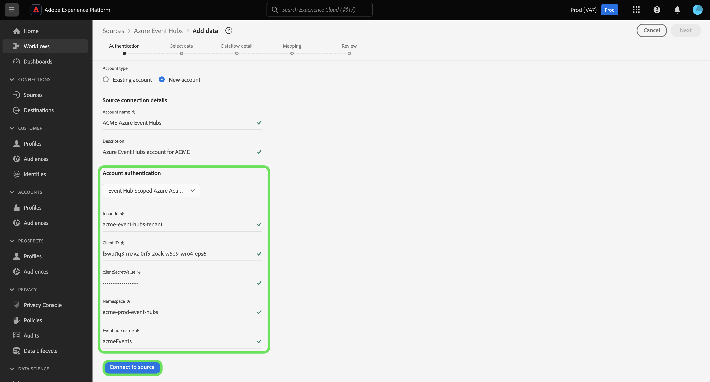

# Criar uma conexão de origem [!DNL Azure Event Hubs] na interface

>[!IMPORTANT]
>
>A origem [!DNL Azure Event Hubs] está disponível no catálogo de origens para usuários que compraram o Real-Time Customer Data Platform Ultimate.

Leia este tutorial para saber como criar uma conta do [!DNL Azure Event Hubs] usando a interface do usuário do Adobe Experience Platform.

## Introdução

Este tutorial requer uma compreensão funcional dos seguintes componentes do Adobe Experience Platform:

* [[!DNL Experience Data Model (XDM)] Sistema](../../../../../xdm/home.md): a estrutura padronizada pela qual o [!DNL Experience Platform] organiza os dados de experiência do cliente.
   * [Noções básicas sobre a composição de esquema](../../../../../xdm/schema/composition.md): saiba mais sobre os blocos de construção básicos de esquemas XDM, incluindo princípios-chave e práticas recomendadas na composição de esquema.
   * [Tutorial do Editor de esquemas](../../../../../xdm/tutorials/create-schema-ui.md): saiba como criar esquemas personalizados usando a interface do Editor de esquemas.
* [[!DNL Real-Time Customer Profile]](../../../../../profile/home.md): Fornece um perfil de consumidor unificado em tempo real com base em dados agregados de várias fontes.

Se você já tiver uma conexão [!DNL Event Hubs] válida, ignore o restante deste documento e prossiga para o tutorial em [configurando um fluxo de dados](../../dataflow/streaming/cloud-storage-streaming.md).

### Coletar credenciais necessárias

Para autenticar o conector de origem do [!DNL Event Hubs], você deve fornecer valores para as seguintes propriedades de conexão:

>[!BEGINTABS]

>[!TAB Autenticação padrão]

| Credencial | Descrição |
| --- | --- |
| Nome da chave SAS | O nome da regra de autorização, que também é conhecido como o nome da chave SAS. |
| Chave SAS | A chave primária do namespace [!DNL Event Hubs]. O `sasPolicy` ao qual `sasKey` corresponde deve ter direitos `manage` configurados para que a lista [!DNL Event Hubs] seja preenchida. |
| Namespace | O namespace do [!DNL Event Hub] que você está acessando. Um namespace [!DNL Event Hub] fornece um contêiner de escopo exclusivo, no qual você pode criar um ou mais [!DNL Event Hubs]. |

>[!TAB Autenticação SAS]

| Credencial | Descrição |
| --- | --- |
| Nome da chave SAS | O nome da regra de autorização, que também é conhecido como o nome da chave SAS. |
| Chave SAS | A chave primária do namespace [!DNL Event Hub]. O `sasPolicy` ao qual `sasKey` corresponde deve ter direitos `manage` configurados para que a lista [!DNL Event Hubs] seja preenchida. |
| Namespace | O namespace do [!DNL Event Hub] que você está acessando. Um namespace [!DNL Event Hub] fornece um contêiner de escopo exclusivo, no qual você pode criar um ou mais [!DNL Event Hubs]. |
| Nome do Hub de Eventos | Preencha seu nome [!DNL Azure Event Hub]. Leia a [documentação do Microsoft](https://learn.microsoft.com/en-us/azure/event-hubs/event-hubs-create#create-an-event-hub) para obter mais informações sobre os nomes de [!DNL Event Hub]. |

>[!TAB Autenticação do Ative Diretory do Azure Hub de Eventos]

| Credencial | Descrição |
| --- | --- |
| ID do locatário | A ID do locatário da qual você deseja solicitar permissão. Sua ID de locatário pode ser formatada como um GUID ou como um nome amigável. **Observação**: a ID do locatário é chamada de &quot;ID do Diretório&quot; na interface [!DNL Microsoft Azure]. |
| ID de cliente | A ID do aplicativo atribuída ao seu aplicativo. Você pode recuperar essa ID do portal do [!DNL Microsoft Entra ID] no qual você registrou o [!DNL Azure Active Directory]. |
| Valor do segredo do cliente | O segredo do cliente usado com a ID do cliente para autenticar seu aplicativo. Você pode recuperar o segredo do cliente no portal [!DNL Microsoft Entra ID] em que registrou o [!DNL Azure Active Directory]. |
| Namespace | O namespace do [!DNL Event Hub] que você está acessando. Um namespace [!DNL Event Hub] fornece um contêiner de escopo exclusivo, no qual você pode criar um ou mais [!DNL Event Hubs]. |

Para obter mais informações sobre [!DNL Azure Active Directory], leia o [Guia do Azure sobre o uso da Microsoft Entra ID](https://learn.microsoft.com/en-us/azure/healthcare-apis/register-application).

>[!TAB Autenticação do Azure Ative Diretory com Escopo do Hub de Eventos]

| Credencial | Descrição |
| --- | --- |
| ID do locatário | A ID do locatário da qual você deseja solicitar permissão. Sua ID de locatário pode ser formatada como um GUID ou como um nome amigável. **Observação**: a ID do locatário é chamada de &quot;ID do Diretório&quot; na interface [!DNL Microsoft Azure]. |
| ID de cliente | A ID do aplicativo atribuída ao seu aplicativo. Você pode recuperar essa ID do portal do [!DNL Microsoft Entra ID] no qual você registrou o [!DNL Azure Active Directory]. |
| Valor do segredo do cliente | O segredo do cliente usado com a ID do cliente para autenticar seu aplicativo. Você pode recuperar o segredo do cliente no portal [!DNL Microsoft Entra ID] em que registrou o [!DNL Azure Active Directory]. |
| Namespace | O namespace do [!DNL Event Hub] que você está acessando. Um namespace [!DNL Event Hub] fornece um contêiner de escopo exclusivo, no qual você pode criar um ou mais [!DNL Event Hubs]. |
| Nome do Hub de Eventos | Preencha seu nome [!DNL Azure Event Hub]. Leia a [documentação do Microsoft](https://learn.microsoft.com/en-us/azure/event-hubs/event-hubs-create#create-an-event-hub) para obter mais informações sobre os nomes de [!DNL Event Hub]. |

Para obter mais informações sobre [!DNL Azure Active Directory], leia o [Guia do Azure sobre o uso da Microsoft Entra ID](https://learn.microsoft.com/en-us/azure/healthcare-apis/register-application).

>[!ENDTABS]

Depois de obter as credenciais necessárias, siga as etapas abaixo para vincular sua conta do [!DNL Event Hubs] à Experience Platform.

## Conectar sua conta do [!DNL Event Hubs]

Na interface do Experience Platform, selecione **[!UICONTROL Fontes]** na navegação à esquerda para acessar o espaço de trabalho [!UICONTROL Fontes]. A tela [!UICONTROL Catálogo] exibe uma variedade de fontes com as quais você pode criar uma conta.

Você pode selecionar a categoria apropriada no catálogo no lado esquerdo da tela. Como alternativa, você pode encontrar a fonte específica com a qual deseja trabalhar usando a opção de pesquisa.

Na categoria [!UICONTROL Armazenamento na nuvem], selecione **[!UICONTROL Hubs de Eventos do Azure]** e **[!UICONTROL Adicionar dados]**.

A caixa de diálogo **[!UICONTROL Conectar-se aos Hubs de Eventos do Azure]** é exibida. Nesta página, você pode usar credenciais novas ou existentes.

### Conta existente

Para usar uma conta existente, selecione a conta [!DNL Event Hubs] que deseja usar e clique em **[!UICONTROL Avançar]** para continuar.

### Nova conta

>[!TIP]
>
>Depois de criada, você não pode alterar o tipo de autenticação de uma conexão de base [!DNL Event Hubs]. Para alterar o tipo de autenticação, você deve criar uma nova conexão base.

Para criar uma nova conta, selecione **[!UICONTROL Nova conta]** e forneça um nome e uma descrição opcional para sua nova conta [!DNL Event Hubs].

>[!BEGINTABS]

>[!TAB Autenticação padrão]

Para criar uma conta [!DNL Event Hubs] com autenticação padrão, use o menu suspenso [!UICONTROL Autenticação da conta] e selecione **[!UICONTROL Autenticação padrão]**. Em seguida, forneça valores para seu [!UICONTROL nome da chave SAS], [!UICONTROL chave SAS] e [!UICONTROL Namespace].

Depois de inserir suas credenciais de autenticação, selecione **[!UICONTROL Conectar à origem]**.

>[!TAB Autenticação SAS]

Para criar uma conta [!DNL Event Hubs] com autenticação SAS, use o menu suspenso [!UICONTROL Autenticação de conta] e selecione **[!UICONTROL Autenticação SAS]**. Em seguida, forneça valores para seu [!UICONTROL nome da chave SAS], [!UICONTROL chave SAS], [!UICONTROL Namespace] e [!UICONTROL nome dos Hubs de Eventos].

Depois de inserir suas credenciais de autenticação, selecione **[!UICONTROL Conectar à origem]**.

>[!TAB Autenticação do Ative Diretory do Azure Hub de Eventos]

Para criar uma conta [!DNL Event Hubs] com autenticação do Ative Diretory do Azure Hub de Eventos, use o menu suspenso [!UICONTROL Autenticação de conta] e selecione **[!UICONTROL Ative Diretory do Azure Hub de Eventos]**. Em seguida, forneça valores para sua [!UICONTROL ID de Locatário], [!UICONTROL ID de Cliente], [!UICONTROL Valor Secreto de Cliente] e [!UICONTROL Namespace].

>[!TAB Autenticação do Azure Ative Diretory com Escopo do Hub de Eventos]

Para criar uma conta [!DNL Event Hubs] com autenticação do Ative Diretory do Azure com Escopo do Hub de Eventos, use o menu suspenso [!UICONTROL Autenticação da conta] e selecione **[!UICONTROL Ative Diretory do Azure com Escopo do Hub de Eventos]**. Em seguida, forneça valores para sua [!UICONTROL ID de Locatário], [!UICONTROL ID de Cliente], [!UICONTROL Valor Secreto de Cliente], [!UICONTROL Namespace] e [!UICONTROL Nome do Hub de Eventos].

>[!ENDTABS]

## Próximas etapas

Seguindo este tutorial, você conectou sua conta do [!DNL Event Hubs] à Experience Platform. Agora você pode seguir para o próximo tutorial e [configurar um fluxo de dados para trazer dados do seu armazenamento em nuvem para o Experience Platform](../../dataflow/streaming/cloud-storage-streaming.md).
