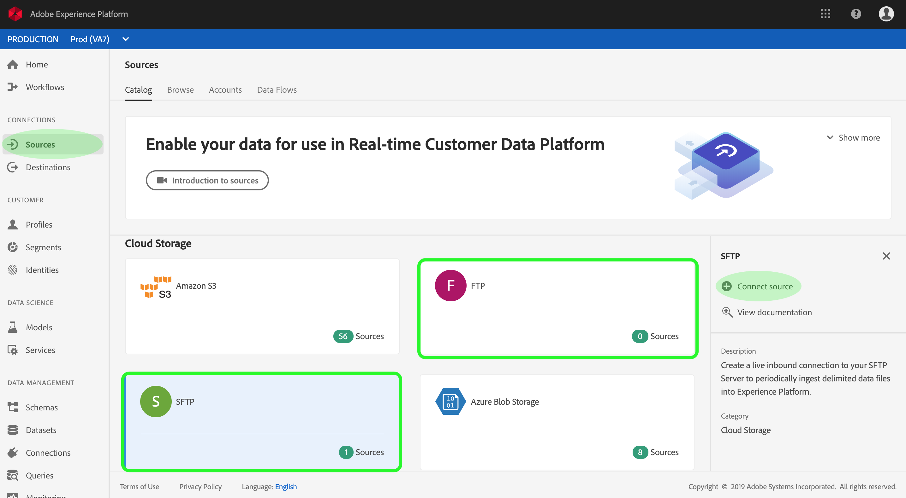

# Criar um conector de origem FTP ou SFTP na interface do usuário

>[!NOTE]
>Os conectores FTP e SFTP estão em beta. Os recursos e a documentação estão sujeitos a alterações.

Os conectores de origem na Adobe Experience Platform fornecem a capacidade de assimilar dados de origem externa de forma programada. Este tutorial fornece etapas para criar um conector de origem FTP ou SFTP usando a interface do usuário da plataforma.

## Introdução

Este tutorial requer uma compreensão prática dos seguintes componentes da Adobe Experience Platform:

* [Sistema](../../../../../xdm/home.md)do Experience Data Model (XDM): A estrutura padronizada pela qual a plataforma Experience organiza os dados da experiência do cliente.
   * [Noções básicas da composição](../../../../../xdm/schema/composition.md)do schema: Saiba mais sobre os elementos básicos dos schemas XDM, incluindo princípios-chave e práticas recomendadas na composição do schema.
   * [Tutorial](../../../../../xdm/tutorials/create-schema-ui.md)do Editor de Schemas: Saiba como criar schemas personalizados usando a interface do editor de Schemas.
* [Perfil](../../../../../profile/home.md)do cliente em tempo real: Fornece um perfil unificado e em tempo real para o consumidor, com base em dados agregados de várias fontes.

Se você já tiver uma conexão FTP ou SFTP válida, poderá ignorar o restante desse documento e prosseguir para o tutorial sobre como [configurar um fluxo de dados](../../dataflow/batch/cloud-storage.md).

### Formatos de arquivo não suportados

A plataforma Experience suporta os seguintes formatos de arquivo para serem assimilados de fontes externas:

* Valores separados por delimitador (DSV): Atualmente, o suporte para arquivos de dados formatados em DSV está limitado a valores separados por vírgula (CSV). O valor dos cabeçalhos de campo nos arquivos formatados em DSV deve consistir apenas em caracteres alfanuméricos e sublinhados. O suporte para DSV geral será fornecido no futuro.
* JSON (JavaScript Object Notation): Os arquivos de dados formatados JSON devem ser compatíveis com XDM.
* Parqueta Apache: Os arquivos de dados formatados do parâmetro devem ser compatíveis com XDM.

### Reunir credenciais obrigatórias

Para acessar seu servidor FTP ou SFTP na plataforma, você deve fornecer o nome **do** host do servidor, um nome **de** usuário e uma **senha**.

## Conecte-se ao seu servidor

Com as credenciais do servidor prontas, você pode seguir as etapas abaixo para criar uma nova conexão básica de entrada para vincular seu servidor FTP ou SFTP à Plataforma.

Faça logon na <a href="https://platform.adobe.com" target="_blank">Adobe Experience Platform</a> e selecione **Fontes** na barra de navegação esquerda para acessar a área de trabalho de fontes. A tela *Catálogo* exibe várias fontes com as quais você pode criar conexões base de entrada e cada fonte mostra o número de conexões base existentes associadas a elas.

Na categoria do Armazenamento *da* Cloud, selecione **FTP** ou **SFTP** para exibir uma barra de informações no lado direito da tela. A barra de informações fornece uma breve descrição para a fonte selecionada, bem como opções para visualização de sua documentação ou para conexão com a fonte. Para criar uma nova conexão básica de entrada, clique em **Conectar fonte**.

No formulário de entrada, forneça um nome à conexão básica, uma descrição opcional e suas credenciais FTP ou SFTP. Por fim, clique em **Conectar** e aguarde algum tempo para que a nova conexão básica seja estabelecida.

Depois que uma conexão básica com seu servidor FTP ou SFTP for estabelecida, você poderá continuar até a próxima seção e configurar um fluxo de dados para trazer os dados para a Plataforma.

## Próximas etapas

Ao seguir este tutorial, você estabeleceu uma conexão com seu servidor FTP ou SFTP. Agora você pode continuar com o próximo tutorial e [configurar um fluxo de dados para trazer dados para a Plataforma](../../dataflow/batch/cloud-storage.md).
