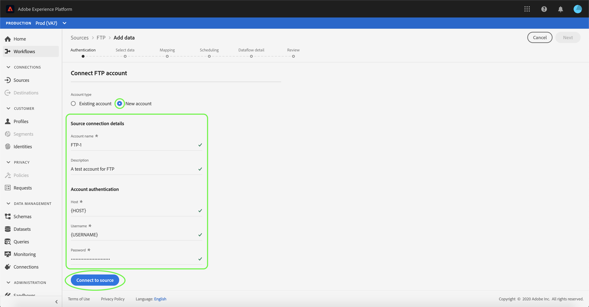

# Criar um conector de origem FTP na interface do usuário

>[!NOTE]
>
>O conector FTP está em beta. Consulte a visão geral [das](../../../../home.md#terms-and-conditions) Fontes para obter mais informações sobre o uso de conectores com rótulo beta.

Este tutorial fornece etapas para a criação de um conector de origem FTP usando a interface do usuário da plataforma.

## Introdução

Este tutorial requer uma compreensão funcional dos seguintes componentes do Adobe Experience Platform:

* [[!DNL Experience Data Model (XDM)] Sistema](../../../../../xdm/home.md): A estrutura padronizada pela qual o Experience Platform organiza os dados de experiência do cliente.
   * [Noções básicas da composição](../../../../../xdm/schema/composition.md)do schema: Saiba mais sobre os elementos básicos dos schemas XDM, incluindo princípios-chave e práticas recomendadas na composição do schema.
   * [Tutorial](../../../../../xdm/tutorials/create-schema-ui.md)do Editor de schemas: Saiba como criar schemas personalizados usando a interface do editor de Schemas.
* [[!DNL Real-time Customer Profile]](../../../../../profile/home.md): Fornece um perfil unificado e em tempo real para o consumidor, com base em dados agregados de várias fontes.

Se você já tiver uma conexão FTP válida, poderá ignorar o restante desse documento e prosseguir para o tutorial sobre como [configurar um fluxo de dados](../../dataflow/batch/cloud-storage.md).

### Reunir credenciais obrigatórias

Para se conectar ao FTP, é necessário fornecer valores para as seguintes propriedades de conexão:

| Credencial | Descrição |
| ---------- | ----------- |
| `host` | O nome ou endereço IP associado ao servidor FTP. |
| `username` | O nome de usuário com acesso ao servidor FTP. |
| `password` | A senha do servidor FTP. |

## Conectar-se ao seu servidor FTP

Depois de reunir as credenciais necessárias, siga as etapas abaixo para criar uma nova conta FTP para se conectar à Plataforma.

Faça logon no [Adobe Experience Platform](https://platform.adobe.com) e selecione **[!UICONTROL Fontes]** na barra de navegação esquerda para acessar a área de trabalho [!UICONTROL Fontes] . A tela [!UICONTROL Catálogo] exibe várias fontes com as quais você pode criar uma conta de entrada.

Você pode selecionar a categoria apropriada no catálogo no lado esquerdo da tela. Como alternativa, você pode encontrar a fonte específica com a qual deseja trabalhar usando a opção de pesquisa.

Na categoria [!UICONTROL armazenamento] da nuvem, selecione **[!UICONTROL FTP]**. Se esta for a sua primeira vez usando este conector, selecione **[!UICONTROL Configurar]**. Caso contrário, selecione **[!UICONTROL Adicionar dados]** para criar uma nova conexão FTP.

A página **[!UICONTROL Conectar-se ao FTP]** é exibida. Nesta página, você pode usar credenciais novas ou existentes.

### Nova conta

Se você estiver usando novas credenciais, selecione **[!UICONTROL Nova conta]**. No formulário de entrada exibido, forneça um nome, uma descrição opcional e suas credenciais. Quando terminar, selecione **[!UICONTROL Connect]** e aguarde algum tempo para a nova conexão ser estabelecida.

### Conta existente

Para conectar uma conta existente, selecione a conta FTP com a qual deseja se conectar e, em seguida, selecione **[!UICONTROL Avançar]** para continuar.

## Próximas etapas

Ao seguir este tutorial, você estabeleceu uma conexão com sua conta FTP. Agora você pode continuar para o próximo tutorial e [configurar um fluxo de dados para trazer dados do seu armazenamento em nuvem para a Plataforma](../../dataflow/batch/cloud-storage.md).