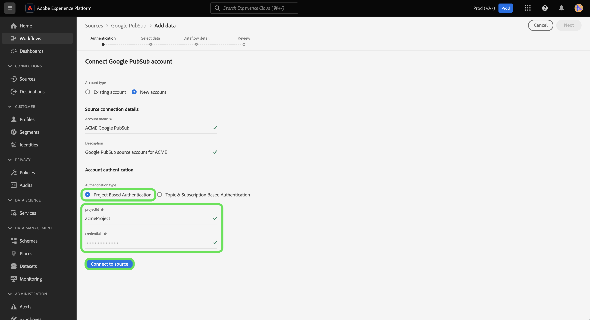

# Criar uma conexão de origem [!DNL Google PubSub] na interface

>[!IMPORTANT]
>
>A origem [!DNL Google PubSub] está disponível no catálogo de origens para usuários que compraram o Real-Time Customer Data Platform Ultimate.

Este tutorial fornece etapas para a criação de um [!DNL Google PubSub] (a seguir denominado &quot;[!DNL PubSub]&quot;) usando a interface do usuário do Experience Platform.

## Introdução

Este tutorial requer uma compreensão funcional dos seguintes componentes do Adobe Experience Platform:

* [Fontes](../../../../home.md): o Experience Platform permite a assimilação de dados de várias fontes, ao mesmo tempo em que fornece a capacidade de estruturar, rotular e aprimorar os dados recebidos usando os serviços do Experience Platform.
* [Sandboxes](../../../../../sandboxes/home.md): a Experience Platform fornece sandboxes virtuais que particionam uma única instância do Experience Platform em ambientes virtuais separados para ajudar a desenvolver aplicativos de experiência digital.

Se você já tiver uma conexão [!DNL PubSub] válida, ignore o restante deste documento e prossiga para o tutorial em [configurando um fluxo de dados](../../dataflow/batch/cloud-storage.md).

### Coletar credenciais necessárias

Você deve fornecer valores para as propriedades de conexão descritas abaixo para conectar sua conta do [!DNL PubSub] à Experience Platform. Para obter mais informações sobre autenticação e configuração de pré-requisito, leia a [[!DNL PubSub source] visão geral](../../../../connectors/cloud-storage/google-pubsub.md#prerequisites).

>[!BEGINTABS]

>[!TAB Autenticação baseada em projeto]

| Credencial | Descrição |
| --- | --- |
| ID do projeto | A ID do projeto necessária para autenticar [!DNL PubSub]. |
| Credenciais | A credencial necessária para autenticar [!DNL PubSub]. Certifique-se de colocar o arquivo JSON completo após remover os espaços em branco de suas credenciais. |

>[!TAB Autenticação baseada em assinatura e tópico]

| Credencial | Descrição |
| --- | --- |
| Credenciais | A credencial necessária para autenticar [!DNL PubSub]. Certifique-se de colocar o arquivo JSON completo após remover os espaços em branco de suas credenciais. |
| Nome do tópico | O nome da sua assinatura do [!DNL PubSub]. No [!DNL PubSub], as assinaturas permitem que você receba mensagens inscrevendo-se no tópico no qual as mensagens foram publicadas. **Observação**: uma única assinatura [!DNL PubSub] só pode ser usada para um fluxo de dados. Para fazer vários fluxos de dados, você deve ter várias assinaturas. |
| Nome da assinatura | O nome da sua assinatura do [!DNL PubSub]. No [!DNL PubSub], as assinaturas permitem que você receba mensagens inscrevendo-se no tópico no qual as mensagens foram publicadas. |

>[!ENDTABS]

Para obter mais informações sobre esses valores, consulte o seguinte documento [PubSub authentication](https://cloud.google.com/pubsub/docs/authentication). Se você estiver usando autenticação baseada em conta de serviço, consulte o seguinte [GuiaPubSub](https://cloud.google.com/docs/authentication/production#create_service_account) para obter etapas sobre como gerar suas credenciais.

>[!TIP]
>
>Se estiver usando autenticação baseada em conta de serviço, verifique se você concedeu acesso de usuário suficiente à conta de serviço e se não há espaços em branco adicionais no JSON ao copiar e colar suas credenciais.

Depois de obter as credenciais necessárias, siga as etapas abaixo para vincular sua conta do [!DNL PubSub] à Experience Platform.

## Conectar sua conta do [!DNL PubSub]

Na interface do Experience Platform, selecione **[!UICONTROL Fontes]** na navegação à esquerda para acessar o espaço de trabalho [!UICONTROL Fontes]. A tela [!UICONTROL Catálogo] exibe uma variedade de fontes com as quais você pode criar uma conta.

Você pode selecionar a categoria apropriada no catálogo no lado esquerdo da tela. Como alternativa, você pode encontrar a fonte específica com a qual deseja trabalhar usando a opção de pesquisa.

Na categoria [!UICONTROL Armazenamento na nuvem], selecione **[!UICONTROL Google PubSub]** e **[!UICONTROL Adicionar dados]**.

A página **[!UICONTROL Conectar ao Google PubSub]** é exibida. Nesta página, você pode usar credenciais novas ou existentes.

### Conta existente

Para usar uma conta existente, selecione a conta [!DNL PubSub] com a qual deseja criar um novo fluxo de dados e clique em **[!UICONTROL Avançar]** para continuar.

### Nova conta

>[!TIP]
>
>* Ao criar uma conta com acesso restrito, você deve fornecer pelo menos um dos nomes do tópico ou da assinatura. A autenticação falhará se ambos os valores estiverem ausentes.
>* Depois de criada, você não pode alterar o tipo de autenticação de uma conexão de base [!DNL Google PubSub]. Para alterar o tipo de autenticação, você deve criar uma nova conexão base.

Se você estiver criando uma nova conta, selecione **[!UICONTROL Nova conta]** e forneça um nome e uma descrição opcional para sua nova conta [!DNL PubSub].

A origem [!DNL PubSub] permite especificar o tipo de acesso que você deseja permitir durante a autenticação. Você pode configurar sua conta para ter autenticação baseada em projeto ou autenticação baseada em tópico e assinatura. A autenticação baseada em projeto permite conceder acesso ao projeto de nível raiz na sua conta, enquanto a autenticação baseada em tópico e assinatura permite restringir o acesso a um tópico e a uma assinatura específicos do [!DNL PubSub].

>[!BEGINTABS]

>[!TAB Autenticação baseada em projeto]

Para criar uma conta com acesso à pasta raiz do projeto [!DNL PubSub]. Selecione **[!UICONTROL Credenciais de autenticação do Google PubSub]** como seu tipo de autenticação e forneça suas credenciais e ID do projeto. Quando terminar, selecione **[!UICONTROL Conectar à origem]** e aguarde algum tempo para que a nova conexão seja estabelecida.

>[!TAB Autenticação baseada em assinatura e tópico]

Para criar uma conta com acesso restrito apenas a um tópico e assinatura específicos do [!DNL PubSub], selecione **[!UICONTROL Credenciais de autenticação do Google PubSub Scoped]** e forneça suas credenciais, nome do tópico e/ou nome da assinatura. Quando terminar, selecione **[!UICONTROL Conectar à origem]** e aguarde algum tempo para que a nova conexão seja estabelecida.

>[!ENDTABS]

>[!NOTE]
>
>As principais (funções) atribuídas a um projeto [!DNL PubSub] são herdadas em todos os tópicos e assinaturas criadas dentro de um projeto [!DNL PubSub]. Se você quiser que um principal (função) tenha acesso a um tópico específico, esse principal (função) também deverá ser adicionado à assinatura correspondente do tópico. Para obter mais informações, leia a [[!DNL PubSub] documentação sobre controle de acesso](<https://cloud.google.com/pubsub/docs/access-control>).

## Selecionar dados

Uma autenticação bem-sucedida leva você à etapa [!UICONTROL Selecionar dados], na qual é possível navegar pela hierarquia de dados [!DNL PubSub] e selecionar os dados que deseja trazer para a Experience Platform.

>[!BEGINTABS]

>[!TAB Autenticação baseada em projeto]

Se você autenticou com acesso baseado em projeto, a interface [!UICONTROL Selecionar dados] exibirá todas as assinaturas do projeto com um tópico anexado a elas.

>[!TAB Autenticação baseada em assinatura e tópico]

Se você autenticou com um tópico e acesso baseado em assinatura, a exibição da interface [!UICONTROL Selecionar dados] poderá variar dependendo das informações fornecidas.

* Se você fornecer apenas o nome do tópico, a interface exibirá todos os pares de assinatura de tópico que correspondem ao tópico fornecido.
* Se você fornecer apenas o nome da subscrição, a interface exibirá todos os pares de topic-subscription que correspondem ao nome da subscrição fornecido.
* Se os nomes do tópico e da assinatura forem fornecidos, a interface exibirá o par topic-subscription que corresponde a ambos os valores fornecidos.

>[!ENDTABS]

## Próximas etapas

Seguindo este tutorial, você criou uma conexão entre sua conta do [!DNL PubSub] e a Experience Platform. Agora você pode seguir para o próximo tutorial e [configurar um fluxo de dados para trazer dados de streaming do seu armazenamento na nuvem para a Experience Platform](../../dataflow/streaming/cloud-storage-streaming.md).
