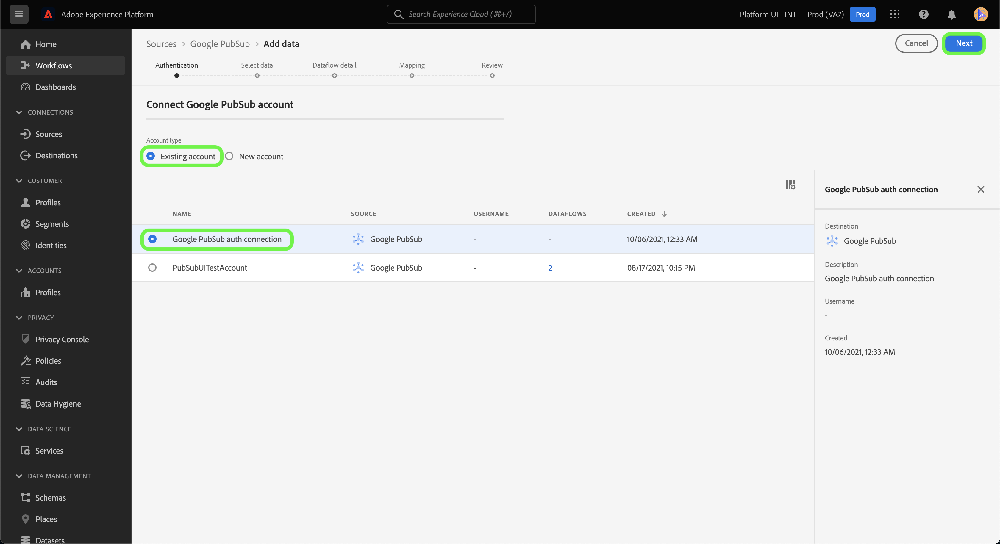
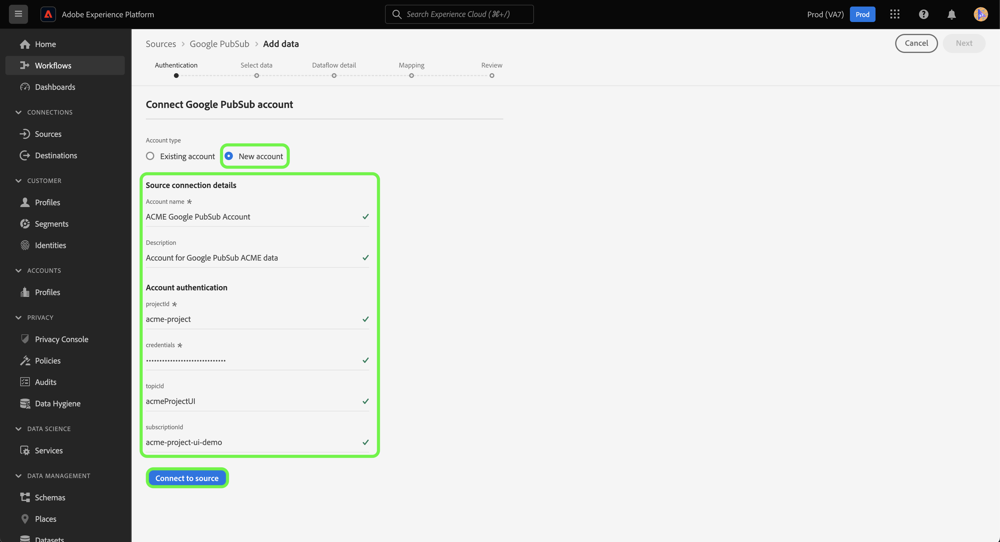

# Crie um [!DNL Google PubSub] conexão de origem na interface do usuário

Este tutorial fornece etapas para criar um [!DNL Google PubSub] (a seguir designado por &quot;[!DNL PubSub]&quot;) usando a interface do usuário da plataforma.

## Introdução

Este tutorial requer uma compreensão funcional dos seguintes componentes do Adobe Experience Platform:

* [Fontes](../../../../home.md): O Experience Platform permite que os dados sejam assimilados de várias fontes, fornecendo a capacidade de estruturar, rotular e aprimorar os dados recebidos usando os serviços da plataforma.
* [Sandboxes](../../../../../sandboxes/home.md): O Experience Platform fornece sandboxes virtuais que particionam uma única instância da Platform em ambientes virtuais separados para ajudar a desenvolver aplicativos de experiência digital.

Se você já tiver um [!DNL PubSub] , você pode ignorar o restante deste documento e prosseguir para o tutorial em [configuração de um fluxo de dados](../../dataflow/batch/cloud-storage.md).

### Obter credenciais necessárias

Para se conectar [!DNL PubSub] para a Platform, você deve fornecer um valor válido para as seguintes credenciais:

| Credencial | Descrição |
| ---------- | ----------- |
| `projectId` | A ID do projeto necessária para autenticação [!DNL PubSub]. |
| `credentials` | A ID da credencial ou da chave privada necessária para a autenticação [!DNL PubSub]. |

Para obter mais informações sobre esses valores, consulte o seguinte [Autenticação PubSub](https://cloud.google.com/pubsub/docs/authentication) documento. Se você estiver usando a autenticação baseada em conta de serviço, consulte o seguinte [PubSub guide](https://cloud.google.com/docs/authentication/production#create_service_account) para obter etapas sobre como gerar suas credenciais.

>[!TIP]
>
>Se estiver usando a autenticação baseada em conta de serviço, certifique-se de ter concedido acesso suficiente ao usuário à sua conta de serviço e de não haver espaços em branco adicionais no JSON, ao copiar e colar suas credenciais.

Depois de reunir suas credenciais necessárias, siga as etapas abaixo para vincular seus [!DNL PubSub] para a Platform.

## Conecte seu [!DNL PubSub] account

No [Interface do usuário da plataforma](https://platform.adobe.com), selecione **[!UICONTROL Fontes]** na barra de navegação esquerda para acessar o [!UICONTROL Fontes] espaço de trabalho. O [!UICONTROL Catálogo] exibe uma variedade de fontes com as quais você pode criar uma conta.

Você pode selecionar a categoria apropriada no catálogo no lado esquerdo da tela. Como alternativa, você pode encontrar a fonte específica com a qual deseja trabalhar usando a barra de pesquisa.

Em [!UICONTROL armazenamento na nuvem] categoria , selecione **[!UICONTROL Google PubSub]** e selecione **[!UICONTROL Adicionar dados]**.

O **[!UICONTROL Conectar-se ao Google PubSub]** será exibida. Nesta página, você pode usar novas credenciais ou credenciais existentes.

### Conta existente

Para usar uma conta existente, selecione a [!DNL PubSub] conta com a qual deseja criar um novo fluxo de dados e selecione **[!UICONTROL Próximo]** para continuar.

### Nova conta

Se estiver criando uma nova conta, selecione **[!UICONTROL Nova conta]** e forneça um nome, uma descrição opcional e [!DNL PubSub] credenciais de autenticação no formulário de entrada. Quando terminar, selecione **[!UICONTROL Conectar-se à origem]** e, em seguida, permitir que a nova conexão seja estabelecida.

## Próximas etapas

Ao seguir este tutorial, você cria uma conexão entre [!DNL PubSub] conta e plataforma. Agora você pode continuar para o próximo tutorial e [configure um fluxo de dados para trazer dados de fluxo do armazenamento em nuvem para a plataforma](../../dataflow/streaming/cloud-storage-streaming.md).
