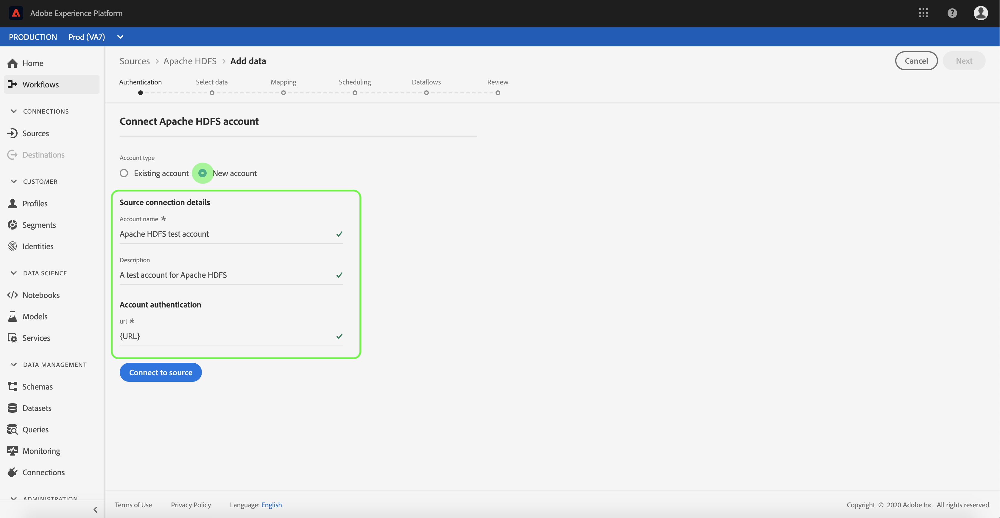

# Crie uma conexão de origem [!DNL Apache] HDFS na interface do usuário

>[!NOTE]
>
>O conector [!DNL Apache] HDFS está em beta. Consulte a [Visão geral das Fontes](../../../../home.md#terms-and-conditions) para obter mais informações sobre o uso de conectores com marca beta.

Os conectores de origem em [!DNL Adobe Experience Platform] fornecem a capacidade de assimilar dados de origem externa de forma programada. Este tutorial fornece etapas para autenticar um conector de origem [!DNL Apache Hadoop Distributed File System] (a seguir denominado &quot;HDFS&quot;) usando a interface do usuário [!DNL Platform].

## Introdução

Este tutorial requer uma compreensão funcional dos seguintes componentes de [!DNL Platform]:

- [[!DNL Experience Data Model (XDM)] Sistema](../../../../../xdm/home.md): A estrutura padronizada pela qual  [!DNL Experience Platform] organiza os dados de experiência do cliente.
   - [Noções básicas da composição](../../../../../xdm/schema/composition.md) do schema: Saiba mais sobre os elementos básicos dos esquemas XDM, incluindo princípios-chave e práticas recomendadas na composição do schema.
   - [Tutorial](../../../../../xdm/tutorials/create-schema-ui.md) do Editor de esquema: Saiba como criar esquemas personalizados usando a interface do Editor de esquemas.
- [[!DNL Real-time Customer Profile]](../../../../../profile/home.md): Fornece um perfil de consumidor unificado e em tempo real com base em dados agregados de várias fontes.

Se já tiver uma conexão HDFS válida, ignore o restante deste documento e prossiga para o tutorial em [configurar um fluxo de dados](../../dataflow/batch/cloud-storage.md).

### Obter credenciais necessárias

Para autenticar seu conector de origem HDFS, você deve fornecer valores para a seguinte propriedade de conexão:

| Credencial | Descrição |
| ---------- | ----------- |
| `url` | O URL define os parâmetros de autenticação necessários para a conexão com o HDFS anonimamente. Para obter mais informações sobre como obter esse valor, consulte o seguinte documento em [Autenticação HTTPS para HDFS](https://hadoop.apache.org/docs/r1.2.1/HttpAuthentication.html). |

## Ligar a sua conta HDFS

Depois de reunir as credenciais necessárias, siga as etapas abaixo para vincular sua conta do HDFS a [!DNL Platform].

Faça logon em [Adobe Experience Platform](https://platform.adobe.com) e selecione **[!UICONTROL Sources]** na barra de navegação esquerda para acessar o espaço de trabalho **[!UICONTROL Sources]**. A tela **[!UICONTROL Catalog]** exibe uma variedade de fontes com as quais você pode criar uma conta.

Você pode selecionar a categoria apropriada no catálogo no lado esquerdo da tela. Como alternativa, você pode encontrar a fonte específica com a qual deseja trabalhar usando a opção de pesquisa.

Na categoria **[!UICONTROL Cloud storage]**, selecione **[!UICONTROL Apache HDFS]**. Se esta for a primeira vez que você usa esse conector, selecione **[!UICONTROL Configure]**. Caso contrário, selecione **[!UICONTROL Add data]** para criar um novo conector HDFS.

A página **[!UICONTROL Connect to HDFS]** é exibida. Nesta página, você pode usar novas credenciais ou credenciais existentes.

### Nova conta

Se estiver usando novas credenciais, selecione **[!UICONTROL New account]**. No formulário de entrada exibido, forneça um nome, uma descrição opcional e suas credenciais do HDFS. Quando terminar, selecione **[!UICONTROL Connect to source]** e aguarde algum tempo para que a nova conexão seja estabelecida.

### Conta existente

Para conectar uma conta existente, selecione a conta do HDFS à qual deseja se conectar e selecione **[!UICONTROL Next]** para prosseguir.

## Próximas etapas

Ao seguir este tutorial, você estabeleceu uma conexão com sua conta HDFS. Agora você pode continuar para o próximo tutorial e [configurar um fluxo de dados para trazer dados do armazenamento de nuvem para [!DNL Platform]](../../dataflow/batch/cloud-storage.md).
