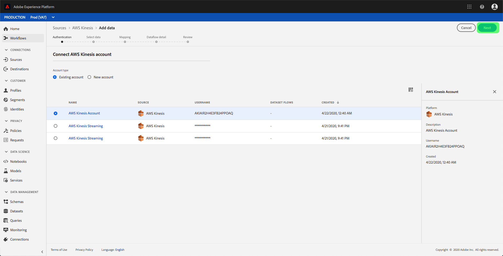

# Criar uma conexão de origem [!DNL Amazon Kinesis] na interface do usuário

>[!NOTE]
>
>O conector [!DNL Amazon Kinesis] está em beta. Consulte a [Visão geral das Fontes](../../../../home.md#terms-and-conditions) para obter mais informações sobre o uso de conectores com marca beta.

Os conectores de origem no Adobe Experience Platform oferecem a capacidade de assimilar dados de origem externa de acordo com a programação. Este tutorial fornece etapas para autenticar um conector de origem [!DNL Amazon Kinesis] (a seguir conhecido como [!DNL "Kinesis"]) usando a interface do usuário [!DNL Platform].

## Introdução

Este tutorial requer uma compreensão funcional dos seguintes componentes do Adobe Experience Platform:

- [[!DNL Experience Data Model (XDM)] Sistema](../../../../../xdm/home.md): A estrutura padronizada pela qual  [!DNL Experience Platform] organiza os dados de experiência do cliente.
   - [Noções básicas da composição](../../../../../xdm/schema/composition.md) do schema: Saiba mais sobre os elementos básicos dos esquemas XDM, incluindo princípios-chave e práticas recomendadas na composição do schema.
   - [Tutorial](../../../../../xdm/tutorials/create-schema-ui.md) do Editor de esquema: Saiba como criar esquemas personalizados usando a interface do Editor de esquemas.
- [[!DNL Real-time Customer Profile]](../../../../../profile/home.md): Fornece um perfil de consumidor unificado e em tempo real com base em dados agregados de várias fontes.

Se você já tiver uma conexão válida [!DNL Kinesis], poderá ignorar o restante deste documento e prosseguir para o tutorial em [configurar um fluxo de dados](../../dataflow/streaming/cloud-storage-streaming.md).

### Obter credenciais necessárias

Para autenticar seu conector de origem [!DNL Kinesis], você deve fornecer valores para as seguintes propriedades de conexão:

| Credencial | Descrição |
| ---------- | ----------- |
| `accessKeyId` | A ID da chave de acesso para sua conta [!DNL Kinesis]. |
| `Secret access key` | A chave de acesso secreta para sua conta [!DNL Kinesis]. |
| `region` | A região do seu servidor AWS. |

Para obter mais informações sobre esses valores, consulte [this [!DNL Kinesis] document](https://docs.aws.amazon.com/streams/latest/dev/getting-started.html).

## Conecte sua conta [!DNL Kinesis]

Depois de coletar suas credenciais necessárias, siga as etapas abaixo para vincular sua conta [!DNL Kinesis] a [!DNL Platform].

Faça logon em [Adobe Experience Platform](https://platform.adobe.com) e selecione **[!UICONTROL Sources]** na barra de navegação esquerda para acessar o espaço de trabalho **[!UICONTROL Sources]**. A tela **[!UICONTROL Catalog]** exibe uma variedade de fontes com as quais você pode criar uma conta.

Você pode selecionar a categoria apropriada no catálogo no lado esquerdo da tela. Como alternativa, você pode encontrar a fonte específica com a qual deseja trabalhar usando a opção de pesquisa.

Na categoria **[!UICONTROL Cloud Storage]**, selecione **[!UICONTROL Amazon Kinesis]**. Se esta for a primeira vez que você usa esse conector, selecione **[!UICONTROL Configure]**. Caso contrário, selecione **[!UICONTROL Add data]** para criar um novo conector [!DNL Kinesis].

A caixa de diálogo **[!UICONTROL Connect to Amazon Kinesis]** é exibida. Nesta página, você pode usar novas credenciais ou credenciais existentes.

### Nova conta

Se estiver usando novas credenciais, selecione **[!UICONTROL New Account]**. No formulário de entrada exibido, forneça um nome, uma descrição opcional e suas credenciais [!DNL Kinesis]. Quando terminar, selecione **[!UICONTROL Connect]** e aguarde algum tempo para que a nova conexão seja estabelecida.

### Conta existente

Para conectar uma conta existente, selecione a conta [!DNL Kinesis] com a qual deseja se conectar e selecione **[!UICONTROL Next]** para prosseguir.

## Próximas etapas

Ao seguir este tutorial, você se conectou à sua conta [!DNL Kinesis] a [!DNL Platform]. Agora você pode continuar para o próximo tutorial e [configurar um fluxo de dados para trazer dados do armazenamento de nuvem para [!DNL Platform]](../../dataflow/streaming/cloud-storage-streaming.md).
