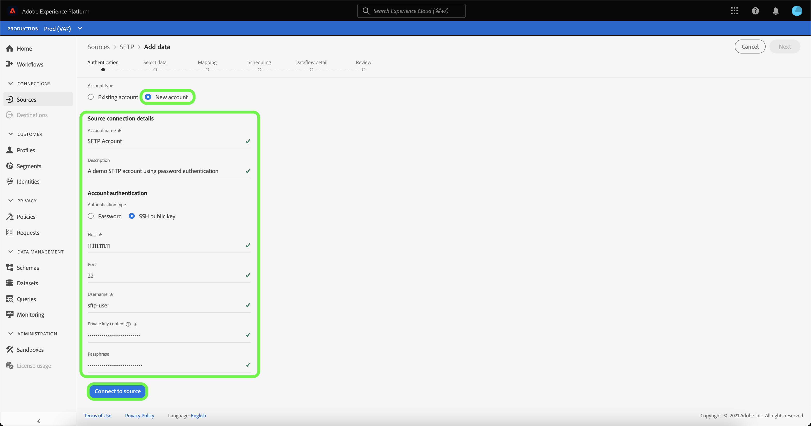

# Criar uma conexão de origem [!DNL SFTP] na interface do usuário

Este tutorial fornece etapas para criar uma conexão de origem [!DNL SFTP] usando a interface do usuário do Adobe Experience Platform.

## Introdução

Este tutorial requer uma compreensão funcional dos seguintes componentes da Platform:

* [[!DNL Experience Data Model (XDM)] Sistema](../../../../../xdm/home.md): A estrutura padronizada pela qual o Experience Platform organiza os dados de experiência do cliente.
   * [Noções básicas da composição](../../../../../xdm/schema/composition.md) do schema: Saiba mais sobre os elementos básicos dos esquemas XDM, incluindo princípios-chave e práticas recomendadas na composição do schema.
   * [Tutorial](../../../../../xdm/tutorials/create-schema-ui.md) do Editor de esquema: Saiba como criar esquemas personalizados usando a interface do Editor de esquemas.
* [[!DNL Real-time Customer Profile]](../../../../../profile/home.md): Fornece um perfil de consumidor unificado e em tempo real com base em dados agregados de várias fontes.

>[!IMPORTANT]
>
>É recomendável evitar quebras de linha ou retornos de carro ao assimilar objetos JSON com uma conexão de origem [!DNL SFTP]. Para contornar a limitação, use um único objeto JSON por linha e use várias linhas para os arquivos subsequentes.

Se você já tiver uma conexão válida [!DNL SFTP], poderá ignorar o restante deste documento e prosseguir para o tutorial em [configurar um fluxo de dados](../../dataflow/batch/cloud-storage.md).

### Obter credenciais necessárias

Para se conectar a [!DNL SFTP], você deve fornecer valores para as seguintes propriedades de conexão:

| Credencial | Descrição |
| ---------- | ----------- |
| `host` | O nome ou endereço IP associado ao servidor [!DNL SFTP]. |
| `port` | A porta do servidor [!DNL SFTP] à qual você está se conectando. Se não for fornecido, o valor assumirá `22` como padrão. |
| `username` | O nome de usuário com acesso ao seu servidor [!DNL SFTP]. |
| `password` | A senha do servidor [!DNL SFTP]. |
| `privateKeyContent` | O conteúdo da chave privada SSH codificada em Base64. O tipo de chave OpenSSH deve ser classificado como RSA ou DSA. |
| `passPhrase` | A senha ou senha para descriptografar a chave privada se o arquivo da chave ou o conteúdo da chave estiver protegido por uma senha. Se PrivateKeyContent estiver protegido por senha, esse parâmetro precisará ser usado com a senha de PrivateKeyContent como valor. |

Depois de coletar suas credenciais necessárias, siga as etapas abaixo para criar uma nova conta [!DNL SFTP] para se conectar à Platform.

## Conecte-se ao seu servidor [!DNL SFTP]

Na interface do usuário da plataforma, selecione **[!UICONTROL Fontes]** na barra de navegação esquerda para acessar o espaço de trabalho [!UICONTROL Fontes]. A tela [!UICONTROL Catálogo] exibe uma variedade de fontes com as quais você pode criar uma conta de entrada.

Você pode selecionar a categoria apropriada no catálogo no lado esquerdo da tela. Como alternativa, você pode encontrar a fonte específica com a qual deseja trabalhar usando a opção de pesquisa.

Na categoria [!UICONTROL Cloud storage], selecione **[!UICONTROL SFTP]** e selecione **[!UICONTROL Adicionar dados]**.

A página **[!UICONTROL Conectar-se ao SFTP]** é exibida. Nesta página, você pode usar novas credenciais ou credenciais existentes.

### Conta existente

Para conectar uma conta existente, selecione a conta FTP ou SFTP com a qual deseja se conectar e selecione **[!UICONTROL Next]** para prosseguir.

### Nova conta

Se estiver criando uma nova conta, selecione **[!UICONTROL New account]** e forneça um nome e uma descrição opcional para sua nova conta [!DNL SFTP].

#### Autenticar usando senha

[!DNL SFTP] O suporta tipos de autenticação diferentes para acesso. Em **[!UICONTROL Autenticação de conta]**, selecione **[!UICONTROL Senha]** e forneça os valores de host e porta aos quais se conectar, juntamente com seu nome de usuário e senha.

#### Autenticar usando chave pública SSH

Para usar credenciais baseadas em chave pública SSH, selecione **[!UICONTROL chave pública SSH]** e forneça seus valores de host e porta, bem como sua combinação de conteúdo de chave privada e senha.

>[!IMPORTANT]
>
>O SFTP suporta uma chave OpenSSH tipo RSA ou DSA. Certifique-se de que o conteúdo do arquivo principal comece com `"-----BEGIN [RSA/DSA] PRIVATE KEY-----"` e termine com `"-----END [RSA/DSA] PRIVATE KEY-----"`. Se o arquivo de chave privada for um arquivo no formato PPK, use a ferramenta PuTTY para converter do formato PPK para OpenSSH.

| Credencial | Descrição |
| ---------- | ----------- |
| Conteúdo da chave privada | O conteúdo da chave privada SSH codificada em Base64. O tipo de chave OpenSSH deve ser classificado como RSA ou DSA. |
| Senha | Especifica a senha ou senha para descriptografar a chave privada se o arquivo de chave ou o conteúdo de chave estiver protegido por uma senha. Se PrivateKeyContent estiver protegido por senha, esse parâmetro precisará ser usado com a senha de PrivateKeyContent como seu valor. |

## Próximas etapas

Ao seguir este tutorial, você estabeleceu uma conexão com sua conta SFTP. Agora você pode continuar para o próximo tutorial e [configurar um fluxo de dados para trazer dados do armazenamento de nuvem para a Platform](../../dataflow/batch/cloud-storage.md).
