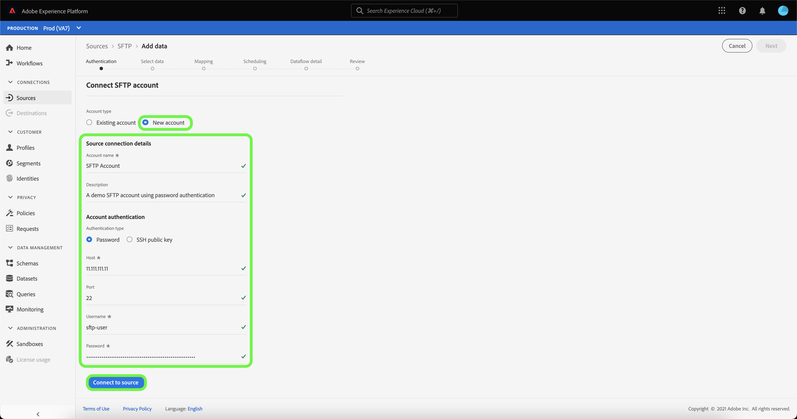

# Criar uma conexão de origem SFTP na interface do usuário

Este tutorial fornece etapas para criar uma conexão de origem SFTP usando a interface do usuário do Adobe Experience Platform.

## Introdução

Este tutorial requer uma compreensão funcional dos seguintes componentes do Adobe Experience Platform:

* [[!DNL Experience Data Model (XDM)] Sistema](../../../../../xdm/home.md): A estrutura padronizada pela qual o Experience Platform organiza os dados de experiência do cliente.
   * [Noções básicas da composição](../../../../../xdm/schema/composition.md) do schema: Saiba mais sobre os elementos básicos dos esquemas XDM, incluindo princípios-chave e práticas recomendadas na composição do schema.
   * [Tutorial](../../../../../xdm/tutorials/create-schema-ui.md) do Editor de esquema: Saiba como criar esquemas personalizados usando a interface do Editor de esquemas.
* [[!DNL Real-time Customer Profile]](../../../../../profile/home.md): Fornece um perfil de consumidor unificado e em tempo real com base em dados agregados de várias fontes.

>[!IMPORTANT]
>
>É recomendável evitar quebras de linha ou retornos de carro ao assimilar objetos JSON com uma conexão de origem SFTP. Para contornar a limitação, use um único objeto JSON por linha e use várias linhas para os arquivos subsequentes.

Se já tiver uma conexão SFTP válida, ignore o restante deste documento e prossiga para o tutorial em [configurar um fluxo de dados](../../dataflow/batch/cloud-storage.md).

### Obter credenciais necessárias

Para se conectar ao SFTP, você deve fornecer valores para as seguintes propriedades de conexão:

| Credencial | Descrição |
| ---------- | ----------- |
| `host` | O nome ou endereço IP associado ao servidor SFTP. |
| `username` | O nome de usuário com acesso ao seu servidor SFTP. |
| `password` | A senha do servidor SFTP. |
| `privateKeyContent` | O conteúdo da chave privada SSH codificada em Base64. O tipo de chave OpenSSH deve ser classificado como RSA ou DSA. |
| `passPhrase` | A senha ou senha para descriptografar a chave privada se o arquivo da chave ou o conteúdo da chave estiver protegido por uma senha. Se PrivateKeyContent estiver protegido por senha, esse parâmetro precisará ser usado com a senha de PrivateKeyContent como valor. |

Depois de reunir as credenciais necessárias, siga as etapas abaixo para criar uma nova conta SFTP para se conectar à Platform.

## Conecte-se ao seu servidor SFTP

Faça logon em [Adobe Experience Platform](https://platform.adobe.com) e selecione **[!UICONTROL Sources]** na barra de navegação esquerda para acessar o espaço de trabalho [!UICONTROL Sources]. A tela [!UICONTROL Catalog] exibe uma variedade de fontes com as quais você pode criar uma conta de entrada.

Você pode selecionar a categoria apropriada no catálogo no lado esquerdo da tela. Como alternativa, você pode encontrar a fonte específica com a qual deseja trabalhar usando a opção de pesquisa.

Na categoria [!UICONTROL Cloud storage], selecione **[!UICONTROL SFTP]**. Se esta for a primeira vez que você usa esse conector, selecione **[!UICONTROL Configure]**. Caso contrário, selecione **[!UICONTROL Add data]** para criar uma nova conexão SFTP.

A página **[!UICONTROL Connect to SFTP]** é exibida. Nesta página, você pode usar novas credenciais ou credenciais existentes.

### Nova conta

Se estiver usando novas credenciais, selecione **[!UICONTROL New account]**. No formulário de entrada exibido, forneça um nome, uma descrição opcional e suas credenciais. Quando terminar, selecione **[!UICONTROL Connect]** e aguarde algum tempo para que a nova conexão seja estabelecida.

O conector SFTP fornece tipos de autenticação diferentes para acesso. Em **[!UICONTROL Account authentication]** selecione **[!UICONTROL Password]** para usar uma credencial baseada em senha.

Como alternativa, você pode selecionar **[chave pública SSH]** e conectar sua conta SFTP usando uma combinação de [!UICONTROL Private key content] e [!UICONTROL Passphrase].

>[!IMPORTANT]
>
>O conector SFTP suporta uma chave OpenSSH tipo RSA ou DSA. Certifique-se de que o conteúdo do arquivo principal comece com `"-----BEGIN [RSA/DSA] PRIVATE KEY-----"` e termine com `"-----END [RSA/DSA] PRIVATE KEY-----"`. Se o arquivo de chave privada for um arquivo no formato PPK, use a ferramenta PuTTY para converter do formato PPK para OpenSSH.

| Credencial | Descrição |
| ---------- | ----------- |
| Conteúdo da chave privada | O conteúdo da chave privada SSH codificada em Base64. O tipo de chave OpenSSH deve ser classificado como RSA ou DSA. |
| Senha | Especifica a senha ou senha para descriptografar a chave privada se o arquivo de chave ou o conteúdo de chave estiver protegido por uma senha. Se PrivateKeyContent estiver protegido por senha, esse parâmetro precisará ser usado com a senha de PrivateKeyContent como valor. |

### Conta existente

Para conectar uma conta existente, selecione a conta FTP ou SFTP com a qual deseja se conectar e selecione **[!UICONTROL Next]** para prosseguir.

## Próximas etapas

Ao seguir este tutorial, você estabeleceu uma conexão com sua conta FTP ou SFTP. Agora você pode continuar para o próximo tutorial e [configurar um fluxo de dados para trazer dados do armazenamento de nuvem para a Platform](../../dataflow/batch/cloud-storage.md).
