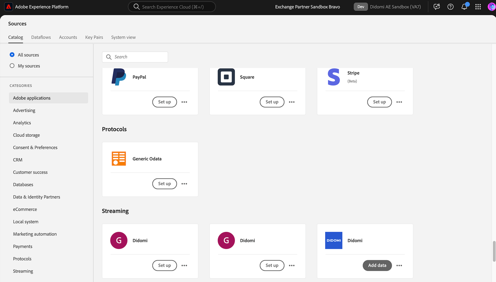

# Conectar [!DNL Didomi] ao Experience Platform

Leia este guia para saber como conectar sua conta do [!DNL Didomi] à Adobe Experience Platform usando o espaço de trabalho de fontes na interface do usuário.

>[!IMPORTANT]
>
>* Esta página de documentação foi criada pela equipe *Didomi*. Para qualquer consulta ou solicitação de atualização, contate-os diretamente em *support@didomi.io*.
>* Para obter instruções passo a passo sobre como gerar a conexão, consulte a [documentação do conector de origem Didomi Adobe](https://developers.didomi.io/integrations/third-party-apps/preference-management-platform-integrations/Adobe-source-connector).

## Introdução

Este tutorial requer uma compreensão funcional dos seguintes componentes do Adobe Experience Platform:

* [[!DNL Experience Data Model (XDM)] Sistema](../../../../../xdm/home.md): a estrutura padronizada pela qual o Experience Platform organiza os dados de experiência do cliente.
   * [Noções básicas sobre a composição de esquema](../../../../../xdm/schema/composition.md): saiba mais sobre os blocos de construção básicos de esquemas XDM, incluindo princípios-chave e práticas recomendadas na composição de esquema.
   * [Tutorial do Editor de esquemas](../../../../../xdm/tutorials/create-schema-ui.md): saiba como criar esquemas personalizados usando a interface do Editor de esquemas.
* [[!DNL Real-Time Customer Profile]](../../../../../profile/home.md): Fornece um perfil de consumidor unificado em tempo real com base em dados agregados de várias fontes.

### Configurar sua conta do [!DNL Didomi]

Antes de continuar, leia e conclua as etapas de pré-requisito descritas na [[!DNL Didomi] visão geral](../../../../connectors/consent-and-preferences/didomi.md#prerequisites) para conectar sua conta à Experience Platform com êxito.

## Navegar pelo catálogo de origens

Na interface do Experience Platform, selecione **[!UICONTROL Fontes]** na navegação à esquerda para acessar o espaço de trabalho *[!UICONTROL Fontes]*. Escolha uma categoria ou use a barra de pesquisa para localizar sua fonte.

Para se conectar a [!DNL Didomi], vá para a categoria *[!UICONTROL Bancos de Dados]*, selecione o cartão de origem **[!UICONTROL Didomi]** e selecione **[!UICONTROL Configurar]**.

>[!TIP]
>
>As origens no catálogo de origens exibem a opção **[!UICONTROL Configurar]** quando uma determinada origem ainda não tem uma conta autenticada. Após a criação de uma conta autenticada, esta opção será alterada para **[!UICONTROL Adicionar dados]**.

## Adicionar seu esquema de dados de origem

Em seguida, use a interface *[!UICONTROL Selecionar dados]* para carregar o arquivo JSON que foi [baixado nas etapas de pré-requisito](../../../../connectors/consent-and-preferences/didomi.md#download-the-sample-payload-file).

É possível usar a interface de pré-visualização para exibir a estrutura de arquivo do payload. Quando terminar, selecione **[!UICONTROL Próximo]**.

## Fornecer detalhes do fluxo de dados

Em seguida, você deve fornecer informações sobre o conjunto de dados e o fluxo de dados.

### Detalhes do conjunto de dados

Um conjunto de dados é uma construção de armazenamento e gerenciamento para uma coleção de dados, normalmente uma tabela, que contém um esquema (colunas) e campos (linhas). Os dados assimilados com sucesso na Experience Platform são mantidos no data lake como conjuntos de dados.

Durante essa etapa, é possível usar um conjunto de dados existente ou criar um novo.

>[!NOTE]
>
>Independentemente de você usar um conjunto de dados existente ou criar um novo, você deve garantir que seu conjunto de dados esteja **habilitado para assimilação do Perfil**.

+++Selecione para obter as etapas para habilitar a Assimilação de perfil, o diagnóstico de erros e a assimilação parcial.

Se o seu conjunto de dados estiver habilitado para o Perfil de cliente em tempo real, durante essa etapa você poderá alternar para **[!UICONTROL o conjunto de dados do perfil]** para habilitar seus dados para assimilação de perfil. Você também pode usar esta etapa para habilitar o **[!UICONTROL Diagnóstico de erro]** e a **[!UICONTROL Assimilação parcial]**.

* **[!UICONTROL Diagnóstico de erro]**: selecione **[!UICONTROL Diagnóstico de erro]** para instruir a origem a produzir o diagnóstico de erro que você poderá consultar posteriormente ao monitorar a atividade do conjunto de dados e o status do fluxo de dados.
* **[!UICONTROL Assimilação parcial]**: a assimilação parcial de lotes é a capacidade de assimilar dados que contêm erros, até um determinado limite configurável. Esse recurso permite assimilar com sucesso todos os seus dados precisos na Experience Platform, enquanto todos os seus dados incorretos são armazenados em lote separadamente com informações sobre por que são inválidos.

+++

### Detalhes do fluxo de dados

Depois que o conjunto de dados é configurado, você deve fornecer detalhes sobre o fluxo de dados, incluindo um nome, uma descrição opcional e configurações de alerta.

| Configurações de fluxo de dados | Descrição |
| --- | --- |
| Nome do fluxo de dados | O nome do fluxo de dados.  Por padrão, esse campo usará o nome do arquivo que está sendo importado. |
| Descrição | (Opcional) Uma breve descrição do fluxo de dados. |
| Alertas | O Experience Platform pode produzir alertas baseados em eventos, nos quais os usuários podem assinar. Todas essas opções dependem de um fluxo de dados em execução para acioná-los.  Para obter mais informações, leia a [visão geral dos alertas](../../alerts.md) <ul><li>**Início da Execução do Fluxo de Dados de Fontes**: selecione este alerta para receber uma notificação quando a execução do fluxo de dados começar.</li><li>**Êxito na Execução do Fluxo de Dados de Fontes**: selecione este alerta para receber uma notificação se o fluxo de dados terminar sem erros.</li><li>**Falha na execução do fluxo de dados de fontes**: selecione este alerta para receber uma notificação se a execução do fluxo de dados terminar com erros.</li></ul> |

{style="table-layout:auto"}

## Mapeamento

Use a interface de mapeamento para mapear os dados de origem para os campos de esquema apropriados antes de assimilar dados na Experience Platform.  Para obter mais informações, leia o [guia de mapeamento na interface](../../../../../data-prep/ui/mapping.md)

O mapeamento é usado especificamente para transferir **dados de finalidade** de [!DNL Didomi] para o conjunto de dados do Experience Platform. Essas finalidades representam as opções de consentimento do usuário (como para análise, personalização, publicidade etc.) e são os únicos campos de mapeamento aceitos nessa integração.

Use a [carga do webhook de amostra baixada](../../../../connectors/consent-and-preferences/didomi.md#download-the-sample-payload-file) das configurações do webhook [!DNL Didomi] para mapear cada finalidade do [!DNL Didomi] para os campos apropriados em seu conjunto de dados do Adobe.

Quando terminar, selecione **[!UICONTROL Próximo]**.

## Revisar

A etapa *[!UICONTROL Revisar]* é exibida, permitindo que você revise os detalhes do fluxo de dados antes que ele seja criado. Os detalhes estão agrupados nas seguintes categorias:

* **[!UICONTROL Conexão]**: mostra o nome da conta, a plataforma de origem e o nome de origem.
* **[!UICONTROL Atribuir conjunto de dados e mapear campos]**: mostra o conjunto de dados de destino e o esquema ao qual o conjunto de dados pertence.

Depois de confirmar que os detalhes estão corretos, selecione **[!UICONTROL Concluir]**.

## Recuperar o URL do ponto de extremidade de streaming

Com a conexão criada, a página de detalhes das origens é exibida. Esta página mostra detalhes da conexão recém-criada, incluindo fluxos de dados executados anteriormente, ID e URL do ponto de extremidade de streaming.

## Concluir a configuração no Adobe

Depois que o fluxo de dados for criado, navegue até o catálogo *[!UICONTROL Fontes]* e selecione **[!UICONTROL Fluxos de Dados]**. Use o diretório de fluxos de dados para localizar seu fluxo de dados do [!DNL Didomi] e acessar a interface de *[!UICONTROL Atividade de fluxo de dados]*. Em seguida, use o painel *[!UICONTROL Propriedades]* no painel direito e recupere valores para o seguinte:

* [!UICONTROL Ponto de extremidade de streaming]
* [!UICONTROL ID do Fluxo de Dados]

Na interface do Experience Platform:

1. Após concluir a configuração, revise os parâmetros de configuração que estavam ausentes na configuração inicial do webhook.
2. Quando esses valores estiverem disponíveis, retorne à Didomi e atualize a configuração do webhook.

## Atualizar a configuração do Webhook

Depois que a configuração for concluída, volte para o console do [!DNL Didomi] e atualize a configuração do webhook com a **URL do ponto de extremidade de streaming** e a **ID do fluxo de dados**.

Depois que isso for concluído, o [!DNL Didomi] começará a enviar eventos de gerenciamento de consentimento e de preferências por meio da integração, e os dados serão armazenados no conjunto de dados do Adobe.

## Próximas etapas

Ao seguir este tutorial, você criou com êxito um fluxo de dados para trazer dados em lote da sua origem [!DNL Didomi] para a Experience Platform. Para obter recursos adicionais, consulte a documentação descrita abaixo.

### Monitorar seu fluxo de dados

Depois que o fluxo de dados for criado, você poderá monitorar os dados que estão sendo assimilados por meio dele para exibir informações sobre taxas de assimilação, sucesso e erros. Para obter mais informações sobre como monitorar o fluxo de dados, visite o tutorial em [monitoramento de contas e fluxos de dados na interface](../../../../../dataflows/ui/monitor-sources.md).

### Atualizar seu fluxo de dados

Para atualizar as configurações do agendamento de fluxos de dados, mapeamento e informações gerais, visite o tutorial em [atualizando fluxos de dados de fontes na interface](../../update-dataflows.md).

### Excluir seu fluxo de dados

Você pode excluir fluxos de dados que não são mais necessários ou que foram criados incorretamente usando a função **[!UICONTROL Excluir]** disponível no espaço de trabalho **[!UICONTROL Fluxos de Dados]**. Para obter mais informações sobre como excluir fluxos de dados, visite o tutorial em [excluindo fluxos de dados na interface](../../delete.md).
