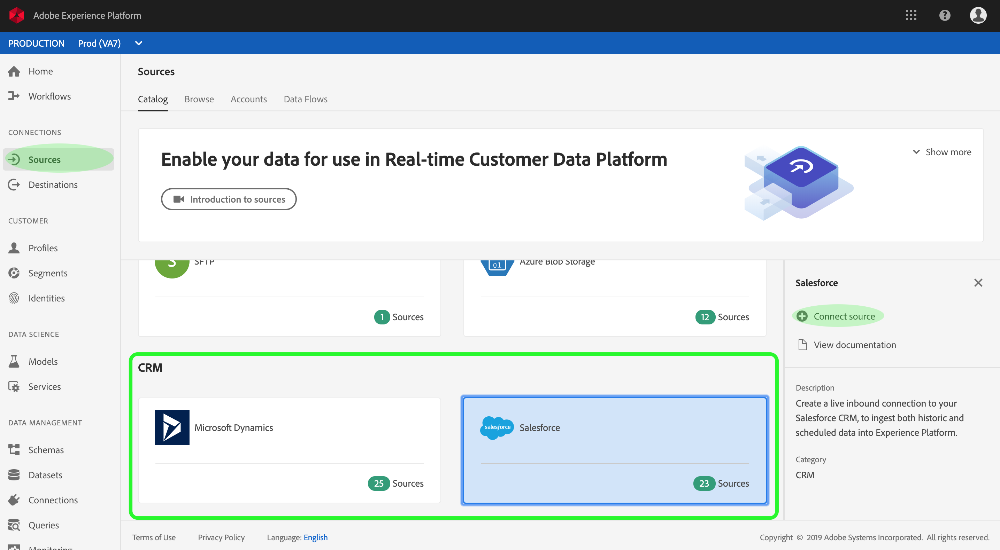

# Criar um conector de origem do Microsoft Dynamics ou Salesforce na interface do usuário

Os conectores de origem na plataforma Adobe Experience fornecem a capacidade de assimilar dados CRM de origem externa de forma programada. Este tutorial fornece etapas para a criação de um Microsoft Dynamics (a seguir denominado &quot;Dinâmico&quot;) ou de um conector de origem do Salesforce usando a interface de usuário da Plataforma.

## Introdução

Este tutorial requer uma compreensão prática dos seguintes componentes da Adobe Experience Platform:

* [Sistema](../../../../../xdm/home.md)do Experience Data Model (XDM): A estrutura padronizada pela qual a plataforma Experience organiza os dados da experiência do cliente.
   * [Noções básicas da composição](../../../../../xdm/schema/composition.md)do schema: Saiba mais sobre os elementos básicos dos schemas XDM, incluindo princípios-chave e práticas recomendadas na composição do schema.
   * [Tutorial](../../../../../xdm/tutorials/create-schema-ui.md)do Editor de Schemas: Saiba como criar schemas personalizados usando a interface do editor de Schemas.
* [Perfil](../../../../../profile/home.md)do cliente em tempo real: Fornece um perfil unificado e em tempo real para o consumidor, com base em dados agregados de várias fontes.

Se você já tiver uma conexão básica do Microsoft Dynamics ou Salesforce, poderá ignorar o restante desse documento e prosseguir para o tutorial sobre como [configurar um fluxo de dados](../../dataflow/crm.md).

### Reunir credenciais obrigatórias

Para acessar sua conta do Dynamics no Platform, é necessário fornecer um URI **de** serviço, um **nome de usuário** e uma **senha**.

Da mesma forma, acessar sua conta do Salesforce na Plataforma requer que você forneça um URL **de** ambiente, um **nome** de usuário, uma **senha** e um token **de** segurança.

## Conectar sua conta do Dynamics ou Salesforce

Com as credenciais do sistema do CRM prontas, você pode seguir as etapas abaixo para criar uma nova conexão básica de entrada para vincular sua conta do Dynamics ou Salesforce à Plataforma.

Faça logon na <a href="https://platform.adobe.com" target="_blank">Adobe Experience Platform</a> e selecione **Fontes** na barra de navegação esquerda para acessar a área de trabalho de fontes. A tela *Catálogo* exibe várias fontes com as quais você pode criar conexões base de entrada e cada fonte mostra o número de conexões base existentes associadas a elas.

Na categoria do *CRM* , selecione **Microsoft Dynamics** ou **Salesforce** para expor uma barra de informações no lado direito da tela. A barra de informações fornece uma breve descrição para a fonte selecionada, bem como opções para visualização de sua documentação ou para conexão com a fonte. Para criar uma nova conexão básica de entrada, clique em **Conectar fonte**.

No formulário de entrada, forneça um nome, uma descrição opcional e suas credenciais do Dynamics ou Salesforce. Por fim, clique em **Conectar** e aguarde algum tempo para que a nova conexão básica seja estabelecida.

Depois que uma conexão básica com seu sistema CRM for estabelecida, você poderá continuar até a próxima seção e configurar um fluxo de dados para trazer dados CRM para a Plataforma.

## Próximas etapas

Ao seguir este tutorial, você estabeleceu uma conexão básica com sua conta do Dynamics ou Salesforce. Agora você pode continuar com o próximo tutorial e [configurar um fluxo de dados para trazer dados para a Plataforma](../../dataflow/crm.md).