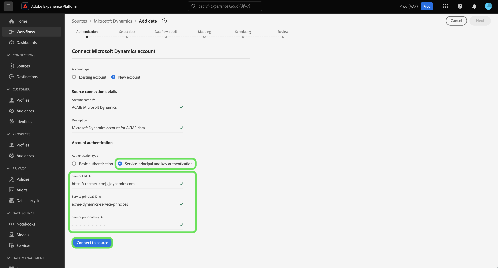

# Criar uma conexão de origem [!DNL Microsoft Dynamics] na interface

Este tutorial fornece etapas para criar uma conexão de origem [!DNL Microsoft Dynamics] (a seguir denominada &quot;[!DNL Dynamics]&quot;) usando a interface do usuário do Adobe Experience Platform.

## Introdução

Este tutorial requer uma compreensão funcional dos seguintes componentes do Adobe Experience Platform:

* [[!DNL Experience Data Model (XDM)] Sistema](../../../../../xdm/home.md): a estrutura padronizada pela qual o Experience Platform organiza os dados de experiência do cliente.
   * [Noções básicas sobre a composição de esquema](../../../../../xdm/schema/composition.md): saiba mais sobre os blocos de construção básicos de esquemas XDM, incluindo princípios-chave e práticas recomendadas na composição de esquema.
   * [Tutorial do Editor de esquemas](../../../../../xdm/tutorials/create-schema-ui.md): saiba como criar esquemas personalizados usando a interface do Editor de esquemas.
* [[!DNL Real-Time Customer Profile]](../../../../../profile/home.md): Fornece um perfil de consumidor unificado em tempo real com base em dados agregados de várias fontes.

Se você já tiver uma conta válida do [!DNL Dynamics], ignore o restante deste documento e prossiga para o tutorial em [configurando um fluxo de dados para uma origem de CRM](../../dataflow/crm.md).

### Coletar credenciais necessárias

Para autenticar sua fonte [!DNL Dynamics], você deve fornecer valores para as seguintes propriedades de conexão:

>[!BEGINTABS]

>[!TAB Autenticação básica]

| Credencial | Descrição |
| --- | --- |
| `serviceUri` | A URL de serviço da instância [!DNL Dynamics]. |
| `username` | O nome de usuário da sua conta de usuário [!DNL Dynamics]. |
| `password` | A senha da sua conta [!DNL Dynamics]. |

>[!TAB Autenticação da entidade de serviço e da chave]

| Credencial | Descrição |
| --- | --- |
| `servicePrincipalId` | A ID de cliente da sua conta [!DNL Dynamics]. Essa ID é necessária ao usar a entidade de serviço e a autenticação baseada em chave. |
| `servicePrincipalKey` | A chave secreta da entidade de serviço. Essa credencial é necessária ao usar a entidade de serviço e a autenticação baseada em chave. |

>[!ENDTABS]

Para obter mais informações sobre a introdução, consulte [este [!DNL Dynamics] documento](https://docs.microsoft.com/en-us/powerapps/developer/common-data-service/authenticate-oauth).

## Conectar sua conta do [!DNL Dynamics]

Na interface do Experience Platform, selecione **[!UICONTROL Fontes]** na navegação à esquerda para acessar o espaço de trabalho [!UICONTROL Fontes]. A tela [!UICONTROL Catálogo] exibe uma variedade de fontes com as quais você pode criar uma conta.

Você pode selecionar a categoria apropriada no catálogo no lado esquerdo da tela. Como alternativa, você pode encontrar a fonte específica com a qual deseja trabalhar usando a opção de pesquisa.

Na categoria [!UICONTROL CRM], selecione **[!UICONTROL Microsoft Dynamics]** e **[!UICONTROL Adicionar dados]**.

A página **[!UICONTROL Conectar conta do Microsoft Dynamics]** é exibida. Nesta página, você pode usar credenciais novas ou existentes.

### Conta existente

Para usar uma conta existente, selecione a conta [!DNL Dynamics] que deseja usar e clique em **[!UICONTROL Avançar]** no canto superior direito para continuar.

### Nova conta

>[!TIP]
>
>Depois de criada, você não pode alterar o tipo de autenticação de uma conexão de base [!DNL Dynamics]. Para alterar o tipo de autenticação, você deve criar uma nova conexão base.

Para criar uma nova conta, selecione **[!UICONTROL Nova conta]** e forneça um nome e uma descrição opcional para sua nova conta [!DNL Dynamics].

Você pode usar a autenticação básica ou a autenticação de entidade de serviço e chave ao criar uma conta do [!DNL Dynamics].

>[!BEGINTABS]

>[!TAB Autenticação básica]

Para criar uma conta do [!DNL Dynamics] com autenticação básica, selecione [!UICONTROL Autenticação básica] e forneça valores para o seu [!UICONTROL URI de Serviço], [!UICONTROL Nome de Usuário] e [!UICONTROL Senha]. **Observação**: a autenticação básica em [!DNL Dynamics] pode ser bloqueada pela autenticação de dois fatores, que atualmente não tem suporte no Experience Platform. Nesse caso, é recomendável usar a autenticação baseada em chave para criar um conector de origem usando [!DNL Dynamics].

Quando terminar, selecione **[!UICONTROL Conectar à origem]** e aguarde algum tempo para que a nova conta seja estabelecida.

>[!TAB Autenticação da entidade de serviço e da chave]

Para criar uma conta [!DNL Dynamics] com autenticação de entidade de serviço e chave, selecione **[!UICONTROL Autenticação de entidade de serviço e chave]** e forneça valores para sua [!UICONTROL ID da entidade de serviço] e [!UICONTROL Chave da entidade de serviço].

Quando terminar, selecione **[!UICONTROL Conectar à origem]** e aguarde algum tempo para que a nova conta seja estabelecida.

>[!ENDTABS]

## Próximas etapas

Seguindo este tutorial, você estabeleceu uma conexão com sua conta do [!DNL Dynamics]. Agora você pode seguir para o próximo tutorial e [configurar um fluxo de dados para trazer dados para a Experience Platform](../../dataflow/crm.md).
