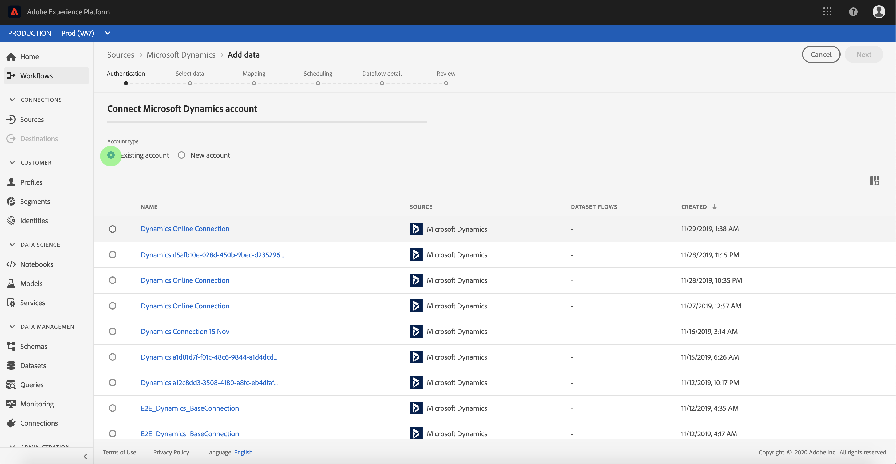

# Criar uma conexão de origem [!DNL Microsoft Dynamics] na interface do usuário

Este tutorial fornece etapas para criar uma conexão de origem [!DNL Microsoft Dynamics] (a seguir chamada &quot;[!DNL Dynamics]&quot;) usando a interface do usuário do Adobe Experience Platform.

## Introdução

Este tutorial requer uma compreensão funcional dos seguintes componentes do Adobe Experience Platform:

* [[!DNL Experience Data Model (XDM)] Sistema](../../../../../xdm/home.md): A estrutura padronizada pela qual o Experience Platform organiza os dados de experiência do cliente.
   * [Noções básicas da composição](../../../../../xdm/schema/composition.md) do schema: Saiba mais sobre os elementos básicos dos esquemas XDM, incluindo princípios-chave e práticas recomendadas na composição do schema.
   * [Tutorial](../../../../../xdm/tutorials/create-schema-ui.md) do Editor de esquema: Saiba como criar esquemas personalizados usando a interface do Editor de esquemas.
* [[!DNL Real-time Customer Profile]](../../../../../profile/home.md): Fornece um perfil de consumidor unificado e em tempo real com base em dados agregados de várias fontes.

Se você já tiver uma conta válida [!DNL Dynamics], poderá ignorar o restante deste documento e prosseguir para o tutorial em [configurar um fluxo de dados para uma fonte CRM](../../dataflow/crm.md).

### Obter credenciais necessárias

| Credencial | Descrição |
| ---------- | ----------- |
| `serviceUri` | O URL de serviço da sua instância [!DNL Dynamics]. |
| `username` | O nome de usuário para sua conta de usuário [!DNL Dynamics]. |
| `password` | A senha da sua conta [!DNL Dynamics]. |
| `servicePrincipalId` | A ID do cliente da sua conta [!DNL Dynamics]. Essa ID é necessária ao usar a principal de serviço e a autenticação baseada em chave. |
| `servicePrincipalKey` | A chave secreta da entidade de serviço. Essa credencial é necessária ao usar a entidade de serviço e a autenticação baseada em chave. |

Para obter mais informações sobre a introdução, consulte [this [!DNL Dynamics] document](https://docs.microsoft.com/en-us/powerapps/developer/common-data-service/authenticate-oauth).

## Conecte sua conta [!DNL Dynamics]

Depois de reunir suas credenciais necessárias, siga as etapas abaixo para vincular sua conta [!DNL Dynamics] à Platform.

Faça logon em [Adobe Experience Platform](https://platform.adobe.com) e selecione **[!UICONTROL Sources]** na barra de navegação esquerda para acessar o espaço de trabalho [!UICONTROL Sources]. A tela **[!UICONTROL Catalog]** exibe uma variedade de fontes com as quais você pode criar uma conta.

Você pode selecionar a categoria apropriada no catálogo no lado esquerdo da tela. Como alternativa, você pode encontrar a fonte específica com a qual deseja trabalhar usando a opção de pesquisa.

Na categoria **[!UICONTROL CRM]**, selecione **[!UICONTROL Microsoft Dynamics]**. Se esta for a primeira vez que você usa esse conector, selecione **[!UICONTROL Configure]**. Caso contrário, selecione **[!UICONTROL Add data]** para criar um novo conector [!DNL Dynamics].

A página **[!UICONTROL Connect to Dynamics]** é exibida. Nesta página, você pode usar novas credenciais ou credenciais existentes.

### Nova conta

Se estiver usando novas credenciais, selecione **[!UICONTROL New account]**. No formulário de entrada exibido, forneça um nome e uma descrição opcional para sua nova conta [!DNL Dynamics].

O conector [!DNL Dynamics] fornece tipos de autenticação diferentes para acesso. Em [!UICONTROL Account authentication] selecione **[!UICONTROL Basic authentication]** para usar credenciais baseadas em senha.

Quando terminar, selecione **[!UICONTROL Connect to source]** e, em seguida, conceda algum tempo para que a nova conta seja estabelecida.

Como alternativa, você pode selecionar **[!UICONTROL Service-principal and key authentication]** e conectar sua conta [!DNL Dynamics] usando uma combinação de [!UICONTROL Service principal ID] e [!UICONTROL Service principal key].

>[!IMPORTANT]
>
> A autenticação básica em [!DNL Dynamics] pode ser bloqueada pela autenticação de dois fatores, que atualmente não é suportada pela Platform. Nesse caso, é recomendável usar a autenticação baseada em chave para criar um conector de origem usando [!DNL Dynamics].

| Credencial | Descrição |
| ---------- | ----------- |
| [!UICONTROL Service principal ID] | A ID do cliente da sua conta [!DNL Dynamics]. Essa ID é necessária ao usar a principal de serviço e a autenticação baseada em chave. |
| [!UICONTROL Service principal key] | A chave secreta da entidade de serviço. Essa credencial é necessária ao usar a entidade de serviço e a autenticação baseada em chave. |

### Conta existente

Para conectar uma conta existente, selecione a conta [!DNL Dynamics] com a qual deseja se conectar e selecione **[!UICONTROL Next]** no canto superior direito para prosseguir.

## Próximas etapas

Ao seguir este tutorial, você estabeleceu uma conexão com sua conta [!DNL Dynamics]. Agora você pode continuar para o próximo tutorial e [configurar um fluxo de dados para trazer dados para a plataforma](../../dataflow/crm.md).
