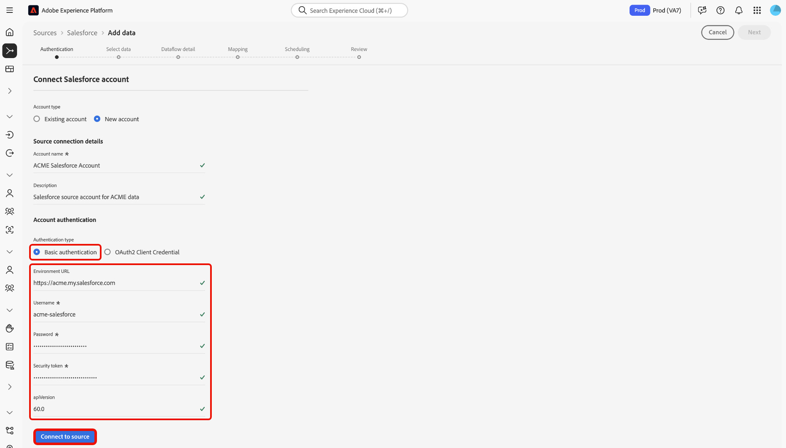

# Conectar sua conta do [!DNL Salesforce] à Experience Platform usando a interface

Este tutorial fornece etapas sobre como conectar sua conta do [!DNL Salesforce] e trazer seus dados do CRM para a Adobe Experience Platform usando a interface do usuário do Experience Platform.

## Introdução

Este tutorial requer uma compreensão funcional dos seguintes componentes do Experience Platform:

* [[!DNL Experience Data Model (XDM)] Sistema](../../../../../xdm/home.md): a estrutura padronizada pela qual o Experience Platform organiza os dados de experiência do cliente.
   * [Noções básicas sobre a composição de esquema](../../../../../xdm/schema/composition.md): saiba mais sobre os blocos de construção básicos de esquemas XDM, incluindo princípios-chave e práticas recomendadas na composição de esquema.
   * [Tutorial do Editor de esquemas](../../../../../xdm/tutorials/create-schema-ui.md): saiba como criar esquemas personalizados usando a interface do Editor de esquemas.
* [[!DNL Real-Time Customer Profile]](../../../../../profile/home.md): Fornece um perfil de consumidor unificado em tempo real com base em dados agregados de várias fontes.

Se você já tiver uma conta autenticada do [!DNL Salesforce], ignore o restante deste documento e prossiga para o tutorial em [configurando um fluxo de dados para dados do CRM](../../dataflow/crm.md).

### Coletar credenciais necessárias {#gather-required-credentials}

A origem [!DNL Salesforce] dá suporte à autenticação básica e à Credencial do Cliente OAuth2.

>[!BEGINTABS]

>[!TAB Autenticação básica]

Você deve fornecer valores para as credenciais a seguir para conectar sua conta do [!DNL Salesforce] usando autenticação básica.

| Credencial | Descrição |
| --- | --- |
| URL do ambiente | A URL da instância de origem [!DNL Salesforce]. O formato da URL do ambiente é `https://[domain].my.salesforce.com`. |
| Nome de usuário | O nome de usuário da conta de usuário [!DNL Salesforce]. |
| Senha | A senha da conta de usuário [!DNL Salesforce]. |
| Token de segurança | O token de segurança para a conta de usuário [!DNL Salesforce]. |
| Versão da API | (Opcional) A versão da API REST da instância [!DNL Salesforce] que você está usando. O valor da versão da API deve ser formatado com um decimal. Por exemplo, se você estiver usando a versão da API `52`, será necessário inserir o valor como `52.0`. Se esse campo ficar em branco, o Experience Platform usará automaticamente a versão mais recente disponível. |

Para obter mais informações sobre autenticação, consulte [este [!DNL Salesforce] guia de autenticação](https://developer.salesforce.com/docs/atlas.en-us.api_rest.meta/api_rest/quickstart_oauth.htm).

>[!TAB Credencial do Cliente OAuth2]

Você deve fornecer valores para as credenciais a seguir para conectar sua conta do [!DNL Salesforce] usando a Credencial do Cliente OAuth2.

| Credencial | Descrição |
| --- | --- |
| URL do ambiente | A URL da instância de origem [!DNL Salesforce]. O formato da URL do ambiente é `https://[domain].my.salesforce.com`. |
| ID de cliente | A ID do cliente é usada em conjunto com o segredo do cliente como parte da autenticação OAuth2. Juntos, a ID do cliente e o segredo do cliente permitem que o aplicativo opere em nome da sua conta, identificando o aplicativo no [!DNL Salesforce]. |
| Segredo do cliente | O segredo do cliente é usado em conjunto com a ID do cliente como parte da autenticação OAuth2. Juntos, a ID do cliente e o segredo do cliente permitem que o aplicativo opere em nome da sua conta, identificando o aplicativo no [!DNL Salesforce]. |
| Versão da API | A versão da API REST da instância [!DNL Salesforce] que você está usando. O valor da versão da API deve ser formatado com um decimal. Por exemplo, se você estiver usando a versão da API `52`, será necessário inserir o valor como `52.0`. Se esse campo ficar em branco, o Experience Platform usará automaticamente a versão mais recente disponível. |

Para obter mais informações sobre como usar o OAuth para [!DNL Salesforce], leia o [[!DNL Salesforce] guia sobre Fluxos de Autorização do OAuth](https://help.salesforce.com/s/articleView?id=sf.remoteaccess_oauth_flows.htm&amp;type=5).

>[!ENDTABS]

Depois de obter as credenciais necessárias, você poderá seguir as etapas abaixo para conectar sua conta do [!DNL Salesforce] à Experience Platform.

## Conectar sua conta do [!DNL Salesforce]

Na interface do Experience Platform, selecione **[!UICONTROL Fontes]** na navegação à esquerda para acessar o espaço de trabalho [!UICONTROL Fontes]. Você pode selecionar a categoria apropriada no catálogo no lado esquerdo da tela. Como alternativa, você pode encontrar a fonte específica com a qual deseja trabalhar usando a opção de pesquisa.

Selecione **[!DNL Salesforce]** na categoria *[!UICONTROL CRM]* e selecione **[!UICONTROL Adicionar dados]**.

>[!TIP]
>
>As origens no catálogo de origens exibem a opção **[!UICONTROL Configurar]** quando uma determinada origem ainda não tem uma conta autenticada. Quando uma conta autenticada existir, esta opção será alterada para **[!UICONTROL Adicionar dados]**.

A página **[!UICONTROL Conectar-se ao Salesforce]** é exibida. Nesta página, você pode usar credenciais novas ou existentes.

### Usar uma conta existente

Para usar uma conta existente, selecione **[!UICONTROL Conta existente]** e, em seguida, selecione a conta que deseja usar na lista exibida. Quando terminar, selecione **[!UICONTROL Avançar]** para continuar.

### Criar uma nova conta

Para criar uma nova conta, selecione **[!UICONTROL Nova conta]** e forneça um nome e uma descrição para sua nova conta [!DNL Salesforce].

Em seguida, selecione o tipo de autenticação que deseja usar para a nova conta.

>[!BEGINTABS]

>[!TAB Autenticação básica]

Para autenticação básica, selecione **[!UICONTROL Autenticação básica]** e forneça valores para as seguintes credenciais:

* URL do ambiente
* Nome de usuário
* Senha
* Versão da API (opcional)

Quando terminar, selecione **[!UICONTROL Conectar à origem]**.

>[!TAB Credencial do Cliente OAuth2]

Para a Credencial do cliente OAuth 2, selecione **[!UICONTROL Credencial do cliente OAuth2]** e forneça valores para as seguintes credenciais:

* URL do ambiente
* ID de cliente
* Segredo do cliente
* Versão da API

Quando terminar, selecione **[!UICONTROL Conectar à origem]**.

>[!ENDTABS]

### Ignorar pré-visualização de dados de amostra {#skip-preview-of-sample-data}

Durante a etapa de seleção de dados, você pode encontrar um tempo limite ao assimilar tabelas ou arquivos de dados grandes. Você pode ignorar a visualização de dados para contornar o tempo limite e ainda visualizar o esquema, embora sem dados de amostra. Para ignorar a visualização de dados, habilite a opção **[!UICONTROL Ignorar visualização de dados de amostra]**.

O restante do workflow permanecerá o mesmo. O único problema é que ignorar a pré-visualização de dados pode impedir que campos calculados e obrigatórios sejam validados automaticamente durante a etapa de mapeamento e, em seguida, será necessário validar manualmente esses campos durante o mapeamento.

## Próximas etapas

Seguindo este tutorial, você estabeleceu uma conexão com sua conta do [!DNL Salesforce]. Agora você pode seguir para o próximo tutorial e [configurar um fluxo de dados para trazer dados para o  [!DNL Experience Platform]](../../dataflow/crm.md).
