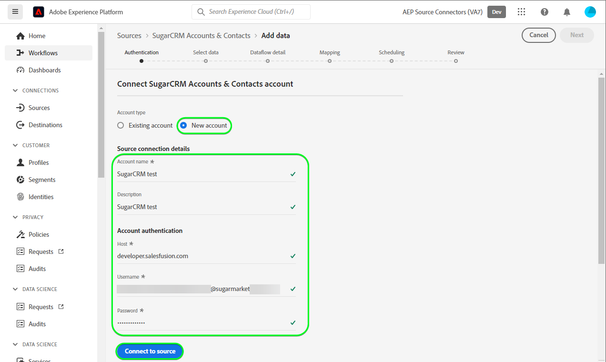
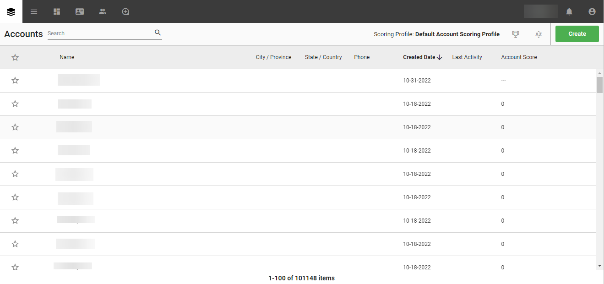

# (Beta) Criar um [!DNL SugarCRM Accounts & Contacts] conexão de origem na interface

>[!NOTE]
>
>A variável [!DNL SugarCRM Accounts & Contacts] a fonte está na versão beta. Consulte a [visão geral das origens](../../../../home.md#terms-and-conditions) para obter mais informações sobre o uso de fontes rotuladas como beta.

Este tutorial fornece etapas para a criação de um [!DNL SugarCRM Accounts & Contacts] conexão de origem usando a interface do usuário do Adobe Experience Platform.

## Introdução

Este tutorial requer um entendimento prático dos seguintes componentes do Experience Platform:

* [[!DNL Experience Data Model (XDM)] Sistema](../../../../../xdm/home.md): o quadro normalizado pelo qual [!DNL Experience Platform] organiza os dados de experiência do cliente.
   * [Noções básicas da composição do esquema](../../../../../xdm/schema/composition.md): saiba mais sobre os componentes básicos dos esquemas XDM, incluindo princípios fundamentais e práticas recomendadas na composição do esquema.
   * [Tutorial do Editor de esquemas](../../../../../xdm/tutorials/create-schema-ui.md): saiba como criar esquemas personalizados usando a interface do Editor de esquemas.
* [[!DNL Real-Time Customer Profile]](../../../../../profile/home.md): fornece um perfil de consumidor unificado em tempo real com base em dados agregados de várias fontes.

Se você já tiver um [!DNL SugarCRM] conta, você pode ignorar o restante deste documento e prosseguir para o tutorial em [configuração de um fluxo de dados](../../dataflow/crm.md).

### Coletar credenciais necessárias

Para se conectar [!DNL SugarCRM Accounts & Contacts] Para o Platform, você deve fornecer valores para as seguintes propriedades de conexão:

| Credencial | Descrição | Exemplo |
| --- | --- | --- |
| `Host` | O ponto de extremidade da API do SugarCRM ao qual a origem se conecta. | `developer.salesfusion.com` |
| `Username` | Seu nome de usuário da conta de desenvolvedor do SugarCRM. | `abc.def@example.com@sugarmarketdemo000.com` |
| `Password` | A senha da sua conta de desenvolvedor do SugarCRM. | `123456789` |

### Criar um esquema da Platform

Antes de criar uma [!DNL SugarCRM] conexão de origem, você também deve garantir que primeiro crie um esquema da Platform para usar em sua origem. Veja o tutorial sobre [criação de um schema do Platform](../../../../../xdm/schema/composition.md) para obter etapas abrangentes sobre como criar um schema.

A variável [!DNL SugarCRM Accounts & Contacts] O é compatível com várias APIs. Isso significa que é necessário criar um esquema separado, dependendo do tipo de objeto que você está utilizando. Consulte os exemplos abaixo para os esquemas de contas e contatos:

>[!BEGINTABS]

>[!TAB Contas]

>[!TAB Contatos]

>[!ENDTABS]

## Conecte seu [!DNL SugarCRM Accounts & Contacts] account

Na interface do usuário da Platform, selecione **[!UICONTROL Origens]** na barra de navegação esquerda, para acessar a [!UICONTROL Origens] espaço de trabalho. A variável [!UICONTROL Catálogo] exibe uma variedade de fontes com as quais você pode criar uma conta.

Você pode selecionar a categoria apropriada no catálogo no lado esquerdo da tela. Como alternativa, você pode encontrar a fonte específica com a qual deseja trabalhar usando a opção de pesquisa.

No *CRM* categoria, selecione **[!UICONTROL Contas e Contatos do SugarCRM]** e selecione **[!UICONTROL Adicionar dados]**.

A variável **[!UICONTROL Conectar contas e conta de contatos do SugarCRM]** é exibida. Nesta página, você pode usar credenciais novas ou existentes.

### Conta existente

Para usar uma conta existente, selecione a variável [!DNL SugarCRM Accounts & Contacts] conta com a qual deseja criar um novo fluxo de dados e selecione **[!UICONTROL Próxima]** para continuar.

### Nova conta

Se estiver criando uma nova conta, selecione **[!UICONTROL Nova conta]** e forneça um nome, uma descrição opcional e suas credenciais. Quando terminar, selecione **[!UICONTROL Conectar à origem]** e aguarde algum tempo para estabelecer a nova conexão.

### Selecionar dados

Finalmente, você deve selecionar o tipo de objeto que deseja assimilar na Platform.

| Tipo de objeto | Descrição |
| --- | --- |
| `Accounts` | As empresas com as quais sua organização tem um relacionamento. |
| `Contacts` | As pessoas individuais com as quais sua organização tem um relacionamento estabelecido. |

>[!BEGINTABS]

>[!TAB Contas]

>[!TAB Contatos]

>[!ENDTABS]

## Próximas etapas

Ao seguir este tutorial, você estabeleceu uma conexão com o seu [!DNL SugarCRM Accounts & Contacts] conta. Agora você pode seguir para o próximo tutorial e [configurar um fluxo de dados para trazer dados para a Platform](../../dataflow/crm.md).

## Recursos adicionais

As seções abaixo fornecem recursos adicionais que você pode consultar ao usar o [!DNL SugarCRM] origem.

### Medidas de proteção {#guardrails}

A variável [!DNL SugarCRM] As taxas de limitação da API são de 90 chamadas por minuto ou 2000 chamadas por dia, o que ocorrer primeiro. No entanto, essa restrição foi contornada adicionando um parâmetro na especificação da conexão que atrasará o tempo de solicitação para que o limite da taxa nunca seja atingido.

### Validação {#validation}

Para validar se você configurou corretamente a origem e [!DNL SugarCRM Accounts & Contacts] Os dados do estão sendo assimilados, siga as etapas abaixo:

* Na interface do usuário da Platform, selecione **[!UICONTROL Exibir fluxos de dados]** ao lado da variável [!DNL SugarCRM Accounts & Contacts] no catálogo de origens. Em seguida, selecione **[!UICONTROL Visualizar conjunto de dados]** para verificar os dados assimilados.

* Dependendo do tipo de objeto com o qual você está trabalhando, é possível verificar os dados agregados em relação às contagens visíveis na [!DNL SugarMarket] Páginas de contas ou contatos abaixo:

>[!BEGINTABS]

>[!TAB Contas]

>[!TAB Contatos]

>[!ENDTABS]

>[!NOTE]
>
>A variável [!DNL SugarMarket] As páginas não incluem as contagens de objetos excluídos. No entanto, os dados recuperados por meio dessa fonte também incluirão a contagem de excluídos, que seria marcada com um sinalizador excluído.