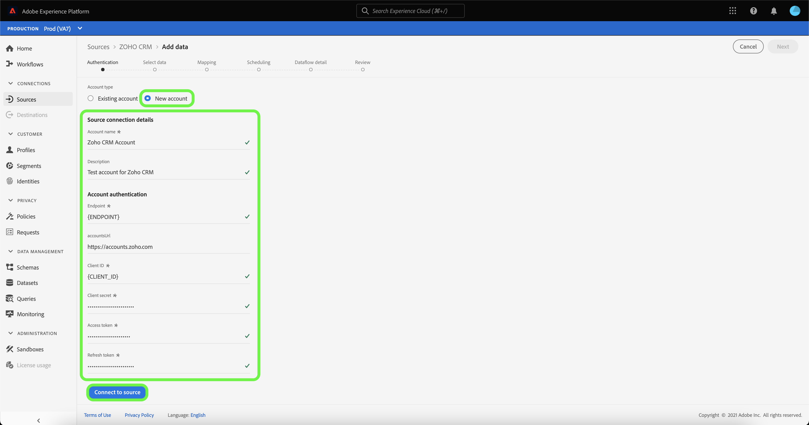

# Crie um [!DNL Zoho CRM] conexão de origem na interface do usuário

>[!NOTE]
>
> O [!DNL Zoho CRM] A fonte está em beta. Consulte a [Visão geral das fontes](../../../../home.md#terms-and-conditions) para obter mais informações sobre o uso de conectores com rótulo beta.

Os conectores de origem no Adobe Experience Platform oferecem a capacidade de assimilar dados de CRM de origem externa de acordo com a programação. Este tutorial fornece etapas para criar um [!DNL Zoho CRM] conector de origem usando o [!DNL Platform] interface do usuário.

## Introdução

Este tutorial requer uma compreensão funcional dos seguintes componentes do Adobe Experience Platform:

* [[!DNL Experience Data Model (XDM)] Sistema](../../../../../xdm/home.md): O quadro normalizado pelo qual [!DNL Experience Platform] organiza os dados de experiência do cliente.
   * [Noções básicas da composição do schema](../../../../../xdm/schema/composition.md): Saiba mais sobre os elementos básicos dos esquemas XDM, incluindo princípios-chave e práticas recomendadas na composição do schema.
   * [Tutorial do Editor de esquemas](../../../../../xdm/tutorials/create-schema-ui.md): Saiba como criar esquemas personalizados usando a interface do Editor de esquemas.
* [[!DNL Real-time Customer Profile]](../../../../../profile/home.md): Fornece um perfil de consumidor unificado e em tempo real com base em dados agregados de várias fontes.

Se você já tiver um [!DNL Zoho CRM] , você pode ignorar o restante deste documento e prosseguir para o tutorial em [configuração de um fluxo de dados](../../dataflow/crm.md).

### Obter credenciais necessárias

Para se conectar [!DNL Zoho CRM] para Plataforma, você deve fornecer valores para as seguintes propriedades de conexão:

| Credencial | Descrição |
| --- | --- |
| Endpoint | O terminal da [!DNL Zoho CRM] servidor para o qual você está fazendo sua solicitação. |
| URL de contas | O URL da conta é usado para gerar seu acesso e atualizar tokens. O URL deve ser específico de domínio. |
| ID do cliente | A ID do cliente que corresponde ao seu [!DNL Zoho CRM] conta do usuário. |
| Segredo do cliente | O segredo do cliente que corresponde ao seu [!DNL Zoho CRM] conta do usuário. |
| Token de acesso | O token de acesso autoriza o acesso seguro e temporário ao seu [!DNL Zoho CRM] conta. |
| Atualizar Token | Um token de atualização é um token usado para gerar um novo token de acesso depois que o token de acesso expirar. |

Para obter mais informações sobre essas credenciais, consulte a documentação em [[!DNL Zoho CRM] autenticação](https://www.zoho.com/crm/developer/docs/api/v2/oauth-overview.html).

## Conecte seu [!DNL Zoho CRM] account

Depois de reunir suas credenciais necessárias, siga as etapas abaixo para vincular seus [!DNL Zoho CRM] para [!DNL Platform].

Na interface do usuário da plataforma, selecione **[!UICONTROL Fontes]** na barra de navegação esquerda para acessar o [!UICONTROL Fontes] espaço de trabalho. O [!UICONTROL Catálogo] exibe uma variedade de fontes com as quais você pode criar uma conta.

Você pode selecionar a categoria apropriada no catálogo no lado esquerdo da tela. Como alternativa, você pode encontrar a fonte específica com a qual deseja trabalhar usando a opção de pesquisa.

Em [!UICONTROL CRM] categoria , selecione **[!UICONTROL Zoho CRM]** e selecione **[!UICONTROL Adicionar dados]**.

O **[!UICONTROL Conta Connect Zoho CRM]** será exibida. Nesta página, você pode usar novas credenciais ou credenciais existentes.

### Conta existente

Para usar uma conta existente, selecione a [!DNL Zoho CRM] conta com a qual deseja criar um novo fluxo de dados e selecione **[!UICONTROL Próximo]** para continuar.

### Nova conta

Se estiver criando uma nova conta, selecione **[!UICONTROL Nova conta]** e forneça um nome, uma descrição opcional e [!DNL Zoho CRM] credenciais. Quando terminar, selecione **[!UICONTROL Conectar-se à origem]** e, em seguida, permitir que a nova conexão seja estabelecida.

>[!TIP]
>
>O domínio do URL da conta deve corresponder ao local de domínio apropriado. A seguir estão os vários domínios e os URLs de contas correspondentes:<ul><li>Estados Unidos: https://accounts.zoho.com</li><li>Austrália: https://accounts.zoho.com.au</li><li>Europa: https://accounts.zoho.eu</li><li>Índia: https://accounts.zoho.in</li><li>China: https://accounts.zoho.com.cn</li></ul>

## Próximas etapas

Ao seguir este tutorial, você estabeleceu uma conexão com seu [!DNL Zoho CRM] conta. Agora você pode continuar para o próximo tutorial e [configurar um fluxo de dados para trazer dados para a plataforma](../../dataflow/crm.md).
