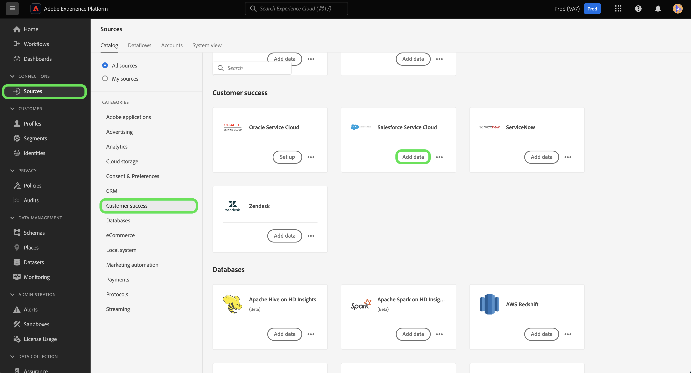

# Conecte seu [!DNL Salesforce Service Cloud] conta para Experience Platform usando a interface do usuário

Este tutorial fornece etapas sobre como conectar seus [!DNL Salesforce Service Cloud] e traga seus dados de sucesso do cliente para a Adobe Experience Platform usando a interface do Experience Platform.

## Introdução

Este tutorial requer um entendimento prático dos seguintes componentes do Experience Platform:

* [[!DNL Experience Data Model (XDM)] Sistema](../../../../../xdm/home.md): a estrutura padronizada pela qual o Experience Platform organiza os dados de experiência do cliente.
   * [Noções básicas da composição do esquema](../../../../../xdm/schema/composition.md): saiba mais sobre os componentes básicos dos esquemas XDM, incluindo princípios fundamentais e práticas recomendadas na composição do esquema.
   * [Tutorial do Editor de esquemas](../../../../../xdm/tutorials/create-schema-ui.md): saiba como criar esquemas personalizados usando a interface do Editor de esquemas.
* [[!DNL Real-Time Customer Profile]](../../../../../profile/home.md): fornece um perfil de consumidor unificado em tempo real com base em dados agregados de várias fontes.

Se você já tiver um [!DNL Salesforce Service Cloud] conexão, você pode ignorar o restante deste documento e prosseguir para o tutorial em [configuração de um fluxo de dados para o sucesso de um cliente](../../dataflow/customer-success.md)

### Coletar credenciais necessárias

Para acessar seu [!DNL Salesforce Service Cloud] conta no Experience Platform, você deve fornecer os seguintes valores:

| Credencial | Descrição |
| --- | --- |
| `environmentUrl` | O URL do [!DNL Salesforce Service Cloud] instância de origem. |
| `username` | O nome de usuário para o [!DNL Salesforce Service Cloud] conta de usuário. |
| `password` | A senha para o [!DNL Salesforce Service Cloud] conta de usuário. |
| `securityToken` | O token de segurança para o [!DNL Salesforce Service Cloud] conta de usuário. |
| `apiVersion` | (Opcional) A versão da API REST do [!DNL Salesforce Service Cloud] instância que você está usando. Se esse campo ficar em branco, o Experience Platform usará automaticamente a versão mais recente disponível. |

Para obter mais informações sobre autenticação, consulte [este [!DNL Salesforce] guia de autenticação](https://developer.salesforce.com/docs/atlas.en-us.api_rest.meta/api_rest/quickstart_oauth.htm).

## Conecte seu [!DNL Salesforce Service Cloud] account

Depois de obter as credenciais necessárias, siga as etapas abaixo para vincular [!DNL Salesforce] conta para Experience Platform.

Na interface do usuário da Platform, selecione **[!UICONTROL Origens]** na navegação à esquerda, para acessar o espaço de trabalho de fontes. A variável *[!UICONTROL Catálogo]* exibe uma variedade de fontes disponíveis no catálogo de fontes do Experience Platform.

Você pode selecionar a categoria apropriada no catálogo no lado esquerdo da tela. Como alternativa, você pode encontrar uma fonte específica usando a opção de pesquisa.

Selecionar **[!UICONTROL Sucesso do cliente]** na lista de categorias de origens e selecione **[!UICONTROL Adicionar dados]** do [!DNL Salesforce Service Cloud] cartão.

A variável **[!UICONTROL Conectar-se à Salesforce Service Cloud]** é exibida. Nesta página, você pode usar credenciais novas ou existentes.

>[!BEGINTABS]

>[!TAB Usar uma conta existente da Salesforce Service Cloud]

Para usar uma conta existente, selecione **[!UICONTROL Conta existente]** e, em seguida, selecione a conta que deseja usar na lista exibida. Quando terminar, selecione **[!UICONTROL Próxima]** para continuar.

>[!TAB Criar uma nova conta da Salesforce Service Cloud]

Para usar uma nova conta, selecione **[!UICONTROL Nova conta]** e forneça um nome, uma descrição e sua [!DNL Salesforce Service Cloud] credenciais de autenticação. Quando terminar, selecione **[!UICONTROL Conectar à origem]** e aguarde alguns segundos para que a nova conexão seja estabelecida.

>[!ENDTABS]

## Próximas etapas

Ao seguir este tutorial, você estabeleceu uma conexão com o seu [!DNL Salesforce Service Cloud] conta. Agora você pode seguir para o próximo tutorial e [configurar um fluxo de dados para trazer os dados de sucesso do cliente para o Experience Platform](../../dataflow/customer-success.md).
