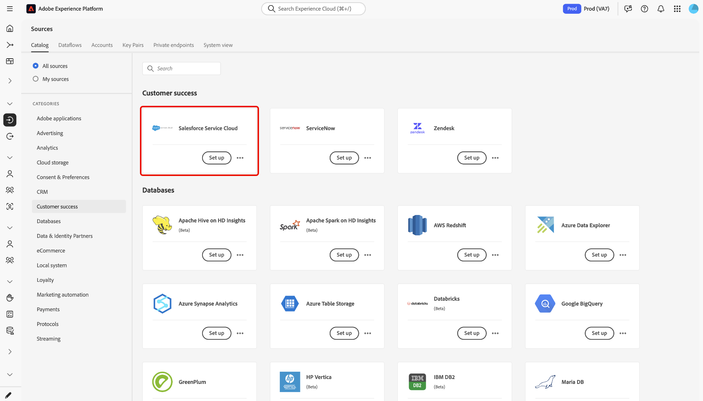

# Conectar sua conta do [!DNL Salesforce Service Cloud] à Experience Platform usando a interface

Siga este guia passo a passo para conectar facilmente sua conta do [!DNL Salesforce Service Cloud] e importar seus dados de sucesso do cliente para o Adobe Experience Platform.

## Introdução

Este tutorial requer uma compreensão funcional dos seguintes componentes do Experience Platform:

* [[!DNL Experience Data Model (XDM)] Sistema](../../../../../xdm/home.md): a estrutura padronizada pela qual o Experience Platform organiza os dados de experiência do cliente.
   * [Noções básicas sobre a composição de esquema](../../../../../xdm/schema/composition.md): saiba mais sobre os blocos de construção básicos de esquemas XDM, incluindo princípios-chave e práticas recomendadas na composição de esquema.
   * [Tutorial do Editor de esquemas](../../../../../xdm/tutorials/create-schema-ui.md): saiba como criar esquemas personalizados usando a interface do Editor de esquemas.
* [[!DNL Real-Time Customer Profile]](../../../../../profile/home.md): Fornece um perfil de consumidor unificado em tempo real com base em dados agregados de várias fontes.

Se você já tiver uma conexão válida do [!DNL Salesforce Service Cloud], ignore o restante deste documento e prossiga para o tutorial em [configurando um fluxo de dados para o sucesso de um cliente](../../dataflow/customer-success.md)

### Coletar credenciais necessárias

Leia o [guia de autenticação](../../../../connectors/customer-success/salesforce-service-cloud.md#credentials) para obter mais informações sobre como recuperar suas credenciais.

## Conectar sua conta do [!DNL Salesforce Service Cloud]

Na interface do Experience Platform, selecione **[!UICONTROL Sources]** na navegação à esquerda para acessar o espaço de trabalho [!UICONTROL Sources]. Você pode selecionar a categoria apropriada no catálogo no lado esquerdo da tela. Como alternativa, você pode encontrar a fonte específica com a qual deseja trabalhar usando a opção de pesquisa.

Selecione **[!DNL Salesforce Service Cloud]** na categoria *[!UICONTROL Customer success]* e selecione **[!UICONTROL Add data]**.

>[!TIP]
>
>As origens no catálogo de origens exibem a opção **[!UICONTROL Set up]** quando uma determinada origem ainda não tem uma conta autenticada. Quando uma conta autenticada existir, esta opção mudará para **[!UICONTROL Add data]**.

A página **[!UICONTROL Connect to Salesforce Service Cloud]** é exibida. Nesta página, você pode usar credenciais novas ou existentes.

### Usar uma conta existente

Para usar uma conta existente, selecione **[!UICONTROL Existing account]** e, em seguida, selecione a conta desejada na lista exibida. Quando terminar, selecione **[!UICONTROL Next]** para continuar.

### Criar uma nova conta

Para criar uma nova conta, selecione **[!UICONTROL New account]** e forneça um nome e uma descrição para sua nova conta [!DNL Salesforce Service Cloud]. Em seguida, selecione **[!UICONTROL OAuth2 Client Credential]** e forneça valores para as seguintes credenciais:

* URL do ambiente
* ID de cliente
* Segredo do cliente
* Versão da API

Quando terminar, selecione **[!UICONTROL Connect to source]**.

## Próximas etapas

Seguindo este tutorial, você estabeleceu uma conexão com sua conta do [!DNL Salesforce Service Cloud]. Agora você pode seguir para o próximo tutorial e [configurar um fluxo de dados para trazer os dados de Sucesso do cliente para a Experience Platform](../../dataflow/customer-success.md).
