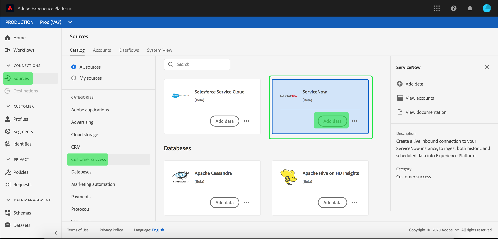

# Criar uma conexão de origem [!DNL ServiceNow] na interface

Os conectores do Source no Adobe Experience Platform fornecem a capacidade de assimilar dados obtidos externamente de forma programada. Este tutorial fornece etapas para a criação de um conector de origem [!DNL ServiceNow] usando a interface do usuário [!DNL Experience Platform].

## Introdução

Este tutorial requer uma compreensão funcional dos seguintes componentes do Adobe Experience Platform:

* [[!DNL Experience Data Model (XDM)] Sistema](../../../../../xdm/home.md): a estrutura padronizada pela qual o [!DNL Experience Platform] organiza os dados de experiência do cliente.
   * [Noções básicas sobre a composição de esquema](../../../../../xdm/schema/composition.md): saiba mais sobre os blocos de construção básicos de esquemas XDM, incluindo princípios-chave e práticas recomendadas na composição de esquema.
   * [Tutorial do Editor de esquemas](../../../../../xdm/tutorials/create-schema-ui.md): saiba como criar esquemas personalizados usando a interface do Editor de esquemas.
* [[!DNL Real-Time Customer Profile]](../../../../../profile/home.md): Fornece um perfil de consumidor unificado em tempo real com base em dados agregados de várias fontes.

Se você já tiver uma conexão [!DNL ServiceNow] válida, ignore o restante deste documento e prossiga para o tutorial em [configurando um fluxo de dados](../../dataflow/customer-success.md)

### Coletar credenciais necessárias

Para acessar sua conta do [!DNL ServiceNow] em [!DNL Experience Platform], você deve fornecer os seguintes valores:

| Credencial | Descrição |
| ---------- | ----------- |
| `endpoint` | O ponto de extremidade do servidor [!DNL ServiceNow]. |
| `username` | O nome de usuário usado para conexão com o servidor [!DNL ServiceNow] para autenticação. |
| `password` | A senha para conexão com o servidor [!DNL ServiceNow] para autenticação. |

Para obter mais informações sobre a introdução, consulte [este [!DNL ServiceNow] documento](https://developer.servicenow.com/app.do#!/rest_api_doc?v=newyork&id=r_TableAPI-GET).

## Conectar sua conta do [!DNL ServiceNow]

Depois de obter as credenciais necessárias, siga as etapas abaixo para vincular sua conta do [!DNL ServiceNow] ao [!DNL Experience Platform].

Faça logon em [Adobe Experience Platform](https://platform.adobe.com) e selecione **[!UICONTROL Fontes]** na barra de navegação esquerda para acessar o espaço de trabalho **[!UICONTROL Fontes]**. A tela **[!UICONTROL Catálogo]** exibe uma variedade de fontes com as quais você pode criar uma conta.

Você pode selecionar a categoria apropriada no catálogo no lado esquerdo da tela. Como alternativa, você pode encontrar a fonte específica com a qual deseja trabalhar usando a opção de pesquisa.

Na categoria **[!UICONTROL Sucesso do cliente]**, selecione **[!UICONTROL ServiceNow]**. Se esta for a primeira vez que você usa este conector, selecione **[!UICONTROL Configurar]**. Caso contrário, selecione **[!UICONTROL Conectar origem]** para criar um novo conector [!DNL ServiceNow].

A página **[!UICONTROL Conectar-se ao ServiceNow]** é exibida. Nesta página, você pode usar credenciais novas ou existentes.

### Nova conta

Se você estiver usando novas credenciais, selecione **[!UICONTROL Nova conta]**. No formulário de entrada que aparece, forneça um nome, uma descrição opcional e suas credenciais do [!DNL ServiceNow]. Quando terminar, selecione **[!UICONTROL Conectar]** e aguarde algum tempo para que a nova conexão seja estabelecida.

### Conta existente

Para conectar uma conta existente, selecione a conta [!DNL ServiceNow] com a qual deseja se conectar e clique em **[!UICONTROL Avançar]** para continuar.

## Próximas etapas

Seguindo este tutorial, você estabeleceu uma conexão com sua conta do [!DNL ServiceNow]. Agora você pode seguir para o próximo tutorial e [configurar um fluxo de dados para trazer dados para o  [!DNL Experience Platform]](../../dataflow/customer-success.md).
