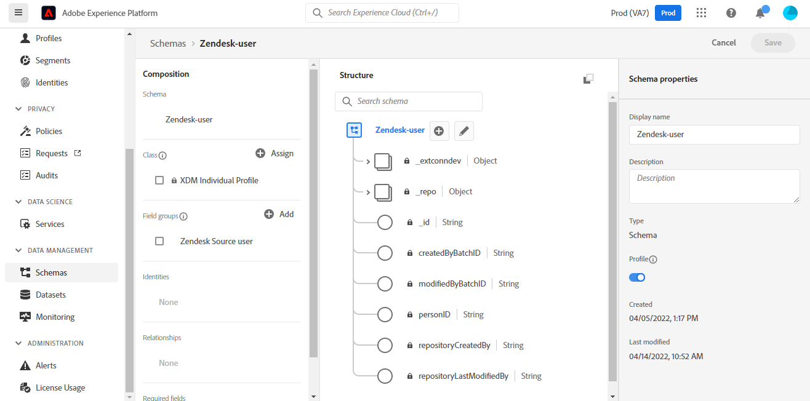
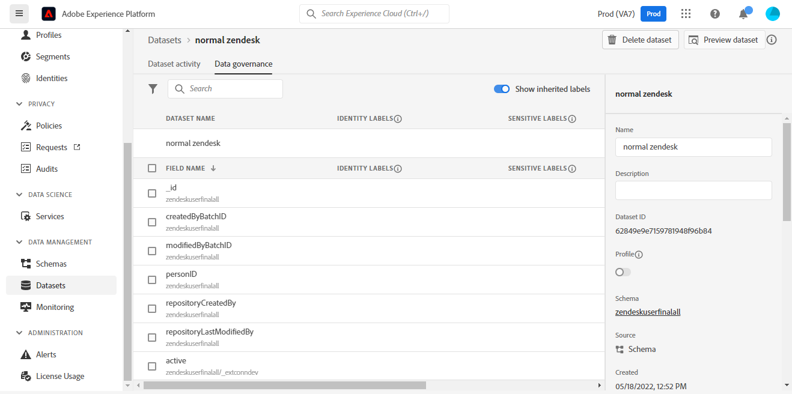

# (Beta) Criar um [!DNL Zendesk] conexão de origem na interface do usuário

>[!NOTE]
>
>O [!DNL Zendesk] A fonte está em beta. Consulte a [visão geral das fontes](../../../../home.md#terms-and-conditions) para obter mais informações sobre o uso de fontes com rótulo beta.

Este tutorial fornece etapas para criar um [!DNL Zendesk] conexão de origem usando a interface do usuário do Adobe Experience Platform.

## Introdução

Este tutorial requer uma compreensão funcional dos seguintes componentes do Adobe Experience Platform:

* [[!DNL Experience Data Model (XDM)] Sistema](../../../../../xdm/home.md): O quadro normalizado pelo qual [!DNL Experience Platform] organiza os dados de experiência do cliente.
   * [Noções básicas da composição do schema](../../../../../xdm/schema/composition.md): Saiba mais sobre os elementos básicos dos esquemas XDM, incluindo princípios-chave e práticas recomendadas na composição do schema.
   * [Tutorial do Editor de esquemas](../../../../../xdm/tutorials/create-schema-ui.md): Saiba como criar esquemas personalizados usando a interface do Editor de esquemas.
* [[!DNL Real-time Customer Profile]](../../../../../profile/home.md): Fornece um perfil de consumidor unificado e em tempo real com base em dados agregados de várias fontes.

### Obter credenciais necessárias

Para acessar o [!DNL Zendesk] na Platform, você deve fornecer valores para as seguintes credenciais:

| Credencial | Descrição | Exemplo |
| --- | --- | --- |
| Host | O domínio exclusivo específico da sua conta criado durante o processo de registro. | `https://yoursubdomain.zendesk.com` |
| Token de acesso | Token da API do Zendesk. | `0lZnClEvkJSTQ7olGLl7PMhVq99gu26GTbJtf` |

Para obter mais informações sobre como autenticar seu [!DNL Zendesk] na fonte, consulte o [[!DNL Zendesk] visão geral da fonte](../../../../connectors/customer-success/zendesk.md).

### Criar um esquema da Platform para [!DNL Zendesk]

Antes de criar um [!DNL Zendesk] na conexão de origem, você também deve garantir que primeiro crie um esquema da plataforma para usar na origem. Veja o tutorial em [criação de um schema da plataforma](../../../../../xdm/schema/composition.md) para obter etapas abrangentes sobre como criar um schema.

Para obter mais orientações sobre [!DNL Zendesk] schema necessário para o [!DNL Zendesk Search API], consulte o [limites](#limits) abaixo.

## Conecte seu [!DNL Zendesk] account

Na interface do usuário da plataforma, selecione **[!UICONTROL Fontes]** na barra de navegação esquerda para acessar o [!UICONTROL Fontes] espaço de trabalho. O [!UICONTROL Catálogo] exibe uma variedade de fontes com as quais você pode criar uma conta.

Você pode selecionar a categoria apropriada no catálogo no lado esquerdo da tela. Como alternativa, você pode encontrar a fonte específica com a qual deseja trabalhar usando a opção de pesquisa.

Em *Sucesso do cliente* categoria , selecione **[!UICONTROL Zendesk]** e selecione **[!UICONTROL Adicionar dados]**.

O **[!UICONTROL Conta do Zendesk]** será exibida. Nesta página, você pode usar novas credenciais ou credenciais existentes.

### Conta existente

Para usar uma conta existente, selecione a *Zendesk* conta com a qual deseja criar um novo fluxo de dados e selecione **[!UICONTROL Próximo]** para continuar.

### Nova conta

Se estiver criando uma nova conta, selecione **[!UICONTROL Nova conta]** e, em seguida, forneça um nome, uma descrição opcional e suas credenciais. Quando terminar, selecione **[!UICONTROL Conectar-se à origem]** e, em seguida, permitir que a nova conexão seja estabelecida.

### Selecionar dados

Depois que a origem é autenticada, a página é atualizada em uma árvore de esquema interativa que permite explorar e inspecionar a hierarquia de seus dados. Selecionar **[!UICONTROL Próximo]** para continuar.

## Próximas etapas

Ao seguir este tutorial, você autenticou e criou uma conexão de origem entre os [!DNL Zendesk] conta e plataforma. Agora você pode continuar para o próximo tutorial e [criar um fluxo de dados para trazer os dados de sucesso do cliente para a Platform](../../dataflow/customer-success.md).

## Recursos adicionais

As seções abaixo fornecem recursos adicionais que você pode consultar ao usar o [!DNL Zendesk] fonte.

### Validação {#validation}

As linhas gerais a seguir podem ser usadas para validar que você conectou seu [!DNL Zendesk] e que [!DNL Zendesk] Os perfis estão sendo assimilados no Platform.

Na interface do usuário da plataforma, selecione **[!UICONTROL Conjuntos de dados]** na navegação à esquerda para acessar o [!UICONTROL Conjuntos de dados] espaço de trabalho. O [!UICONTROL Atividade do conjunto de dados] exibe os detalhes das execuções.

Em seguida, selecione a ID de execução do fluxo de dados que deseja visualizar para ver detalhes específicos sobre a execução do fluxo de dados.

Para ver detalhes sobre o esquema, selecione **[!UICONTROL Governança de dados]**.

Finalmente, selecione **[!UICONTROL Visualizar conjunto de dados]** para exibir os dados que foram assimilados.

Você também pode verificar os dados da sua plataforma em relação aos dados da [!DNL Zendesk] > [!DNL Customers] página.

### Esquema do Zendesk

A tabela abaixo lista os mapeamentos compatíveis que devem ser configurados para o Zendesk.

>[!TIP]
>
>Consulte [API de pesquisa do Zendesk > Exportar resultados de pesquisa](https://developer.zendesk.com/api-reference/ticketing/ticket-management/search/#export-search-results) para obter mais informações sobre a API.

| Fonte | Tipo |
|---|---|
| `results.active` | Booleano |
| `results.alias` | String |
| `results.created_at` | String |
| `results.custom_role_id` | Número inteiro |
| `results.default_group_id` | Número inteiro |
| `results.details` | String |
| `results.email` | String |
| `results.external_id` | Número inteiro |
| `results.iana_time_zone` | String |
| `results.id` | Número inteiro |
| `results.last_login_at` | String |
| `results.locale` | String |
| `results.locale_id` | Número inteiro |
| `results.moderator` | Booleano |
| `results.name` | String |
| `results.notes` | String |
| `results.only_private_comments` | Booleano |
| `results.organization_id` | Número inteiro |
| `results.phone` | String |
| `results.photo` | String |
| `results.report_csv` | Booleano |
| `results.restricted_agent` | Booleano |
| `results.result_type` | String |
| `results.role` | String |
| `results.role_type` | Número inteiro |
| `results.shared` | Booleano |
| `results.shared_agent` | Booleano |
| `results.shared_phone_number` | Booleano |
| `results.signature` | String |
| `results.suspended` | Booleano |
| `results.ticket_restriction` | String |
| `results.time_zone` | String |
| `results.two_factor_auth_enabled` | Booleano |
| `results.updated_at` | String |
| `results.url` | String |
| `results.verified` | Booleano |

{style=&quot;table-layout:auto&quot;}

### Limites {#limits}

* O [API de pesquisa do Zendesk > Exportar resultados de pesquisa](https://developer.zendesk.com/api-reference/ticketing/ticket-management/search/#export-search-results) retorna no máximo 1000 registros por página.
   * O valor da variável ``filter[type]`` é definido como ``user`` e, portanto, a conexão do Zendesk retorna somente os usuários.
   * O número de resultados por página é gerenciado pela variável ``page[size]`` parâmetro. O valor é definido como ``100``. Isso é feito para reduzir o impacto das restrições de redução de velocidade definidas pelo Zendesk.
   * Consulte [Limites](https://developer.zendesk.com/api-reference/ticketing/ticket-management/search/#limits) e [Paginação](https://developer.zendesk.com/api-reference/ticketing/ticket-management/search/#pagination-1).
   * Também é possível fazer referência a [Paginação através de listas usando paginação de cursor](https://developer.zendesk.com/documentation/developer-tools/pagination/paginating-through-lists-using-cursor-pagination/).
