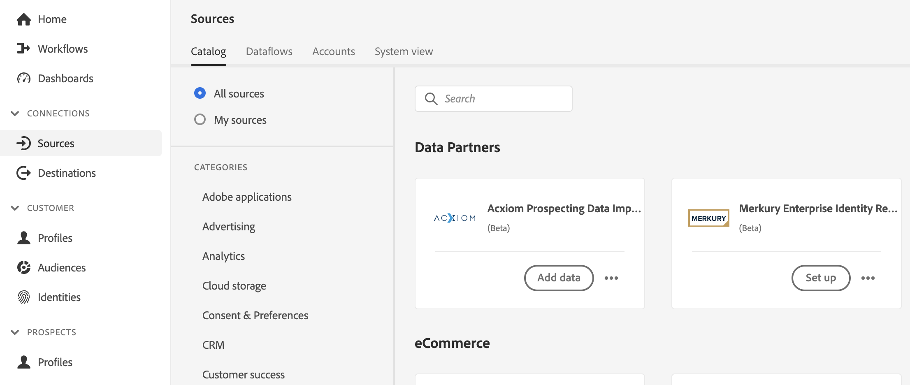

# Criar uma conexão e um fluxo de dados de origem [!DNL Acxiom Prospecting Data Import] na interface do usuário

A importação de dados de prospecção do [!DNL Acxiom] para o Adobe Real-Time Customer Data Platform é um processo para fornecer os públicos-alvo de prospecção mais produtivos possíveis. O [!DNL Acxiom] coleta dados primários da Real-Time CDP por meio de uma exportação segura e executa esses dados por meio de um sistema premiado de higiene e resolução de identidades. Isso produz um arquivo de dados a ser usado como uma lista de supressão. Esse arquivo de dados é comparado ao banco de dados global da Acxiom, o que permite que as listas de clientes potenciais sejam personalizadas para importação.

Você pode usar a origem [!DNL Acxiom] para recuperar e mapear respostas do serviço de prospecto Acxiom usando o Amazon S3 como ponto de partida.

Leia este tutorial para saber como criar uma conexão de origem e um fluxo de dados do [!DNL Acxiom Prospecting Data Import] usando a interface do usuário do Adobe Experience Platform.

## Pré-requisitos {#prerequisites}

Este tutorial requer uma compreensão funcional dos seguintes componentes do Experience Platform:

* [[!DNL Experience Data Model (XDM)] Sistema](../../../../../xdm/home.md): a estrutura padronizada pela qual o Experience Platform organiza os dados de experiência do cliente.
   * [Noções básicas sobre a composição de esquema](../../../../../xdm/schema/composition.md): saiba mais sobre os blocos de construção básicos de esquemas XDM, incluindo princípios-chave e práticas recomendadas na composição de esquema.
   * [Tutorial do Editor de esquemas](../../../../../xdm/tutorials/create-schema-ui.md): saiba como criar esquemas personalizados usando a interface do Editor de esquemas.
* [[!DNL Real-Time Customer Profile]](../../../../../profile/home.md): Fornece um perfil de consumidor unificado em tempo real com base em dados agregados de várias fontes.
* [[!DNL Prospect Profile]](../../../../../profile/ui/prospect-profile.md): Saiba como criar e usar um perfil de cliente potencial para coletar informações sobre clientes desconhecidos usando informações de terceiros.

### Coletar credenciais necessárias

Para acessar seu bucket no Experience Platform, você precisa fornecer valores válidos para as seguintes credenciais:

| Credencial | Descrição |
| --- | --- |
| Chave de autenticação [!DNL Acxiom] | A chave de autenticação. Você pode recuperar esse valor da equipe [!DNL Acxiom]. |
| [!DNL Amazon S3] chave de acesso | A ID da chave de acesso do seu bucket. Você pode recuperar esse valor da equipe [!DNL Acxiom]. |
| [!DNL Amazon S3] chave secreta | A ID da chave secreta para o seu bucket. Você pode recuperar esse valor da equipe [!DNL Acxiom]. |
| Nome do bucket | Esse é o seu bucket onde os arquivos serão compartilhados. Você pode recuperar esse valor da equipe [!DNL Acxiom]. |

>[!IMPORTANT]
>
>Você deve ter as permissões **[!UICONTROL Exibir Fontes]** e **[!UICONTROL Gerenciar Fontes]** habilitadas para sua conta a fim de conectar sua conta do [!DNL Acxiom] à Experience Platform. Entre em contato com o administrador do produto para obter as permissões necessárias. Para obter mais informações, leia o [guia da interface do usuário de controle de acesso](../../../../../access-control/ui/overview.md).

## Conectar sua conta do [!DNL Acxiom]

Na interface do usuário do Experience Platform, selecione **[!UICONTROL Fontes]** na barra de navegação esquerda para acessar o espaço de trabalho [!UICONTROL Fontes]. A tela [!UICONTROL Catálogo] exibe uma variedade de fontes com as quais você pode criar uma conta.

Você pode selecionar a categoria apropriada no catálogo no lado esquerdo da tela. Como alternativa, você pode encontrar a fonte específica com a qual deseja trabalhar usando a opção de pesquisa.

Na categoria **[!UICONTROL Parceiros de dados e identidade]**, selecione **[!UICONTROL Importação de dados de prospecção da Acxiom]** e **[!UICONTROL Configurar]**.

>[!TIP]
>
>Um cartão de origem que exibe **[!UICONTROL Adicionar dados]** significa que a origem já tem uma conta autenticada. Por outro lado, um cartão de origem que exibe **[!UICONTROL Configurar]** significa que você deve fornecer credenciais e criar uma nova conta para usar essa origem.

### Criar uma nova conta

Se você estiver usando novas credenciais, selecione **[!UICONTROL Nova conta]**. No formulário de entrada que aparece, forneça um nome, uma descrição opcional e suas credenciais do [!DNL Acxiom]. Quando terminar, selecione **[!UICONTROL Conectar à origem]** e aguarde algum tempo para que a nova conexão seja estabelecida.

| Credenciais | Descrição |
| --- | --- |
| Nome da conta | O nome da conta. |
| Descrição | (Opcional) Uma breve explicação da finalidade da conta. |
| Chave de autenticação [!DNL Acxiom] | A chave fornecida por [!DNL Acxiom] é necessária para a aprovação da conta. Deve corresponder ao valor correto para que uma conexão com o banco de dados possa ser estabelecida.  Essa chave deve ter 24 caracteres e pode incluir apenas: A-Z, a-z e 0-9. |
| Chave de acesso S3 | A chave de acesso S3 faz referência ao local do Amazon S3. Ele é fornecido pelo administrador quando as permissões de função do S3 são definidas. |
| Chave secreta S3 | A chave secreta S3 faz referência ao local do Amazon S3. Ele é fornecido pelo administrador quando as permissões de função do S3 são definidas. |
| s3SessionToken | (Opcional) O valor do token de autenticação ao se conectar ao S3. |
| serviceUrl | (Opcional) O local do URL a ser usado ao se conectar ao S3 em um local não padrão. |
| Nome do bucket | (Opcional) O nome do bucket do S3 configurado no S3 que serve como um caminho inicial na seleção de dados. |
| Caminho da pasta | Se os subdiretórios em um bucket forem usados, você também poderá especificar um caminho como um caminho inicial na seleção de dados. |

### Usar uma conta existente

Para usar uma conta existente, selecione **[!UICONTROL Conta existente]**.

Selecione uma conta na lista para ver os detalhes dessa conta. Depois de selecionar uma conta, selecione **[!UICONTROL Avançar]** para continuar.

## Selecionar dados

Selecione o arquivo que deseja assimilar do bucket e do subdiretório desejados. Uma visualização dos dados pode ser fornecida assim que o delimitador e o tipo de compactação forem definidos. Depois de selecionar o arquivo, selecione **[!UICONTROL Avançar]** para continuar.

>[!NOTE]
>
>Embora os tipos de arquivos JSON e Parquet estejam listados, não é necessário ou esperado que você os use durante o fluxo de trabalho de origem [!DNL Acxiom].

## Fornecer detalhes do conjunto de dados e do fluxo de dados

Em seguida, você deve fornecer informações sobre o conjunto de dados e o fluxo de dados.

### Detalhes do conjunto de dados

>[!BEGINTABS]

>[!TAB Usar um novo conjunto de dados]

Um conjunto de dados é uma construção de armazenamento e gerenciamento para uma coleção de dados, normalmente uma tabela, que contém um esquema (colunas) e campos (linhas). Os dados assimilados com sucesso na Experience Platform são mantidos no data lake como conjuntos de dados. Para usar um novo conjunto de dados, selecione **[!UICONTROL Novo conjunto de dados]**.

| Detalhes do novo conjunto de dados | Descrição |
| --- | --- |
| Nome do conjunto de dados de saída | O nome do novo conjunto de dados. |
| Descrição | (Opcional) Uma breve explicação da finalidade do conjunto de dados. |
| Esquema | Uma lista suspensa de esquemas que existem em sua organização. Você também pode criar seu próprio esquema antes do processo de configuração de origem. Para obter mais informações, leia o manual sobre [criação de esquema na interface](../../../../../xdm/tutorials/create-schema-ui.md). |

>[!TAB Usar um conjunto de dados existente]

Para usar um conjunto de dados existente, selecione **[!UICONTROL Conjunto de dados existente]**.

Você pode selecionar **[!UICONTROL Pesquisa avançada]** para exibir uma janela de todos os conjuntos de dados de sua organização, incluindo seus respectivos detalhes, como se eles estão habilitados para assimilação no Perfil do cliente em tempo real.

>[!ENDTABS]

### Detalhes do fluxo de dados

Durante esta etapa, se o conjunto de dados estiver habilitado para o Perfil, você poderá selecionar a opção **[!UICONTROL Conjunto de dados do perfil]** para habilitar seus dados para assimilação de Perfil. Você também pode habilitar o [!UICONTROL Diagnóstico de erros] e a [!UICONTROL Assimilação parcial].

* **Diagnóstico de Erro** - Selecione **Diagnóstico de erro** para instruir a origem a produzir o diagnóstico de erro que você poderá consultar posteriormente usando APIs. Para obter mais informações, leia a [visão geral do diagnóstico de erro](../../../../../ingestion/quality/error-diagnostics.md)
* **Habilitar Assimilação parcial** - Assimilação parcial em lote é a capacidade de assimilar dados que contenham erros, até um determinado limite. Com esse recurso, os usuários podem assimilar todos os dados corretos na Adobe Experience Platform com sucesso, enquanto todos os dados incorretos são armazenados em lote separadamente, juntamente com detalhes sobre o motivo da invalidade.  Para obter mais informações, leia a [Visão geral da assimilação parcial](../../../../../ingestion/batch-ingestion/partial.md)

| Configurações de fluxo de dados | Descrição |
| --- | --- |
| Nome do fluxo de dados | O nome do fluxo de dados.  Por padrão, esse campo usará o nome do arquivo que está sendo importado. |
| Descrição | (Opcional) Uma breve descrição do fluxo de dados. |
| Alertas | O Experience Platform pode produzir alertas baseados em eventos, nos quais os usuários podem assinar. Todas essas opções dependem de um fluxo de dados em execução para acioná-los.  Para obter mais informações, leia a [visão geral dos alertas](../../alerts.md) <ul><li>**Início da Execução do Fluxo de Dados de Fontes**: selecione este alerta para receber uma notificação quando a execução do fluxo de dados começar.</li><li>**Êxito na Execução do Fluxo de Dados de Fontes**: selecione este alerta para receber uma notificação se o fluxo de dados terminar sem erros.</li><li>**Falha na execução do fluxo de dados de fontes**: selecione este alerta para receber uma notificação se a execução do fluxo de dados terminar com erros.</li></ul> |

## Mapeamento

Use a interface de mapeamento para mapear os dados de origem para os campos de esquema apropriados antes de assimilar dados na Experience Platform.  Para obter mais informações, leia o [guia de mapeamento na interface](../../../../../data-prep/ui/mapping.md)

## Agendar a assimilação do fluxo de dados

Use a interface de programação para definir a programação de assimilação do fluxo de dados.

| Configuração de agendamento | Descrição |
| --- | --- |
| Frequência | Configure a frequência para indicar a frequência de execução do fluxo de dados. Você pode definir a frequência como: <ul><li>**Uma vez**: defina sua frequência como `once` para criar uma assimilação única. As configurações para intervalo e preenchimento retroativo não estão disponíveis ao criar um fluxo de dados de assimilação única. Por padrão, a frequência de agendamento é definida como uma vez.</li><li>**Minuto**: Defina sua frequência como `minute` para agendar seu fluxo de dados para assimilar dados por minuto.</li><li>**Hora**: Defina sua frequência como `hour` para agendar seu fluxo de dados para assimilar dados por hora.</li><li>**Dia**: Defina sua frequência como `day` para agendar seu fluxo de dados para assimilar dados por dia.</li><li>**Semana**: Defina sua frequência como `week` para agendar seu fluxo de dados para assimilar dados por semana.</li></ul> |
| Intervalo | Depois de selecionar uma frequência, você pode definir o intervalo para estabelecer o intervalo de tempo entre cada assimilação. Por exemplo, se você definir a frequência como dia e configurar o intervalo como 15, o fluxo de dados será executado a cada 15 dias. Você não pode definir o intervalo como zero. O valor mínimo de intervalo aceito para cada frequência é o seguinte:<ul><li>**Uma vez**: n/d</li><li>**Minuto**: 15</li><li>**Hora**: 1</li><li>**Dia**: 1</li><li>**Semana**: 1</li></ul> |
| Hora de início | O carimbo de data e hora da execução projetada, apresentado no fuso horário UTC. |
| Preenchimento retroativo | O preenchimento retroativo determina quais dados são assimilados inicialmente. Se o preenchimento retroativo estiver ativado, todos os arquivos atuais no caminho especificado serão assimilados durante a primeira assimilação agendada. Se o preenchimento retroativo estiver desativado, somente os arquivos carregados entre a primeira execução da assimilação e a hora de início serão assimilados. Os arquivos carregados antes da hora de início não serão assimilados. |

## Revisar seu fluxo de dados

Use a página de revisão para obter um resumo do seu fluxo de dados antes da assimilação. Os detalhes estão agrupados nas seguintes categorias:

* **Conexão** - Mostra o tipo de origem, o caminho relevante do arquivo de origem escolhido e a quantidade de colunas nesse arquivo de origem.
* **Atribuir campos de conjunto de dados e mapa** - Mostra em qual conjunto de dados os dados de origem estão sendo assimilados, incluindo o esquema ao qual o conjunto de dados pertence.
* **Agendamento** - Mostra o período, a frequência e o intervalo ativos do agendamento de assimilação.
Depois de revisar seu fluxo de dados, clique em Concluir e aguarde algum tempo para que o fluxo de dados seja criado.

## Próximas etapas

Ao seguir este tutorial, você criou com êxito um fluxo de dados para trazer dados em lote da sua origem [!DNL Acxiom] para a Experience Platform. Para obter recursos adicionais, consulte a documentação descrita abaixo.

### Monitorar seu fluxo de dados

Depois que o fluxo de dados for criado, você poderá monitorar os dados que estão sendo assimilados por meio dele para exibir informações sobre taxas de assimilação, sucesso e erros. Para obter mais informações sobre como monitorar o fluxo de dados, visite o tutorial em [monitoramento de contas e fluxos de dados na interface](../../monitor.md).

### Atualizar seu fluxo de dados

Para atualizar as configurações do agendamento de fluxos de dados, mapeamento e informações gerais, visite o tutorial em [atualizando fluxos de dados de fontes na interface](../../update-dataflows.md)

### Excluir seu fluxo de dados

Você pode excluir fluxos de dados que não são mais necessários ou que foram criados incorretamente usando a função **[!UICONTROL Excluir]** disponível no espaço de trabalho **[!UICONTROL Fluxos de Dados]**. Para obter mais informações sobre como excluir fluxos de dados, visite o tutorial em [excluindo fluxos de dados na interface](../../delete.md).

## Recursos adicionais {#additional-resources}

Distribuição e dados de público-alvo do [!DNL Acxiom]: https://www.acxiom.com/customer-data/audience-data-distribution/
