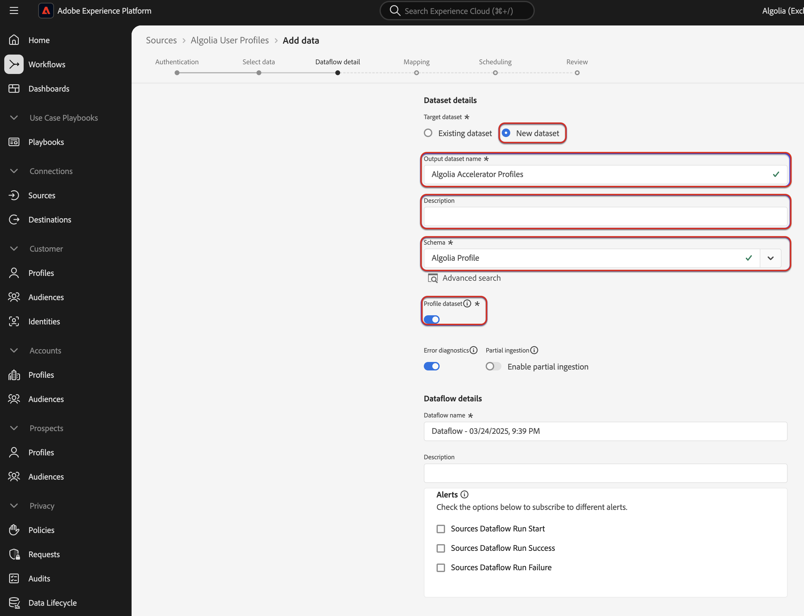

# Assimilar dados do [!DNL Algolia User Profiles] para a Experience Platform usando a interface do

Leia este tutorial para saber como assimilar dados de pagamentos de sua conta do [!DNL Algolia User Profiles] para a Adobe Experience Platform usando a interface do usuário.

## Introdução

>[!IMPORTANT]
>
>Antes de começar, verifique se você concluiu as etapas de pré-requisito descritas na [[!DNL Algolia User Profiles] visão geral](../../../../connectors/data-partners/algolia-user-profiles.md#prerequisites).

Este tutorial requer uma compreensão funcional dos seguintes componentes do Experience Platform:

* [[!DNL Experience Data Model (XDM)] Sistema](../../../../../xdm/home.md): a estrutura padronizada pela qual o Experience Platform organiza os dados de experiência do cliente.
   * [Noções básicas sobre a composição de esquema](../../../../../xdm/schema/composition.md): saiba mais sobre os blocos de construção básicos de esquemas XDM, incluindo princípios-chave e práticas recomendadas na composição de esquema.
   * [Tutorial do Editor de esquemas](../../../../../xdm/tutorials/create-schema-ui.md): saiba como criar esquemas personalizados usando a interface do Editor de esquemas.
* [[!DNL Real-Time Customer Profile]](../../../../../profile/home.md): Fornece um perfil de consumidor unificado em tempo real com base em dados agregados de várias fontes.
* [Fontes](../../../../home.md): o Experience Platform permite a assimilação de dados de várias fontes, ao mesmo tempo em que fornece a capacidade de estruturar, rotular e aprimorar os dados recebidos usando os serviços do Experience Platform.

### Coletar credenciais necessárias

Para conectar [!DNL Algolia] ao Experience Platform, você deve fornecer valores para as seguintes credenciais:

| Credencial | Descrição |
| --- | --- |
| ID do aplicativo | A ID do aplicativo [!DNL Algolia] é um identificador exclusivo atribuído à sua conta [!DNL Algolia]. |
| Chave de API | A Chave de API [!DNL Algolia] é uma credencial usada para autenticar e autorizar solicitações de API para os serviços de pesquisa e indexação de [!DNL Algolia]. |

Para obter mais informações sobre essas credenciais, consulte a [!DNL Algolia] [documentação de autenticação](https://www.algolia.com/doc/tools/cli/get-started/authentication/).

## Conectar sua conta do [!DNL Algolia]

Na interface do Experience Platform, selecione **[!UICONTROL Fontes]** na navegação à esquerda para acessar o espaço de trabalho *[!UICONTROL Fontes]*. Você pode selecionar a categoria apropriada no painel *[!UICONTROL Categorias]*. Como alternativa, você pode usar a barra de pesquisa para navegar até a fonte específica que deseja usar.

Para usar o [!DNL Algolia], selecione o cartão de origem **[!UICONTROL Algolia]** em *[!UICONTROL Parceiros de Dados e Identidade]* e selecione **[!UICONTROL Configurar]**.

>[!TIP]
>
>As origens no catálogo de origens exibem a opção **[!UICONTROL Configurar]** quando uma determinada origem ainda não tem uma conta autenticada. Quando uma conta autenticada existir, esta opção será alterada para **[!UICONTROL Adicionar dados]**.

## Autenticação

### Conta existente

Para usar uma conta existente, selecione **[!UICONTROL Conta existente]** e depois selecione a conta [!DNL Algolia User Profiles] que deseja usar. Para continuar, selecione **[!UICONTROL Avançar]**.

### Nova conta

Se você estiver criando uma nova conta, selecione **[!UICONTROL Nova conta]** e forneça um nome, uma descrição opcional e as credenciais [!DNL Algolia]. Quando terminar, selecione **[!UICONTROL Conectar à origem]** e aguarde algum tempo para que a nova conexão seja estabelecida.

## Adicionar dados

Depois de criar sua conta do [!DNL Algolia User Profiles], a etapa **[!UICONTROL Adicionar dados]** é exibida, fornecendo uma interface para você explorar seus perfis de usuário do [!DNL Algolia] que deseja trazer para a Experience Platform.

* A parte esquerda da interface é usada para inserir campos **[!UICONTROL Índices]** e **[!UICONTROL Afinidade(s)]** opcionais.
* A parte direita da interface permite visualizar até 100 linhas de perfis de usuário.

Depois de concluir a seleção e a visualização dos dados para assimilação, selecione **[!UICONTROL Próximo]**.

### Fornecer detalhes do fluxo de dados

Se estiver usando um conjunto de dados existente, selecione um que esteja associado a um esquema que esteja usando o Grupo de Campos [!DNL Algolia Profile].

Se estiver criando um novo conjunto de dados, selecione um esquema que esteja usando o grupo de campos [!DNL Algolia Profile] necessário na etapa de mapeamento.

### Mapear campos de dados para um esquema XDM

Use a interface de mapeamento para mapear os dados de origem para os campos de esquema apropriados antes de assimilar dados na Experience Platform.  Para obter mais informações, leia o [guia de mapeamento na interface](../../../../../data-prep/ui/mapping.md).

### Programar execuções de assimilação

Em seguida, use a interface de programação para definir a programação de assimilação do fluxo de dados.

<!-- The Scheduling step allows for configuration of the data/time to execute the [!DNL Algolia Uer Profiles] Source connector. There is configuration to backfill the data from [!DNL Algolia] which will pull all the profiles from the source system.  If the source is scheduled, then it will retrieve modified profiles from the [!DNL Algolia] based on the configured time interval. -->

| Configuração de agendamento | Descrição |
| --- | --- |
| Frequência | Configure a frequência para indicar a frequência de execução do fluxo de dados. Você pode definir a frequência como: <ul><li>**Uma vez**: defina sua frequência como `once` para criar uma assimilação única. As configurações para intervalo e preenchimento retroativo não estão disponíveis ao criar um fluxo de dados de assimilação única. Por padrão, a frequência de agendamento é definida como uma vez.</li><li>**Minuto**: Defina sua frequência como `minute` para agendar seu fluxo de dados para assimilar dados por minuto.</li><li>**Hora**: Defina sua frequência como `hour` para agendar seu fluxo de dados para assimilar dados por hora.</li><li>**Dia**: Defina sua frequência como `day` para agendar seu fluxo de dados para assimilar dados por dia.</li><li>**Semana**: Defina sua frequência como `week` para agendar seu fluxo de dados para assimilar dados por semana.</li></ul> |
| Intervalo | Depois de selecionar uma frequência, você pode definir o intervalo para estabelecer o intervalo de tempo entre cada assimilação. Por exemplo, se você definir a frequência como dia e configurar o intervalo como 15, o fluxo de dados será executado a cada 15 dias. Você não pode definir o intervalo como zero. O valor mínimo de intervalo aceito para cada frequência é o seguinte:<ul><li>**Uma vez**: n/d</li><li>**Minuto**: 15</li><li>**Hora**: 1</li><li>**Dia**: 1</li><li>**Semana**: 1</li></ul> |
| Hora de início | O carimbo de data e hora da execução projetada, apresentado no fuso horário UTC. |
| Preenchimento retroativo | O preenchimento retroativo determina quais dados são assimilados inicialmente. Se o preenchimento retroativo estiver ativado, todos os arquivos atuais no caminho especificado serão assimilados durante a primeira assimilação agendada. Se o preenchimento retroativo estiver desativado, somente os arquivos carregados entre a primeira execução da assimilação e a hora de início serão assimilados. Os arquivos carregados antes da hora de início não serão assimilados. |

### Revisar seu fluxo de dados

Use a página de revisão para obter um resumo do seu fluxo de dados antes da assimilação. Os detalhes estão agrupados nas seguintes categorias:

* **Conexão** - Mostra o tipo de origem, o caminho relevante do arquivo de origem escolhido e o número de colunas nesse arquivo de origem.
* **Atribuir campos de conjunto de dados e mapa** - Mostra em qual conjunto de dados os dados de origem estão sendo assimilados, incluindo o esquema ao qual o conjunto de dados pertence.
* **Agendamento** - Mostra o período, a frequência e o intervalo ativos do agendamento de assimilação.

Depois de revisar o fluxo de dados, selecione **[!UICONTROL Concluir]** e aguarde algum tempo para que o fluxo de dados seja criado.

## Próximas etapas

Ao seguir este tutorial, você criou com êxito um fluxo de dados para trazer dados de intenção da sua origem [!DNL Algolia] para a Experience Platform. Para obter recursos adicionais, consulte a documentação descrita abaixo.

### Monitorar seu fluxo de dados

Depois que o fluxo de dados for criado, você poderá monitorar os dados que estão sendo assimilados por meio dele para exibir informações sobre taxas de assimilação, sucesso e erros. Para obter mais informações sobre como monitorar o fluxo de dados, visite o tutorial em [monitoramento de contas e fluxos de dados na interface](../../../../../dataflows/ui/monitor-sources.md).

### Atualizar seu fluxo de dados

Para atualizar as configurações do agendamento de fluxos de dados, mapeamento e informações gerais, visite o tutorial em [atualizando fluxos de dados de fontes na interface](../../update-dataflows.md).

### Excluir seu fluxo de dados

Você pode excluir fluxos de dados que não são mais necessários ou que foram criados incorretamente usando a função **[!UICONTROL Excluir]** disponível no espaço de trabalho **[!UICONTROL Fluxos de Dados]**. Para obter mais informações sobre como excluir fluxos de dados, visite o tutorial em [excluindo fluxos de dados na interface](../../delete.md).
