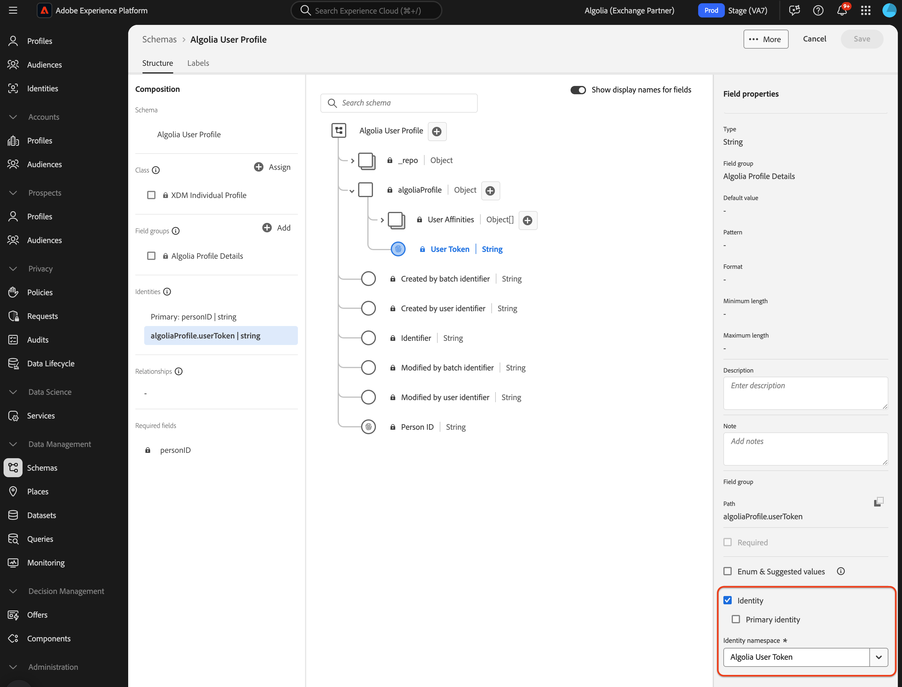

# Assimilar dados do [!DNL Algolia User Profiles] na Experience Platform usando a interface

Este tutorial o orienta pela assimilação de dados da conta do [!DNL Algolia User Profiles] na Adobe Experience Platform usando a interface do usuário.

## Introdução

>[!IMPORTANT]
>
>Antes de começar, verifique se você concluiu os pré-requisitos descritos na [[!DNL Algolia User Profiles] visão geral](../../../../connectors/data-partners/algolia-user-profiles.md#prerequisites).

Este tutorial presume que você esteja familiarizado com os seguintes componentes do Experience Platform:

* [[!DNL Experience Data Model (XDM)] Sistema](../../../../../xdm/home.md): a estrutura padronizada que a Experience Platform usa para organizar dados de experiência do cliente.

   * [Noções básicas sobre a composição do esquema](../../../../../xdm/schema/composition.md): saiba mais sobre a composição do esquema, incluindo princípios-chave e práticas recomendadas.
   * [Tutorial do Editor de esquemas](../../../../../xdm/tutorials/create-schema-ui.md): saiba como criar esquemas personalizados usando a interface do Editor de esquemas.
* [[!DNL Real-Time Customer Profile]](../../../../../profile/home.md): um perfil de cliente unificado em tempo real com base em dados agregados de várias fontes.
* [Fontes](../../../../home.md): assimile dados de várias fontes e use os serviços da Experience Platform para estruturar, rotular e aprimorar os dados.

### Coletar credenciais necessárias

Para conectar [!DNL Algolia] ao Adobe Experience Platform, forneça as seguintes credenciais:

| Credencial | Descrição |
| -------------- | ----------------------------------------------------------------------------------------- |
| ID do aplicativo | O identificador exclusivo atribuído à sua conta do [!DNL Algolia]. |
| Chave de API | A credencial para autenticar e autorizar solicitações de API para os serviços de [!DNL Algolia]. |

Para obter mais informações, consulte a [!DNL Algolia] [documentação de autenticação](https://www.algolia.com/doc/tools/cli/get-started/authentication/).

## Conectar sua conta do [!DNL Algolia]

Na interface do Experience Platform, selecione **[!UICONTROL Fontes]** na navegação à esquerda para abrir o espaço de trabalho *[!UICONTROL Fontes]*. Use o painel ou a barra de pesquisa *[!UICONTROL Categorias]* para encontrar a origem desejada.

Para conectar [!DNL Algolia], escolha o cartão de origem **[!UICONTROL Algolia]** em *[!UICONTROL Parceiros de Dados e Identidade]* e selecione **[!UICONTROL Configurar]**.

>[!TIP]
>
> Se uma origem ainda não tiver uma conta autenticada, ela mostrará a opção **[!UICONTROL Configurar]**. Após a autenticação, isso muda para **[!UICONTROL Adicionar dados]**.

## Autenticação

### Usar uma conta existente

Para usar uma conta existente, escolha **[!UICONTROL Conta existente]** e selecione a conta [!DNL Algolia User Profiles] que deseja usar. Em seguida, selecione **[!UICONTROL Próximo]**.

### Criar uma nova conta

Para criar uma nova conta, selecione **[!UICONTROL Nova conta]** e digite um nome, uma descrição opcional e suas credenciais do [!DNL Algolia]. Selecione **[!UICONTROL Conectar à origem]** e aguarde o estabelecimento da conexão.

## Adicionar dados

Após a criação da conta [!DNL Algolia User Profiles], a etapa **[!UICONTROL Adicionar dados]** é exibida. Use-o para selecionar e visualizar os dados do perfil do usuário para assimilação.

* À esquerda, insira **[!UICONTROL Índices]** e **[!UICONTROL Afinidade(s)]** opcionais.
* À direita, visualize até 100 linhas de perfis de usuário.

Depois de concluído, selecione **[!UICONTROL Próximo]**.

## Fornecer detalhes do fluxo de dados

Se estiver usando um conjunto de dados existente, escolha um associado a um esquema que inclua o grupo de campos [!DNL Algolia Profile]. Verifique se o campo [!DNL Algolia User Token] está usando o namespace de identidade [!DNL Algolia User Token].  Se o [!DNL Algolia User Token] não estiver criado ou atribuído no momento, as instruções serão fornecidas abaixo.

Se estiver criando um novo conjunto de dados, selecione um esquema usando o grupo de campos [!DNL Algolia Profile].

### Criar namespace de identidade [!DNL Algolia User Token]

Será necessário criar o namespace de identidade [!DNL Algolia User Token] se ele ainda não existir em sua organização.

Use a navegação à esquerda e selecione **[!UICONTROL Identidades]** para acessar o espaço de trabalho da interface do [Serviço de Identidade](../../../../../identity-service/home.md) e selecione **[!UICONTROL Criar namespace de identidade]**.

Em seguida, forneça um **[!UICONTROL Nome para Exibição]** e um **[!UICONTROL Símbolo de Identidade]** para o seu namespace personalizado. Durante essa etapa, você também deve configurar o tipo do namespace. Quando terminar, selecione **[!UICONTROL Criar]**.

| Configuração de namespace personalizado | Valor |
| --- | --- |
| **[!UICONTROL Nome de exibição]** | [!DNL Algolia User Token] |
| **[!UICONTROL Símbolo de Identidade]** | [!DNL AlgoliaUserToken] |
| **[!UICONTROL Selecionar um tipo]** | [!DNL Cookie ID] |

Depois de adicionado, o namespace aparece na lista. Agora você pode aplicá-la ao esquema.

### Aplicar o namespace ao esquema

Use a navegação à esquerda e selecione **[!UICONTROL Esquemas]** para acessar o espaço de trabalho da interface de [Esquemas](../../../../../xdm/ui/overview.md). Use o espaço de trabalho de esquemas para criar ou atualizar um esquema com o grupo de campos [!DNL Algolia Profile Details]. Em seguida, navegue até o campo **[!UICONTROL Token de usuário]** e use o painel direito para selecionar a caixa **[!UICONTROL Identidade]**. Use também a caixa de entrada para definir o namespace de identidade [!DNL Algolia User Token]. Quando terminar, selecione **[!UICONTROL Salvar]**.

Depois que o campo **[!UICONTROL Token de Usuário]** recebe o namespace de identidade [!DNL Algolia User Token], a identidade aparece no perfil de usuário para qualquer perfil.

## Mapear campos de dados para um esquema XDM

Use a interface de mapeamento para mapear os dados de origem para campos de esquema. Para obter mais informações, consulte o [guia de mapeamento](../../../../../data-prep/ui/mapping.md).

## Programar execuções de assimilação

Em seguida, use a interface de programação para definir a programação de assimilação do fluxo de dados.

| Configuração de agendamento | Descrição |
| --- | --- |
| Frequência | Configure a frequência para indicar a frequência de execução do fluxo de dados. Você pode definir a frequência como: <ul><li>**Uma vez**: defina sua frequência como `once` para criar uma assimilação única. As configurações para intervalo e preenchimento retroativo não estão disponíveis ao criar um fluxo de dados de assimilação única. Por padrão, a frequência de agendamento é definida como uma vez.</li><li>**Minuto**: Defina sua frequência como `minute` para agendar seu fluxo de dados para assimilar dados por minuto.</li><li>**Hora**: Defina sua frequência como `hour` para agendar seu fluxo de dados para assimilar dados por hora.</li><li>**Dia**: Defina sua frequência como `day` para agendar seu fluxo de dados para assimilar dados por dia.</li><li>**Semana**: Defina sua frequência como `week` para agendar seu fluxo de dados para assimilar dados por semana.</li></ul> |
| Intervalo | Depois de selecionar uma frequência, você pode definir o intervalo para estabelecer o intervalo de tempo entre cada assimilação. Por exemplo, se você definir a frequência como dia e configurar o intervalo como 15, o fluxo de dados será executado a cada 15 dias. Você não pode definir o intervalo como zero. O valor mínimo de intervalo aceito para cada frequência é o seguinte:<ul><li>**Uma vez**: n/d</li><li>**Minuto**: 15</li><li>**Hora**: 1</li><li>**Dia**: 1</li><li>**Semana**: 1</li></ul> |
| Hora de início | O carimbo de data e hora da execução projetada, apresentado no fuso horário UTC. |
| Preenchimento retroativo | O preenchimento retroativo determina quais dados são assimilados inicialmente. Se o preenchimento retroativo estiver ativado, todos os arquivos atuais no caminho especificado serão assimilados durante a primeira assimilação agendada. Se o preenchimento retroativo estiver desativado, somente os arquivos carregados entre a primeira execução da assimilação e a hora de início serão assimilados. Os arquivos carregados antes da hora de início não serão assimilados. |

## Revisar seu fluxo de dados

Use a página de revisão para obter um resumo do seu fluxo de dados antes da assimilação. Os detalhes estão agrupados nas seguintes categorias:

* **Conexão** - Mostra o tipo de origem, o caminho relevante do arquivo de origem escolhido e o número de colunas nesse arquivo de origem.
* **Atribuir campos de conjunto de dados e mapa** - Mostra em qual conjunto de dados os dados de origem estão sendo assimilados, incluindo o esquema ao qual o conjunto de dados pertence.
* **Agendamento** - Mostra o período, a frequência e o intervalo ativos do agendamento de assimilação.

Depois de revisar o fluxo de dados, selecione **[!UICONTROL Concluir]** e aguarde algum tempo para que o fluxo de dados seja criado.

## Próximas etapas

Ao seguir este tutorial, você criou com êxito um fluxo de dados para trazer dados de intenção da sua origem [!DNL Algolia] para a Experience Platform. Para obter recursos adicionais, consulte a documentação descrita abaixo.

### Monitorar seu fluxo de dados

Depois que o fluxo de dados for criado, você poderá monitorar os dados que estão sendo assimilados por meio dele para exibir informações sobre taxas de assimilação, sucesso e erros. Para obter mais informações sobre como monitorar o fluxo de dados, visite o tutorial em [monitoramento de contas e fluxos de dados na interface](../../../../../dataflows/ui/monitor-sources.md).

### Atualizar seu fluxo de dados

Para atualizar as configurações do agendamento de fluxos de dados, mapeamento e informações gerais, visite o tutorial em [atualizando fluxos de dados de fontes na interface](../../update-dataflows.md).

### Excluir seu fluxo de dados

Você pode excluir fluxos de dados que não são mais necessários ou que foram criados incorretamente usando a função **[!UICONTROL Excluir]** disponível no espaço de trabalho **[!UICONTROL Fluxos de Dados]**. Para obter mais informações sobre como excluir fluxos de dados, visite o tutorial em [excluindo fluxos de dados na interface](../../delete.md).
