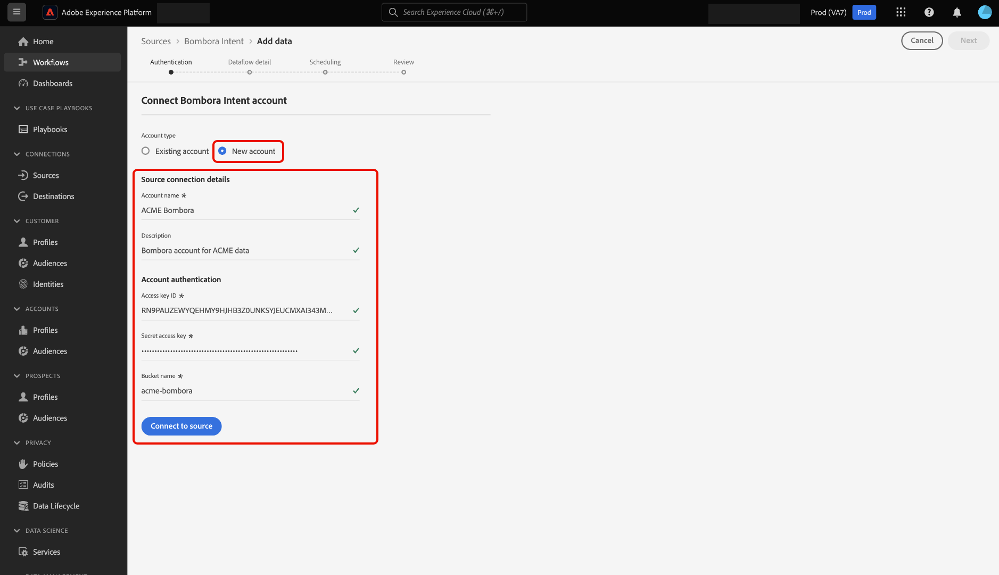
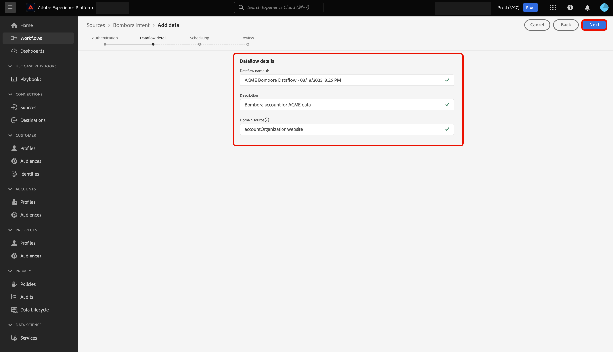

# Conectar o [!DNL Bombora Intent] ao Experience Platform usando a interface

Leia este guia para saber como conectar sua conta do [!DNL Bombora Intent] à Adobe Experience Platform usando a interface do usuário.

## Introdução

Este tutorial requer uma compreensão funcional dos seguintes componentes do Experience Platform:

* [Real-Time CDP B2B edition](../../../../../rtcdp/b2b-overview.md): o Real-Time CDP B2B edition foi criado especificamente para profissionais de marketing que operam em um modelo de serviço business-to-business. A plataforma reúne dados de várias origens e os combina numa única exibição de perfis de pessoas e contas. Esses dados unificados permitem que profissionais de marketing direcionem públicos-alvo específicos com precisão e gerem engajamento em todos os canais disponíveis.
* [Fontes](../../../../home.md): o Experience Platform permite a assimilação de dados de várias fontes, ao mesmo tempo em que fornece a capacidade de estruturar, rotular e aprimorar os dados recebidos usando os serviços do Experience Platform.
* [Sandboxes](../../../../../sandboxes/home.md): a Experience Platform fornece sandboxes virtuais que particionam uma única instância do Experience Platform em ambientes virtuais separados para ajudar a desenvolver aplicativos de experiência digital.

## Navegar pelo catálogo de origens

Na interface do Experience Platform, selecione **[!UICONTROL Fontes]** na navegação à esquerda para acessar o espaço de trabalho *[!UICONTROL Fontes]*. Você pode selecionar a categoria apropriada no painel *[!UICONTROL Categorias]*. Como alternativa, você pode usar a barra de pesquisa para navegar até a fonte específica que deseja usar.

Para usar o [!DNL Bombora], selecione o cartão de origem **[!UICONTROL Propósito Bombora]** em *[!UICONTROL Parceiros de Dados e Identidade]* e selecione **[!UICONTROL Adicionar dados]**.

>[!TIP]
>
>As origens no catálogo de origens exibem a opção **[!UICONTROL Configurar]** quando uma determinada origem ainda não tem uma conta autenticada. Quando uma conta autenticada existir, esta opção será alterada para **[!UICONTROL Adicionar dados]**.

## Autenticação {#authentication}

### Usar uma conta existente {#existing}

Para usar uma conta existente, selecione **[!UICONTROL Conta existente]** e, em seguida, selecione a conta que deseja usar na lista de contas na interface.

Depois de selecionar sua conta, selecione **[!UICONTROL Avançar]** para prosseguir para a próxima etapa.

### Criar uma nova conta {#create}

Se você não tiver uma conta existente, deverá criar uma nova conta fornecendo as credenciais de autenticação necessárias que correspondam à sua origem.

Para criar uma nova conta, selecione **[!UICONTROL Nova conta]** e forneça um nome de conta e, opcionalmente, uma descrição para os detalhes da sua conta. Em seguida, forneça os valores de autenticação apropriados para autenticar sua fonte no Experience Platform. Para conectar sua conta do [!DNL Bombora], você deve ter as seguintes credenciais:

* **ID da chave de acesso**: sua ID da chave de acesso [!DNL Bombora]. Esta é uma sequência de 61 caracteres alfanuméricos necessária para autenticar sua conta no Experience Platform.
* **Chave de acesso secreta**: sua chave de acesso secreta [!DNL Bombora]. Esta é uma sequência de 40 caracteres codificada em base 64 necessária para autenticar sua conta no Experience Platform.
* **Nome do bucket**: seu bucket [!DNL Bombora] do qual os dados serão extraídos.

## Fornecer detalhes do fluxo de dados {#provide-dataflow-details}

Depois que a conta for autenticada e conectada, você deverá fornecer os seguintes detalhes para o fluxo de dados:

* **Nome do fluxo de dados**: o nome do seu fluxo de dados. Você pode usar esse nome para pesquisar seu fluxo de dados na interface do usuário, uma vez que ele tenha sido criado e processado.
* **Descrição**: (opcional) uma breve explicação ou informações adicionais para o fluxo de dados.
* **Origem do domínio**: o campo de domínio ou site que corresponde aos registros da conta de origem em relação às contas do Experience Platform. Esse valor pode depender das configurações. Se não for fornecido, o domínio assumirá como padrão accountOrganization.website.

## Agendar fluxo de dados {#schedule-dataflow}

Em seguida, use a interface de agendamento para configurar um agendamento de assimilação para seu fluxo de dados.

* **Frequência**: configure a frequência para indicar a frequência de execução do fluxo de dados. Você pode agendar seu fluxo de dados do [!DNL Bombora] para assimilar dados semanalmente.
* **Intervalo**: o intervalo representa o tempo entre cada ciclo de assimilação. O único intervalo com suporte para um fluxo de dados [!DNL Bombora] é 1. Isso significa que seu fluxo de dados assimilará dados uma vez por semana, toda semana.
* **Hora de início**: a hora de início determina quando ocorrerá a primeira iteração de execução do fluxo de dados. [!DNL Bombora] envia dados para o Adobe uma vez por semana, às segundas-feiras, às 12h UTC. Portanto, você deve definir a hora de início da assimilação após as 12h UTC. Além disso, você deve confirmar o tempo de assimilação com [!DNL Bombora], pois eles podem alterar a programação ao soltar arquivos no Adobe.

Depois de configurar o agendamento de assimilação do fluxo de dados, selecione **[!UICONTROL Avançar]**.

## Revisar fluxo de dados {#review-dataflow}

A etapa final no processo de criação do fluxo de dados é revisar o fluxo de dados antes de executá-lo. Use a etapa *[!UICONTROL Revisão]* para revisar os detalhes do novo fluxo de dados antes de ele ser executado. Os detalhes estão agrupados nas seguintes categorias:

* **Conexão**: mostra o tipo de origem, o caminho relevante do arquivo de origem escolhido e o número de colunas nesse arquivo de origem.
* **Agendamento**: mostra o período, a frequência e o intervalo ativos do agendamento de assimilação.

Depois de revisar o fluxo de dados, selecione **[!UICONTROL Concluir]**.

## Próximas etapas

Ao seguir este tutorial, você criou com êxito um fluxo de dados para trazer dados de intenção da sua origem [!DNL Bombora] para a Experience Platform. Para obter recursos adicionais, consulte a documentação descrita abaixo.

### Monitorar seu fluxo de dados

Depois que o fluxo de dados for criado, você poderá monitorar os dados que estão sendo assimilados por meio dele para exibir informações sobre taxas de assimilação, sucesso e erros. Para obter mais informações sobre como monitorar o fluxo de dados, visite o tutorial em [monitoramento de contas e fluxos de dados na interface](../../../../../dataflows/ui/monitor-sources.md).

### Atualizar seu fluxo de dados

Para atualizar as configurações do agendamento de fluxos de dados, mapeamento e informações gerais, visite o tutorial em [atualizando fluxos de dados de fontes na interface](../../update-dataflows.md).

### Excluir seu fluxo de dados

Você pode excluir fluxos de dados que não são mais necessários ou que foram criados incorretamente usando a função **[!UICONTROL Excluir]** disponível no espaço de trabalho **[!UICONTROL Fluxos de Dados]**. Para obter mais informações sobre como excluir fluxos de dados, visite o tutorial em [excluindo fluxos de dados na interface](../../delete.md).
