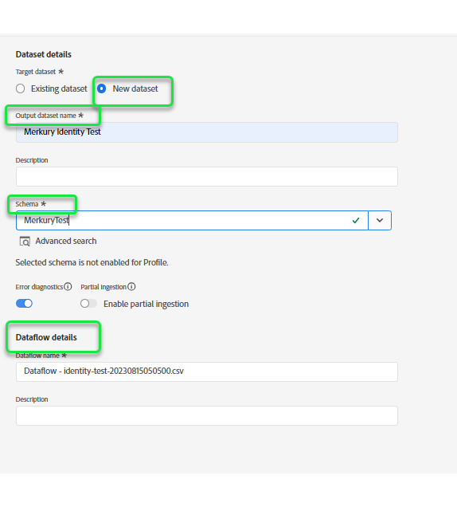

# Criar um [!DNL Merkury Enterprise Identity Resolution] conexão de origem e fluxo de dados na interface do

>[!NOTE]
>
>A variável [!DNL Merkury Enterprise Identity Resolution] a fonte está na versão beta. Leia as [visão geral das origens](../../../../home.md#terms-and-conditions) para obter mais informações sobre o uso de fontes rotuladas como beta.

Este tutorial fornece etapas para criar um [!DNL Merkury Enterprise Identity Resolution] conexão de origem e fluxo de dados usando a interface do usuário do Adobe Experience Platform.

## Introdução

Este tutorial requer um entendimento prático dos seguintes componentes do Experience Platform:

* [[!DNL Experience Data Model (XDM)] Sistema](../../../../../xdm/home.md): a estrutura padronizada pela qual o Experience Platform organiza os dados de experiência do cliente.
   * [Noções básicas da composição do esquema](../../../../../xdm/schema/composition.md): saiba mais sobre os componentes básicos dos esquemas XDM, incluindo princípios fundamentais e práticas recomendadas na composição do esquema.
   * [Tutorial do Editor de esquemas](../../../../../xdm/tutorials/create-schema-ui.md): saiba como criar esquemas personalizados usando a interface do Editor de esquemas.
* [[!DNL Real-Time Customer Profile]](../../../../../profile/home.md): fornece um perfil de consumidor unificado em tempo real com base em dados agregados de várias fontes.

### Coletar credenciais necessárias

Para acessar seu bucket no Experience Platform, é necessário fornecer valores válidos para as seguintes credenciais:

| Credencial | Descrição |
| --- | --- |
| Chave de acesso | A ID da chave de acesso do seu bucket. Você pode recuperar esse valor de seu [!DNL Merkury] equipe. |
| Chave secreta | A ID da chave secreta para o seu bucket. Você pode recuperar esse valor de seu [!DNL Merkury] equipe. |
| Nome do bucket | Este é o seu balde Merkury onde os arquivos serão compartilhados. Você pode recuperar esse valor de seu [!DNL Merkury] equipe. |

Para obter mais informações sobre a configuração do [!DNL Merkury] e outros pré-requisitos, leia a [[!DNL Merkury] visão geral da origem](../../../../connectors/data-partners/merkury.md).

## Conectar sua conta do Merkury

Na interface do usuário da Platform, selecione **[!UICONTROL Origens]** na barra de navegação esquerda, para acessar a [!UICONTROL Origens] espaço de trabalho. A variável [!UICONTROL Catálogo] A tela exibe uma variedade de fontes com as quais você pode criar uma conta.

Você pode selecionar a categoria apropriada no catálogo no lado esquerdo da tela. Como alternativa, você pode encontrar a fonte específica com a qual deseja trabalhar usando a opção de pesquisa.

No **[!UICONTROL Parceiros de dados]** categoria, selecione **[!UICONTROL Merkury]** e selecione **[!UICONTROL Configurar]**.

A variável **[!UICONTROL Conectar-se ao Merkury]** é exibida. Nesta página, você pode usar credenciais novas ou existentes.

### Criar uma nova conta

Se estiver usando novas credenciais, selecione **[!UICONTROL Nova conta]**. No formulário de entrada que aparece, forneça um nome, uma descrição opcional e [!DNL Merkury] credenciais. Quando terminar, selecione **[!UICONTROL Conectar à origem]** e aguarde algum tempo para estabelecer a nova conexão.

### Usar uma conta existente

Para usar uma conta existente, selecione **[!UICONTROL Conta existente]** e, em seguida, selecione a [!DNL Merkury] conta que deseja usar. Selecione **[!UICONTROL Próximo]** para continuar.

>[!BEGINSHADEBOX]

**Formatos de arquivo não suportados**

Você pode assimilar os seguintes formatos de arquivo com o [!DNL Merkury] origem:

* Valores separados por delimitadores (DSV): qualquer valor com um único caractere pode ser usado como delimitador para arquivos de dados formatados em DSV.
* [!DNL JavaScript Object Notation] (JSON): os arquivos de dados formatados em JSON devem ser compatíveis com XDM.
* [!DNL Apache Parquet]: arquivos de dados formatados com Parquet devem ser compatíveis com XDM.
* Arquivos compactados: JSON e arquivos delimitados podem ser compactados como: `bzip2`, `gzip`, `deflate`, `zipDeflate`, `tarGzip`, e `tar`.

>[!ENDSHADEBOX]

## Adicionar dados

Depois de criar o [!DNL Merkury] conta, a variável **[!UICONTROL Adicionar dados]** é exibida, fornecendo uma interface para você explorar suas [!DNL Merkury] hierarquia de arquivos e selecione a pasta ou o arquivo específico que deseja trazer para o Experience Platform.

* A parte esquerda da interface é um navegador de diretórios, que exibe [!DNL Merkury] hierarquia de arquivos.
* A parte direita da interface permite visualizar até 100 linhas de dados de uma pasta ou arquivo compatível.

Selecione a pasta raiz para acessar a hierarquia de pastas. Aqui, você pode selecionar uma única pasta para assimilar todos os arquivos na pasta recursivamente. Ao assimilar uma pasta inteira, você deve garantir que todos os arquivos nessa pasta compartilhem o mesmo formato de dados e esquema.

Depois de selecionar uma pasta, a interface correta é atualizada para uma pré-visualização do conteúdo e da estrutura do primeiro arquivo na pasta selecionada.

Durante essa etapa, você pode fazer várias configurações para seus dados antes de continuar. Primeiro, selecione **[!UICONTROL Formato de dados]** e selecione o formato de dados apropriado para seu arquivo no painel suspenso exibido.

A tabela a seguir exibe os formatos de dados apropriados para os tipos de arquivos compatíveis:

| Tipo de arquivo | Formato dos dados |
| --- | --- |
| CSV | [!UICONTROL Delimitado] |
| JSON | [!UICONTROL JSON] |
| Parquet | [!UICONTROL Parquet XDM] |

### Selecionar um delimitador de coluna

+++Selecione para exibir etapas sobre como definir um delimitador

Após configurar o formato de dados, é possível definir um delimitador de coluna ao assimilar arquivos delimitados. Selecione o **[!UICONTROL Delimitador]** e selecione um delimitador no menu suspenso. O menu exibe as opções usadas com mais frequência para delimitadores, incluindo uma vírgula (`,`), uma guia (`\t`), e uma barra vertical (`|`).

Se preferir usar um delimitador personalizado, selecione **[!UICONTROL Personalizado]** e insira um delimitador de caractere único de sua escolha na barra de entrada pop-up.

+++

### Assimilar arquivos compactados

+++ Selecione para ver as etapas sobre como assimilar arquivos compactados

Você também pode assimilar arquivos JSON ou delimitados compactados especificando o tipo de compactação.

No [!UICONTROL Selecionar dados] selecione um arquivo compactado para assimilação e, em seguida, selecione o tipo de arquivo apropriado e se ele é compatível com XDM ou não. Em seguida, selecione **[!UICONTROL Tipo de compactação]** e selecione o tipo de arquivo compactado apropriado para seus dados de origem.

Para trazer um arquivo específico para a Platform, selecione uma pasta e, em seguida, selecione o arquivo que deseja assimilar. Durante essa etapa, também é possível visualizar o conteúdo de outros arquivos em uma determinada pasta usando o ícone de visualização ao lado de um nome de arquivo.

Quando terminar, selecione **[!UICONTROL Próxima]**.

+++

## Fornecer detalhes do fluxo de dados

A variável [!UICONTROL Detalhes do fluxo de dados] permite selecionar se deseja usar um conjunto de dados existente ou um novo conjunto de dados. Durante esse processo, você também pode configurar os dados para serem assimilados no Perfil e ativar configurações como [!UICONTROL Diagnóstico de erro], [!UICONTROL Assimilação parcial], e [!UICONTROL Alertas].

### Usar um conjunto de dados existente

Para assimilar dados em um conjunto de dados existente, selecione **[!UICONTROL Conjunto de dados existente]**. É possível recuperar um conjunto de dados existente usando o [!UICONTROL Pesquisa avançada] ou rolando pela lista de conjuntos de dados existentes no menu suspenso. Depois de selecionar um conjunto de dados, forneça um nome e uma descrição para o fluxo de dados.

### Usar um novo conjunto de dados

Para assimilar em um novo conjunto de dados, selecione **[!UICONTROL Novo conjunto de dados]** e forneça um nome de conjunto de dados de saída e uma descrição opcional. Em seguida, selecione um esquema para mapear usando o [!UICONTROL Pesquisa avançada] ou rolando pela lista de esquemas existentes no menu suspenso. Depois de selecionar um esquema, forneça um nome e uma descrição para o fluxo de dados.

### Ativar perfil e diagnóstico de erro

+++Selecione para exibir as etapas para habilitar o diagnóstico de erros e a assimilação de perfis

Em seguida, selecione o **[!UICONTROL Conjunto de dados Perfil]** Ative para ativar seu conjunto de dados para o Perfil de cliente em tempo real. Isso permite criar uma visualização integral dos atributos e comportamentos de uma entidade. Os dados de todos os conjuntos de dados habilitados para perfil serão incluídos no Perfil e as alterações serão aplicadas quando você salvar seu fluxo de dados.

[!UICONTROL Diagnóstico de erro] permite a geração de mensagens de erro detalhadas para qualquer registro incorreto que ocorra em seu fluxo de dados, enquanto [!UICONTROL Assimilação parcial] O permite assimilar dados que contêm erros, até um determinado limite definido manualmente. Consulte a [visão geral da assimilação parcial de lotes](../../../../../ingestion/batch-ingestion/partial.md) para obter mais informações.

+++

### Ativar alertas

+++Selecione para exibir etapas para ativar alertas

Você pode ativar os alertas para receber notificações sobre o status do fluxo de dados. Selecione um alerta na lista para assinar e receber notificações sobre o status do seu fluxo de dados. Para obter mais informações sobre alertas, consulte o manual sobre [assinatura de alertas de origens usando a interface do usuário](../../alerts.md).

Quando terminar de fornecer detalhes ao seu fluxo de dados, selecione **[!UICONTROL Próxima]**.

+++

## Mapear campos de dados para um esquema XDM

A variável [!UICONTROL Mapeamento] é exibida, fornecendo uma interface para mapear os campos de origem do esquema de origem para os campos XDM de destino apropriados no esquema de destino.

A Platform fornece recomendações inteligentes para campos mapeados automaticamente com base no esquema ou conjunto de dados de destino selecionado. Você pode ajustar manualmente as regras de mapeamento para atender aos seus casos de uso. Com base nas suas necessidades, você pode optar por mapear campos diretamente ou usar funções de preparação de dados para transformar dados de origem para derivar valores calculados ou calculados. Para obter etapas abrangentes sobre o uso da interface do mapeador e campos calculados, consulte o [Guia da interface de preparação de dados](../../../../../data-prep/ui/mapping.md).

Depois que os dados de origem forem mapeados com sucesso, selecione **[!UICONTROL Próxima]**.

## Programar execuções de assimilação

A variável [!UICONTROL Agendamento] Esta etapa permite configurar uma programação de assimilação para assimilar automaticamente os dados de origem selecionados usando os mapeamentos configurados. Por padrão, o agendamento está definido como `Once`. Para ajustar a frequência de assimilação, selecione **[!UICONTROL Frequência]** e selecione uma opção no menu suspenso.

>[!TIP]
>
>O intervalo e o preenchimento retroativo não ficam visíveis durante uma assimilação única.

Se você definir a frequência de assimilação como `Minute`, `Hour`, `Day`ou `Week`, você deve definir um intervalo para estabelecer um intervalo de tempo definido entre cada assimilação. Por exemplo, uma frequência de assimilação definida como `Day` e um intervalo definido como `15` significa que seu fluxo de dados está programado para assimilar dados a cada 15 dias.

Durante essa etapa, você também pode ativar **preenchimento retroativo** e definir uma coluna para a assimilação incremental de dados. O preenchimento retroativo é usado para assimilar dados históricos, enquanto a coluna definida para assimilação incremental permite que novos dados sejam diferenciados dos dados existentes.

Consulte a tabela abaixo para obter mais informações sobre como programar configurações.

| Campo | Descrição |
| --- | --- |
| Frequência | A frequência na qual ocorre uma assimilação. As frequências selecionáveis incluem `Once`, `Minute`, `Hour`, `Day`, e `Week`. |
| Interval | Um número inteiro que define o intervalo para a frequência selecionada. O valor do intervalo deve ser um inteiro diferente de zero e deve ser definido como maior ou igual a 15. |
| Hora de início | Um carimbo de data e hora UTC que indica quando a primeira assimilação está definida para ocorrer. A hora de início deve ser maior ou igual à hora UTC atual. |
| Preenchimento retroativo | Um valor booleano que determina quais dados são assimilados inicialmente. Se o preenchimento retroativo estiver ativado, todos os arquivos atuais no caminho especificado serão assimilados durante a primeira assimilação agendada. Se o preenchimento retroativo estiver desativado, somente os arquivos carregados entre a primeira execução da assimilação e a hora de início serão assimilados. Os arquivos carregados antes da hora de início não serão assimilados. |

>[!NOTE]
>
>Para assimilação em lote, cada fluxo de dados subsequente seleciona arquivos que serão assimilados de sua origem com base em seus **última modificação** carimbo de data e hora. Isso significa que os fluxos de dados em lote selecionam arquivos da origem que são novos ou que foram modificados desde a última execução do fluxo. Além disso, você deve garantir que haja um intervalo de tempo suficiente entre o carregamento do arquivo e uma execução de fluxo agendada, pois os arquivos que não foram totalmente carregados na sua conta de armazenamento na nuvem antes do tempo de execução do fluxo agendado podem não ser coletados para assimilação.

Quando terminar de configurar a programação de assimilação, selecione **[!UICONTROL Próxima]**.

## Revisar seu fluxo de dados

A variável **[!UICONTROL Revisão]** é exibida, permitindo que você revise seu novo fluxo de dados antes de ele ser criado. Os detalhes são agrupados nas seguintes categorias:

* **[!UICONTROL Conexão]**: mostra o tipo de origem, o caminho relevante do arquivo de origem escolhido e a quantidade de colunas nesse arquivo de origem.
* **[!UICONTROL Atribuir conjunto de dados e mapear campos]**: mostra em qual conjunto de dados os dados de origem estão sendo assimilados, incluindo o esquema ao qual o conjunto de dados adere.
* **[!UICONTROL Agendamento]**: mostra o período, a frequência e o intervalo ativos da programação de assimilação.

Depois de revisar o fluxo de dados, clique em **[!UICONTROL Concluir]** e aguarde algum tempo para criar o fluxo de dados.

## Próximas etapas

Ao seguir este tutorial, você criou com sucesso um fluxo de dados para trazer dados em lote de seus [!DNL Merkury] origem para Experience Platform. Para obter recursos adicionais, consulte a documentação descrita abaixo.

### Monitorar seu fluxo de dados

Depois que o fluxo de dados for criado, você poderá monitorar os dados que estão sendo assimilados por meio dele para exibir informações sobre taxas de assimilação, sucesso e erros. Para obter mais informações sobre como monitorar o fluxo de dados, consulte o tutorial em [monitoramento de contas e fluxos de dados na interface do](../../monitor.md).

### Atualizar seu fluxo de dados

Para atualizar as configurações para o agendamento de fluxos de dados, mapeamento e informações gerais, visite o tutorial em [atualização de fluxos de dados de fontes na interface do usuário](../../update-dataflows.md)

### Excluir seu fluxo de dados

É possível excluir fluxos de dados que não são mais necessários ou que foram criados incorretamente usando o **[!UICONTROL Excluir]** disponível na **[!UICONTROL Fluxos de dados]** espaço de trabalho. Para obter mais informações sobre como excluir fluxos de dados, consulte o tutorial em [exclusão de fluxos de dados na interface](../../delete.md).