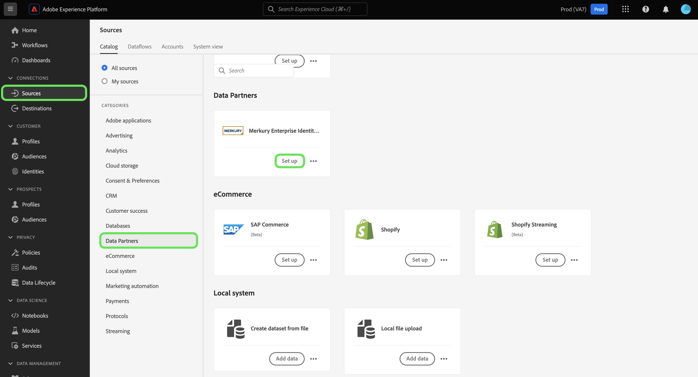
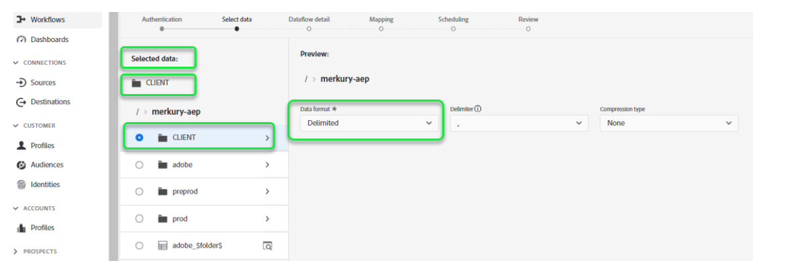

# Criar uma conexão de origem e um fluxo de dados de [!DNL Merkury Enterprise Identity Resolution] na interface do usuário

Este tutorial fornece etapas para criar uma conexão de origem e um fluxo de dados do [!DNL Merkury Enterprise Identity Resolution] usando a interface do usuário do Adobe Experience Platform.

## Introdução

Este tutorial requer uma compreensão funcional dos seguintes componentes do Experience Platform:

* [[!DNL Experience Data Model (XDM)] Sistema](../../../../../xdm/home.md): a estrutura padronizada pela qual o Experience Platform organiza os dados de experiência do cliente.
   * [Noções básicas sobre a composição de esquema](../../../../../xdm/schema/composition.md): saiba mais sobre os blocos de construção básicos de esquemas XDM, incluindo princípios-chave e práticas recomendadas na composição de esquema.
   * [Tutorial do Editor de esquemas](../../../../../xdm/tutorials/create-schema-ui.md): saiba como criar esquemas personalizados usando a interface do Editor de esquemas.
* [[!DNL Real-Time Customer Profile]](../../../../../profile/home.md): Fornece um perfil de consumidor unificado em tempo real com base em dados agregados de várias fontes.

### Coletar credenciais necessárias

Para acessar seu bucket no Experience Platform, você precisa fornecer valores válidos para as seguintes credenciais:

| Credencial | Descrição |
| --- | --- |
| Chave de acesso | A ID da chave de acesso do seu bucket. Você pode recuperar esse valor da equipe [!DNL Merkury]. |
| Chave secreta | A ID da chave secreta para o seu bucket. Você pode recuperar esse valor da equipe [!DNL Merkury]. |
| Nome do bucket | Este é o seu balde Merkury onde os arquivos serão compartilhados. Você pode recuperar esse valor da equipe [!DNL Merkury]. |

Para obter mais informações sobre como configurar o para [!DNL Merkury] e outros pré-requisitos, leia a [[!DNL Merkury] visão geral da origem](../../../../connectors/data-partners/merkury.md).

## Conectar sua conta do Merkury

Na interface do usuário do Experience Platform, selecione **[!UICONTROL Fontes]** na barra de navegação esquerda para acessar o espaço de trabalho [!UICONTROL Fontes]. A tela [!UICONTROL Catálogo] exibe uma variedade de fontes com as quais você pode criar uma conta.

Você pode selecionar a categoria apropriada no catálogo no lado esquerdo da tela. Como alternativa, você pode encontrar a fonte específica com a qual deseja trabalhar usando a opção de pesquisa.

Na categoria **[!UICONTROL Parceiros de dados]**, selecione **[!UICONTROL Merkury]** e **[!UICONTROL Configurar]**.

A página **[!UICONTROL Conectar-se ao Merkury]** é exibida. Nesta página, você pode usar credenciais novas ou existentes.

### Criar uma nova conta

Se você estiver usando novas credenciais, selecione **[!UICONTROL Nova conta]**. No formulário de entrada que aparece, forneça um nome, uma descrição opcional e suas credenciais do [!DNL Merkury]. Quando terminar, selecione **[!UICONTROL Conectar à origem]** e aguarde algum tempo para que a nova conexão seja estabelecida.

### Usar uma conta existente

Para usar uma conta existente, selecione **[!UICONTROL Conta existente]** e depois selecione a conta [!DNL Merkury] que deseja usar. Selecione **[!UICONTROL Avançar]** para continuar.

>[!BEGINSHADEBOX]

**Formatos de arquivo com suporte**

Você pode assimilar os seguintes formatos de arquivo com a origem [!DNL Merkury]:

* Valores separados por delimitadores (DSV): qualquer valor com um único caractere pode ser usado como delimitador para arquivos de dados formatados em DSV.
* [!DNL JavaScript Object Notation] (JSON): arquivos de dados formatados em JSON devem ser compatíveis com XDM.
* [!DNL Apache Parquet]: arquivos de dados formatados com Parquet devem ser compatíveis com XDM.
* Arquivos compactados: arquivos JSON e delimitados podem ser compactados como: `bzip2`, `gzip`, `deflate`, `zipDeflate`, `tarGzip` e `tar`.

>[!ENDSHADEBOX]

## Adicionar dados

Depois de criar sua conta do [!DNL Merkury], a etapa **[!UICONTROL Adicionar dados]** é exibida, fornecendo uma interface para que você explore sua hierarquia de arquivos do [!DNL Merkury] e selecione a pasta ou o arquivo específico que deseja trazer para a Experience Platform.

* A parte esquerda da interface é um navegador de diretório, que exibe sua hierarquia de arquivos [!DNL Merkury].
* A parte direita da interface permite visualizar até 100 linhas de dados de uma pasta ou arquivo compatível.

Selecione a pasta raiz para acessar a hierarquia de pastas. Aqui, você pode selecionar uma única pasta para assimilar todos os arquivos na pasta recursivamente. Ao assimilar uma pasta inteira, você deve garantir que todos os arquivos nessa pasta compartilhem o mesmo formato de dados e esquema.

Depois de selecionar uma pasta, a interface correta é atualizada para uma pré-visualização do conteúdo e da estrutura do primeiro arquivo na pasta selecionada.

Durante essa etapa, você pode fazer várias configurações para seus dados antes de continuar. Primeiro, selecione **[!UICONTROL Formato dos dados]** e, em seguida, selecione o formato de dados apropriado para seu arquivo no painel suspenso exibido.

A tabela a seguir exibe os formatos de dados apropriados para os tipos de arquivos compatíveis:

| Tipo de arquivo | Formato dos dados |
| --- | --- |
| CSV | [!UICONTROL Delimitado] |
| JSON | [!UICONTROL JSON] |
| Parquet | [!UICONTROL Parquet XDM] |

### Selecionar um delimitador de coluna

+++Selecione para exibir etapas sobre como definir um delimitador

Após configurar o formato de dados, é possível definir um delimitador de coluna ao assimilar arquivos delimitados. Selecione a opção **[!UICONTROL Delimitador]** e, em seguida, selecione um delimitador no menu suspenso. O menu exibe as opções usadas com mais frequência para delimitadores, incluindo vírgula (`,`), tabulação (`\t`) e barra vertical (`|`).

Se preferir usar um delimitador personalizado, selecione **[!UICONTROL Personalizado]** e insira um delimitador de caractere único de sua escolha na barra de entrada pop-up.

+++

### Assimilar arquivos compactados

+++ Selecione para ver as etapas sobre como assimilar arquivos compactados

Você também pode assimilar arquivos JSON ou delimitados compactados especificando o tipo de compactação.

Na etapa [!UICONTROL Selecionar dados], selecione um arquivo compactado para assimilação, selecione o tipo de arquivo apropriado e se ele é compatível com XDM ou não. Em seguida, selecione **[!UICONTROL Tipo de compactação]** e selecione o tipo de arquivo compactado apropriado para seus dados de origem.

Para trazer um arquivo específico para o Experience Platform, selecione uma pasta e, em seguida, selecione o arquivo que deseja assimilar. Durante essa etapa, também é possível visualizar o conteúdo de outros arquivos em uma determinada pasta usando o ícone de visualização ao lado de um nome de arquivo.

Quando terminar, selecione **[!UICONTROL Próximo]**.

+++

## Fornecer detalhes do fluxo de dados

A página [!UICONTROL Detalhes do fluxo de dados] permite selecionar se você deseja usar um conjunto de dados existente ou um novo conjunto de dados. Durante esse processo, você também pode configurar seus dados para serem assimilados no Perfil e habilitar configurações como [!UICONTROL Diagnóstico de erro], [!UICONTROL Assimilação parcial] e [!UICONTROL Alertas].

### Usar um conjunto de dados existente

Para assimilar dados em um conjunto de dados existente, selecione **[!UICONTROL Conjunto de dados existente]**. Você pode recuperar um conjunto de dados existente usando a opção [!UICONTROL Pesquisa avançada] ou rolando pela lista de conjuntos de dados existentes no menu suspenso. Depois de selecionar um conjunto de dados, forneça um nome e uma descrição para o fluxo de dados.

### Usar um novo conjunto de dados

Para assimilar em um novo conjunto de dados, selecione **[!UICONTROL Novo conjunto de dados]** e forneça um nome de conjunto de dados de saída e uma descrição opcional. Em seguida, selecione um esquema para mapear usando a opção [!UICONTROL Pesquisa avançada] ou rolando pela lista de esquemas existentes no menu suspenso. Depois de selecionar um esquema, forneça um nome e uma descrição para o fluxo de dados.

### Ativar perfil e diagnóstico de erro

+++Selecione para exibir as etapas para habilitar o diagnóstico de erros e a assimilação de perfis

Em seguida, selecione a opção de alternância **[!UICONTROL Conjunto de dados de perfil]** para habilitar seu conjunto de dados para o Perfil de cliente em tempo real. Isso permite criar uma visualização integral dos atributos e comportamentos de uma entidade. Os dados de todos os conjuntos de dados habilitados para perfil serão incluídos no Perfil e as alterações serão aplicadas quando você salvar seu fluxo de dados.

O [!UICONTROL Diagnóstico de erro] habilita a geração de mensagens de erro detalhadas para todos os registros incorretos que ocorrem no fluxo de dados, enquanto a [!UICONTROL Assimilação parcial] permite assimilar dados que contêm erros, até um determinado limite definido manualmente. Consulte a [visão geral da assimilação parcial de lotes](../../../../../ingestion/batch-ingestion/partial.md) para obter mais informações.

+++

### Ativar alertas

+++Selecione para ver as etapas para ativar alertas

Você pode ativar os alertas para receber notificações sobre o status do fluxo de dados. Selecione um alerta na lista para assinar e receber notificações sobre o status do seu fluxo de dados. Para obter mais informações sobre alertas, consulte o manual sobre [assinatura de alertas de fontes usando a interface](../../alerts.md).

Quando terminar de fornecer detalhes ao seu fluxo de dados, selecione **[!UICONTROL Avançar]**.

+++

## Mapear campos de dados para um esquema XDM

A etapa [!UICONTROL Mapeamento] é exibida, fornecendo uma interface para mapear os campos de origem do esquema de origem para os campos XDM de destino apropriados no esquema de destino.

O Experience Platform fornece recomendações inteligentes para campos mapeados automaticamente com base no esquema ou conjunto de dados de destino selecionado. Você pode ajustar manualmente as regras de mapeamento para atender aos seus casos de uso. Com base nas suas necessidades, você pode optar por mapear campos diretamente ou usar funções de preparação de dados para transformar dados de origem para derivar valores calculados ou calculados. Para obter etapas abrangentes sobre como usar a interface do mapeador e campos calculados, consulte o [Guia da Interface do Preparo de Dados](../../../../../data-prep/ui/mapping.md).

Depois que os dados de origem forem mapeados com êxito, selecione **[!UICONTROL Próximo]**.

## Programar execuções de assimilação

A etapa [!UICONTROL Agendamento] é exibida, permitindo configurar um agendamento de assimilação para assimilar automaticamente os dados de origem selecionados usando os mapeamentos configurados. Por padrão, o agendamento está configurado para `Once`. Para ajustar a frequência de assimilação, selecione **[!UICONTROL Frequência]** e escolha uma opção no menu suspenso.

>[!TIP]
>
>O intervalo e o preenchimento retroativo não ficam visíveis durante uma assimilação única.

Se você definir a frequência de assimilação como `Minute`, `Hour`, `Day` ou `Week`, deverá definir um intervalo para estabelecer um intervalo de tempo definido entre cada assimilação. Por exemplo, uma frequência de assimilação definida como `Day` e um intervalo definido como `15` significa que o fluxo de dados está agendado para assimilar dados a cada 15 dias.

Durante esta etapa, você também pode habilitar o **preenchimento retroativo** e definir uma coluna para a assimilação incremental de dados. O preenchimento retroativo é usado para assimilar dados históricos, enquanto a coluna definida para assimilação incremental permite que novos dados sejam diferenciados dos dados existentes.

Consulte a tabela abaixo para obter mais informações sobre como programar configurações.

| Configuração de agendamento | Descrição |
| --- | --- |
| Frequência | Configure a frequência para indicar a frequência de execução do fluxo de dados. Você pode definir a frequência como: <ul><li>**Uma vez**: defina sua frequência como `once` para criar uma assimilação única. As configurações para intervalo e preenchimento retroativo não estão disponíveis ao criar um fluxo de dados de assimilação única. Por padrão, a frequência de agendamento é definida como uma vez.</li><li>**Minuto**: Defina sua frequência como `minute` para agendar seu fluxo de dados para assimilar dados por minuto.</li><li>**Hora**: Defina sua frequência como `hour` para agendar seu fluxo de dados para assimilar dados por hora.</li><li>**Dia**: Defina sua frequência como `day` para agendar seu fluxo de dados para assimilar dados por dia.</li><li>**Semana**: Defina sua frequência como `week` para agendar seu fluxo de dados para assimilar dados por semana.</li></ul> |
| Intervalo | Depois de selecionar uma frequência, você pode definir o intervalo para estabelecer o intervalo de tempo entre cada assimilação. Por exemplo, se você definir a frequência como dia e configurar o intervalo como 15, o fluxo de dados será executado a cada 15 dias. Você não pode definir o intervalo como zero. O valor mínimo de intervalo aceito para cada frequência é o seguinte:<ul><li>**Uma vez**: n/d</li><li>**Minuto**: 15</li><li>**Hora**: 1</li><li>**Dia**: 1</li><li>**Semana**: 1</li></ul> |
| Hora de início | O carimbo de data e hora da execução projetada, apresentado no fuso horário UTC. |
| Preenchimento retroativo | O preenchimento retroativo determina quais dados são assimilados inicialmente. Se o preenchimento retroativo estiver ativado, todos os arquivos atuais no caminho especificado serão assimilados durante a primeira assimilação agendada. Se o preenchimento retroativo estiver desativado, somente os arquivos carregados entre a primeira execução da assimilação e a hora de início serão assimilados. Os arquivos carregados antes da hora de início não serão assimilados. |

>[!NOTE]
>
>Para assimilação em lote, cada fluxo de dados subsequente seleciona arquivos a serem assimilados de sua origem com base no carimbo de data/hora **última modificação**. Isso significa que os fluxos de dados em lote selecionam arquivos da origem que são novos ou que foram modificados desde a última execução do fluxo. Além disso, você deve garantir que haja um intervalo de tempo suficiente entre o carregamento do arquivo e uma execução de fluxo agendada, pois os arquivos que não foram totalmente carregados na sua conta de armazenamento na nuvem antes do tempo de execução do fluxo agendado podem não ser coletados para assimilação.

Quando terminar de configurar o agendamento de assimilação, selecione **[!UICONTROL Avançar]**.

## Revisar seu fluxo de dados

A etapa **[!UICONTROL Revisão]** é exibida, permitindo que você revise seu novo fluxo de dados antes de ele ser criado. Os detalhes são agrupados nas seguintes categorias:

* **[!UICONTROL Conexão]**: mostra o tipo de origem, o caminho relevante do arquivo de origem escolhido e a quantidade de colunas nesse arquivo de origem.
* **[!UICONTROL Atribuir campos de conjunto de dados e mapa]**: mostra em qual conjunto de dados os dados de origem estão sendo assimilados, incluindo o esquema ao qual o conjunto de dados pertence.
* **[!UICONTROL Agendamento]**: mostra o período, a frequência e o intervalo ativos do agendamento de assimilação.

Depois de revisar o fluxo de dados, clique em **[!UICONTROL Concluir]** e aguarde algum tempo para que o fluxo de dados seja criado.

## Próximas etapas

Ao seguir este tutorial, você criou com êxito um fluxo de dados para trazer dados em lote da sua origem [!DNL Merkury] para a Experience Platform. Para obter recursos adicionais, consulte a documentação descrita abaixo.

### Monitorar seu fluxo de dados

Depois que o fluxo de dados for criado, você poderá monitorar os dados que estão sendo assimilados por meio dele para exibir informações sobre taxas de assimilação, sucesso e erros. Para obter mais informações sobre como monitorar o fluxo de dados, visite o tutorial em [monitoramento de contas e fluxos de dados na interface](../../monitor.md).

### Atualizar seu fluxo de dados

Para atualizar as configurações do agendamento de fluxos de dados, mapeamento e informações gerais, visite o tutorial em [atualizando fluxos de dados de fontes na interface](../../update-dataflows.md)

### Excluir seu fluxo de dados

Você pode excluir fluxos de dados que não são mais necessários ou que foram criados incorretamente usando a função **[!UICONTROL Excluir]** disponível no espaço de trabalho **[!UICONTROL Fluxos de Dados]**. Para obter mais informações sobre como excluir fluxos de dados, visite o tutorial em [excluindo fluxos de dados na interface](../../delete.md).
