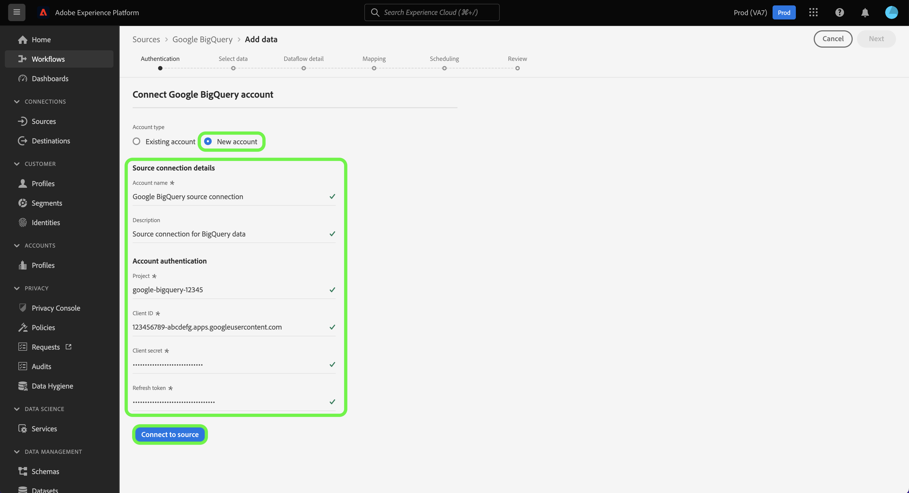

# Criar uma conexão de origem [!DNL Google Big Query] na interface do usuário

>[!NOTE]
>
> O conector [!DNL Google BigQuery] está em beta. Consulte a [Visão geral das Fontes](../../../../home.md#terms-and-conditions) para obter mais informações sobre o uso de conectores com marca beta.

Os conectores de origem no Adobe Experience Platform oferecem a capacidade de assimilar dados de origem externa de acordo com a programação. Este tutorial fornece etapas para criar um conector de origem [!DNL Google Big Query] (a seguir chamado &quot;BigQuery&quot;) usando a interface do usuário [!DNL Platform].

## Introdução

Este tutorial requer uma compreensão funcional dos seguintes componentes do Adobe Experience Platform:

* [[!DNL Experience Data Model (XDM)] Sistema](../../../../../xdm/home.md): A estrutura padronizada pela qual  [!DNL Experience Platform] organiza os dados de experiência do cliente.
   * [Noções básicas da composição](../../../../../xdm/schema/composition.md) do schema: Saiba mais sobre os elementos básicos dos esquemas XDM, incluindo princípios-chave e práticas recomendadas na composição do schema.
   * [Tutorial](../../../../../xdm/tutorials/create-schema-ui.md) do Editor de esquema: Saiba como criar esquemas personalizados usando a interface do Editor de esquemas.
* [[!DNL Real-time Customer Profile]](../../../../../profile/home.md): Fornece um perfil de consumidor unificado e em tempo real com base em dados agregados de várias fontes.

Se você já tiver uma conexão BigQuery válida, ignore o restante deste documento e prossiga para o tutorial em [configurar um fluxo de dados](../../dataflow/databases.md).

### Obter credenciais necessárias

Para acessar sua conta do BigQuery em [!DNL Platform], você deve fornecer os seguintes valores de autenticação do OAuth 2.0:

| Credencial | Descrição |
| ---------- | ----------- |
| `project` | A ID do projeto [!DNL BigQuery] padrão para o qual consultar. |
| `clientID` | O valor da ID usado para gerar o token de atualização. |
| `clientSecret` | O valor secreto usado para gerar o token de atualização. |
| `refreshToken` | O token de atualização obtido de [!DNL Google] usado para autorizar o acesso a [!DNL BigQuery]. |

Para obter mais informações sobre esses valores, consulte [este documento BigQuery](https://cloud.google.com/storage/docs/json_api/v1/how-tos/authorizing).

## Conecte sua conta do Google BigQuery

Depois de coletar suas credenciais necessárias, siga as etapas abaixo para vincular sua conta do BigQuery a [!DNL Platform].

Faça logon em [Adobe Experience Platform](https://platform.adobe.com) e selecione **[!UICONTROL Sources]** na barra de navegação esquerda para acessar o espaço de trabalho **[!UICONTROL Sources]**. A tela **[!UICONTROL Catalog]** exibe uma variedade de fontes com as quais você pode criar uma conta.

Você pode selecionar a categoria apropriada no catálogo no lado esquerdo da tela. Como alternativa, você pode encontrar a fonte específica com a qual deseja trabalhar usando a opção de pesquisa.

Na categoria **[!UICONTROL Databases]**, selecione **[!UICONTROL Google Big Query]**. Se esta for a primeira vez que você usa esse conector, selecione **[!UICONTROL Configure]**. Caso contrário, selecione **[!UICONTROL Add data]** para criar um novo conector BigQuery.

A página **[!UICONTROL Connect to Google Big Query]** é exibida. Nesta página, você pode usar novas credenciais ou credenciais existentes.

### Nova conta

Se estiver usando novas credenciais, selecione **[!UICONTROL New account]**. No formulário de entrada exibido, forneça um nome, uma descrição opcional e suas credenciais do BigQuery. Quando terminar, selecione **[!UICONTROL Connect]** e aguarde algum tempo para que a nova conexão seja estabelecida.

### Conta existente

Para conectar uma conta existente, selecione a conta do BigQuery com a qual deseja se conectar e selecione **[!UICONTROL Next]** para continuar.

## Próximas etapas

Ao seguir este tutorial, você estabeleceu uma conexão com sua conta GBQ. Agora você pode continuar para o próximo tutorial e [configurar um fluxo de dados para trazer dados para [!DNL Platform]](../../dataflow/databases.md).
